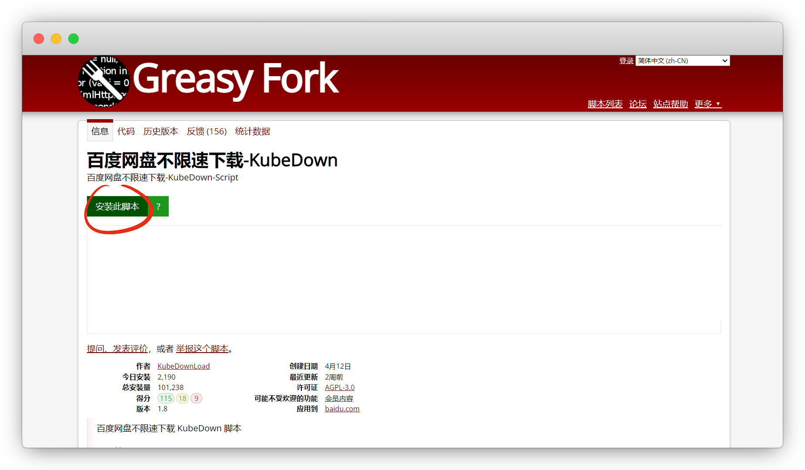
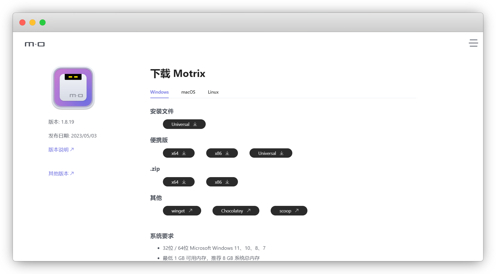
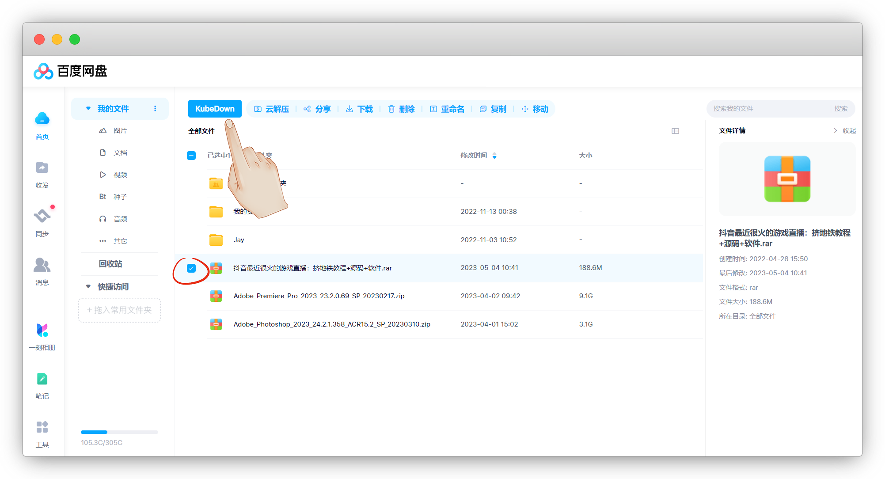
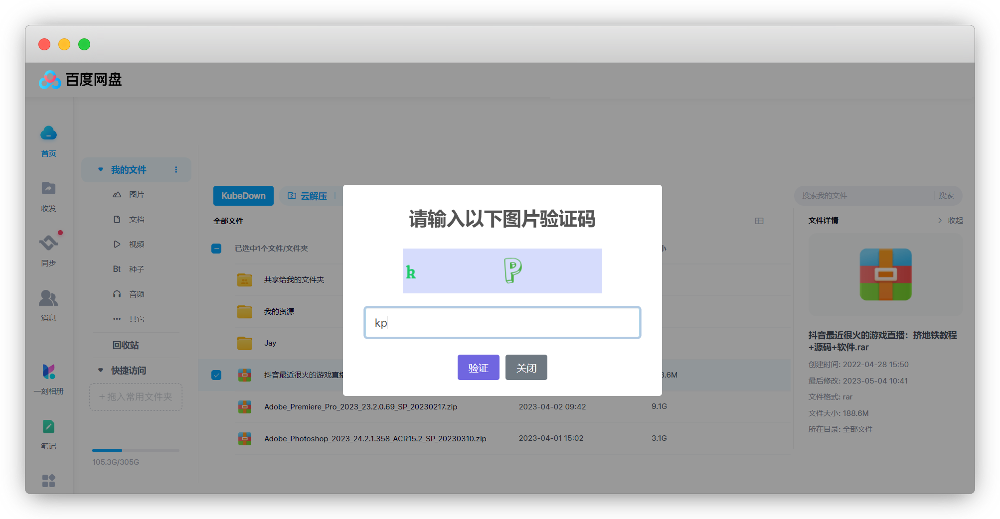
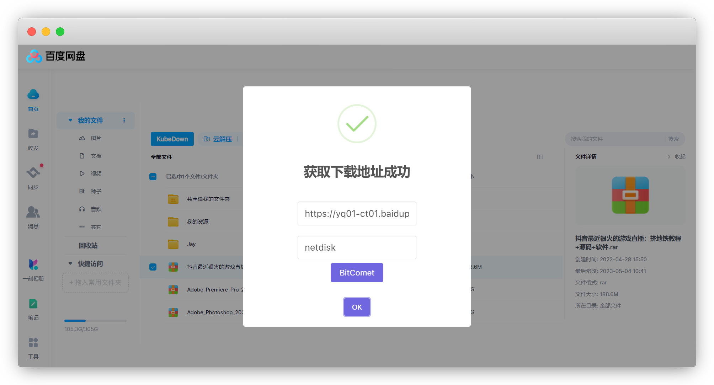
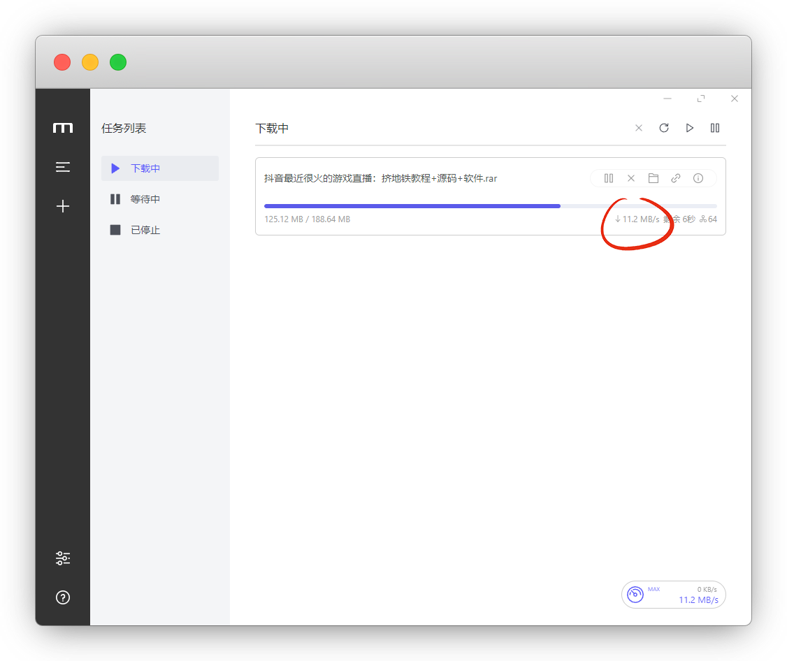

# 百度云不限速下载

::: warning 更新时间
最近更新：2023-6-10
:::

此方法非IDM非加速，而是利用油猴脚本+Motrix

## 准备工具

* [百度网盘不限速下载-KubeDown](https://greasyfork.org/zh-CN/scripts/463832-%E7%99%BE%E5%BA%A6%E7%BD%91%E7%9B%98%E4%B8%8D%E9%99%90%E9%80%9F%E4%B8%8B%E8%BD%BD-kubedown)

* [Motrix](https://motrix.app/zh-CN/download)

## 安装KubeDown

::: warning 注意
如果你从来没有使用过油猴脚本，[请参照教程安装后再来](../tampermonkey/)
:::

在Greasy Fork中下载KubeDown脚本并安装

下载：[https://greasyfork.org/zh-CN/scripts/463832](https://greasyfork.org/zh-CN/scripts/463832)

## 安装Motrix

下载Motrix并安装，我选的便携版

::: tip 说明
查看系统几位的：此电脑-右键属性-系统类型
:::

官网：[https://motrix.app/zh-CN/download](https://motrix.app/zh-CN/download)

## 获取链接

网页登录 [百度云盘](https://pan.baidu.com/) ，勾选要下载的文件，点击 `KubeDown`

输入验证码

成功获取到链接和UA

## 下载资源

我们将获取的链接添加到Motrix，并在高级设置中填入UA，自己更改下下载目录就可以提交了

满速下载，眨眼功夫下载完成

