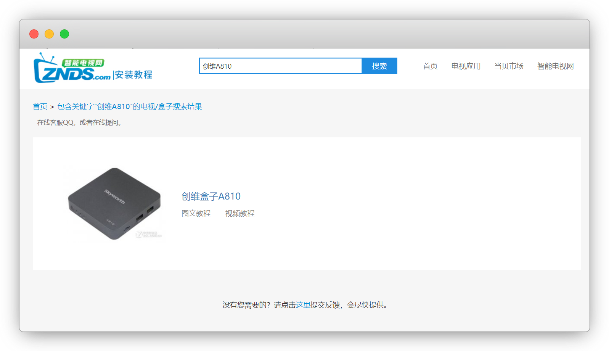
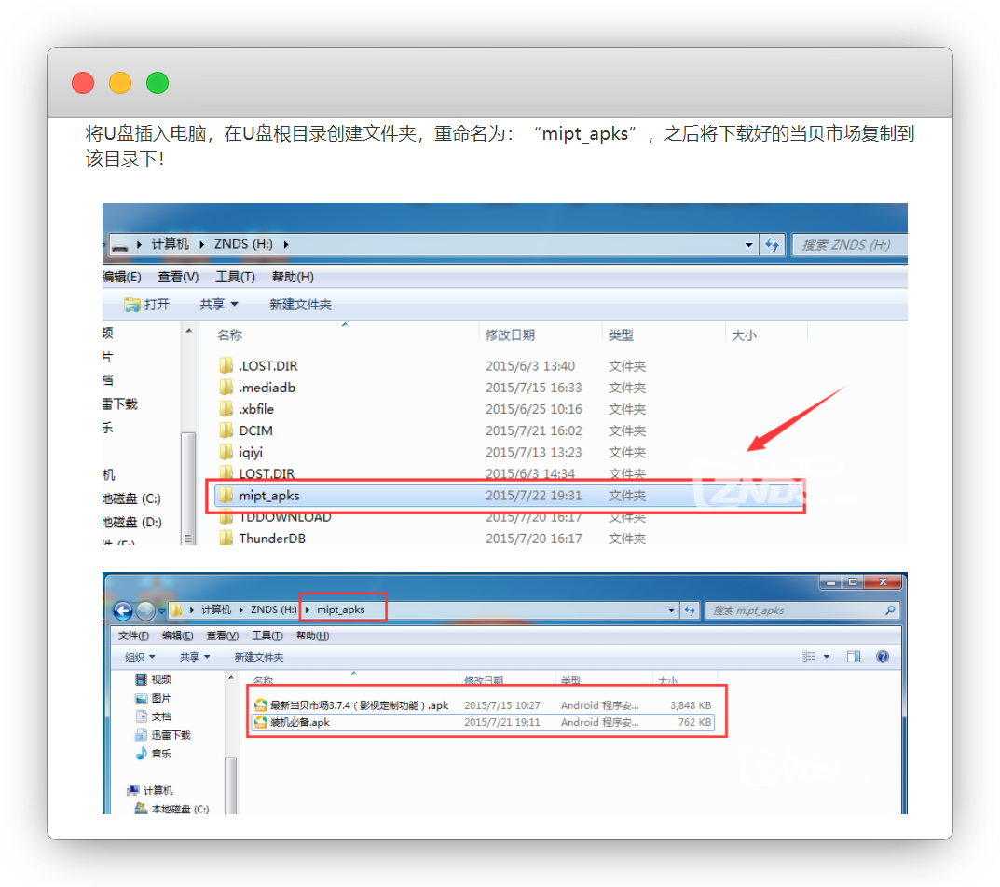
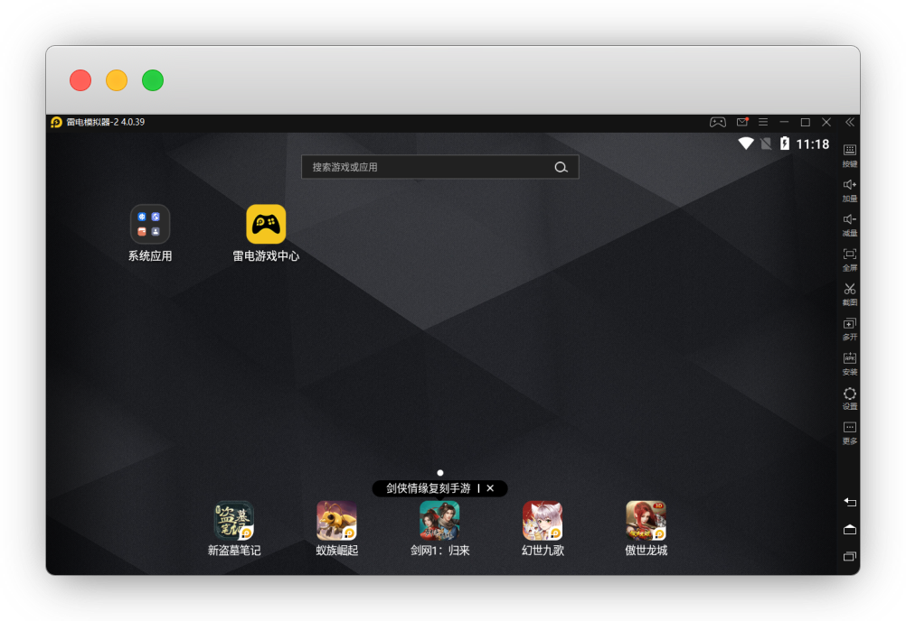
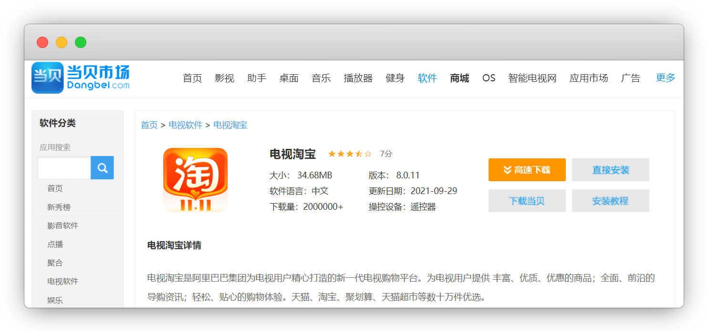
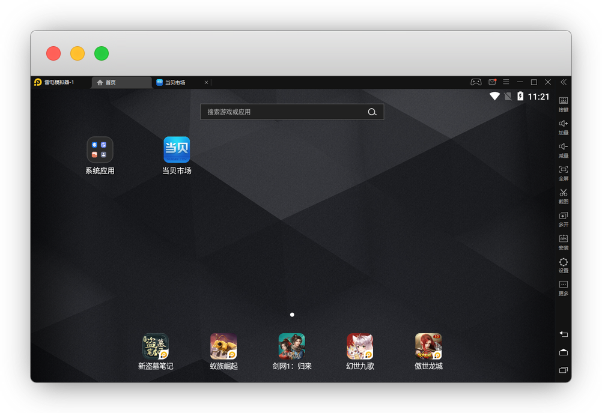
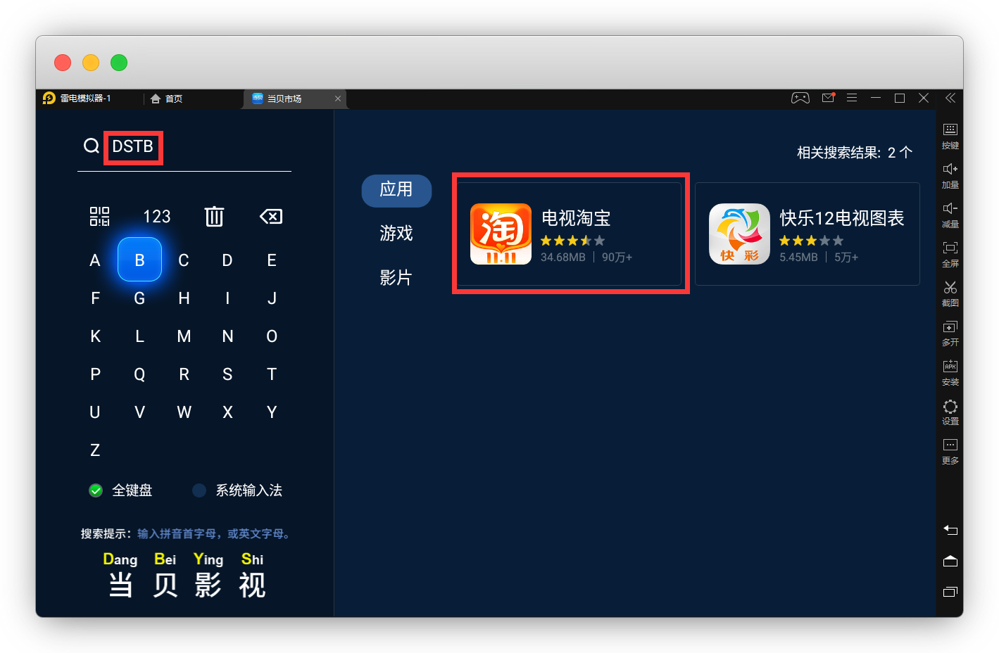
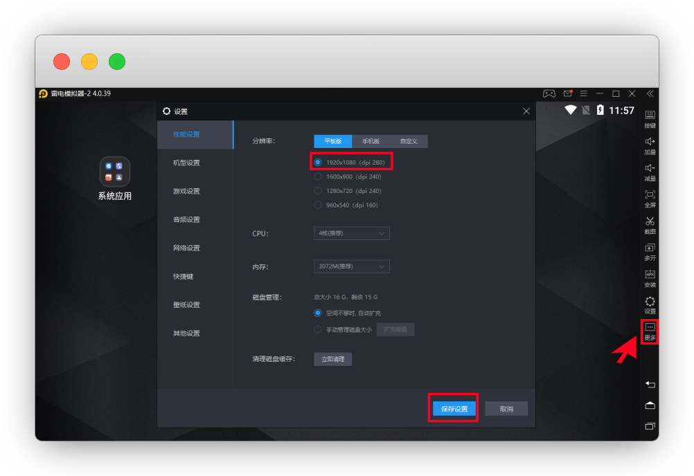
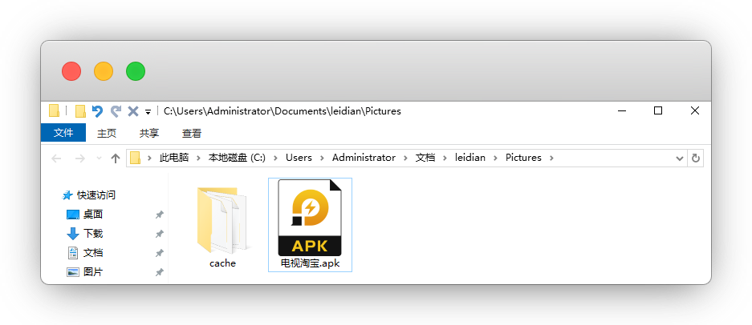
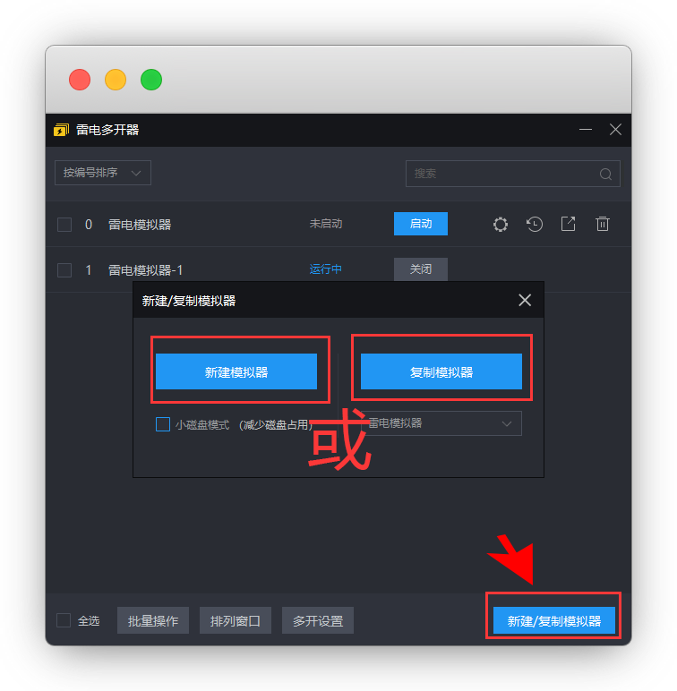

# TV电视安装apk应用

::: warning 更新时间
最近更新：2021-10-18
:::


因为电视TV的后缀也是apk格式，所以安卓机可直接安装

苹果没办法，或者电脑用雷电模拟器安装


## 电视端安装


本文以安装 `淘宝` app 为例


### 1. 官网下载app


电视淘宝官网：[https://dianshi.taobao.com/products.html?pageName=tvtaobao](https://dianshi.taobao.com/products.html?pageName=tvtaobao)


### 2. 当贝市场 [推荐]


官网：[http://www.dangbei.com/](http://www.dangbei.com/)

应用包市场：[http://www.dangbei.com/app/](http://www.dangbei.com/app/)

::: tip 说明
相当于电视的第三方应用商店，资源齐全

电视机建议安装一个，下APP很方便
:::


每个品牌的安装方式不同，[请参考教程☛ https://www.znds.com/jc/](https://www.znds.com/jc/)

::: tip 说明
有的电视，自带商店可直装

有的要下载到U盘，插入电视安装
:::


我家电视是海信，但是盒子用的是创维A810，就找盒子的型号

::: tip 说明
界面没找到，我直接搜竟然有，就离谱
:::




根据教程，我需要下载好APP，并在U盘新建一个文件夹 `mipt_apks`，再把文件放进去

::: warning 注意
请根据自家电视型号参考安装，我仅做演示
:::




然后就安装完成了


## 模拟器安装


模拟器比手机好的地方，在于能够用键盘控制，特别是切换频道


雷电模拟器官网：[https://www.ldmnq.com/](https://www.ldmnq.com/)


安装好后，打开




去当贝应用市场，搜索下载应用包：[http://www.dangbei.com/app/](http://www.dangbei.com/app/)

::: tip 说明
已有安装包的先下载到桌面，直接拖入
:::




当贝只会让你先下载 `当贝市场app`，我们直接拖入模拟器安装




然后进去当贝搜索 `DSTB`（电视淘宝的开头首字母），安装




如果页面显示不全，右边齿轮 `设置` 改成 `1080P`，保存设置




重新打开运行即可，页面控制参照下方

::: tip 说明
键盘的方向键 —— 遥控器的方向键

键盘的ESC键 —— 遥控器的返回键

鼠标点击或回车键 —— 遥控器的OK
:::


### 模拟器拓展1：提取apk


`长按` 电视淘宝 -别松手 拖拽至 右侧的 `导出` 上，松开

> 其他apk导出同理


这样我们就得到了安装apk的应用包，发给小伙伴即可




### 模拟器拓展2：多开


如果不想每天麻烦的切号，`新建模拟器` 或者 `复制模拟器`

::: warning 注意
右下角选择要复制的模拟器

否则会默认复制第一个，也就是0号模拟器
:::




这样就双开了，多开非常吃内存，开多了卡

::: tip 建议
最多同时开2个，关掉后，再打开另外的
:::


## TVBOX(电视观影)

强力推荐，可在线看收费电影/电视剧/综艺


下载地址：[https://github.com/pvqogw/TVBoxOSC/releases](https://github.com/pvqogw/TVBoxOSC/releases)


页面是干净的，我们只需要复制任一一个添加源即可

```json
月光宝盒家庭版
https://jihulab.com/ygbh1/box/-/raw/main/月光宝盒

肥猫Panda
http://我不是.肥猫.love:63/接口禁止贩卖

饭太硬
http://饭太硬.ga/tv

小雅
http://drpy.site/js1

莱妮丝
https://tvbox.cainisi.cf

龙门影视
https://agit.ai/VivoMax/ddtv/raw/branch/master/%E9%BE%99%E9%97%A8%E5%BD%B1%E8%A7%86.json

南风
https://agit.ai/Yoursmile7/TVBox/raw/branch/master/XC.json

神器推送
https://神器每日推送.tk/pz.json

吾爱
http://52bsj.vip:98/wuai

运输车
https://weixine.net/ysc.json

小苹果
https://agit.ai/nbwzlyd/xiaopingguo/raw/branch/master/xiaopingguo/xiaopingguo.json

分享者
https://agit.ai/66666/mao/raw/branch/master/00/000.m3u8

蜂蜜
https://ghproxy.com/https://raw.githubusercontent.com/FongMi/CatVodSpider/main/json/config.json

喵影视
http://miaotvs.cn/meow

甜蜜
https://raw.iqiq.io/kebedd69/TVbox-interface/main/%E7%94%9C%E8%9C%9C.json

老刘备
https://raw.iqiq.io/liu673cn/box/main/m.json

白嫖线路
http://js.134584.xyz/json/pp87.json

乱世
http://www.dmtv.ml/mao/single.json

巧技接口
https://agit.ai/relax/adcc/raw/branch/master/tvbox.json

家庭版升级
http://itvbox.cc/tvbox/云星日记/1.m3u8

哔哩大套餐
http://itvbox.cc/tvbox/云星日记/bili.m3u8

阿里大套餐
http://itvbox.cc/tvbox/云星日记/ali.m3u8

刚刚
http://刚刚.live/猫

唐三
https://hutool.ml/tang

lekan
https://gitee.com/lekanbox/ysc/raw/master/ysc.json

无名
https://jx.izny.cn/qwsp/qwsp.json

4k云盘
http://9xi4o.tk/0725.json

无名路线
https://gitea.com/52670576/tvbox/raw/branch/master/ysc.json

兽爪
http://52bsj.vip:81/api/v3/file/get/46060/Tv%20box%E6%BA%902.txt?sign=yI8sCYT8pei-pxp1_xwLjWOfepQ9b7c1y6Q_QD_0RY4%3D%3A0

星辰
http://8.210.232.168/xc.json

大聪明
https://yydsys.top/duo

于俊
http://home.jundie.top:81/top98.json

高山流水
https://raw.gitmirror.com/gaotianliuyun/gao/master/js.json

刘C
https://raw.liucn.cc/box/m.json

佰欣园
https://raw.gitmirror.com/chengxueli818913/maoTV/main/44.txt

潇洒
https://download.kstore.space/download/2863/01.txt

心魔
https://gitee.com/yw88075/tvbox1/raw/main/dr/js.json

Imabc
https://www.agit.ai/n/b/raw/branch/a/b/c.json

宋
https://cdn.staticaly.com/gh/XuQqu/PinkBird/main/normal.json

网络1
https://cdn.staticaly.com/gh/XuQqu/PinkBird/main/normal.json

网络2
https://agit.ai/n/b/raw/branch/a/b/c.json

liu673cn
https://raw.fastgit.org/liu673cn/box/main/m.json

学习
http://52bsj.vip:81/api/v3/file/get/41063/bili.json?sign=TxuApYZt6bNl9TzI7vObItW34UnATQ4RQxABAEwHst4%3D%3A0

二哈
https://raw.gitmirror.com/2hacc/TVBox/main/tvbox.json

荷城茶秀
http://rihou.cc:88/荷城茶秀

小胡
https://jihulab.com/xiaohutx/box/-/raw/main/0.json

道长
https://pastebin.com/raw/5NHaxyGR

霜辉月明
https://ghproxy.com/raw.githubusercontent.com/lm317379829/PyramidStore/pyramid/py.json

dxawi
http://dxawi.github.io/0/0.json

蚂蚁
https://la.kstore.space/download/2883/0110.txt

冰河
https://ju.binghe.ga/4.txt

不良帅
https://notabug.org/qizhen15800/My9394/raw/master/ProfessionalEdition.m3u8

乱世
http://www.dmtv.ml/mao/single.json

一影视
https://ghproxy.com/https://raw.githubusercontent.com/tv-player/tvbox-line/main/tv/fj.json

一木
https://ghproxy.com/https://raw.githubusercontent.com/xianyuyimu/TVBOX-/main/TVBox/%E4%B8%80%E6%9C%A8%E8%87%AA%E7%94%A8.json

kvymin
https://agit.ai/kvymin/TV/raw/branch/master/Box.json

agit/abc
https://agit.ai/n/b/raw/branch/a/b/c.json

zzz1
https://agit.ai/mmmgit/tvbox/raw/branch/main/zzz1.json

```

