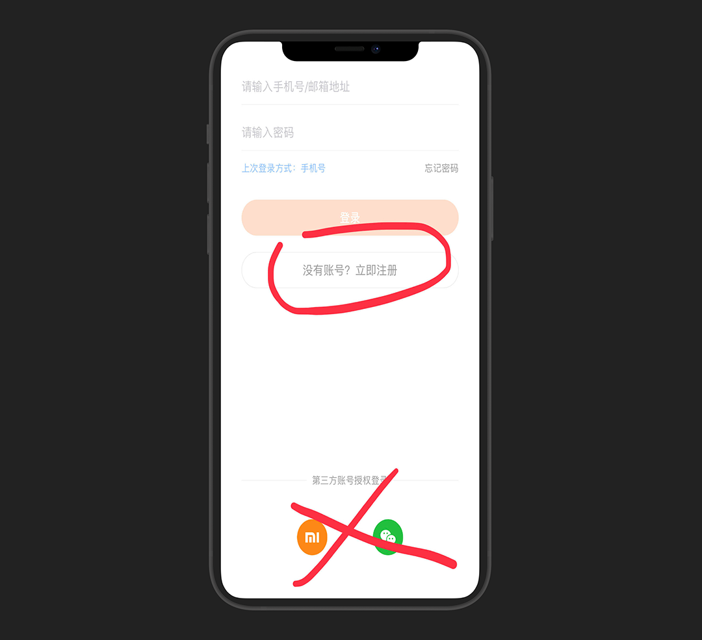
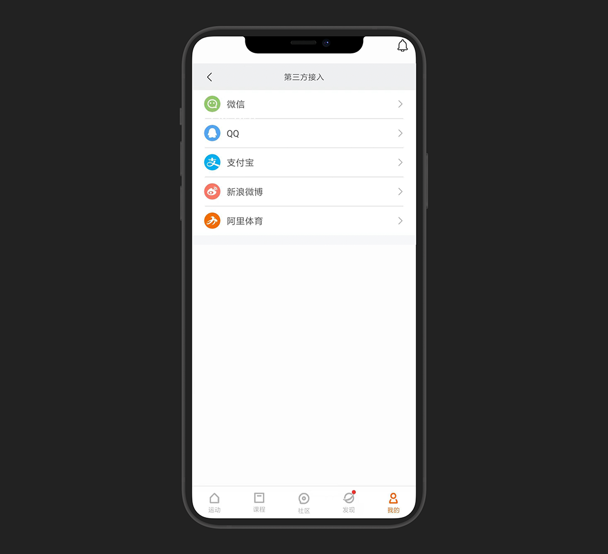
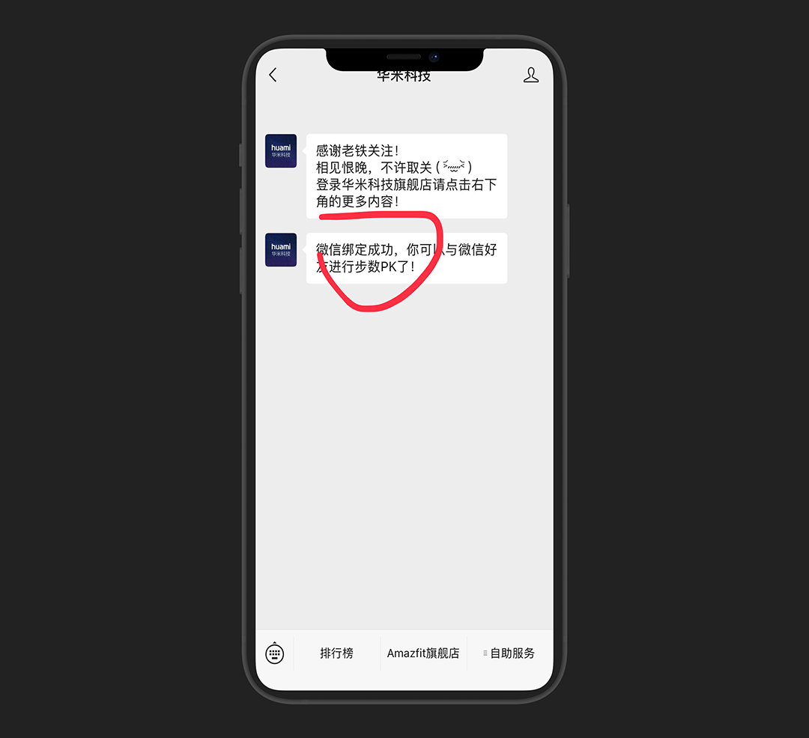
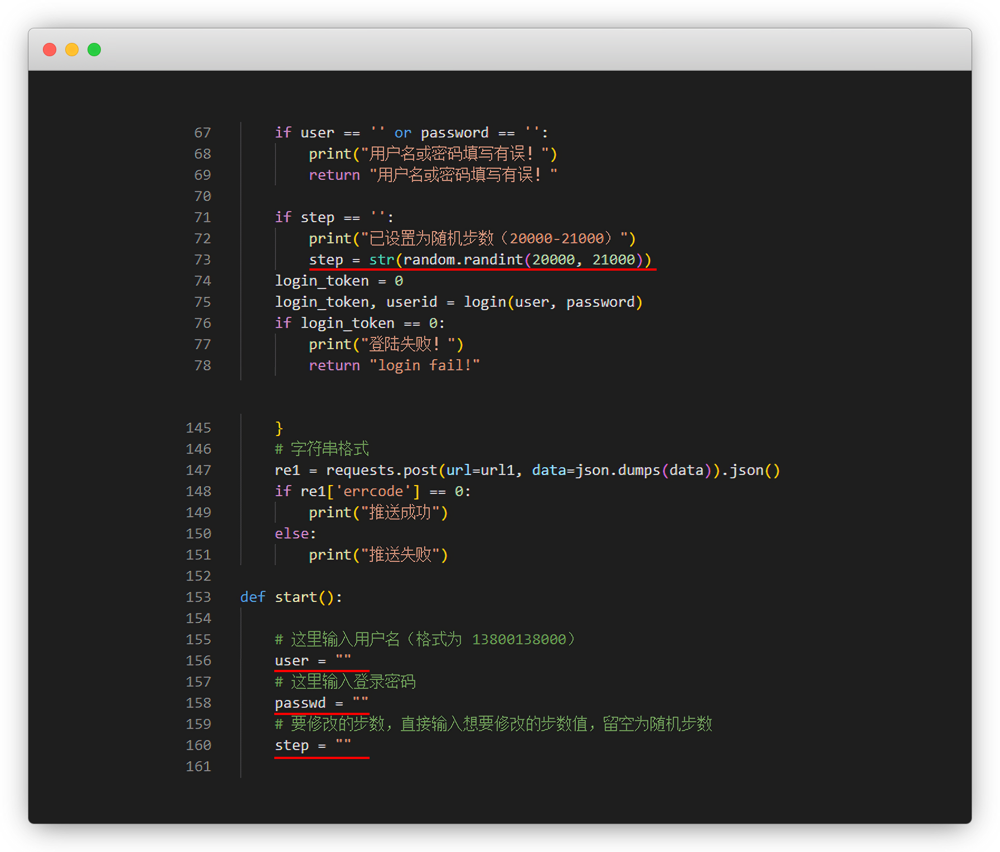

# 小米运动刷微信步数


::: warning 更新时间
最近更新：2021-10-18
:::


## 准备工作


* 手机号1个(注册用)

* 小米运动APP(现已更名：Zepp life)


## 1.注册账号


打开 `Zepp life` App，点击注册账号，这里 不要点第三方登录

::: tip 说明
正常注册就行，该填的填，该选的选，照片不用传
:::




进入`Zepp life`APP后，点 我的—下拉 `第三方接入`


这里绑定微信，就是刷微信运动

::: tip 说明
绑支付宝，就是刷的支付宝，其他同理
:::




进去后有个绑定的二维码，`手机截图`

微信扫码关注 `华米科技公众号` 绑定设备

::: tip 说明
没有显示绑定设备的，步骤不对，取关重来
:::


成功后，有提示，App也有绑定信息,到这里，我们就成功一半了




## 2.开始刷步


刷步的网站、小程序以及APP也很多，哪个好用用哪个

极速刷步：[http://jisu.shuabu.wang/](http://jisu.shuabu.wang/)


点击 `Zepp life` ，输入刚注册 `账号和密码`，以及要刷的步数，提交即可

::: warning 注意
步数建议不要一下子太高，符合常理一点，你直接99999隔天就会被封微信运动，只能等解封
:::


如果服务器的，可以把脚本 `xmsb.py` 挂在青龙面板每天自动运行

```py
第73行 改 步数区间范围
第156/158行 填入 账号密码
第160行 留空就按区间范围随机步数，填入就指定步数
```




::: details 点我查看刷步 xmsb.py 代码
```py
# -*- coding: utf8 -*-
import requests
import time
import re
import json
import random

now = time.strftime("%Y-%m-%d %H:%M:%S", time.localtime())
headers = {
    'User-Agent': 'Dalvik/2.1.0 (Linux; U; Android 9; MI 6 MIUI/20.6.18)'
}

# 获取登录code
def get_code(location):
    code_pattern = re.compile("(?<=access=).*?(?=&)")
    code = code_pattern.findall(location)[0]
    return code


# 登录
def login(user, password):
    url1 = "https://api-user.huami.com/registrations/+86" + user + "/tokens"
    headers = {
        "Content-Type": "application/x-www-form-urlencoded;charset=UTF-8",
        "User-Agent": "MiFit/4.6.0 (iPhone; iOS 14.0.1; Scale/2.00)"
    }
    data1 = {
        "client_id": "HuaMi",
        "password": password,
        "redirect_uri": "https://s3-us-west-2.amazonaws.com/hm-registration/successsignin.html",
        "token": "access"
    }
    r1 = requests.post(url1, data=data1, headers=headers, allow_redirects=False)
    location = r1.headers["Location"]
    try:
        code = get_code(location)
    except:
        return 0, 0
    # print("access_code获取成功！")
    # print(code)

    url2 = "https://account.huami.com/v2/client/login"
    data2 = {
        "app_name": "com.xiaomi.hm.health",
        "app_version": "4.6.0",
        "code": code,
        "country_code": "CN",
        "device_id": "2C8B4939-0CCD-4E94-8CBA-CB8EA6E613A1",
        "device_model": "phone",
        "grant_type": "access_token",
        "third_name": "huami_phone",
    }
    r2 = requests.post(url2, data=data2, headers=headers).json()
    login_token = r2["token_info"]["login_token"]
    # print("login_token获取成功！")
    # print(login_token)
    userid = r2["token_info"]["user_id"]
    # print("us erid获取成功！")
    # print(userid)
    return login_token, userid

# 主函数
def main(user, passwd, step):
    user = str(user)
    password = str(passwd)
    step = str(step)
    if user == '' or password == '':
        print("用户名或密码填写有误！")
        return "用户名或密码填写有误！"

    if step == '':
        print("已设置为随机步数（20000-21000）")
        step = str(random.randint(20000, 21000))
    login_token = 0
    login_token, userid = login(user, password)
    if login_token == 0:
        print("登陆失败！")
        return "login fail!"

    t = get_time()

    app_token = get_app_token(login_token)

    today = time.strftime("%F")

    data_json = '%5B%7B%22data_hr%22%3A%22%5C%2F%5C%2F%5C%2F%5C%2F%5C%2F%5C%2F9L%5C%2F%5C%2F%5C%2F%5C%2F%5C%2F%5C%2F%5C%2F%5C%2F%5C%2F%5C%2F%5C%2F%5C%2FVv%5C%2F%5C%2F%5C%2F%5C%2F%5C%2F%5C%2F%5C%2F%5C%2F%5C%2F%5C%2F%5C%2F0v%5C%2F%5C%2F%5C%2F%5C%2F%5C%2F%5C%2F%5C%2F%5C%2F%5C%2F%5C%2F%5C%2F9e%5C%2F%5C%2F%5C%2F%5C%2F%5C%2F0n%5C%2Fa%5C%2F%5C%2F%5C%2FS%5C%2F%5C%2F%5C%2F%5C%2F%5C%2F%5C%2F%5C%2F%5C%2F%5C%2F%5C%2F%5C%2F%5C%2F0b%5C%2F%5C%2F%5C%2F%5C%2F%5C%2F%5C%2F%5C%2F%5C%2F%5C%2F%5C%2F1FK%5C%2F%5C%2F%5C%2F%5C%2F%5C%2F%5C%2F%5C%2F%5C%2F%5C%2F%5C%2F%5C%2F%5C%2FR%5C%2F%5C%2F%5C%2F%5C%2F%5C%2F%5C%2F%5C%2F%5C%2F%5C%2F%5C%2F%5C%2F%5C%2F%5C%2F%5C%2F%5C%2F%5C%2F%5C%2F9PTFFpaf9L%5C%2F%5C%2F%5C%2F%5C%2F%5C%2F%5C%2F%5C%2F%5C%2F%5C%2F%5C%2F%5C%2F%5C%2FR%5C%2F%5C%2F%5C%2F%5C%2F%5C%2F%5C%2F%5C%2F%5C%2F%5C%2F%5C%2F%5C%2F%5C%2F0j%5C%2F%5C%2F%5C%2F%5C%2F%5C%2F%5C%2F%5C%2F%5C%2F%5C%2F%5C%2F%5C%2F9K%5C%2F%5C%2F%5C%2F%5C%2F%5C%2F%5C%2F%5C%2F%5C%2F%5C%2F%5C%2F%5C%2F%5C%2FOv%5C%2F%5C%2F%5C%2F%5C%2F%5C%2F%5C%2F%5C%2F%5C%2F%5C%2F%5C%2F%5C%2Fzf%5C%2F%5C%2F%5C%2F86%5C%2Fzr%5C%2FOv88%5C%2Fzf%5C%2FPf%5C%2F%5C%2F%5C%2F0v%5C%2FS%5C%2F8%5C%2F%5C%2F%5C%2F%5C%2F%5C%2F%5C%2F%5C%2F%5C%2F%5C%2F%5C%2F%5C%2F%5C%2F%5C%2FSf%5C%2F%5C%2F%5C%2F%5C%2F%5C%2F%5C%2F%5C%2F%5C%2F%5C%2F%5C%2F%5C%2Fz3%5C%2F%5C%2F%5C%2F%5C%2F%5C%2F%5C%2F0r%5C%2FOv%5C%2F%5C%2F%5C%2F%5C%2F%5C%2F%5C%2FS%5C%2F9L%5C%2Fzb%5C%2FSf9K%5C%2F0v%5C%2FRf9H%5C%2Fzj%5C%2FSf9K%5C%2F0%5C%2F%5C%2FN%5C%2F%5C%2F%5C%2F%5C%2F0D%5C%2FSf83%5C%2Fzr%5C%2FPf9M%5C%2F0v%5C%2FOv9e%5C%2F%5C%2F%5C%2F%5C%2F%5C%2F%5C%2F%5C%2F%5C%2F%5C%2F%5C%2F%5C%2F%5C%2FS%5C%2F%5C%2F%5C%2F%5C%2F%5C%2F%5C%2F%5C%2F%5C%2F%5C%2F%5C%2F%5C%2F%5C%2Fzv%5C%2F%5C%2Fz7%5C%2FO%5C%2F83%5C%2Fzv%5C%2FN%5C%2F83%5C%2Fzr%5C%2FN%5C%2F86%5C%2Fz%5C%2F%5C%2FNv83%5C%2Fzn%5C%2FXv84%5C%2Fzr%5C%2FPP84%5C%2Fzj%5C%2FN%5C%2F9e%5C%2Fzr%5C%2FN%5C%2F89%5C%2F03%5C%2FP%5C%2F89%5C%2Fz3%5C%2FQ%5C%2F9N%5C%2F0v%5C%2FTv9C%5C%2F0H%5C%2FOf9D%5C%2Fzz%5C%2FOf88%5C%2Fz%5C%2F%5C%2FPP9A%5C%2Fzr%5C%2FN%5C%2F86%5C%2Fzz%5C%2FNv87%5C%2F0D%5C%2FOv84%5C%2F0v%5C%2FO%5C%2F84%5C%2Fzf%5C%2FMP83%5C%2FzH%5C%2FNv83%5C%2Fzf%5C%2FN%5C%2F84%5C%2Fzf%5C%2FOf82%5C%2Fzf%5C%2FOP83%5C%2Fzb%5C%2FMv81%5C%2FzX%5C%2FR%5C%2F9L%5C%2F0v%5C%2FO%5C%2F9I%5C%2F0T%5C%2FS%5C%2F9A%5C%2Fzn%5C%2FPf89%5C%2Fzn%5C%2FNf9K%5C%2F07%5C%2FN%5C%2F83%5C%2Fzn%5C%2FNv83%5C%2Fzv%5C%2FO%5C%2F9A%5C%2F0H%5C%2FOf8%5C%2F%5C%2Fzj%5C%2FPP83%5C%2Fzj%5C%2FS%5C%2F87%5C%2Fzj%5C%2FNv84%5C%2Fzf%5C%2FOf83%5C%2Fzf%5C%2FOf83%5C%2Fzb%5C%2FNv9L%5C%2Fzj%5C%2FNv82%5C%2Fzb%5C%2FN%5C%2F85%5C%2Fzf%5C%2FN%5C%2F9J%5C%2Fzf%5C%2FNv83%5C%2Fzj%5C%2FNv84%5C%2F0r%5C%2FSv83%5C%2Fzf%5C%2FMP%5C%2F%5C%2F%5C%2Fzb%5C%2FMv82%5C%2Fzb%5C%2FOf85%5C%2Fz7%5C%2FNv8%5C%2F%5C%2F0r%5C%2FS%5C%2F85%5C%2F0H%5C%2FQP9B%5C%2F0D%5C%2FNf89%5C%2Fzj%5C%2FOv83%5C%2Fzv%5C%2FNv8%5C%2F%5C%2F0f%5C%2FSv9O%5C%2F0ZeXv%5C%2F%5C%2F%5C%2F%5C%2F%5C%2F%5C%2F%5C%2F%5C%2F%5C%2F%5C%2F%5C%2F1X%5C%2F%5C%2F%5C%2F%5C%2F%5C%2F%5C%2F%5C%2F%5C%2F%5C%2F%5C%2F%5C%2F9B%5C%2F%5C%2F%5C%2F%5C%2F%5C%2F%5C%2F%5C%2F%5C%2F%5C%2F%5C%2F%5C%2F%5C%2FTP%5C%2F%5C%2F%5C%2F1b%5C%2F%5C%2F%5C%2F%5C%2F%5C%2F%5C%2F0%5C%2F%5C%2F%5C%2F%5C%2F%5C%2F%5C%2F%5C%2F%5C%2F%5C%2F%5C%2F%5C%2F%5C%2F9N%5C%2F%5C%2F%5C%2F%5C%2F%5C%2F%5C%2F%5C%2F%5C%2F%5C%2Fv7%2B%5C%2Fv7%2B%5C%2Fv7%2B%5C%2Fv7%2B%5C%2Fv7%2B%5C%2Fv7%2B%5C%2Fv7%2B%5C%2Fv7%2B%5C%2Fv7%2B%5C%2Fv7%2B%5C%2Fv7%2B%5C%2Fv7%2B%5C%2Fv7%2B%5C%2Fv7%2B%5C%2Fv7%2B%5C%2Fv7%2B%5C%2Fv7%2B%5C%2Fv7%2B%5C%2Fv7%2B%5C%2Fv7%2B%5C%2Fv7%2B%5C%2Fv7%2B%5C%2Fv7%2B%5C%2Fv7%2B%5C%2Fv7%2B%5C%2Fv7%2B%5C%2Fv7%2B%5C%2Fv7%2B%5C%2Fv7%2B%5C%2Fv7%2B%5C%2Fv7%2B%5C%2Fv7%2B%5C%2Fv7%2B%5C%2Fv7%2B%5C%2Fv7%2B%5C%2Fv7%2B%5C%2Fv7%2B%5C%2Fv7%2B%5C%2Fv7%2B%5C%2Fv7%2B%5C%2Fv7%2B%5C%2Fv7%2B%5C%2Fv7%2B%5C%2Fv7%2B%5C%2Fv7%2B%5C%2Fv7%2B%5C%2Fv7%2B%5C%2Fv7%2B%5C%2Fv7%2B%5C%2Fv7%2B%5C%2Fv7%2B%5C%2Fv7%2B%5C%2Fv7%2B%5C%2Fv7%2B%5C%2Fv7%2B%5C%2Fv7%2B%5C%2Fv7%2B%5C%2Fv7%2B%5C%2Fv7%2B%5C%2Fv7%2B%5C%2Fv7%2B%5C%2Fv7%2B%5C%2Fv7%2B%5C%2Fv7%2B%5C%2Fv7%2B%5C%2Fv7%2B%5C%2Fv7%2B%5C%2Fv7%2B%5C%2Fv7%2B%5C%2Fv7%2B%5C%2Fv7%2B%5C%2Fv7%2B%5C%2Fv7%2B%5C%2Fv7%2B%5C%2Fv7%2B%5C%2Fv7%2B%5C%2Fv7%2B%5C%2Fv7%2B%5C%2Fv7%2B%5C%2Fv7%2B%5C%2Fv7%2B%5C%2Fv7%2B%5C%2Fv7%2B%5C%2Fv7%2B%5C%2Fv7%2B%5C%2Fv7%2B%5C%2Fv7%2B%5C%2Fv7%2B%5C%2Fv7%2B%5C%2Fv7%2B%5C%2Fv7%2B%5C%2Fv7%2B%5C%2Fv7%2B%5C%2Fv7%2B%5C%2Fv7%2B%5C%2Fv7%2B%5C%2Fv7%2B%5C%2Fv7%2B%5C%2Fv7%2B%5C%2Fv7%2B%5C%2Fv7%2B%5C%2Fv7%2B%5C%2Fv7%2B%5C%2Fv7%2B%5C%2Fv7%2B%5C%2Fv7%2B%5C%2Fv7%2B%5C%2Fv7%2B%5C%2Fv7%2B%5C%2Fv7%2B%5C%2Fv7%2B%5C%2Fv7%2B%5C%2Fv7%2B%5C%2Fv7%2B%5C%2Fv7%2B%5C%2Fv7%2B%5C%2Fv7%2B%5C%2Fv7%2B%5C%2Fv7%2B%5C%2Fv7%2B%5C%2Fv7%2B%5C%2Fv7%2B%5C%2Fv7%2B%5C%2Fv7%2B%5C%2Fv7%2B%5C%2Fv7%2B%5C%2Fv7%2B%5C%2Fv7%2B%5C%2Fv7%2B%5C%2Fv7%2B%5C%2Fv7%2B%5C%2Fv7%2B%5C%2Fv7%2B%5C%2Fv7%2B%5C%2Fv7%2B%5C%2Fv7%2B%5C%2Fv7%2B%5C%2Fv7%2B%5C%2Fv7%2B%5C%2Fv7%2B%5C%2Fv7%2B%5C%2Fv7%2B%5C%2Fv7%2B%5C%2Fv7%2B%5C%2Fv7%2B%5C%2Fv7%2B%5C%2Fv7%2B%5C%2Fv7%2B%5C%2Fv7%2B%5C%2Fv7%2B%5C%2Fv7%2B%5C%2Fv7%2B%5C%2Fv7%2B%5C%2Fv7%2B%5C%2Fv7%2B%5C%2Fv7%2B%5C%2Fv7%2B%5C%2Fv7%2B%5C%2Fv7%2B%5C%2Fv7%2B%5C%2Fv7%2B%5C%2Fv7%2B%5C%2Fv7%2B%5C%2Fv7%2B%5C%2Fv7%2B%5C%2Fv7%2B%5C%2Fv7%2B%5C%2Fv7%2B%5C%2Fv7%2B%5C%2Fv7%2B%5C%2Fv7%2B%5C%2Fv7%2B%5C%2Fv7%2B%5C%2Fv7%2B%5C%2Fv7%2B%5C%2Fv7%2B%5C%2Fv7%2B%5C%2Fv7%2B%5C%2Fv7%2B%5C%2Fv7%2B%5C%2Fv7%2B%5C%2Fv7%2B%5C%2Fv7%2B%5C%2Fv7%2B%5C%2Fv7%2B%5C%2Fv7%2B%5C%2Fv7%2B%5C%2Fv7%2B%5C%2Fv7%2B%5C%2Fv7%2B%5C%2Fv7%2B%5C%2Fv7%2B%5C%2Fv7%2B%5C%2Fv7%2B%5C%2Fv7%2B%5C%2Fv7%2B%5C%2Fv7%2B%5C%2Fv7%2B%5C%2Fv7%2B%5C%2Fv7%2B%5C%2Fv7%2B%5C%2Fv7%2B%5C%2Fv7%2B%5C%2Fv7%2B%5C%2Fv7%2B%5C%2Fv7%2B%5C%2Fv7%2B%5C%2Fv7%2B%5C%2Fv7%2B%5C%2Fv7%2B%5C%2Fv7%2B%5C%2Fv7%2B%5C%2Fv7%2B%5C%2Fv7%2B%5C%2Fv7%2B%5C%2Fv7%2B%5C%2Fv7%2B%5C%2Fv7%2B%5C%2Fv7%2B%5C%2Fv7%2B%5C%2Fv7%2B%5C%2Fv7%2B%5C%2Fv7%2B%5C%2Fv7%2B%5C%2Fv7%2B%5C%2Fv7%2B%5C%2Fv7%2B%5C%2Fv7%2B%5C%2Fv7%2B%5C%2Fv7%2B%5C%2Fv7%2B%5C%2Fv7%2B%5C%2Fv7%2B%5C%2Fv7%2B%5C%2Fv7%2B%5C%2Fv7%2B%5C%2Fv7%2B%5C%2Fv7%2B%5C%2Fv7%2B%5C%2Fv7%2B%5C%2Fv7%2B%5C%2Fv7%2B%5C%2Fv7%2B%5C%2Fv7%2B%5C%2Fv7%2B%5C%2Fv7%2B%5C%2Fv7%2B%5C%2Fv7%2B%5C%2Fv7%2B%5C%2Fv7%2B%5C%2Fv7%2B%5C%2Fv7%2B%5C%2Fv7%2B%5C%2Fv7%2B%5C%2Fv7%2B%5C%2Fv7%2B%5C%2Fv7%2B%5C%2Fv7%2B%5C%2Fv7%2B%5C%2Fv7%2B%5C%2Fv7%2B%22%2C%22date%22%3A%222021-08-07%22%2C%22data%22%3A%5B%7B%22start%22%3A0%2C%22stop%22%3A1439%2C%22value%22%3A%22UA8AUBQAUAwAUBoAUAEAYCcAUBkAUB4AUBgAUCAAUAEAUBkAUAwAYAsAYB8AYB0AYBgAYCoAYBgAYB4AUCcAUBsAUB8AUBwAUBIAYBkAYB8AUBoAUBMAUCEAUCIAYBYAUBwAUCAAUBgAUCAAUBcAYBsAYCUAATIPYD0KECQAYDMAYB0AYAsAYCAAYDwAYCIAYB0AYBcAYCQAYB0AYBAAYCMAYAoAYCIAYCEAYCYAYBsAYBUAYAYAYCIAYCMAUB0AUCAAUBYAUCoAUBEAUC8AUB0AUBYAUDMAUDoAUBkAUC0AUBQAUBwAUA0AUBsAUAoAUCEAUBYAUAwAUB4AUAwAUCcAUCYAUCwKYDUAAUUlEC8IYEMAYEgAYDoAYBAAUAMAUBkAWgAAWgAAWgAAWgAAWgAAUAgAWgAAUBAAUAQAUA4AUA8AUAkAUAIAUAYAUAcAUAIAWgAAUAQAUAkAUAEAUBkAUCUAWgAAUAYAUBEAWgAAUBYAWgAAUAYAWgAAWgAAWgAAWgAAUBcAUAcAWgAAUBUAUAoAUAIAWgAAUAQAUAYAUCgAWgAAUAgAWgAAWgAAUAwAWwAAXCMAUBQAWwAAUAIAWgAAWgAAWgAAWgAAWgAAWgAAWgAAWgAAWREAWQIAUAMAWSEAUDoAUDIAUB8AUCEAUC4AXB4AUA4AWgAAUBIAUA8AUBAAUCUAUCIAUAMAUAEAUAsAUAMAUCwAUBYAWgAAWgAAWgAAWgAAWgAAWgAAUAYAWgAAWgAAWgAAUAYAWwAAWgAAUAYAXAQAUAMAUBsAUBcAUCAAWwAAWgAAWgAAWgAAWgAAUBgAUB4AWgAAUAcAUAwAWQIAWQkAUAEAUAIAWgAAUAoAWgAAUAYAUB0AWgAAWgAAUAkAWgAAWSwAUBIAWgAAUC4AWSYAWgAAUAYAUAoAUAkAUAIAUAcAWgAAUAEAUBEAUBgAUBcAWRYAUA0AWSgAUB4AUDQAUBoAXA4AUA8AUBwAUA8AUA4AUA4AWgAAUAIAUCMAWgAAUCwAUBgAUAYAUAAAUAAAUAAAUAAAUAAAUAAAUAAAUAAAUAAAWwAAUAAAcAAAcAAAcAAAcAAAcAAAcAAAcAAAcAAAcAAAcAAAcAAAcAAAcAAAcAAAcAAAcAAAcAAAcAAAcAAAcAAAcAAAcAAAcAAAcAAAcAAAeSEAeQ8AcAAAcAAAcAAAcAAAcAAAcAAAcAAAcAAAcAAAcAAAcAAAcAAAcBcAcAAAcAAAcCYOcBUAUAAAUAAAUAAAUAAAUAUAUAAAcAAAcAAAcAAAcAAAcAAAcAAAcAAAcAAAcAAAcAAAcAAAcAAAcAAAcAAAcAAAcCgAeQAAcAAAcAAAcAAAcAAAcAAAcAYAcAAAcBgAeQAAcAAAcAAAegAAegAAcAAAcAcAcAAAcAAAcAAAcAAAcAAAcAAAcAAAcAAAcAAAcAAAcAAAcAAAcAAAcAAAcAAAcCkAeQAAcAcAcAAAcAAAcAwAcAAAcAAAcAIAcAAAcAAAcAAAcAAAcAAAcAAAcAAAcAAAcAAAcAAAcAAAcAAAcAAAcAAAcAAAcAAAcAAAcAAAcCIAeQAAcAAAcAAAcAAAcAAAcAAAeRwAeQAAWgAAUAAAUAAAUAAAUAAAUAAAcAAAcAAAcBoAeScAeQAAegAAcBkAeQAAUAAAUAAAUAAAUAAAUAAAUAAAcAAAcAAAcAAAcAAAcAAAcAAAegAAegAAcAAAcAAAcBgAeQAAcAAAcAAAcAAAcAAAcAAAcAkAegAAegAAcAcAcAAAcAcAcAAAcAAAcAAAcAAAcA8AeQAAcAAAcAAAeRQAcAwAUAAAUAAAUAAAUAAAUAAAUAAAcAAAcBEAcA0AcAAAWQsAUAAAUAAAUAAAUAAAUAAAcAAAcAoAcAAAcAAAcAAAcAAAcAAAcAAAcAAAcAYAcAAAcAAAcAAAcAAAcAAAcAAAcAAAcAAAcBYAegAAcAAAcAAAegAAcAcAcAAAcAAAcAAAcAAAcAAAeRkAegAAegAAcAAAcAAAcAAAcAAAcAAAcAAAcAAAcAEAcAAAcAAAcAAAcAUAcAQAcAAAcBIAeQAAcAAAcAAAcAAAcAAAcAAAcAAAcAAAcAAAcAAAcAAAcAAAcAAAcBsAcAAAcAAAcBcAeQAAUAAAUAAAUAAAUAAAUAAAUBQAcBYAUAAAUAAAUAoAWRYAWTQAWQAAUAAAUAAAUAAAcAAAcAAAcAAAcAAAcAAAcAMAcAAAcAQAcAAAcAAAcAAAcDMAeSIAcAAAcAAAcAAAcAAAcAAAcAAAcAAAcAAAcAAAcAAAcAAAcAAAcAAAcAAAcAAAcAAAcAAAcAAAcAAAcBQAeQwAcAAAcAAAcAAAcAMAcAAAeSoAcA8AcDMAcAYAeQoAcAwAcFQAcEMAeVIAaTYAbBcNYAsAYBIAYAIAYAIAYBUAYCwAYBMAYDYAYCkAYDcAUCoAUCcAUAUAUBAAWgAAYBoAYBcAYCgAUAMAUAYAUBYAUA4AUBgAUAgAUAgAUAsAUAsAUA4AUAMAUAYAUAQAUBIAASsSUDAAUDAAUBAAYAYAUBAAUAUAUCAAUBoAUCAAUBAAUAoAYAIAUAQAUAgAUCcAUAsAUCIAUCUAUAoAUA4AUB8AUBkAfgAAfgAAfgAAfgAAfgAAfgAAfgAAfgAAfgAAfgAAfgAAfgAAfgAAfgAAfgAAfgAAfgAAfgAAfgAAfgAAfgAAfgAAfgAAfgAAfgAAfgAAfgAAfgAAfgAAfgAAfgAAfgAAfgAAfgAAfgAAfgAAfgAAfgAAfgAAfgAAfgAAfgAAfgAAfgAAfgAAfgAAfgAAfgAAfgAAfgAAfgAAfgAAfgAAfgAAfgAAfgAAfgAAfgAAfgAAfgAAfgAAfgAAfgAAfgAAfgAAfgAAfgAAfgAAfgAAfgAAfgAAfgAAfgAAfgAAfgAAfgAAfgAAfgAAfgAAfgAAfgAAfgAAfgAAfgAAfgAAfgAAfgAAfgAAfgAAfgAAfgAAfgAAfgAAfgAAfgAAfgAAfgAAfgAAfgAAfgAAfgAAfgAAfgAAfgAAfgAAfgAAfgAAfgAAfgAAfgAAfgAAfgAAfgAAfgAAfgAAfgAAfgAAfgAAfgAAfgAAfgAAfgAAfgAAfgAAfgAAfgAAfgAAfgAAfgAAfgAAfgAAfgAAfgAAfgAAfgAAfgAAfgAAfgAAfgAAfgAAfgAAfgAAfgAAfgAAfgAAfgAAfgAAfgAAfgAAfgAAfgAAfgAAfgAAfgAAfgAAfgAAfgAAfgAAfgAAfgAAfgAAfgAAfgAAfgAAfgAAfgAAfgAAfgAAfgAAfgAAfgAAfgAAfgAAfgAAfgAAfgAAfgAAfgAAfgAAfgAAfgAAfgAAfgAAfgAAfgAAfgAAfgAAfgAAfgAAfgAAfgAAfgAAfgAAfgAAfgAAfgAAfgAAfgAAfgAAfgAAfgAAfgAAfgAAfgAAfgAAfgAAfgAAfgAAfgAAfgAAfgAAfgAAfgAAfgAAfgAAfgAAfgAAfgAAfgAAfgAAfgAAfgAAfgAAfgAAfgAAfgAAfgAAfgAAfgAAfgAAfgAAfgAAfgAAfgAAfgAAfgAAfgAAfgAAfgAAfgAAfgAAfgAAfgAAfgAAfgAAfgAAfgAAfgAAfgAAfgAAfgAAfgAAfgAAfgAAfgAAfgAAfgAAfgAAfgAAfgAAfgAAfgAAfgAAfgAAfgAAfgAAfgAAfgAAfgAAfgAAfgAAfgAAfgAAfgAAfgAAfgAAfgAAfgAAfgAAfgAAfgAAfgAAfgAAfgAAfgAAfgAAfgAAfgAAfgAAfgAAfgAAfgAAfgAAfgAAfgAAfgAAfgAAfgAAfgAAfgAAfgAAfgAAfgAAfgAAfgAAfgAAfgAAfgAAfgAAfgAAfgAAfgAAfgAAfgAAfgAAfgAAfgAAfgAAfgAAfgAAfgAAfgAAfgAAfgAAfgAAfgAAfgAAfgAAfgAAfgAAfgAAfgAAfgAAfgAAfgAAfgAAfgAAfgAAfgAAfgAAfgAAfgAAfgAAfgAAfgAAfgAAfgAAfgAAfgAAfgAAfgAAfgAAfgAAfgAAfgAAfgAAfgAAfgAAfgAAfgAAfgAAfgAAfgAAfgAAfgAAfgAAfgAAfgAAfgAAfgAAfgAAfgAAfgAAfgAAfgAAfgAAfgAAfgAAfgAAfgAAfgAAfgAAfgAAfgAAfgAAfgAAfgAAfgAAfgAAfgAAfgAAfgAAfgAAfgAAfgAAfgAAfgAAfgAAfgAAfgAAfgAAfgAAfgAAfgAAfgAAfgAAfgAAfgAAfgAAfgAAfgAAfgAAfgAAfgAAfgAAfgAAfgAAfgAAfgAAfgAAfgAAfgAAfgAAfgAAfgAAfgAAfgAAfgAAfgAAfgAAfgAAfgAAfgAAfgAAfgAAfgAAfgAAfgAAfgAAfgAAfgAAfgAAfgAAfgAAfgAAfgAAfgAAfgAAfgAAfgAAfgAAfgAAfgAAfgAAfgAAfgAAfgAAfgAAfgAAfgAAfgAAfgAAfgAAfgAAfgAAfgAAfgAAfgAAfgAAfgAAfgAAfgAAfgAAfgAAfgAAfgAAfgAAfgAAfgAAfgAAfgAAfgAAfgAAfgAAfgAAfgAAfgAAfgAAfgAAfgAAfgAAfgAAfgAAfgAAfgAAfgAAfgAAfgAAfgAAfgAAfgAAfgAAfgAAfgAAfgAAfgAAfgAAfgAAfgAAfgAAfgAAfgAAfgAAfgAAfgAAfgAAfgAAfgAAfgAAfgAAfgAAfgAAfgAAfgAAfgAAfgAAfgAAfgAAfgAAfgAAfgAAfgAAfgAAfgAAfgAAfgAAfgAAfgAAfgAAfgAAfgAAfgAAfgAAfgAAfgAAfgAAfgAAfgAAfgAAfgAAfgAAfgAAfgAAfgAAfgAAfgAAfgAAfgAAfgAAfgAAfgAAfgAAfgAAfgAAfgAAfgAAfgAAfgAAfgAAfgAAfgAAfgAAfgAAfgAAfgAAfgAAfgAAfgAAfgAAfgAAfgAAfgAAfgAAfgAAfgAAfgAAfgAAfgAAfgAAfgAAfgAAfgAAfgAAfgAAfgAAfgAAfgAAfgAAfgAAfgAAfgAAfgAAfgAAfgAAfgAAfgAAfgAAfgAAfgAAfgAAfgAAfgAAfgAAfgAAfgAAfgAAfgAAfgAAfgAAfgAAfgAAfgAAfgAAfgAAfgAAfgAAfgAAfgAAfgAAfgAAfgAAfgAAfgAAfgAAfgAAfgAAfgAAfgAAfgAAfgAAfgAAfgAAfgAAfgAAfgAAfgAAfgAAfgAAfgAAfgAAfgAAfgAAfgAAfgAAfgAAfgAAfgAAfgAAfgAAfgAAfgAAfgAAfgAAfgAAfgAAfgAAfgAAfgAAfgAAfgAAfgAAfgAAfgAAfgAAfgAAfgAAfgAAfgAAfgAAfgAAfgAAfgAAfgAAfgAAfgAAfgAAfgAAfgAAfgAAfgAAfgAAfgAAfgAAfgAAfgAAfgAAfgAAfgAAfgAAfgAAfgAAfgAAfgAAfgAAfgAAfgAAfgAAfgAAfgAAfgAAfgAAfgAAfgAAfgAAfgAAfgAAfgAAfgAAfgAAfgAAfgAAfgAAfgAAfgAAfgAAfgAAfgAAfgAAfgAAfgAAfgAAfgAAfgAAfgAAfgAAfgAAfgAAfgAAfgAAfgAAfgAAfgAAfgAAfgAAfgAAfgAAfgAAfgAAfgAAfgAAfgAAfgAAfgAAfgAAfgAAfgAAfgAAfgAAfgAAfgAAfgAAfgAAfgAAfgAAfgAAfgAAfgAAfgAAfgAAfgAAfgAAfgAAfgAAfgAAfgAAfgAAfgAAfgAAfgAAfgAAfgAAfgAAfgAA%22%2C%22tz%22%3A32%2C%22did%22%3A%22DA932FFFFE8816E7%22%2C%22src%22%3A24%7D%5D%2C%22summary%22%3A%22%7B%5C%22v%5C%22%3A6%2C%5C%22slp%5C%22%3A%7B%5C%22st%5C%22%3A1628296479%2C%5C%22ed%5C%22%3A1628296479%2C%5C%22dp%5C%22%3A0%2C%5C%22lt%5C%22%3A0%2C%5C%22wk%5C%22%3A0%2C%5C%22usrSt%5C%22%3A-1440%2C%5C%22usrEd%5C%22%3A-1440%2C%5C%22wc%5C%22%3A0%2C%5C%22is%5C%22%3A0%2C%5C%22lb%5C%22%3A0%2C%5C%22to%5C%22%3A0%2C%5C%22dt%5C%22%3A0%2C%5C%22rhr%5C%22%3A0%2C%5C%22ss%5C%22%3A0%7D%2C%5C%22stp%5C%22%3A%7B%5C%22ttl%5C%22%3A18272%2C%5C%22dis%5C%22%3A10627%2C%5C%22cal%5C%22%3A510%2C%5C%22wk%5C%22%3A41%2C%5C%22rn%5C%22%3A50%2C%5C%22runDist%5C%22%3A7654%2C%5C%22runCal%5C%22%3A397%2C%5C%22stage%5C%22%3A%5B%7B%5C%22start%5C%22%3A327%2C%5C%22stop%5C%22%3A341%2C%5C%22mode%5C%22%3A1%2C%5C%22dis%5C%22%3A481%2C%5C%22cal%5C%22%3A13%2C%5C%22step%5C%22%3A680%7D%2C%7B%5C%22start%5C%22%3A342%2C%5C%22stop%5C%22%3A367%2C%5C%22mode%5C%22%3A3%2C%5C%22dis%5C%22%3A2295%2C%5C%22cal%5C%22%3A95%2C%5C%22step%5C%22%3A2874%7D%2C%7B%5C%22start%5C%22%3A368%2C%5C%22stop%5C%22%3A377%2C%5C%22mode%5C%22%3A4%2C%5C%22dis%5C%22%3A1592%2C%5C%22cal%5C%22%3A88%2C%5C%22step%5C%22%3A1664%7D%2C%7B%5C%22start%5C%22%3A378%2C%5C%22stop%5C%22%3A386%2C%5C%22mode%5C%22%3A3%2C%5C%22dis%5C%22%3A1072%2C%5C%22cal%5C%22%3A51%2C%5C%22step%5C%22%3A1245%7D%2C%7B%5C%22start%5C%22%3A387%2C%5C%22stop%5C%22%3A393%2C%5C%22mode%5C%22%3A4%2C%5C%22dis%5C%22%3A1036%2C%5C%22cal%5C%22%3A57%2C%5C%22step%5C%22%3A1124%7D%2C%7B%5C%22start%5C%22%3A394%2C%5C%22stop%5C%22%3A398%2C%5C%22mode%5C%22%3A3%2C%5C%22dis%5C%22%3A488%2C%5C%22cal%5C%22%3A19%2C%5C%22step%5C%22%3A607%7D%2C%7B%5C%22start%5C%22%3A399%2C%5C%22stop%5C%22%3A414%2C%5C%22mode%5C%22%3A4%2C%5C%22dis%5C%22%3A2220%2C%5C%22cal%5C%22%3A120%2C%5C%22step%5C%22%3A2371%7D%2C%7B%5C%22start%5C%22%3A415%2C%5C%22stop%5C%22%3A427%2C%5C%22mode%5C%22%3A3%2C%5C%22dis%5C%22%3A1268%2C%5C%22cal%5C%22%3A59%2C%5C%22step%5C%22%3A1489%7D%2C%7B%5C%22start%5C%22%3A428%2C%5C%22stop%5C%22%3A433%2C%5C%22mode%5C%22%3A1%2C%5C%22dis%5C%22%3A152%2C%5C%22cal%5C%22%3A4%2C%5C%22step%5C%22%3A238%7D%2C%7B%5C%22start%5C%22%3A434%2C%5C%22stop%5C%22%3A444%2C%5C%22mode%5C%22%3A3%2C%5C%22dis%5C%22%3A2295%2C%5C%22cal%5C%22%3A95%2C%5C%22step%5C%22%3A2874%7D%2C%7B%5C%22start%5C%22%3A445%2C%5C%22stop%5C%22%3A455%2C%5C%22mode%5C%22%3A4%2C%5C%22dis%5C%22%3A1592%2C%5C%22cal%5C%22%3A88%2C%5C%22step%5C%22%3A1664%7D%2C%7B%5C%22start%5C%22%3A456%2C%5C%22stop%5C%22%3A466%2C%5C%22mode%5C%22%3A3%2C%5C%22dis%5C%22%3A1072%2C%5C%22cal%5C%22%3A51%2C%5C%22step%5C%22%3A1245%7D%2C%7B%5C%22start%5C%22%3A467%2C%5C%22stop%5C%22%3A477%2C%5C%22mode%5C%22%3A4%2C%5C%22dis%5C%22%3A1036%2C%5C%22cal%5C%22%3A57%2C%5C%22step%5C%22%3A1124%7D%2C%7B%5C%22start%5C%22%3A478%2C%5C%22stop%5C%22%3A488%2C%5C%22mode%5C%22%3A3%2C%5C%22dis%5C%22%3A488%2C%5C%22cal%5C%22%3A19%2C%5C%22step%5C%22%3A607%7D%2C%7B%5C%22start%5C%22%3A489%2C%5C%22stop%5C%22%3A499%2C%5C%22mode%5C%22%3A4%2C%5C%22dis%5C%22%3A2220%2C%5C%22cal%5C%22%3A120%2C%5C%22step%5C%22%3A2371%7D%2C%7B%5C%22start%5C%22%3A500%2C%5C%22stop%5C%22%3A511%2C%5C%22mode%5C%22%3A3%2C%5C%22dis%5C%22%3A1268%2C%5C%22cal%5C%22%3A59%2C%5C%22step%5C%22%3A1489%7D%2C%7B%5C%22start%5C%22%3A512%2C%5C%22stop%5C%22%3A522%2C%5C%22mode%5C%22%3A1%2C%5C%22dis%5C%22%3A152%2C%5C%22cal%5C%22%3A4%2C%5C%22step%5C%22%3A238%7D%5D%7D%2C%5C%22goal%5C%22%3A8000%2C%5C%22tz%5C%22%3A%5C%2228800%5C%22%7D%22%2C%22source%22%3A24%2C%22type%22%3A0%7D%5D'

    finddate = re.compile(r'.*?date%22%3A%22(.*?)%22%2C%22data.*?')
    findstep = re.compile(r'.*?ttl%5C%22%3A(.*?)%2C%5C%22dis.*?')
    data_json = re.sub(finddate.findall(data_json)[0], today, str(data_json))
    data_json = re.sub(findstep.findall(data_json)[0], step, str(data_json))

    url = "https://api-mifit-cn.huami.com/v1/data/band_data.json?&t=" + t
    head = {
        "apptoken": app_token,
        "Content-Type": "application/x-www-form-urlencoded"
    }

    data = "userid={userid}&last_sync_data_time=1597306380&device_type=0&last_deviceid=DA932FFFFE8816E7&data_json=" + data_json

    response = requests.post(url, data=data, headers=head).json()
    # print(response) result = f"{user[:4]}****{user[-4:]}: [{now}] 修改步数（{step}）" + \
    result = "微信刷步数\n" +"用户："+user + "\n步数：" + step + "\n当前时间：" + now
    print(result)
    return result


# 获取时间戳


def get_time():
    url = 'http://api.m.taobao.com/rest/api3.do?api=mtop.common.getTimestamp'
    response = requests.get(url, headers=headers).json()
    t = response['data']['t']
    return t


# 获取app_token
def get_app_token(login_token):
    url = "https://account-cn.huami.com/v1/client/app_tokens?app_name=com.xiaomi.hm.health&dn=api-user.huami.com%2Capi-mifit.huami.com%2Capp-analytics.huami.com&login_token=" + login_token
    response = requests.get(url, headers=headers).json()
    app_token = response['token_info']['app_token']
    # print("app_token获取成功！")
    # print(app_token)
    return app_token

def push_qy(text):
    wex = {
        "id": "",  # 企业id
        "secret": "",  # 创建的应用secret
        "agentid": 1000002,  # 创建的应用id
    }
    # 获得access_token
    url = 'https://qyapi.weixin.qq.com/cgi-bin/gettoken?corpid=' + wex['id'] + '&corpsecret=' + wex['secret']
    re = requests.get(url).json()
    access_token = re['access_token']
    url1 = "https://qyapi.weixin.qq.com/cgi-bin/message/send?access_token="+ access_token
    data = {
        "touser": "@all",
        "msgtype": "text",
        "agentid": wex["agentid"],
        "text": {
            "content": text
        },
    }
    # 字符串格式
    re1 = requests.post(url=url1, data=json.dumps(data)).json()
    if re1['errcode'] == 0:
        print("推送成功")
    else:
        print("推送失败")

def start():

    # 这里输入用户名（格式为 13800138000）
    user = ""
    # 这里输入登录密码
    passwd = ""
    # 要修改的步数，直接输入想要修改的步数值，留空为随机步数
    step = ""

    user_list = user.split('#')
    passwd_list = passwd.split('#')
    setp_array = step.split('-')

    if len(user_list) == len(passwd_list):
        push = ''
        for line in range(0, len(user_list)):
            if len(setp_array) == 2:
                step = str(random.randint(
                    int(setp_array[0]), int(setp_array[1])))
            elif str(step) == '0':
                step = ''
            push += main(user_list[line], passwd_list[line], step) + '\n'
        try:
            push_qy(push)
        except:
            print('推送出错')

    else:
        print('用户名和密码数量不对')


def main_handler(event, context):
    start()


if __name__ == '__main__':
    start()
```
:::


## 3.查看步数


如果微信运动的步数，与你提交的一致，那么恭喜你成功了！

以后每次只需要打开刷步网站，提交步数就行了


## 常见问题


#### 1.滴滴等第三方活动步数不同步

解决：微信端打开小程序同步即可

原因：获取步数的途径不同，APP获取的是手机本身的运动数据，而小程序是直接获取的微信运动的数据


#### 2.如何查看是否绑定成功？

Zepp life-我的-第三方接入，这里显示的是你自己的微信，就说明已经绑定成功了


#### 3.Zepp life App可以卸载了吗

完全可以，记得账号密码就行


#### 4.刷步成功，数据没有同步

0-8点这个时间段，不同步


#### 5.刷步成功，已经绑定，数据依然没有同步

可能有过手误取关过公众号，一但取关，绑定关系可能脱离，需要取关后重新进APP绑定


#### 6.刷步成功，也已重新绑定过，数据依然没有同步


两种可能，要么是不是昨天刷的过猛，微信运动封了；要么就是你小米账号黑了，换个手机号重新注册绑定即可


