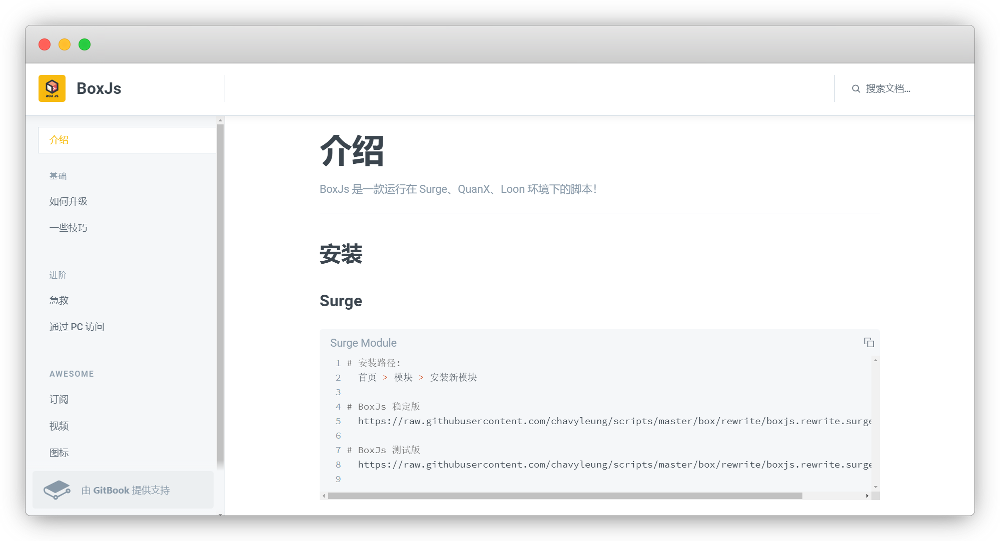
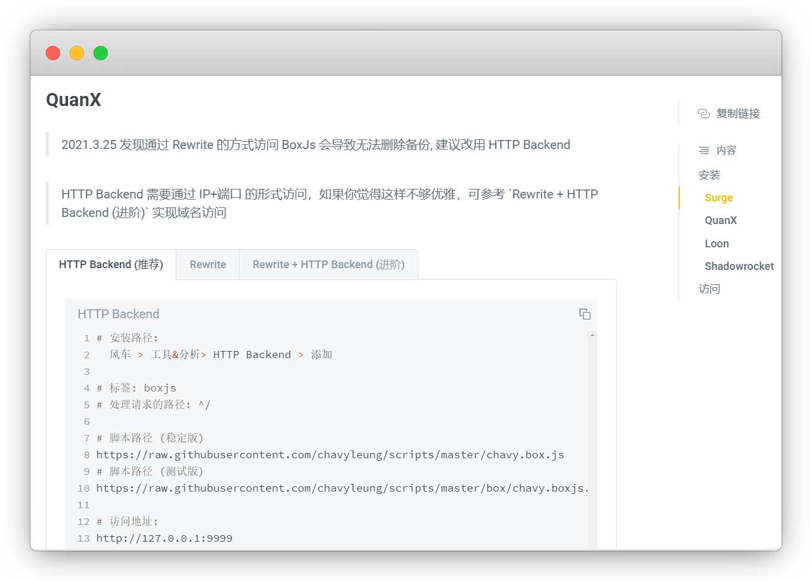
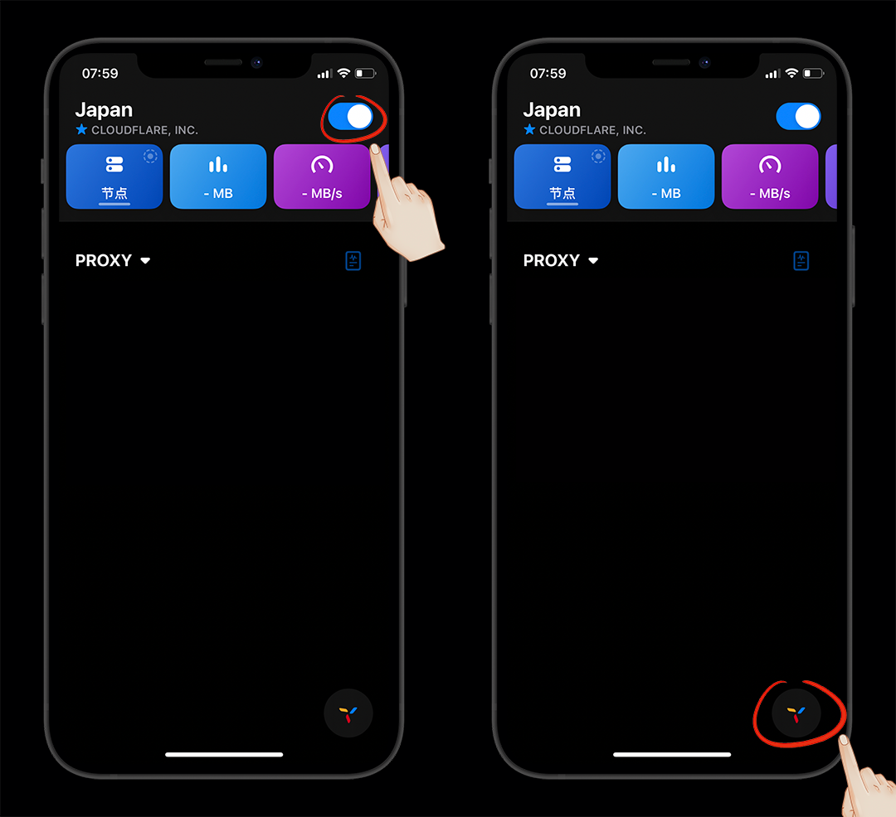
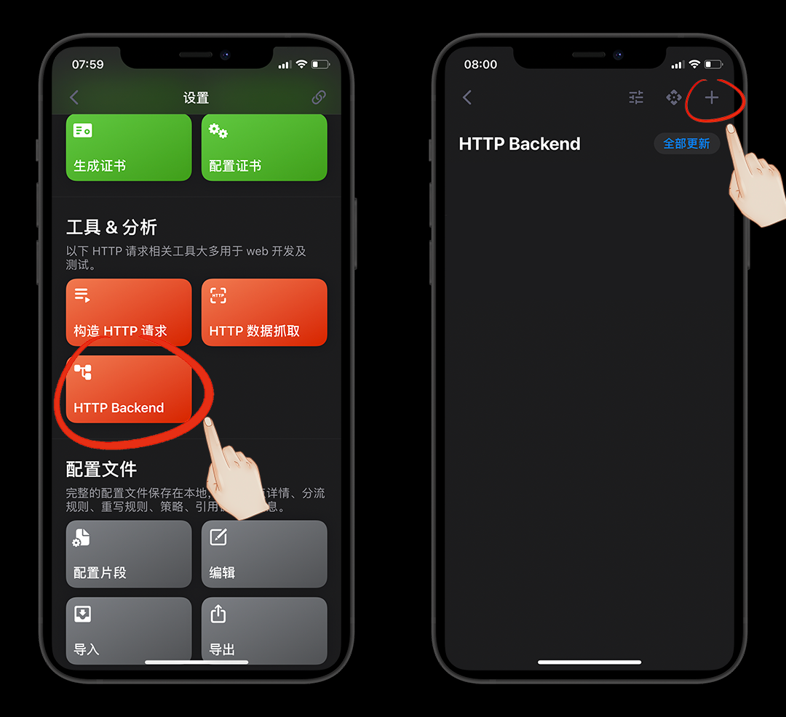
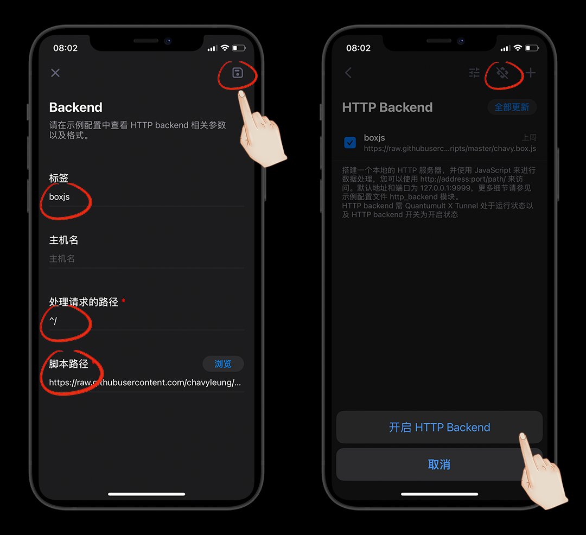
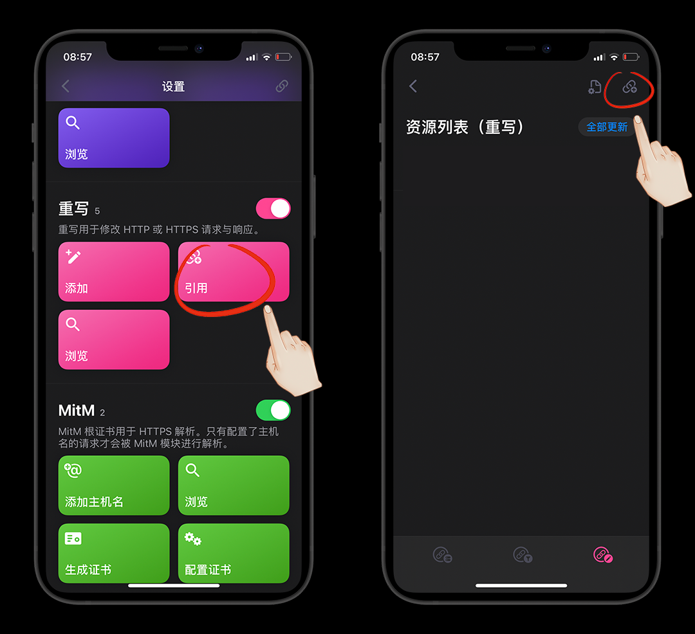
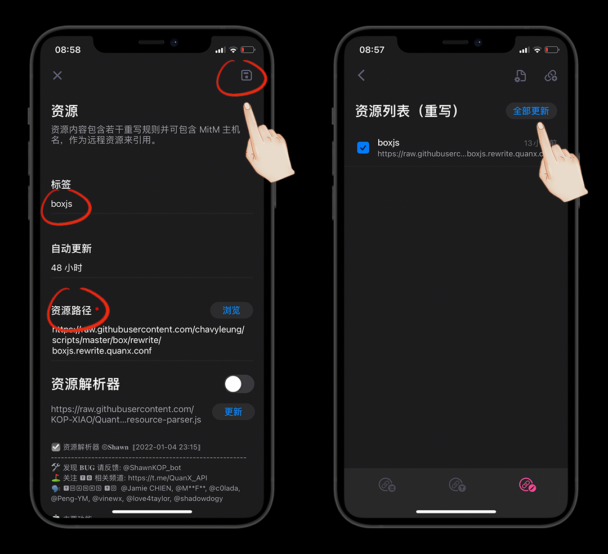
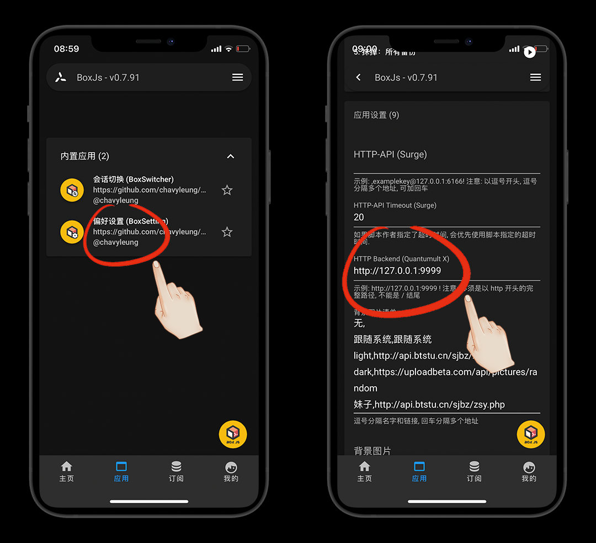
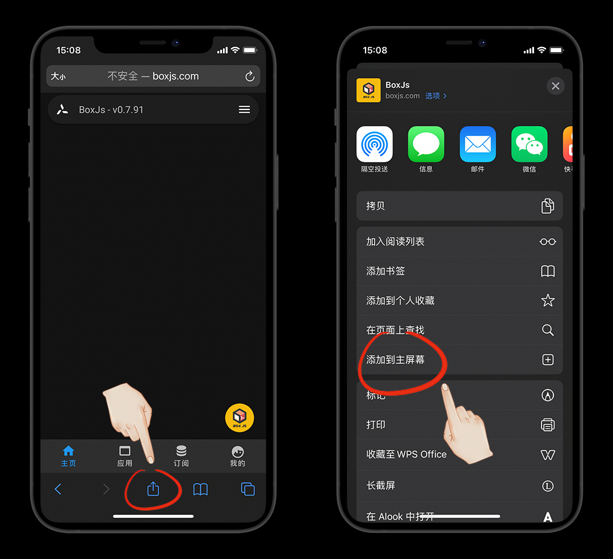
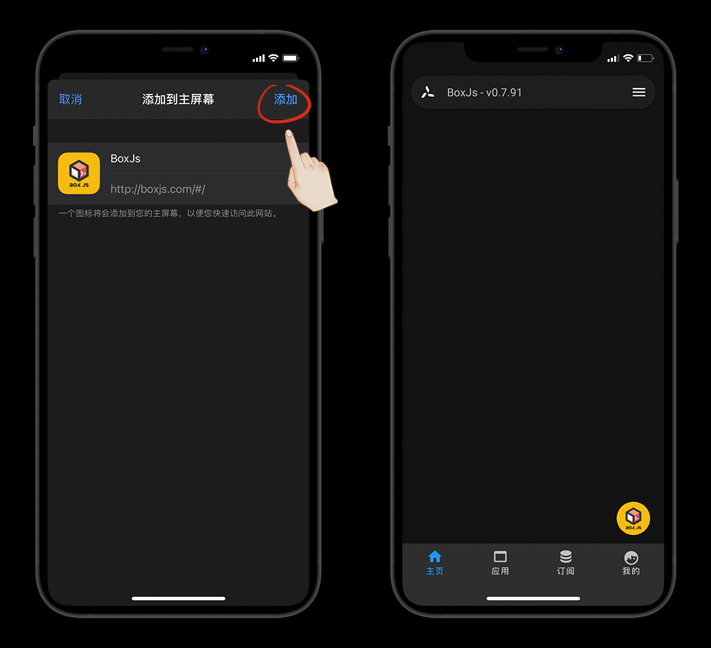

# BoxJs安装

::: warning 更新时间
最近更新：2022-1-25
:::


BoxJs官网：[https://docs.boxjs.app/](https://docs.boxjs.app/)




::: tip 说明
我这里只有圈X，就只演示圈X了，其他的按照它的步骤即可
:::

圈X的安装有3个方式，我们按推荐的来




## 安装

打开圈X开关，连接好一个节点，然后打开开关，不然进不去


风车 > 工具&分析> HTTP Backend > 添加






添加脚本信息

```js
标签: boxjs

处理请求的路径: ^/

脚本路径 (稳定版)

https://raw.githubusercontent.com/chavyleung/scripts/master/chavy.box.js

脚本路径 (测试版)

https://raw.githubusercontent.com/chavyleung/scripts/master/box/chavy.boxjs.js
```

我们就用稳定版即可，填完信息保存并打开HTTP Backend开关，最后更新一下




安装完成后，访问地址即可

[http://127.0.0.1:9999](http://127.0.0.1:9999)


## 域名访问

如果不喜欢这种IP+端口的方式，可以用第三种安装方式，用域名访问

[http://boxjs.com/](http://boxjs.com/)


风车 > 重写 > 引用





填写脚本信息

```js
BoxJs 稳定版

https://raw.githubusercontent.com/chavyleung/scripts/master/box/rewrite/boxjs.rewrite.quanx.conf

BoxJs 测试版

https://raw.githubusercontent.com/chavyleung/scripts/master/box/rewrite/boxjs.rewrite.quanx.tf.conf
```

我们就用稳定版即可，填完信息保存，最后更新一下



BoxJs > 应用(底栏) > 内置应用 > 偏好设置

在`HTTP Backend (Quantumult X)` 中填入 HTTP Backend 的地址即可

```
http://127.0.0.1:9999
```




## 桌面快捷


网页进入BoxJs-底部分享-添加到主屏幕即可






## 特别鸣谢


* [BoxJs](https://docs.boxjs.app/)

* [chavyleung](https://github.com/chavyleung/scripts)

