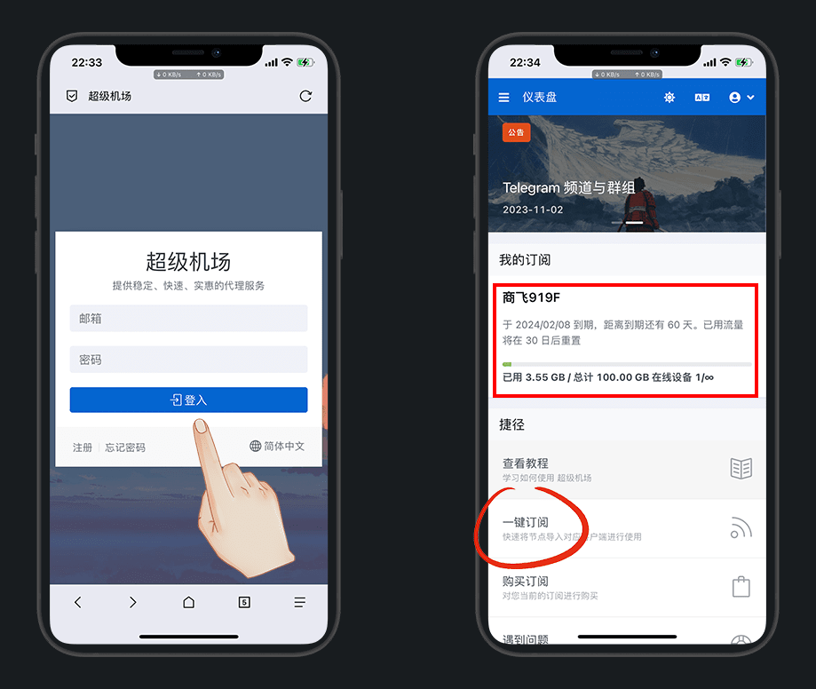
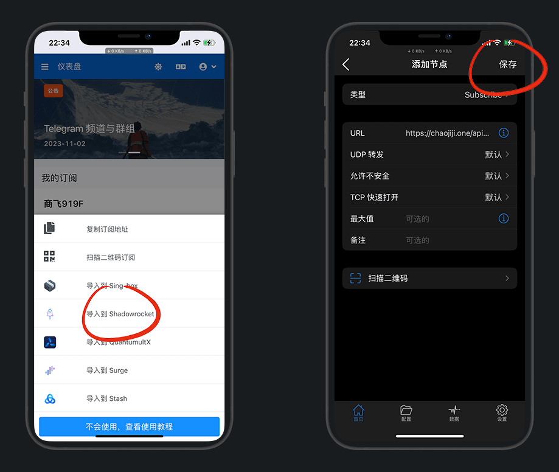

# 科学上网工具及使用

> 更新时间：2024-1-2

## 简介

想要翻墙看外面的世界，工具必不可少

不推荐使用任何VPN以及破解的VPN，因为会被监管审计，小心说错话被请去喝茶

* 苹果推荐：[小火箭](#iphone)

* 安卓推荐：[Clash](#android)

## 工具

请根据自己的设备，下载相应的客户端

::: tip 说明
有⭐的有教程，点击即跳转
:::

### iPhone

* [⭐Shadowrocket·小火箭：美区$5.99](#苹果使用)

* [QuantumultX·圈X：美区$7.99](https://apps.apple.com/us/app/quantumult-x/id1443988620)

* [Surge](https://apps.apple.com/us/app/id1442620678)

* [Loon：美区$5.99](https://apps.apple.com/us/app/loon/id1373567447)

* [Choc：美区$2.99](https://apps.apple.com/us/app/choc/id1582542227)

* [Stash：美区$3.99](https://apps.apple.com/us/app/stash-proxy-utility/id1596063349)

* [sing-box](https://apps.apple.com/us/app/sing-box/id6451272673)

* [karing](https://karing.app/)

* [Potatso Lite](https://apps.apple.com/us/app/id1239860606)

* [OneClick](https://apps.apple.com/us/app/id1545555197)

* [Spectre](https://apps.apple.com/app/spectre-vpn/id1508712998)

* [Upnet：每天签到免费15分钟](https://apps.apple.com/us/app/vpn-upnetvpn/id1532190618)

---

### Android

* [⭐Clash：小猫咪，作者@Kr328关库的备份](#安卓使用)

* [V2rayN](https://github.com/2dust/v2rayNG/releases)

* [Shadowsocks](https://github.com/shadowsocks/shadowsocks-android/releases)

* [surfboard：冲浪板](https://github.com/getsurfboard/surfboard/releases/)

* [shadowsocksr：SSR](https://github.com/shadowsocksrr/shadowsocksr-android/releases)

* [NekoBox](https://github.com/MatsuriDayo/NekoBoxForAndroid)

---

### Window

* [Clash：作者@Fndroid关库的备份](https://github.com/Z-Siqi/Clash-for-Windows_Chinese/releases/tag/CFW)

::: details Clash使用说明
使用方法：
1.配置-粘贴订阅链接-下载;
2.常规-打开系统代理;
3.代理-选择节点
:::

* [Clash汉化补丁_作者@BoyceLig关库的备份](https://github.com/Z-Siqi/Clash-for-Windows_Chinese/releases/tag/CFW-V0.20.39_CN)

::: details Clash汉化说明
下载对应版本的app.asar文件，替换resources\app.asar中的文件
:::

* [Shadowsocks](https://github.com/shadowsocks/shadowsocks-windows/releases)

::: details Shadowsocks使用说明
使用方法：右键状态栏-服务器-从剪切板导入；系统代理-勾选PAC模式
:::

* [V2rayN](https://github.com/2dust/v2rayN/releases)

* [shadowsocksr：SSR](https://github.com/shadowsocksr-rm/shadowsocksr-csharp/releases)

* [Nekoray：window端64位](https://github.com/MatsuriDayo/nekoray/releases)

* [clash-nyanpasu](https://github.com/keiko233/clash-nyanpasu/releases)

* [karing](https://karing.app/)

* [NekoRay](https://github.com/MatsuriDayo/nekoray/releases)

* [浏览器插件·Hoxx VPN.crx](https://dzp.lanzouy.com/ih2uz052glwh)

* [浏览器插件·iGG谷歌学术助手.crx](https://dzp.lanzouy.com/igSY9xk2asd)

---

### Mac

* [ClashX：作者@yichengchen关库的备份](https://www.clash.la/archives/750/)

* [V2rayU](https://github.com/yanue/V2rayU/releases)

* [ShadowsocksX-NG](https://github.com/shadowsocks/ShadowsocksX-NG/releases/)

* [Surge：需科学上网才可打开](http://nssurge.com/)

* [clash-nyanpasu](https://github.com/keiko233/clash-nyanpasu/releases)

* [karing](https://karing.app/)

---

## 使用

本次仅演示手机端的使用

---

### 苹果使用

美区苹果商店，下载安装 [小火箭 shadowrocket](https://apps.apple.com/us/app/shadowrocket/id932747118) 来演示

::: details 关于小火箭安装方式
* 付费方式：需 [注册美区Apple ID](../../iPhone/Apple_ID/) 且购买后下载使用

* 免费方式1：安装 [巨魔助手](../../iPhone/sign/TrollStore.md) ，下载 [小火箭巨魔专用版](https://app.liuchengxi.com/app/243.html) ，用巨魔安装使用

* 免费方式2：借别人购买过小火箭的账号，登录下载
:::

找一个免费送流量的机场注册，点击 `一键订阅`

::: tip 说明
以下截图机场仅为演示

更多免费好用机场，请查看 [机场channel大全一览表](../channel/)
:::

选择对应的工具，我这里选 `shadowrocket`，跳转后点右上角保存

::: details 没有跳转到小火箭
点复制订阅地址，打开小火箭，右上角+号添加保存即可

:::

设置 - 延迟测试方法，改成 `CONNECT`

::: tip 说明
这一步虽然不是非必要的，但是是一个查看网络延迟的重要参考
:::

选择延迟低的，打开开关，上 [谷歌](https://www.google.com/) 看看是否成功

::: details 关于节点
* 垃圾节点打开就很慢的，无解

* 如果节点是中国香港，那么谷歌只能用 https://www.google.hk/
:::

---

### 安卓使用

安卓下载安装 [小猫咪 Clash](https://github.com/Z-Siqi/Clash-for-Windows_Chinese/releases/tag/CFA) 来演示

找一个免费送流量的机场注册，点击 `一键订阅`

::: tip 说明
以下截图机场仅为演示

更多免费好用机场，请查看 [机场channel大全一览表](../channel/)
:::

自动跳转过来保存即可，不能跳转的，手动复制填写，返回启动

访问谷歌，成功即可，打不开说明节点不行，换机场

