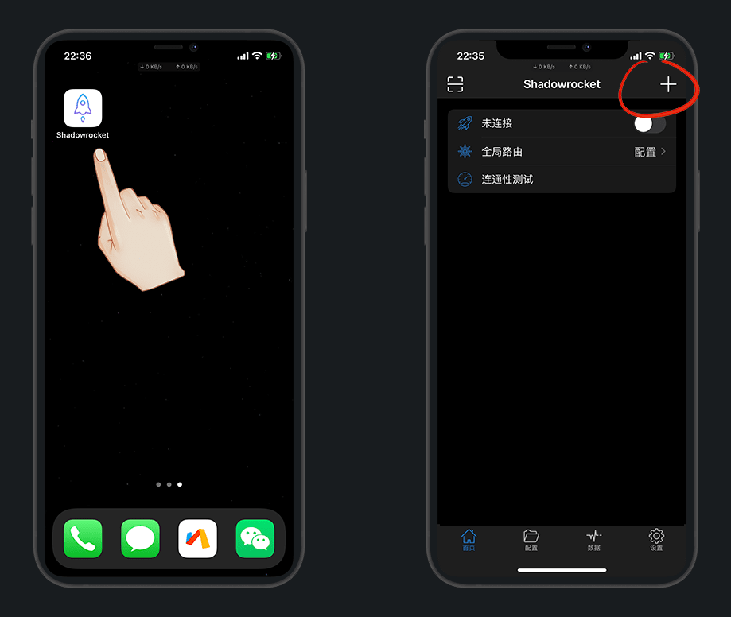

# 科学上网工具及使用方法

::: warning 更新时间
最近更新：2022-9-19
:::


工具基本上任选一种就够用了，不用去追求最全，好用就行

::: tip 推荐
苹果推荐 `小火箭`，安卓推荐 `Clash`
:::


## Window


* [Clash：PC端下载](https://github.com/Fndroid/clash_for_windows_pkg/releases)

::: tip Clash使用说明
使用方法：
1.配置-粘贴订阅链接-下载;
2.常规-打开系统代理;
3.代理-选择节点
:::

* [Clash：PC端汉化补丁下载](https://github.com/BoyceLig/Clash_Chinese_Patch/releases)

::: tip Clash汉化说明
下载对应版本的app.asar文件，替换resources\app.asar中的文件
:::

* [Shadowsocks：PC端下载](https://github.com/shadowsocks/shadowsocks-windows/releases)

::: tip Shadowsocks使用说明
使用方法：右键状态栏-服务器-从剪切板导入；系统代理-勾选PAC模式
:::

* [V2rayN：PC端下载](https://github.com/2dust/v2rayN/releases)

* [SSR：PC端下载](https://github.com/shadowsocksr-rm/shadowsocksr-csharp/releases)


* [浏览器插件·Hoxx VPN.crx](https://dzp.lanzouy.com/ih2uz052glwh)


* [浏览器插件·iGG谷歌学术助手.crx](https://dzp.lanzouy.com/igSY9xk2asd)


## Mac

* [ClashX：MAC端下载](https://github.com/yichengchen/clashX/releases)


* [V2rayN：MAC端下载](https://github.com/yanue/V2rayU/releases)


* [Shadowsocks：MAC端下载](https://github.com/shadowsocks/ShadowsocksX-NG/releases/)


* [Surge：MAC端下载](http://nssurge.com/)


## Android


* [Clash：安卓端下载](https://github.com/Kr328/ClashForAndroid/releases)


* [V2rayN：安卓端下载](https://github.com/2dust/v2rayNG/releases)


* [Shadowsocks：安卓端下载](https://github.com/shadowsocks/shadowsocks-android/releases)


* [surfboard：安卓端下载](https://github.com/getsurfboard/surfboard/releases/)


* [SSR：安卓端下载](https://github.com/shadowsocksrr/shadowsocksr-android/releases)


* [Matsuri：安卓端下载](https://github.com/MatsuriDayo/Matsuri/releases/)


## iPhone


* [GreatVPN：苹果端下载](https://apps.apple.com/us/app/id1603206726)「美区ID免费」

* [Shadowrocket·小火箭：苹果端下载](https://apps.apple.com/us/app/shadowrocket/id932747118)「美区ID付费」

* [QuantumultX·圈X：苹果端下载](https://apps.apple.com/us/app/quantumult-x/id1443988620)「美区ID付费 日区便宜」

* [Surge：苹果端下载](https://apps.apple.com/us/app/id1442620678)

* [Loon：苹果端下载](https://apps.apple.com/us/app/loon/id1373567447)

* [Choc：苹果端下载](https://apps.apple.com/us/app/choc/id1582542227)

* [Stash：苹果端下载](https://apps.apple.com/us/app/stash-proxy-utility/id1596063349)

* [Potatso Lite：苹果端下载](https://apps.apple.com/us/app/id1239860606)

* [OneClick：苹果端下载](https://apps.apple.com/us/app/id1545555197)

* [Spectre：苹果端下载](https://apps.apple.com/app/spectre-vpn/id1508712998)


## VPN

基本都是付费的，不需要自己找节点，自己找破解的用也可

* [白鲸加速器](https://www.bjch999.com/)「简单好用」

* [快连](https://github.com/LetsGo666/LetsGo_2)「付费」

::: tip 说明
IOS端配合 巨魔助手安装 `Apps Manager` 抹除数据可无限刷

[不懂巨魔助手的点我另外的文章](../../iPhone/sign/#巨魔助手)
:::


## 使用


有了工具，我们还需要节点(流量)

::: tip 说明
第一次使用，建议随便挑一个有新户注册送流量的机场，好用再花钱买
:::

请参照 [机场channel大全一览表](../channel/)


挑好机场并注册，然后我以安卓的小猫咪 `Clash` 演示

::: tip 说明
其他应用请参考机场的使用说明文档
:::


自动跳转过来保存即可，不能跳转的，手动复制填写，返回启动


访问谷歌，成功即可，打不开说明节点不行，换机场




:::: details 点击查看 其它获取方式

1.TG群分享

有很多白嫖节点分享群，请参照 [TG搜：白嫖](https://tgsou.me/findtg/?keyword=%E7%99%BD%E5%AB%96)


2.爬虫搜索

* [FOFA搜索引擎](https://fofa.so/)(凉了)


* [zoomeye 钟馗之眼](https://www.zoomeye.org/)「需注册账号」


搜索 `title:"Free Proxies"` ，点黑色小箭头进去

```
title:"Free Proxies"
```


这种就是搭建好了的，我们直接复制订阅，使用即可

::: tip 注意
如果进来没有这个页面，说明没有搭建，找下一个即可
:::


::::


## 订阅转换

有些订阅节点和机场格式，app不支持，我们就可以用链接转换

* [Shawn](https://dove.589669.xyz/web)

* [fengguo](https://sub.feng666.tk/)

* [碧海](https://sub.bihai.cf/)

* [Saraphine](https://sub.saraphine.cf/)

* [cycxtit](https://subs.cycxtit.ga/)
