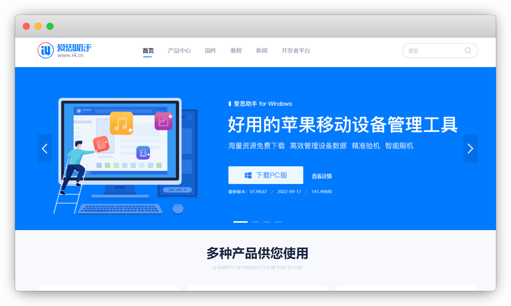
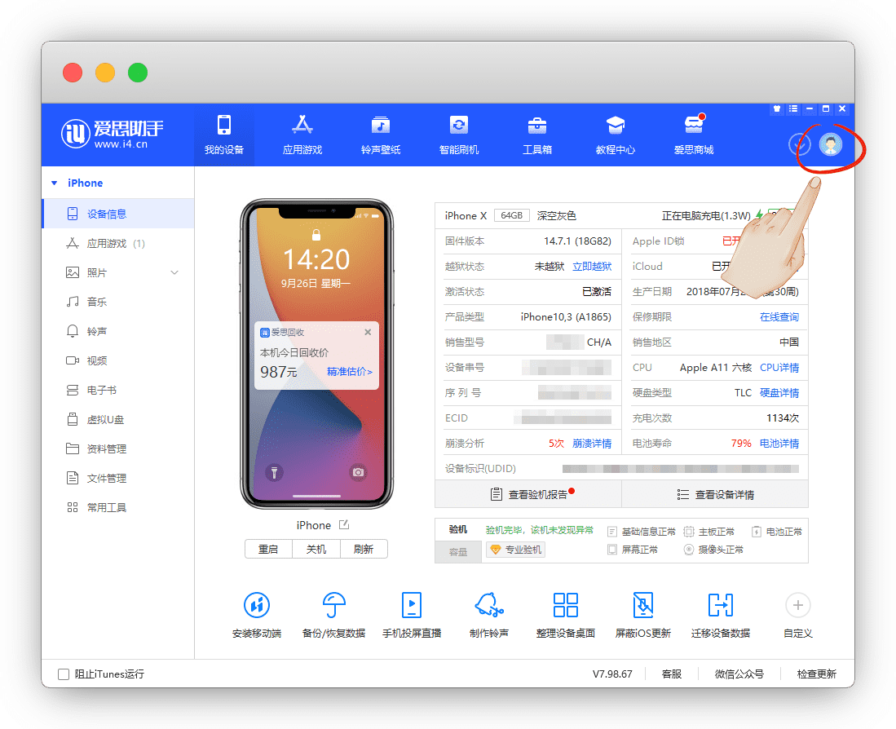
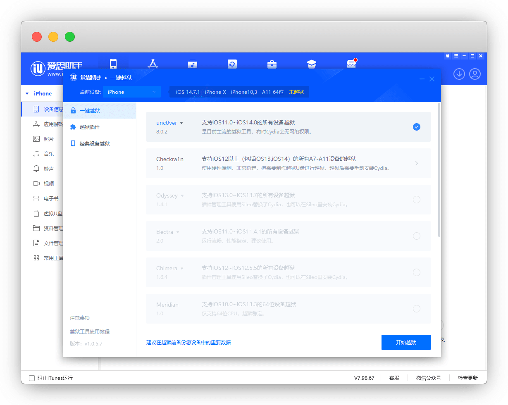

# unc0ver越狱及使用

> 更新时间：2023-12-5


## 简介

老系统中最常用也最强大的越狱工具之一

官网：https://unc0ver.dev/


## 适用范围


| 手机/系统 | 6s-8系列 / SE / X (A9-A11) | XS系列 / XR / 11系列 / SE 2 (A12-A13) | 12系列 (A14) | 13-15系列 / SE 3 (A15-A17) |
| :-: | :-: | :-: | :-: | :-: |
| 11.0-14.3 | :heart: | :heart: | :heart: | ✘ |
| 14.6-14.8 | ✘ | :heart: | ✘ | ✘ |
| 14.8.1及以上 | ✘ | ✘ | ✘ | ✘ |


## 开始越狱

如果刚上手不太懂得使用，直接 [爱思助手](https://www.i4.cn/) 简单且好用


官网：[https://www.i4.cn/](https://www.i4.cn/)





安装完成后，连接手机，手机端点一下 `信任` ，就进入了爱思界面

请先右上角注册并登录账号，否则无法使用越狱功能

::: tip 说明
都是手机的信息，查验手机也会用到它
:::




点工具箱 - 一键越狱，等下载安装完成


打开后会自动识别可用的越狱工具

::: tip 说明
如果你这里没有可用的工具，排出数据线没插好外，默哀，你的手机越狱不了
:::




勾选 `unc0ver` ，点击开始越狱，自动下载安装


回到手机，设置-通用-设备管理，安装信任证书


打开 `unc0ver` ，却提示 `Unsupported`，竟然不支持，我哭

::: tip 说明
不支持就是无解了，不要再尝试了，换工具吧
:::


虽然我的手机不可以，我去截个图来继续演示


打开 `unc0ver` ，点左上角 齿轮 ，进入设置，只开 `Load Tweaks`即可，右上角 Done 退出


返回后点击 `jailbraek` 开始越狱，等完成后点击OK，手机自动重启


## Cyida的使用


进入Cyida-更新必要软件包-确定-即可进入主页


界面简介，常用的就是 `软件源` 和 `搜索`，用Trollstore演示一下

软件源-右上角编辑-左上角添加，输入源地址：[https://havoc.app](https://havoc.app)


等安装完成即可，现在就有Havoc的源了


搜索 `Trollstore Helper` 然后右上角-更改-安装就完成了


## 插件


由于插件源众多，不一一赘述，更多源请参考 `@艾橙互动` 公众号的整理

[插件目录大全](https://mp.weixin.qq.com/s/ploLK0P8KakFgicxZYC1UQ) 丨 [整理的各类源](https://mp.weixin.qq.com/s/lSE0PSKA4PT09ChOrEwRRw)


### 自带源

::: tip 说明
默认源，无需额外添加，避免误删的对照
:::

* Binger源：`https://apt.binger.com/`

* BigBoss源：`https://apt.thebigboss.org/repofiles/Cydia/`

* Chariz源：`https://repo.chariz.com/`

* Dynastic Repo源：`https://repo.dynastic.co/`

* ModMyi(Archive)源：`https://apt.modmyi.com/`

* ZodTTD&MacCiti(Archive)源：`https://cydia.zodttd.com/repo/cydia`


::: details 默认源好用插件
```md
# BigBoss源

* PreferenceLoader：越狱插件运行的依赖文件

* AppList：查看已经安装的 App 列表

* RocketBootstrap：允许在 App 运行时加载插件

* Apple File Conduit "2"：手机连接电脑，爱思助手可以访问导入或导出文件

* 连个锤子：修复无法联网问题


# Chariz源

* Atria：自定义桌面布局

* Cylinder Reborn：炫酷翻页特效

* LastLook：款熄屏显示插件，收费！

* NewTerm 2：终端工具

```
:::


### 其他插件


::: details 点我查看常用插件源
```md
# Netskao哥哥源

源地址：https://repo.initnil.com

DumpDecrypter：砸壳解密工具

NetWorkManager：联网权限管理

injectipa：dylib插件注入

微信净化/抖音净化等等

IPA下载：https://share.initnil.com/With_TorllStore

QQ及微信砸壳包：https://github.com/Netskao/iOS-DumpDecrypted-IPAs

公众号Netskao：https://mp.weixin.qq.com/s/ieLeWpUNjbDL9JGKYhJcmA


# 老牌猫源

源地址：https://apt.25mao.com/

插件：微信插件：密友/斗图助手/游戏扫码登录

TG群：https://t.me/lanmaoios


# APP库

源地址：http://ak.wxqqurl.cn/appstore

IPA盘：https://pan.wxqqurl.cn

公众号App库：https://mp.weixin.qq.com/s/aDLiPqL5tSxbTOa5M2IqGw


# 艾锋源

源地址：http://apt.ss03.cn/

公众号：艾锋降级


# 电话助手源

源地址：http://apt.htv123.com

购买授权码：https://buy.htv123.com/


# 嗨客汉化源

源地址：http://repo.qqtlr.com


# 冷冷雨源

源地址：https://lenglengyu.com

TG群：https://t.me/+l9inH184Ye9jZmM1


# 苏兔美化酸果

源地址：https://apt.sutuplus.com/

公众号苏兔：https://mp.weixin.qq.com/s/aDLiPqL5tSxbTOa5M2IqGw


# AppCake源

源地址：http://cydia.iphonecake.com/

CarackerXI+ 砸壳官方源


# akusio源

源地址：https://akusio.github.io/

BackgrounderAction15 for CCSupport：应用在后台保持运行，不支持微信 丨 需安装CCSupport

MilkyWay：分屏插件


# CokePokes源

源地址：http://cokepokes.github.io/

AppStore++ APP升降级，在APP Store长按应用的打开按键


# Delta源

源地址：http://getdelta.co

Flex3：免广告插件


# Fouad源

源地址：https://apt.fouadraheb.com/

AppData：系统垃圾清理


# Havoc源

源地址：https://havoc.app

原Packix源迁移至此

Trollstore Helper：巨魔助手(免签神器)

ReProvision Reborn：自签插件，免签安装IPA

Ampere：电池百分比数字显示


# 蔡明美源

源地址：https://cydia.akemi.ai/

AppSync Unified：自签插件，免签安装IPA


# Ivano Bilenchi`s Repo源

源地址：https://ib-soft.net/cydia

iCleaner pro：老牌清理插件


# julioverne源

源地址：https://julio.hackyouriphone.org/

Cydown：deb插件下载

NtSpeed：悬浮网速显示


# MiRO92源

源地址：http://miro92.com/repo

Cyrch：在Cydia顶部增加一个搜索功能


# opa334源

源地址：https://opa334.github.io/

Choicy：调整注入管理插件丨汉化赵楠源：`https://invalidunit.github.io/repo/`

AltList：安装Choicy的依赖

CCSupport：控制中心模块相关插件的依赖


# SkyPian源

源地址：https://skypain.github.io/repo/

CCLocation：控制中心添加定位开关，一键开启或关闭定位

CCRespring：控制中心一键注销

CCSettrings：控制中心添加设置开关，一键打开手机设置 App

MiniLsp：锁屏迷你播放器


# TIGI Software源

源地址：https://tigisoftware.com/cydia/

Apps Manager： Filza文件管理器


# xia0Repo源

源地址：http://xia0z.github.io/

FakeLocationX：虚拟定位
```
:::


### 插件下载


::: tip 说明
我们常见的 `dylib插件` 也就是deb解压出来的
:::

* [PC端：cydownload](https://github.com/borishonman/cydownload/releases)

* [手机端：PostBox](https://itunes.apple.com/app/id1644577838)「国区下架，美区下载即可」

* [手机端：Saily](https://github.com/SailyTeam/Saily/releases)

* [手机端：Sileo](https://github.com/Sileo/Sileo/releases)

* [越狱机：CyDown](https://julio.hackyouriphone.org/)

* [网页端：Repo Updates](https://www.ios-repo-updates.com/)


## 常见问题


#### 1.uncover一直卡进度条，不到32

可尝试用[Altstore](https://altstore.io/)签名安装 `uncover` 后，重新越狱


#### 2.怎么清除越狱


清理越狱环境，但安装的插件配置文件会保留，建议先清理

* [iCleaner Pro](https://ib-soft.net/cydia)「删除插件」

* 用[Filza File Manager](http://tigisoftware.com/cydia/)，在 `Cydown` 路径 `/var/mobile/Documents/CyDown` 删除已经下载的 deb 安装包

* 卸载必须依赖 用 `PreferenceLoader` 批量卸载

* unc0ver：左上角点击齿轮，把所有按钮都关闭，只开`Restore RootFS`，重启

