#  iPhone越狱


::: warning 更新时间
最近更新：2023-10-17
:::

## 简介

越狱的目的简单来讲，就是通过安装各种插件来追求更个性化、更安卓化

随着苹果漏洞的完善，越狱在不久的将来，可能会不复存在

::: warning 说明
越狱工具很多，参照表格，我们根据自己的系统选择即可

除 `Dopamine` 为 `rootless无根越狱`，其他均为 `rootful有根越狱`
:::

| 手机/系统 | 6s系列 / SE / 7(A9-A10) | 8系列 / X(A11) | XS系列 / XR / 11系列 / SE 2 (A12-A13) | 12系列(A14) | 13系列 / 14系列 / SE 3(A15) | 14 Pro系列 / 15系列(A16) |
| :-: | :-: | :-: | :-: | :-: | :-: | :-: |
| 14.0-14.5.1 | [Taurine](#taurine) / [checkra1n](#checkra1n) / [Palera1n](#palera1n) / [unc0ver](#unc0ver) | [Taurine](#taurine) / [checkra1n](#checkra1n) / [Palera1n](#palera1n) / [unc0ver](#unc0ver) | [Taurine](#taurine) / [unc0ver](#unc0ver) | [unc0ver](#unc0ver) | - | - |
| 14.6-14.8 | [Taurine](#taurine) / [checkra1n](#checkra1n) / [Palera1n](#palera1n) | [Taurine](#taurine) / [checkra1n](#checkra1n) / [Palera1n](#palera1n) | [unc0ver](#unc0ver) | - | - | - |
| 14.8.1 | [Taurine](#taurine) / [checkra1n](#checkra1n) / [Palera1n](#palera1n) | [Taurine](#taurine) / [checkra1n](#checkra1n) / [Palera1n](#palera1n) | - | - | - | - |
| 15.0-15.4.1 | [checkra1n](#checkra1n) / [Palera1n](#palera1n) | [checkra1n](#checkra1n) / [Palera1n](#palera1n) | [💪Dopamine](#💪dopamine) | [💪Dopamine](#💪dopamine) | [💪Dopamine](#💪dopamine) | - |
| 15.5-15.7.9 | [checkra1n](#checkra1n) / [Palera1n](#palera1n) | [checkra1n](#checkra1n) / [Palera1n](#palera1n) | - | - | - | - |
| 16.0 - 16.7 | - | [checkra1n](#checkra1n) / [Palera1n](#palera1n) | - | - | - | - |
| 17及以上 | - | - | - | - | - | - |


## 💪Dopamine


IOS 15越狱工具Dopamine，中文名 `多巴胺`

::: details XinaA15 IOS 15首个越狱工具

首个IOS 15越狱，由国人 [@朱心浪](https://twitter.com/xina520) 独立开发，后发布了 [XinaA15](https://xina.ss03.cn/)

* 适用：`A12-15 / iOS 15.0-15.1.1`

* 功能：首次推出最强功能的 `临退模式` ，即可以临时退出越狱模式，以应对银行等app对越狱环境的检测

* 隐退：[@opa334](https://twitter.com/opa334dev) 加入了IOS 15的越狱开发中后，退出了 `XinaA15` 的开发

* 骄傲：只用了3年就学会越狱，是国人的骄傲和榜样

* 越狱源：[https://apt.xina.vip/](https://apt.xina.vip/)

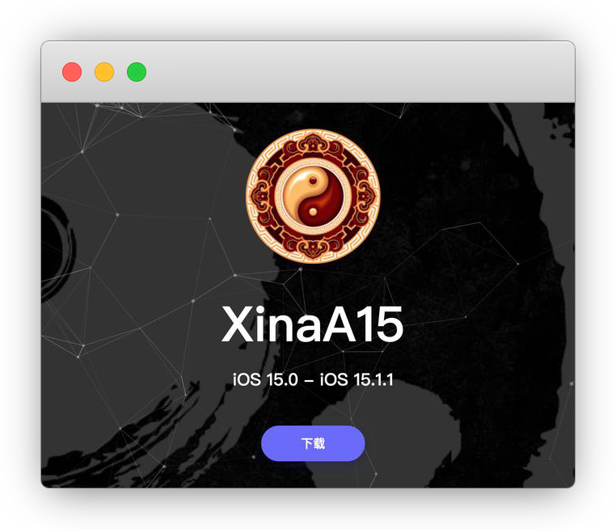

:::

### 1.简介

[@opa334](https://twitter.com/opa334dev) 加入IOS 15的越狱开发中，进展迅速并暂时命令为 [Fugu 15 Max](https://github.com/opa334/fugu15)

* 适用：`A12-15 M1 / iOS 15.0-15.4.1`

* 发布：2023/4/20正式发布，并命名为 [Dopamine](https://github.com/opa334/Dopamine) (多巴胺)

* 官网：[https://ellekit.space/dopamine/](https://ellekit.space/dopamine/)

* 仓库：[https://github.com/opa334/Dopamine](https://github.com/opa334/Dopamine)

* 越狱源：[https://opa334.github.io/](https://opa334.github.io/)


::: warning 注意
越狱均为不完美越狱，即重启后恢复未越狱状态，需要重新越狱

多巴胺为rootless，即无根越狱，无根目录权限，仅可读取系统文件
:::


### 2.适用范围

| 手机/系统| XS系列 / XR / 11-14系列 / SE 2-3 / (A12-A15) | 14 Pro系列 / 15系列 (A16) |
| :-: | :-: | :-: |
| 15.0-15.4.1 | :heart: | ✘ |
| 15.5及以上 | ✘ | ✘ |


### 3.安装


在多巴胺官网：[https://ellekit.space/dopamine/](https://ellekit.space/dopamine/)

下载ipa包


我用巨魔安装，或者你也可以 [用其他自签工具](../sign/)

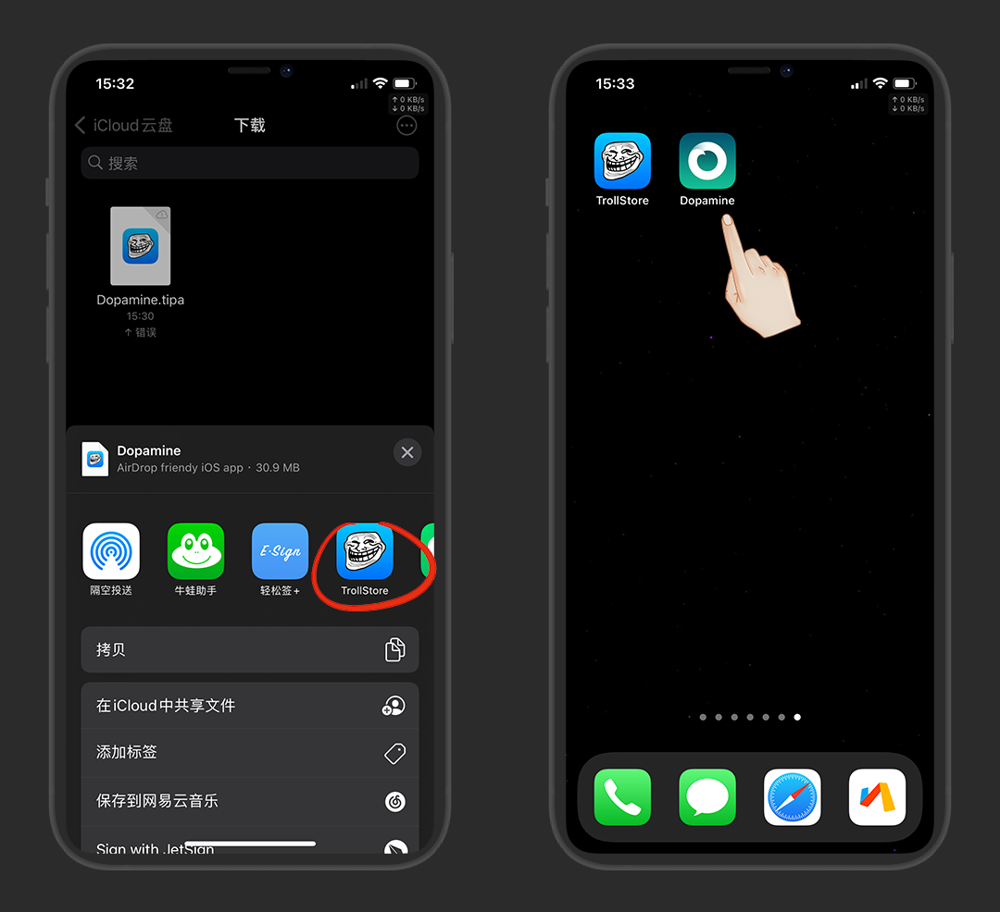


支持中文界面，UI很舒服

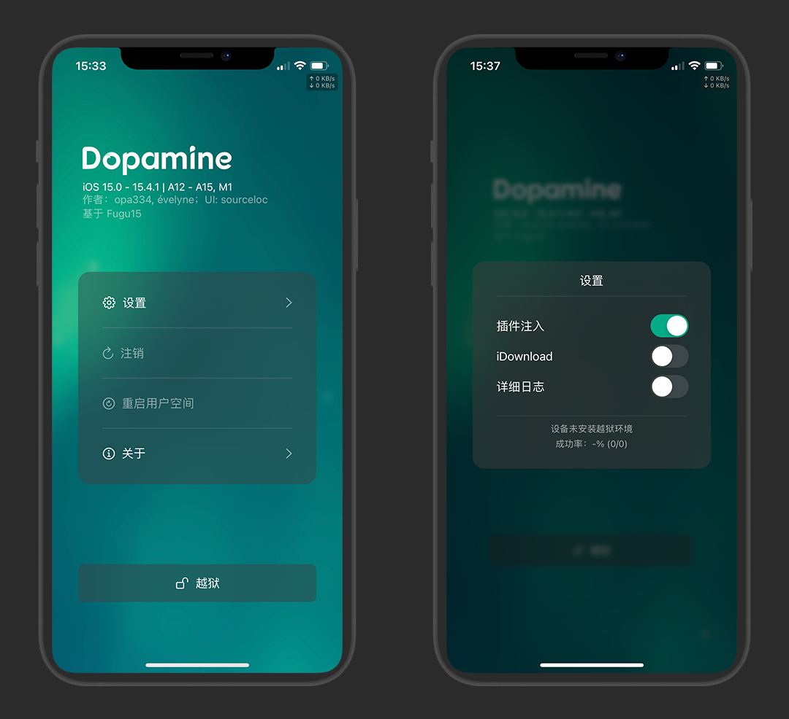


点击底部 `越狱` 开始，选择包管理器，默认 Sileo


首次越狱，会弹出设置终端密码提示框，以后会使用到

::: danger 注意
请牢记密码！请牢记密码！请牢记密码！

使用命令工具的时候会用到
:::

进度完成后自动注销，再次进入查看手机是否完成越狱

如越狱失败，重启下手机，再试一遍，不代表一次能成功


接下来就是打开Sileo商店安装插件了


### 4.插件

::: warning 注意
Ellekit 是 Dopamine 越狱后必须安装的基板

必须首先安装 Ellekit 源：[https://ellekit.space/](https://ellekit.space/)

另：有一些有根转无根的插件，尽量不要使用，以免白苹果！
:::


#### 4.1 默认源

* BigBoss 源：`https://apt.thebigboss.org/repofiles/Cydia/`

* Chariz 源：`https://repo.chariz.com/`

* Ellekit 源：`https://ellekit.space/`

* Havoc 源：`https://havoc.app/`

* Procursus 源：`https://apt.procurs.us/` (必装依赖PreferenceLoader)


::: details 默认源 好用插件推荐
```md

# BigBoss 源

* App Library Disabler：去除App资源库的插件

* CCVibration：控制中心添加振动模块的插件

* HotspotQR：将个人热点网络生成二维码

* WiFiQR：将WiFi网络生成二维码


# Havoc 源

* Anouk：给隐藏照片加锁

* Ampere：电池百分比插件

* CopyLog：剪贴板管理插件

* CCCounters：控制中心显示倒计时的插件

* CCDNDTimer：控制中心勿扰模式增强插件

* DLEasy：知名的国外社交App视频下载神器

* DNDMyRecording：录屏勿扰插件

* FloatingDockXVI：自定义Dock栏摆放数量

* Hammer It：分词大爆炸 [说明书](https://github.com/lclrc/lclrc.github.io/blob/main/HammerIt.md)

* InstaLauncher 2：应用快速启动插件

* IconOrder：依赖文件，如FolderX、Bolders Reborn

* Macaron：给Doc栏添加图片的插件

* MenuSupport：将选择菜单图标按钮显示的插件

* Stella：一款模拟雪花飘落的插件

* Snapper 3：区域截图插件，收费！需安装bigboss源的 `CCSupport` 依赖，可配合 Hammer It、Translomatic使用

* SquidGesture：全局手势插件插件

* Translomatic：快捷翻译，可配合Snapper 3使用

* TrollStore Helper：巨魔助手，可永久免签安装ipa

* Uptime：控制中心显示开机后运行时间的插件

* UnderDock：新的键盘增强插件


# Chariz 源

* Atria：自定义主屏幕图标布局的插件，需在本源中安装依赖 `Alderis Color Picker`

* Bolders Reborn：自定义文件夹的插件，需在Havoc源安装依赖`IconOrder`

* Cylinder Reborn：炫酷翻页特效插件

* Comet：依赖文件，如Dodo

* Jade：收费插件，控制中心

* LastLook：熄屏显示插件

* Orion Runtime (iOS 14 – 16)：依赖文件，如Dodo

* SearchDots：模仿iOS 16系统桌面搜索按钮的插件

* SwipeExtenderX：原生键盘增强，需[P2KDev](https://p2kdev.github.io/repo/)源的 `libcolorpicker` 依赖，由[MiRO92](https://miro92.com/repo/)接手维护

* Velvet 2：多彩通知栏发光美化插件

```
:::


#### 4.2 其他插件


::: details 点我查看常用插件源

```md
# opa334 源

源地址：https://opa334.github.io/

* AltList：重要的依赖，如Choicy

* Choicy：调整插件注入的工具

* CCSupport：控制中心模块相关插件的依赖，如BackgrounderAction15 for CCSupport、Cache Magic Rootless、Cpu Magic Rootless、Memory Magic Rootless、Network Magic Rootless

* Crane：App 创建容器的插件，分身神器

* libSandy：扩展系统的沙盒用户程序安装的依赖，如电话助手


# Amy 源

源地址：https://repo.anamy.gay/

* Sileo：Sileo越狱商店


# akusio 源

源地址：https://akusio.github.io/

* BackgrounderAction15 for CCSupport：应用程序后台保持运行，需在opa334源安装依赖`CCSupport`

* MilkyWay4：老牌分屏神器


# AnthoPak 源

源地址：https://repo.anthopak.dev/

* PanCake：一款快速返回上一页的插件，依赖`Cephei Tweak Support`在Chariz 源安装

* QuickPrefs：在设置三维触控面板增加菜单的插件


# b4db1r3 源

源地址：https://b4db1r3.github.io/d3vr3p0/

* OCD：角标和名称自适应图标颜色的插件

* tappy：单击或双击状态栏时间显示自定义日期的插件


# CreatureSurvive 源

源地址：https://creaturecoding.com/repo/

* Shuffle：设置归类插件

* libCSPreferences：Shuffle的依赖

* Tranquil：背景音插件

* TweakSettings：独立的插件设置插件


# 蔡明美 源

源地址：https://cydia.akemi.ai/

* AppSync Unified：免签安装IPA


# CydiaGeek 源

源地址：https://cydiageek.yourepo.com/

* DoubleTapToLock：双击锁屏插件


# Dcsyhi 源


源地址：https://dcsyhi1998.github.io/

* ADKeyboard：键盘添加颜色插件

* KBApp：键盘底部添加快捷按钮或者App的插件

* Zetsu：分屏插件


# 刀刀源

源地址：https://xiangfeidexiaohuo.github.io/

* 嗨客源的衍生源，主要是插件汉化包


# Fouad Raheb 源

源地址：https://apt.fouadraheb.com/

* AppData：快速查看和管理应用程序详细数据的插件


# Ginsu 源

源地址：https://ginsu.dev/repo/

* Comet：DualClock 2依赖

* Dodo：简洁清新的锁屏插件，需在Chariz源安装依赖 `Orion Runtime`

* DualClock 2：锁屏显示双时钟的插件，需在Chariz源安装依赖 `Orion Runtime`

* GScore：Dodo、DualClock 2依赖


# htv123 电话助手源

源地址：http://apt.htv123.com/

* 电话助手：通话录音(收费插件)，需在opa334源安装依赖`libSandy`

* 魔术师：屏蔽越狱


# ichitaso 源

源地址：https://cydia.ichitaso.com/

* HideKBSettings：隐藏键盘设置的插件

* NoUpdateMark：去除设置更新红点的插件

* PowerSelector：电源增强插件

* PrimalFolder 2：将文件夹第一个图标作为文件夹封面的插件


# Ivano Bilenchi 源

源地址：https://ib-soft.net/repo

* iCleaner Pro：iOS 系统清理垃圾工具


# iKarwan 源

源地址：https://repo.ikghd.me/

* PMP：照片保护插件


# igamegods 源

源地址：https://iosgods.com/repo/

* igamegods：内存修改器


# iCraze 源

源地址：https://repo.icrazeios.com/

* DarkPods：模仿iOS 17系统 AirPods 系列设备弹窗深色模式的插件

* NotiCopy15：复制通知的插件


# i0s_tweak3r 源

源地址：https://www.yourepo.com/

* ByeByeAppLibrary：禁用App资源库的插件


# JunesiPhone 源

源地址：https://junesiphone.com/supersecret/

* HideDockBG：Dock 背景透明


# Lizynz 源

源地址：https://lizynz.github.io/

* FolderX：自定义文件夹插件，需在Havoc源安装依赖`IconOrder`


# Limneos 源

源地址：https://limneos.net/repo/

* AudioRecorder XS：通话录音插件

* BioProtect XS：使用指纹、面容或密码保护您的应用程序

* DynamicPeninsula：老设备实现灵动岛功能的插件

* Glow：屏幕发光的插件，熄屏显示夜总会灯光

* VoiceChanger XS：收费插件，通话变声器


# 老牌猫源

源地址：https://apt.25mao.com/

插件：微信插件：密友/斗图助手/游戏扫码登录

TG群：https://t.me/lanmaoios


# maxiwee源

源地址：https://maxiwee.de/

* FiveIcon Dock：Dock 栏5个图标

* NoDock：Dock 栏透明背景

* noquickies：去除锁屏手电筒和相机快速按钮

* nobar：去除小横条


# Netskao 源

源地址：https://repo.initnil.com

* CCPower：电源增强插件

* PullOver Pro：侧边分屏神器，c1d3r 开发 Netskao 重新编译

* 其他：净化/去广告/增强插件

* IPA下载：https://share.initnil.com/With_TorllStore

* QQ及微信砸壳包：https://github.com/Netskao/iOS-DumpDecrypted-IPAs

* 公众号Netskao：https://mp.weixin.qq.com/s/ieLeWpUNjbDL9JGKYhJcmA


# Nebbs 源

源地址：https://repo.itznebbs.com/

* Edge 2：屏幕边缘添加渐变色彩的插件

* Phoenix：Edge 2依赖文件


# nahtedetihw 源

源地址：https://nahtedetihw.github.io/

* ReachPlayer：便捷访问区域显示音乐播放器的插件


# P2KDev 源

源地址：https://p2kdev.github.io/repo/

* 3DBadgeClear：快速清除通知角标的插件

* DeleteForeverXS：永久删除照片的插件

* EZSwipe：主屏幕向下滑动手势插件

* LetMeKnow：电话接听振动的插件

* NewTab：给 Safari 底部添加新建页面+号按钮的插件

* QuitAll：一键清理后台的插件

* ReachMore：便捷访问手势插件

* Snapper2 CC Toggle：Snapper 2增强插件

* Sakal：锁屏添加天气等信息的插件

* SimpleBattery：状态栏电池增加百分比显示的插件

* SugarCane：控制中心亮度和音量添加百分比显示的插件

* ScreenshotActions：给截图添加类似于iOS 16系统的拷贝并删除选项

* TinyWidget14：简单的锁屏音乐播放器插件


# PoomSmart 源

源地址：https://poomsmart.github.io/repo/

* AppColorClose：颜色选择器依赖

* Battery Health Enabler：开启电池健康

* BlurryBadges：角标美化的插件

* CC On&Off：在控制中心真正的关闭WiFi和蓝牙等

* RecordPause：录像暂停的插件

* TapVideoConfig：视频录制弹窗选择分辨率的插件


# SOPPPra 源

源地址：https://sopppra.mooo.com/

* Cache Magic Rootless：清除系统缓存，需在opa334源安装依赖`CCSupport`

* Cpu Magic Rootless：显示 CPU 实时信息，需在opa334源安装依赖`CCSupport`

* KillApps：一键清理后台的插件

* LibGcUniversall：SettingsRevamp依赖

* Memory Magic Rootless：显示 RAM 实时信息，需在opa334源安装依赖`CCSupport`

* Network Magic Rootless：显示网速，上传和下载的速率，需在opa334源安装依赖`CCSupport`

* SettingsRevamp：设置归类/设置顶图自定义插件

* StatusTime：自定义状态栏日期和时间的插件

* TweakHub：快速呼出插件设置插件


# SkyPian 源

源地址：https://skypain.github.io/repo/

* CCScreenShot：控制中心截图模块

* CCAutoBrightness：控制中心亮度自动调节模块

* CCLocation：控制中心添加定位开关

* CCRespring：控制中心一键注销

* CCSettrings：控制中心添加设置开关

* Kayoko：剪贴板管理工具

* MiniLsp：锁屏迷你播放器


# Shadow 源

源地址：https://ios.jjolano.me/

* jjolano：屏蔽越狱检测插件


# Spark 源

源地址：https://sparkdev.me/

* 主题插件源

* AutoUnlockX：自动解锁插件

* CCMusicArtwork：控制中心音乐模块显示正在播放音乐封面的插件


# TIGI Software 源

源地址：https://tigisoftware.com/cydia/

* Apps Manager：App管理器

* Filza：系统文件管理器


# Tinyapps 源

源地址：https://apt.tinyapps.cn/

* 连个锤子：修复越狱后国行设备无法联网问题


# uz-ra 源

源地址：https://uz-ra.github.io/

* medusa：应用分屏切换


# XsF1re 源

源地址：https://alias20.gitlab.io/apt/

* AdaptiveAirPodView：模仿iOS 17系统 AirPods 系列设备弹窗自适应深色模式的插件

* Axon：锁屏通知归纳插件

* bfdecryptor：砸壳插件

* CalcLog：计算器显示历史记录的插件

* FakeSignalBa：自定义运营商的插件

* Power4Options：电源增强插件

* Six(LS)：iOS 6 样式的锁屏美化插件，Skitty 开发 XsF1re 重新编译

* Speedy：iOS系统自定义动画速度插件


# ZX02 源

源地址：https://zerui18.github.io/zx02/

* Frame：锁屏主屏使用视频作为壁纸


# 其他插件

* [AppsDump：iOS 15系统砸壳专用丨@bswbw](https://www.123pan.com/s/3LWcVv-tbzrh.html)

* [deb备份插件.ipa](https://www.123pan.com/s/3LWcVv-ibzrh.html)

* [BigShot：长截图；无根越狱下arm64；需在BigBoss安装CCSupport](https://github.com/jontelang/BigShotJbSnapper3Plugin/tree/main/packages)


:::


#### 4.3 插件下载

常用的插件下载方式

* [PC端：cydownload](https://github.com/borishonman/cydownload/releases)

* [手机端：PostBox](https://itunes.apple.com/app/id1644577838)「国区下架，美区下载即可」

* [手机端：Saily](https://github.com/SailyTeam/Saily/releases)

* [手机端：Sileo](https://github.com/Sileo/Sileo/releases)

* [越狱机：CyDown](https://julio.hackyouriphone.org/)

* [网页端：Repo Updates](https://www.ios-repo-updates.com/)


## checkra1n


### 1.简介

它是基于Checkm8的一个硬件漏洞，A11及以下的设备均存在此漏洞

硬件问题是无法修复的，无论当前是什么样的系统，一样可以越狱

官网：[https://checkra.in/](https://checkra.in/)


### 2.适用范围

| 手机/系统| 6s-7系列 / SE (A9-A10) | 8系列 / X(A11) | XS系列 / XR / SE 2-3 / 11-15系列 (A12-A16) |
| :-: | :-: | :-: | :-: |
| 14.0-15.7.9 | :heart: | :heart: | ✘ |
| 16.0 - 16.7 | ✘ | :heart: | ✘ |
| 17及以上 | ✘ | ✘ | ✘ |


### 3.制作U盘

如果刚上手不太懂得使用，直接 [爱思助手](https://www.i4.cn/) 简单且好用


官网：[https://www.i4.cn/](https://www.i4.cn/)


安装完成后，连接手机，手机端点一下 `信任` ，就进入了爱思界面

请先右上角注册并登录账号，否则无法使用越狱功能

::: tip 说明
都是手机的信息，查验手机也会用到它
:::


点工具箱 - 一键越狱，等下载安装完成

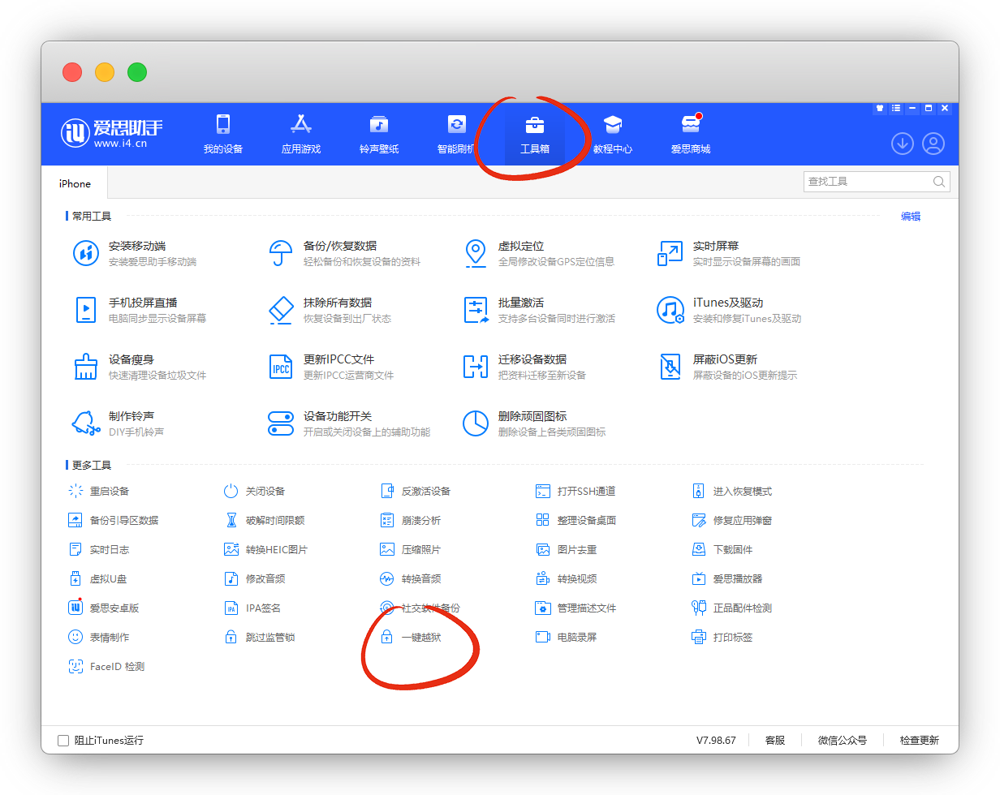


打开后会自动识别可用的越狱工具

::: tip 说明
如果你这里没有可用的工具，排出数据线没插好外，默哀，你的手机越狱不了
:::

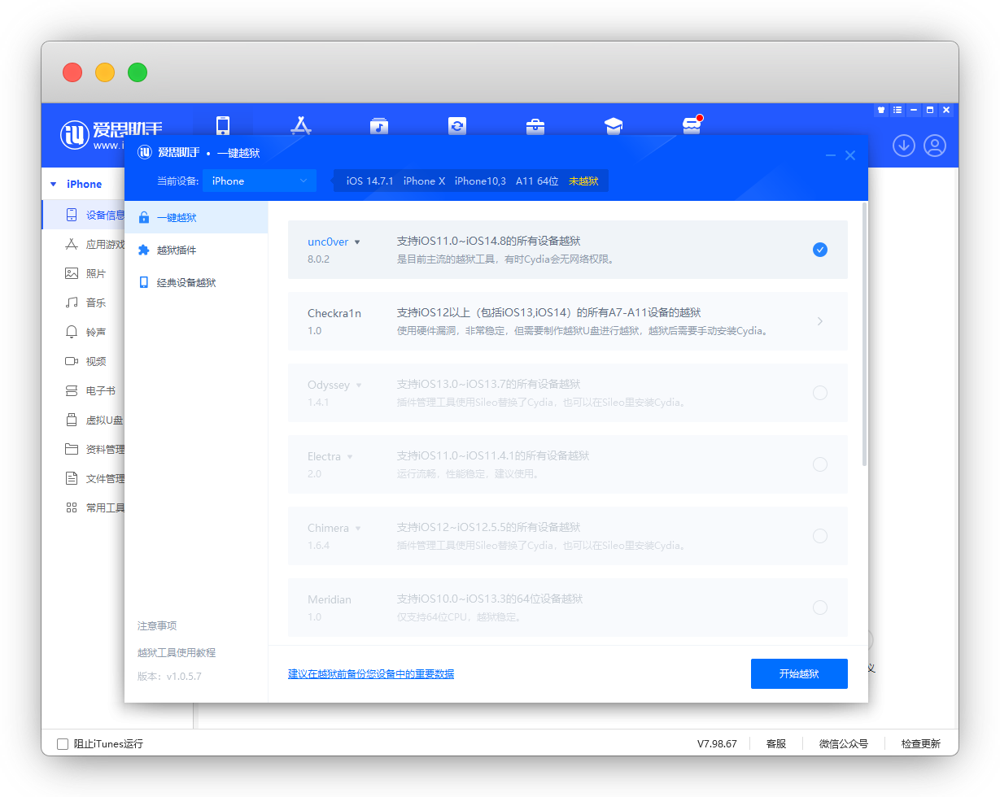


选择 `U盘越狱`，镜像文件选 `cnx...` ，插入准备好的U盘，识别后开始制作

::: warning 注意
操作会清空U盘数据，自行备份好数据！！！
:::

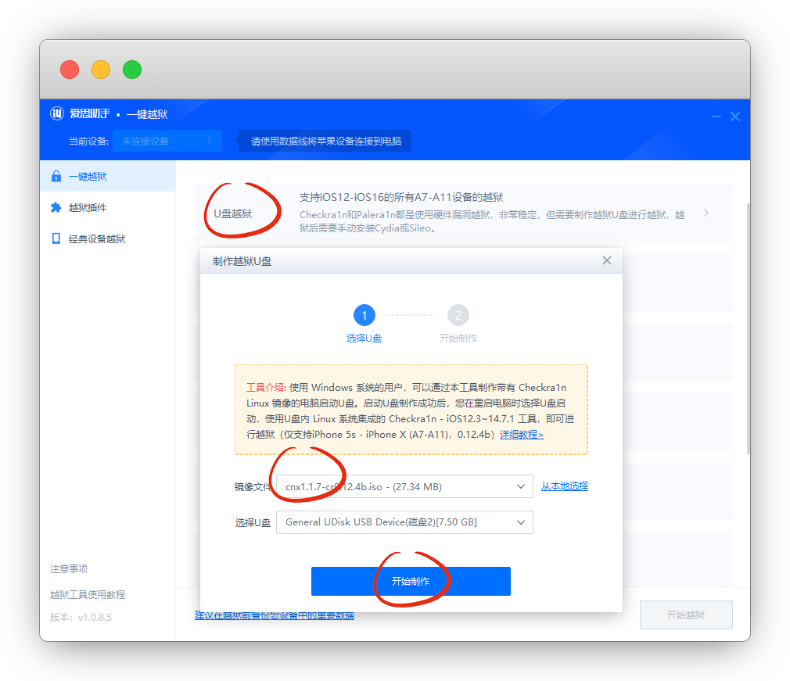


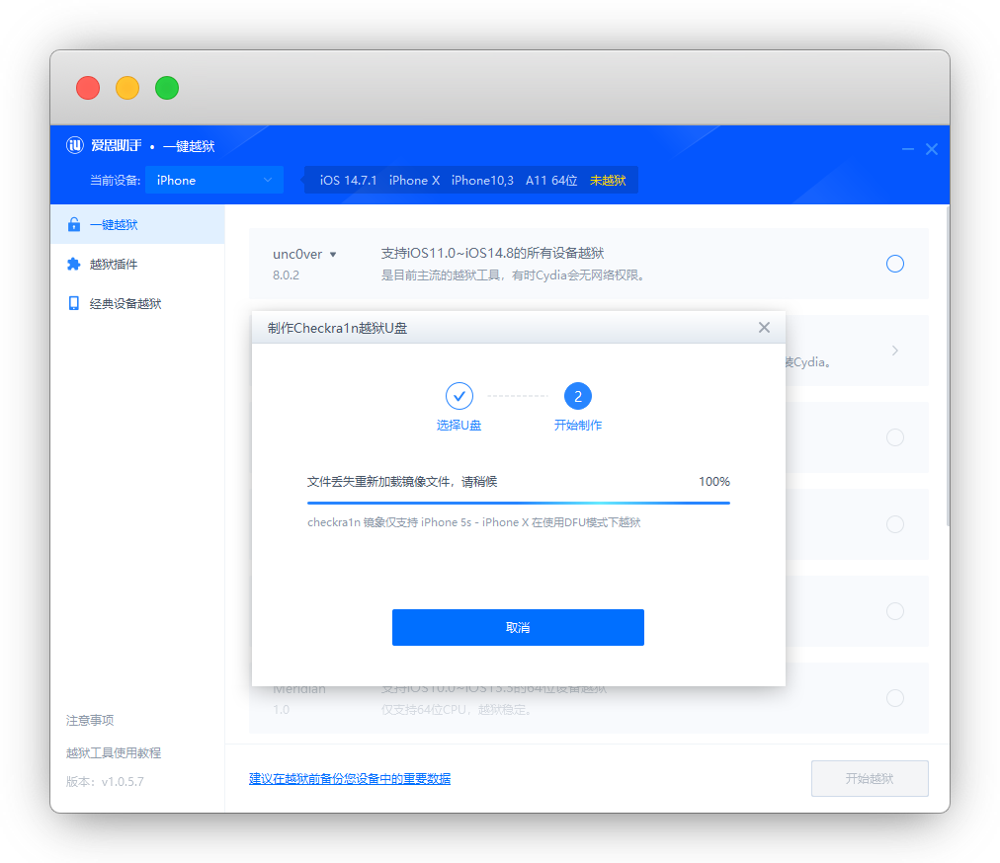


### 4.开始越狱

U盘不要拔掉，重启电脑，进入BIOS模式并选择以U盘启动

我的微星主板是按 `F11` 快速选择，[其他品牌制作PE启动盘时的介绍](../../daily/wepe/#_3-bios设置u盘启动)

::: warning 说明
如果U盘有一个EFUI模式，硬件支持的话选，速度快点；不支持就选常规U盘
:::

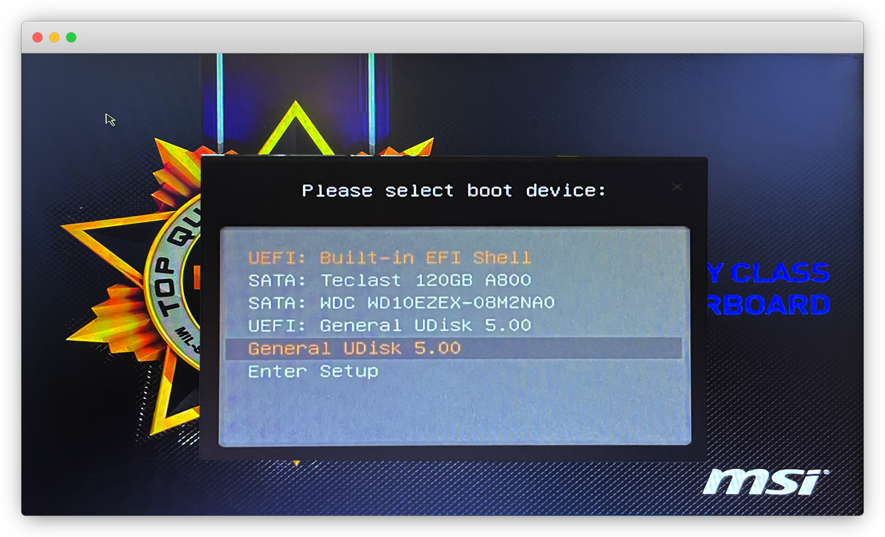


在Welcome to checkn1x 界面按组合键 `Alt+F2` 进入 Checkra1n

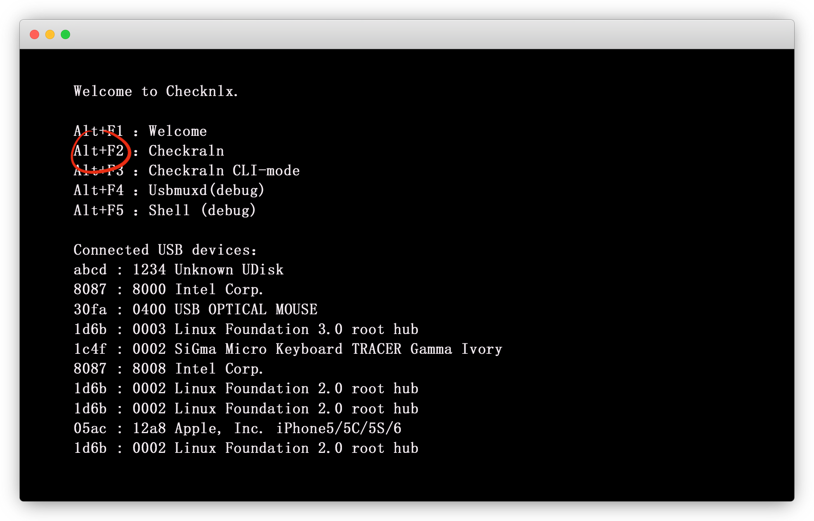


电脑用USB链接手机，手机弹窗点`信任`，然后再电脑端用方向键选择 `options` 回车

::: tip 说明
无反应，再次拔插数据线即可
:::

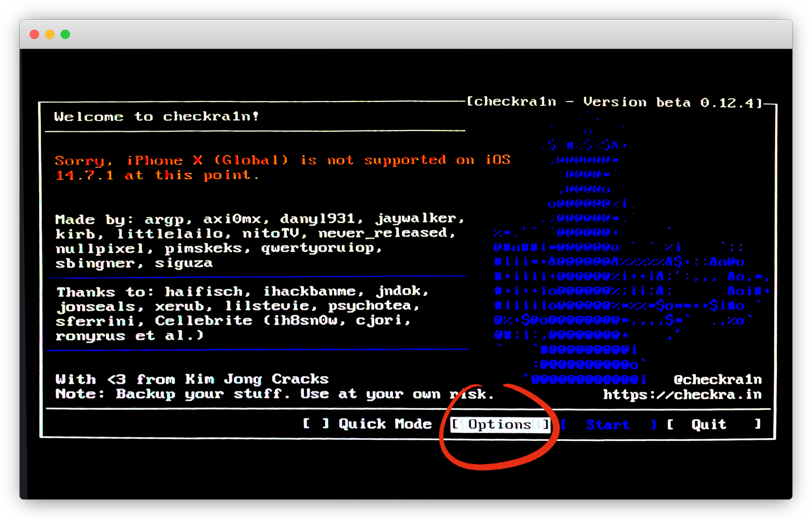


全选-返回，如果全选卡死就重启再来的时候，不选 `Safe Mode`

::: danger 注意
仍然卡死的话，先选1后，返回！再选2345！
:::

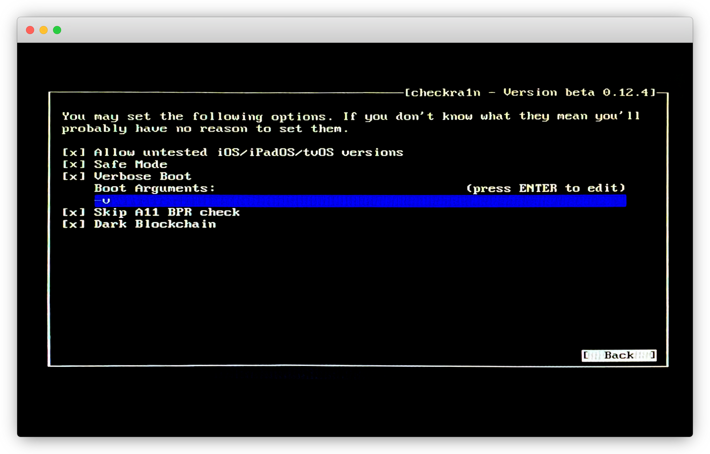


这时候 `start`就亮了，方向键选择 `Start` 后按回车，下一步

::: tip 说明
如果还没有亮，再次拔插数据线就可以了
:::


手机自动进入DFU模式，每个人手机不同，请看下电脑界面提示按键，然后 `Start` 开始操作

::: tip 说明
我的是先长按电源键+音量下键4秒

再松开电源键，保持按住音量下键10秒
:::


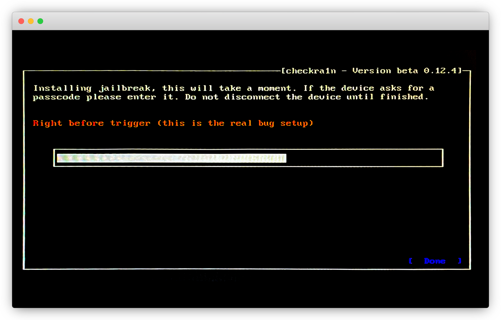


越狱完成后，Checkra1n 会提示 `All Done` 

::: tip 说明
如果越狱失败，请再尝试一次
:::

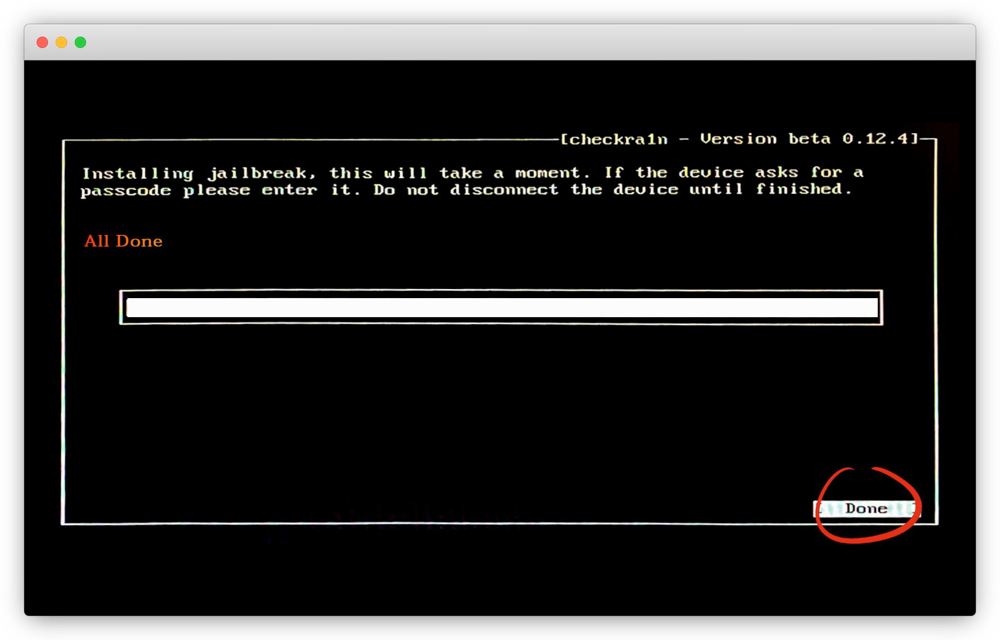


桌面会有 `checkra1n` 图标生成，打开 checkra1n，点击 Cydia 并安装 `Install Cydia`

::: tip 说明
如果不显示或者提示 `timed out` ，挂个梯子就好了
:::

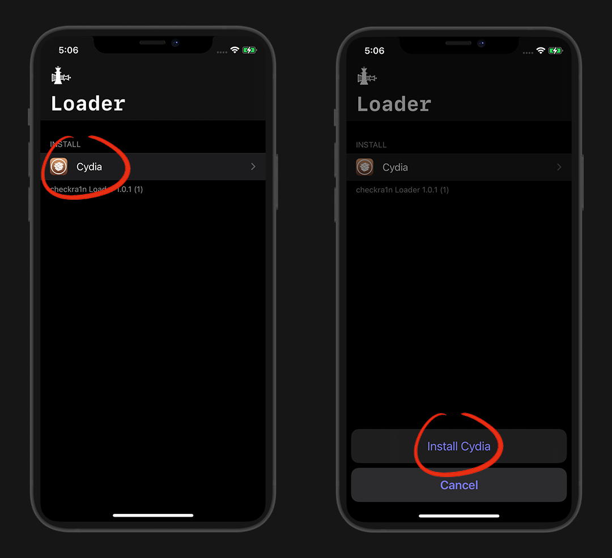


### 5.Cyida的使用


进入Cyida-更新必要软件包-确定-即可进入主页

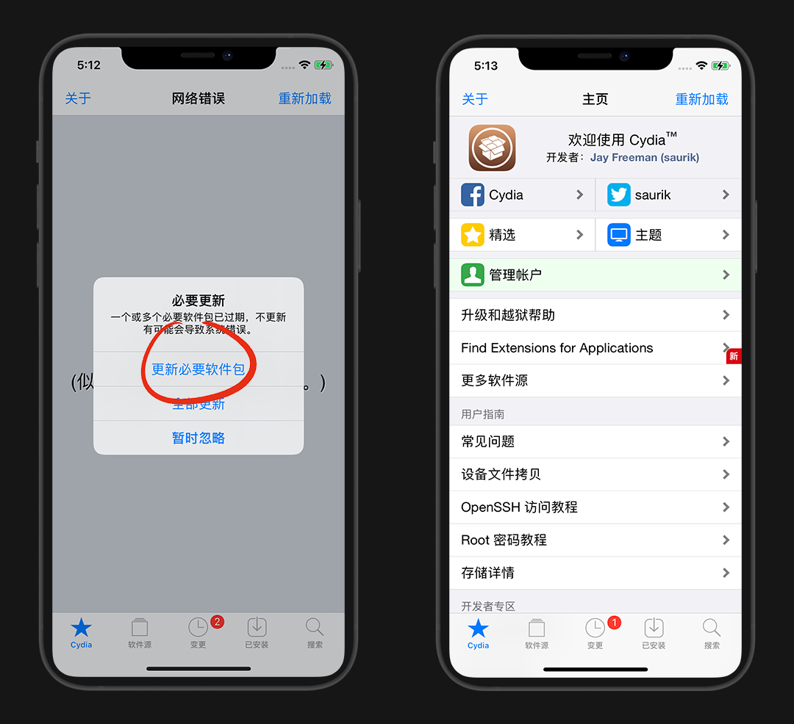


界面简介，常用的就是 `软件源` 和 `搜索`，用Trollstore演示一下

软件源-右上角编辑-左上角添加，输入源地址：[https://havoc.app](https://havoc.app)


等安装完成即可，现在就有Havoc的源了


搜索 `Trollstore Helper` 然后右上角-更改-安装就完成了


### 6.U盘恢复工具

越狱用的U盘无法正常使用，我们可以用恢复工具

[点我下载：rufus-3.11p.zip](https://d-image.i4.cn/i4web/image/news/2020-07-16/fileTypeImages_1594880598242082789.zip)丨 [备用：蓝奏云](https://dzp.lanzouy.com/iW1tG0cm7wcb)


下载工具下载到桌面，打开运行

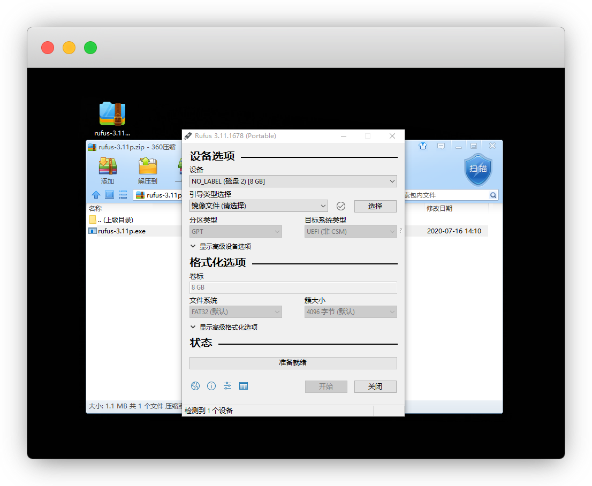


插入U盘，会自动识别设备，在 引导类型选择 下选择 `FreeDOS`


点击开始，直到完成，U盘恢复正常模式

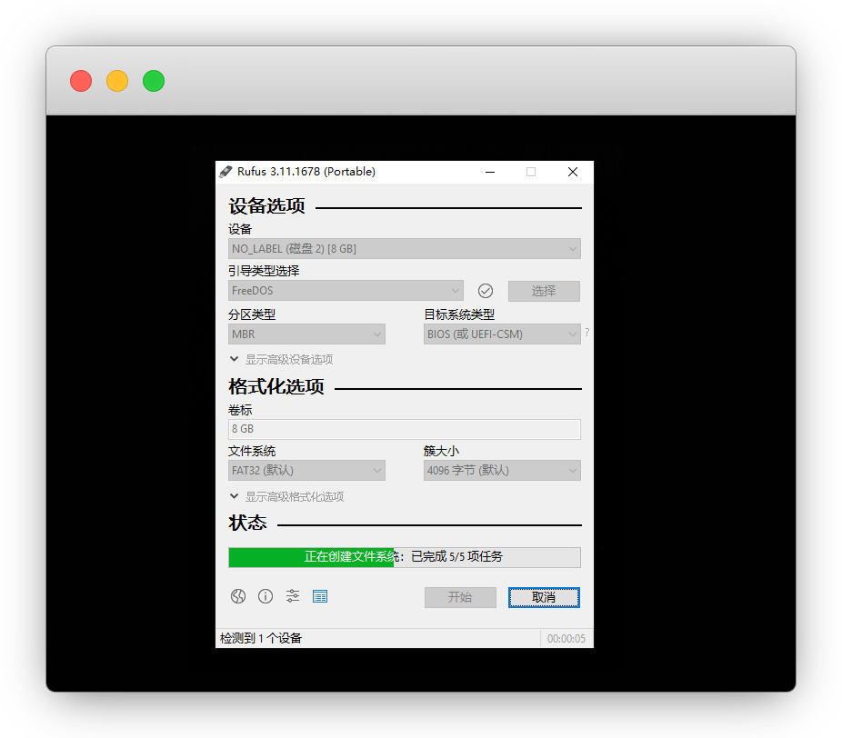


### 7.插件


详细请查看 [越狱插件(旧)](#越狱插件-旧)


### 8.常见问题


---

#### 1.手机重启后，恢复到未越狱状态了

恭喜你，重新来一遍


##### 2.怎么清除越狱


清理越狱环境，但安装的插件配置文件会保留，建议先清理

* [iCleaner Pro](https://ib-soft.net/cydia)「删除插件」

* 用[Filza File Manager](http://tigisoftware.com/cydia/)，在 `Cydown` 路径 `/var/mobile/Documents/CyDown` 删除已经下载的 deb 安装包

* 卸载必须依赖 用 `PreferenceLoader` 批量卸载

* Checkra1n：进入点击 `Restore System` ，清除完毕后重启，桌面残留Cydia图标删除即可。如果银行打不开，请备份后，抹机


##### 3.Checkra1n桌面没有图标了

用Checkra1n制作的U盘，重新越狱即可


## Palera1n

### 1.简介

和 [checkra1n](#checkra1n) 一样的也是基于Checkm8的一个硬件漏洞，A11及以下的设备均存在此漏洞

硬件问题是无法修复的，无论当前是什么样的系统，一样可以越狱

官网：https://palera.in/

### 2.安装

步骤我就不再演示了，可以参考爱思的教程

https://www.i4.cn/news_detail_52687.html


## unc0ver


### 1.简介

老系统中最常用也最强大的越狱工具之一

官网：https://unc0ver.dev/

### 2.适用范围


| 手机/系统 | 6s-8系列 / SE / X (A9-A11) | XS系列 / XR / 11系列 / SE 2 (A12-A13) | 12系列 (A14) | 13-15系列 / SE 3 (A15-A16) |
| :-: | :-: | :-: | :-: | :-: |
| 11.0-14.3 | :heart: | :heart: | :heart: | ✘ |
| 14.6-14.8 | ✘ | :heart: | ✘ | ✘ |
| 14.8.1及以上 | ✘ | ✘ | ✘ | ✘ |


### 3.开始越狱

如果刚上手不太懂得使用，直接 [爱思助手](https://www.i4.cn/) 简单且好用


官网：[https://www.i4.cn/](https://www.i4.cn/)


安装完成后，连接手机，手机端点一下 `信任` ，就进入了爱思界面

请先右上角注册并登录账号，否则无法使用越狱功能

::: tip 说明
都是手机的信息，查验手机也会用到它
:::


点工具箱 - 一键越狱，等下载安装完成


打开后会自动识别可用的越狱工具

::: tip 说明
如果你这里没有可用的工具，排出数据线没插好外，默哀，你的手机越狱不了
:::


勾选 `unc0ver` ，点击开始越狱，自动下载安装

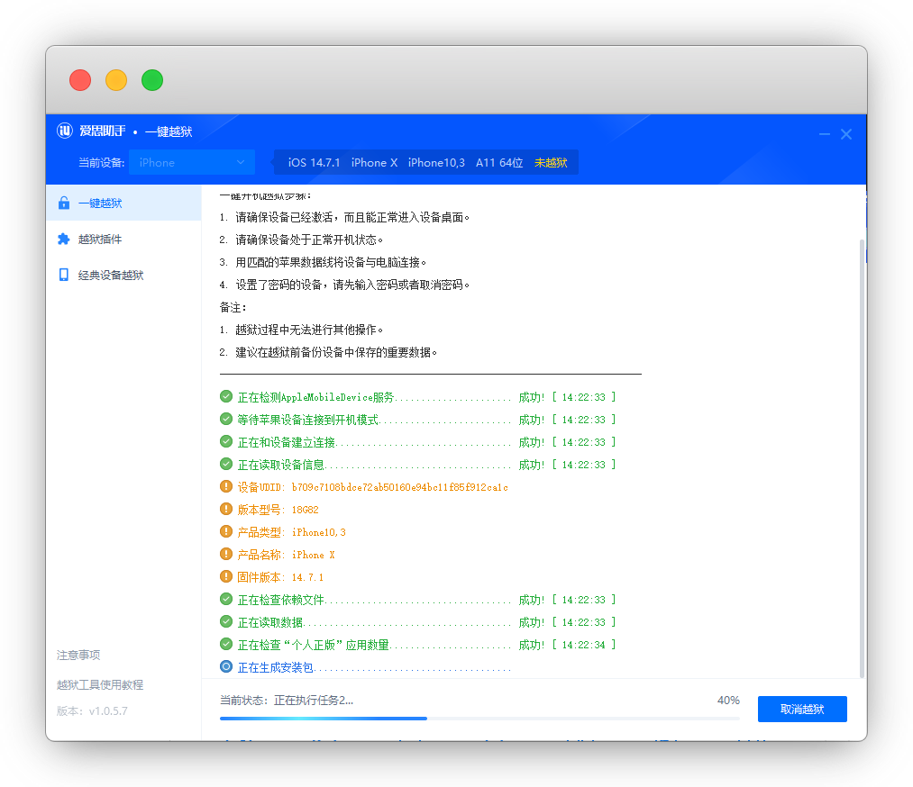

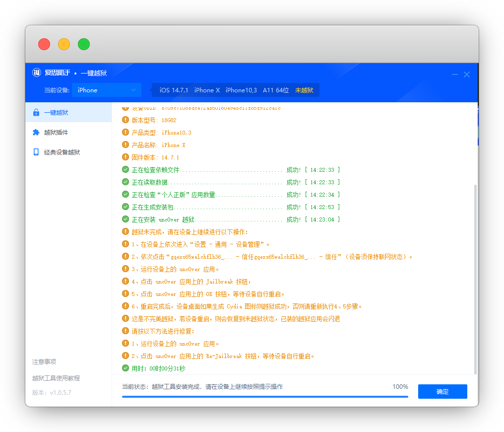


回到手机，设置-通用-设备管理，安装信任证书

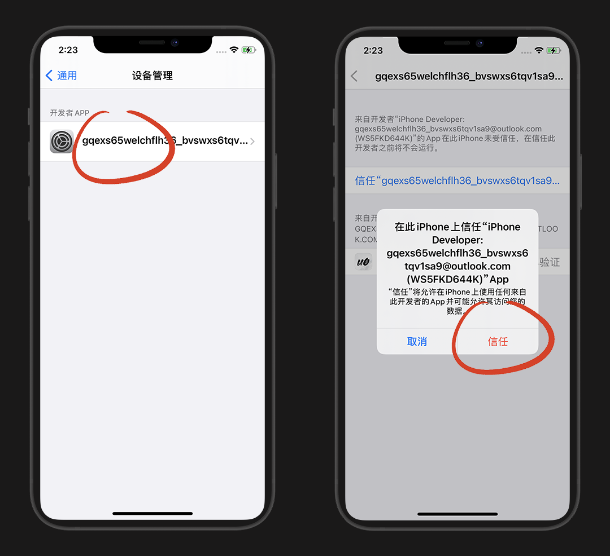


打开 `unc0ver` ，却提示 `Unsupported`，竟然不支持，我哭

::: tip 说明
不支持就是无解了，不要再尝试了，换工具吧
:::

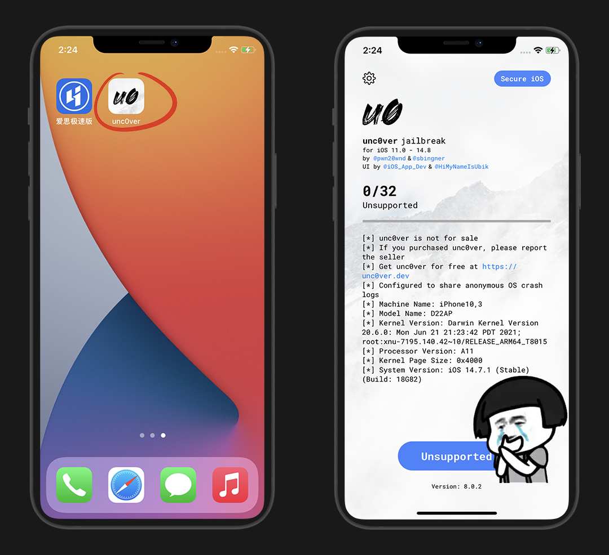


虽然我的手机不可以，我去截个图来继续演示


打开 `unc0ver` ，点左上角 齿轮 ，进入设置，只开 `Load Tweaks`即可，右上角 Done 退出

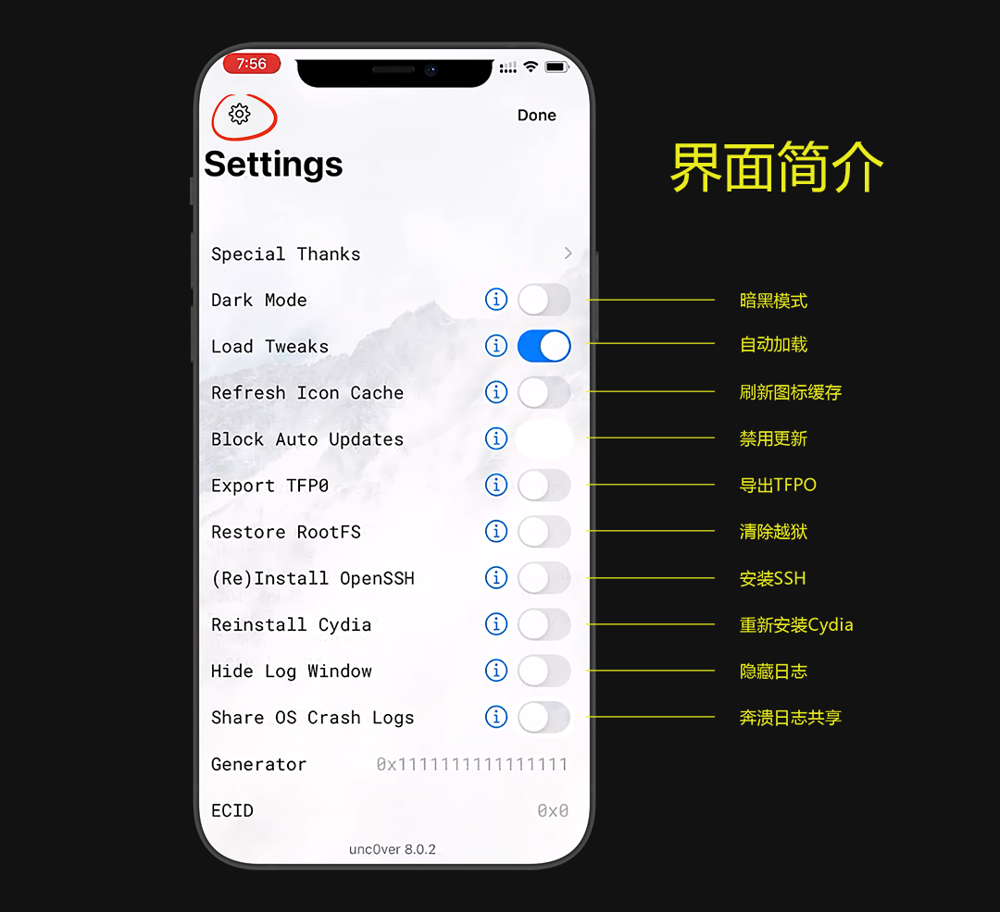


返回后点击 `jailbraek` 开始越狱，等完成后点击OK，手机自动重启


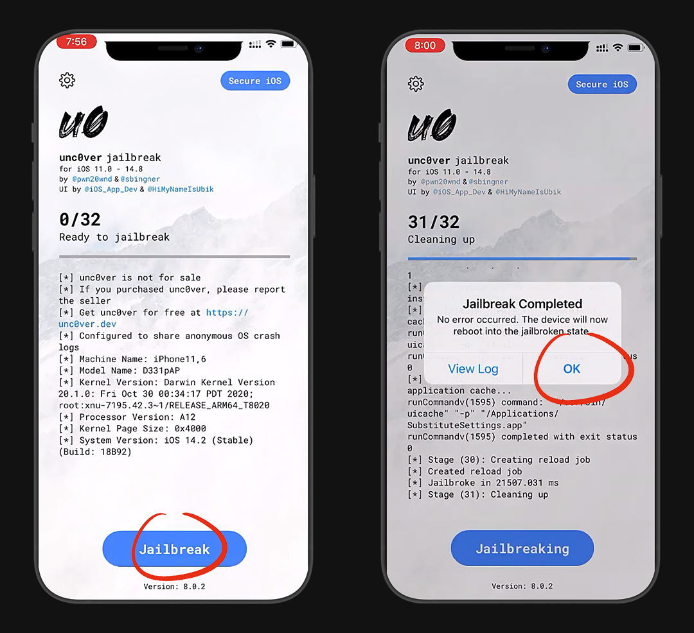


### 4.Cyida的使用


进入Cyida-更新必要软件包-确定-即可进入主页


界面简介，常用的就是 `软件源` 和 `搜索`，用Trollstore演示一下

软件源-右上角编辑-左上角添加，输入源地址：[https://havoc.app](https://havoc.app)


等安装完成即可，现在就有Havoc的源了


搜索 `Trollstore Helper` 然后右上角-更改-安装就完成了


### 5.常见问题

---

#### 1.uncover一直卡进度条，不到32

可尝试用[Altstore](https://altstore.io/)签名安装 `uncover` 后，重新越狱


#### 2.怎么清除越狱


清理越狱环境，但安装的插件配置文件会保留，建议先清理

* [iCleaner Pro](https://ib-soft.net/cydia)「删除插件」

* 用[Filza File Manager](http://tigisoftware.com/cydia/)，在 `Cydown` 路径 `/var/mobile/Documents/CyDown` 删除已经下载的 deb 安装包

* 卸载必须依赖 用 `PreferenceLoader` 批量卸载

* unc0ver：左上角点击齿轮，把所有按钮都关闭，只开`Restore RootFS`，重启


## Taurine

### 1.简介

俗称牛磺酸，是 CoolStar(酷星) 主导开发的越狱工具，现在他已离开越狱社区

### 2.适用范围

| 手机/系统| 6s-12系列 / SE-2 / X / XS系列 / XR (A9-A14) | 13-15系列 / SE 3 (A15-A16) |
| :-: | :-: | :-: |
| 14.0-14.8.1 | :heart: | ✘ |
| 15.0及以上 | ✘ | ✘ |

### 3.开始越狱

与多巴胺非常相似，步骤请参照我爱搞机网的教程

http://www.52ggi.cn/yynews/256.html


## 越狱插件(旧)

仅适用于旧系统rootful越狱使用，如 [unc0ver](#unc0ver) 、[checkra1n](#checkra1n)、[Palera1n](#Palera1n)


由于插件源众多，不一一赘述，更多源请参考 `@艾橙互动` 公众号的整理

[插件目录大全](https://mp.weixin.qq.com/s/ploLK0P8KakFgicxZYC1UQ) 丨 [整理的各类源](https://mp.weixin.qq.com/s/lSE0PSKA4PT09ChOrEwRRw)


#### 1.自带源

::: tip 说明
默认源，无需额外添加，避免误删的对照
:::

* Binger源：`https://apt.binger.com/`

* BigBoss源：`https://apt.thebigboss.org/repofiles/Cydia/`

* Chariz源：`https://repo.chariz.com/`

* Dynastic Repo源：`https://repo.dynastic.co/`

* ModMyi(Archive)源：`https://apt.modmyi.com/`

* ZodTTD&MacCiti(Archive)源：`https://cydia.zodttd.com/repo/cydia`


::: details 默认源好用插件
```md
# BigBoss源

* PreferenceLoader：越狱插件运行的依赖文件

* AppList：查看已经安装的 App 列表

* RocketBootstrap：允许在 App 运行时加载插件

* Apple File Conduit "2"：手机连接电脑，爱思助手可以访问导入或导出文件

* 连个锤子：修复无法联网问题


# Chariz源

* Atria：自定义桌面布局

* Cylinder Reborn：炫酷翻页特效

* LastLook：款熄屏显示插件，收费！

* NewTerm 2：终端工具

```
:::


#### 2.其他插件

::: details 点我查看常用插件源
```md
# Netskao哥哥源

源地址：https://repo.initnil.com

DumpDecrypter：砸壳解密工具

NetWorkManager：联网权限管理

injectipa：dylib插件注入

微信净化/抖音净化等等

IPA下载：https://share.initnil.com/With_TorllStore

QQ及微信砸壳包：https://github.com/Netskao/iOS-DumpDecrypted-IPAs

公众号Netskao：https://mp.weixin.qq.com/s/ieLeWpUNjbDL9JGKYhJcmA


# 老牌猫源

源地址：https://apt.25mao.com/

插件：微信插件：密友/斗图助手/游戏扫码登录

TG群：https://t.me/lanmaoios


# APP库

源地址：http://ak.wxqqurl.cn/appstore

IPA盘：https://pan.wxqqurl.cn

公众号App库：https://mp.weixin.qq.com/s/aDLiPqL5tSxbTOa5M2IqGw


# 艾锋源

源地址：http://apt.ss03.cn/

公众号：艾锋降级


# 电话助手源

源地址：http://apt.htv123.com

购买授权码：https://buy.htv123.com/


# 嗨客汉化源

源地址：http://repo.qqtlr.com


# 冷冷雨源

源地址：https://lenglengyu.com

TG群：https://t.me/+l9inH184Ye9jZmM1


# 苏兔美化酸果

源地址：https://apt.sutuplus.com/

公众号苏兔：https://mp.weixin.qq.com/s/aDLiPqL5tSxbTOa5M2IqGw


# AppCake源

源地址：http://cydia.iphonecake.com/

CarackerXI+ 砸壳官方源


# akusio源

源地址：https://akusio.github.io/

BackgrounderAction15 for CCSupport：应用在后台保持运行，不支持微信 丨 需安装CCSupport

MilkyWay：分屏插件


# CokePokes源

源地址：http://cokepokes.github.io/

AppStore++ APP升降级，在APP Store长按应用的打开按键


# Delta源

源地址：http://getdelta.co

Flex3：免广告插件


# Fouad源

源地址：https://apt.fouadraheb.com/

AppData：系统垃圾清理


# Havoc源

源地址：https://havoc.app

原Packix源迁移至此

Trollstore Helper：巨魔助手(免签神器)

ReProvision Reborn：自签插件，免签安装IPA

Ampere：电池百分比数字显示


# 蔡明美源

源地址：https://cydia.akemi.ai/

AppSync Unified：自签插件，免签安装IPA


# Ivano Bilenchi`s Repo源

源地址：https://ib-soft.net/cydia

iCleaner pro：老牌清理插件


# julioverne源

源地址：https://julio.hackyouriphone.org/

Cydown：deb插件下载

NtSpeed：悬浮网速显示


# MiRO92源

源地址：http://miro92.com/repo

Cyrch：在Cydia顶部增加一个搜索功能


# opa334源

源地址：https://opa334.github.io/

Choicy：调整注入管理插件丨汉化赵楠源：`https://invalidunit.github.io/repo/`

AltList：安装Choicy的依赖

CCSupport：控制中心模块相关插件的依赖


# SkyPian源

源地址：https://skypain.github.io/repo/

CCLocation：控制中心添加定位开关，一键开启或关闭定位

CCRespring：控制中心一键注销

CCSettrings：控制中心添加设置开关，一键打开手机设置 App

MiniLsp：锁屏迷你播放器


# TIGI Software源

源地址：https://tigisoftware.com/cydia/

Apps Manager： Filza文件管理器


# xia0Repo源

源地址：http://xia0z.github.io/

FakeLocationX：虚拟定位
```
:::


#### 3.插件下载


::: tip 说明
我们常见的 `dylib插件` 也就是deb解压出来的
:::

* [PC端：cydownload](https://github.com/borishonman/cydownload/releases)

* [手机端：PostBox](https://itunes.apple.com/app/id1644577838)「国区下架，美区下载即可」

* [手机端：Saily](https://github.com/SailyTeam/Saily/releases)

* [手机端：Sileo](https://github.com/Sileo/Sileo/releases)

* [越狱机：CyDown](https://julio.hackyouriphone.org/)

* [网页端：Repo Updates](https://www.ios-repo-updates.com/)
