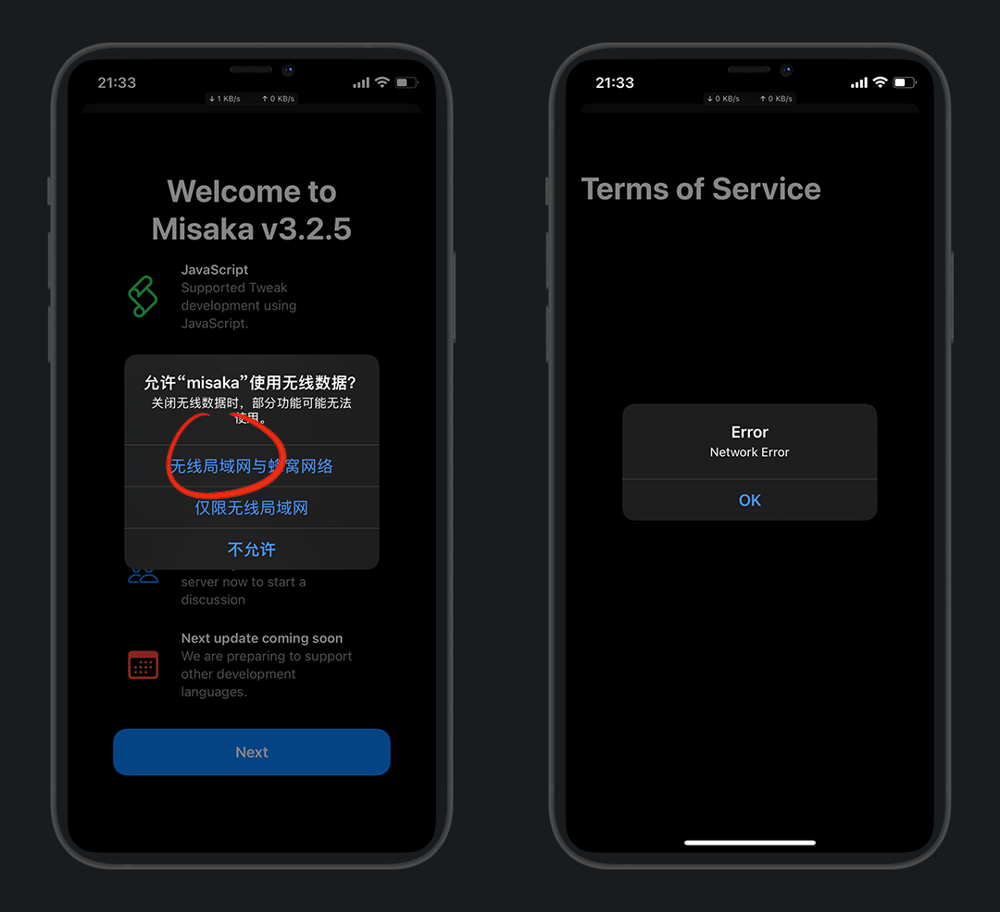
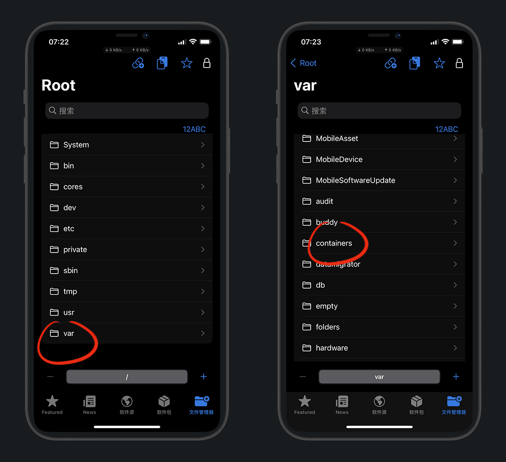

# 巨魔2

安装方法和巨魔1有点区别

## 安装牛蛙助手

1. [牛蛙助手安装教程](./index.md#牛蛙助手)

2. [牛蛙助手添加个人Apple ID](./index.md#_4-ipa签名)

::: warning 注意
已经安装好的，可以无视看下一步 [安装misaka](#安装misaka)
:::

## 安装Misaka

Safari浏览器 Misaka 官方下载

官网：https://github.com/straight-tamago/misaka/releases

::: tip 说明
下载最新版的即可，截稿前演示版本v3.2.5
:::

下载完成后，点击浏览器 `下载` 按键，再点击已经下载好的 `misaka`

右上角分享，选择 `牛蛙助手`

点 `发送`，牛蛙打开后，选择 `导入`

::: tip 说明
如果勿点了取消，也可直接点 misaka.ipa 选择导入应用库
:::

点击 `misaka` ，选择 `签名` - `立即签名`

在已签名的页卡中，选择刚签好名的 `misaka` 安装

但牛蛙安装必须要开启`VPN和WIFI`，我们去打开

设置 - VPN - 勾选 `牛蛙助手` - 打开VPN开关

打开VPN后我们返回重新安装 misaka 即可

misaka就安装成功了，但是还打不开，要信任一下

设置 - 通用 - VPN与设备管理 - 选择 开发者APP - `信任`

再次打开 misaka ，提示沙盒读写，点 `好`

允许 `无限局域网与蜂窝数据`，但是提示 `Network Erro`

这时我们需要使用 科学上网 打开

我用小火箭，机场用的超级机场

连接好再次打开 misaka，`Agree` 同意后进入主界面

左上角 Setting - App Language

选择 `zh_CN` 完成后，自动退出，再次进入就能看到已经汉化了

::: tip 说明
下滑可退出页面
:::

## 选择漏洞

在 misaka 设置中，请根据自己的系统选择模式！

::: warning 参照表
KFD：IOS 16.2-16.5系统

MDC：IOS 15.0-16.1.2系统

No Exploit：无漏洞(IOS 16.5及以上系统)
:::

## 安装巨魔

打开 misaka - 软件包 - 左下角图标 - `Install TrollStore`

任选一个作为安装器，我这里选 `Books` 演示

注意：请确保选取的APP没有收纳在文件夹中，请放在桌面

::: warning 说明
[Tips：提示](https://apps.apple.com/cn/app/id1069509450)、[Books：图书](https://apps.apple.com/cn/app/id364709193)、[Home：家庭](https://apps.apple.com/cn/app/id1110145103)

选定的应用，以后就无法使用原来的功能了，只能用来安装巨魔
:::

::: details 疑问1：选不了，这里图标是灰的
那是因为你没有安装这个应用，去App Store下载即可
:::

::: details 疑问2：提示错误2或1
确保你的科学上网软件没有掉，那就重启手机，再试一次
:::

成功后会自动注销，重新进入桌面打开 `Books`

:::: details 疑问3：books等打不开，闪退
这个就麻烦一点了，看步骤

下载：https://www.123pan.com/s/3LWcVv-8RLrh.html

打开 misaka 文件管理 - var - containers

Bundle - Application

com.apple.iBooks - Books.app

找到 `books`，再点 `Flie Overwrite`

选择我们刚才下好的文件 [PersistenceHelper_Embedded](https://www.123pan.com/s/3LWcVv-8RLrh.html)，这样就覆盖重写完成了，再次打开books即可

::: tip 说明
safari下载的文件路径：icloud云盘-下载
:::

::::

点 `Install TrollStore` 安装巨魔，桌面有图标就是成功了

## 疑难解答

#### 1.为什么使用牛蛙助手

我们需要使用 misaka 工具，它需要签名工具签名安装后才能使用

#### 2.为什么选择misaka

安装巨魔需要借助MDC/KFD漏洞，而misaka正是其中一款漏洞工具，且已上线辅助安装功能

#### 3.为什么选择books等应用呢

巨魔本身是利用了系统的漏洞，将这个漏洞注入进入了books，使books成为了一个安装器

安装完成，你也可以选择卸载

## 工具

[请在原分类中查找](./index.md#5其他工具)