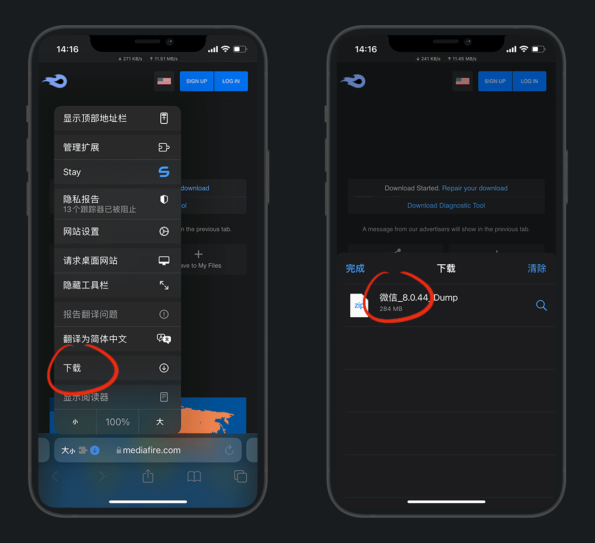
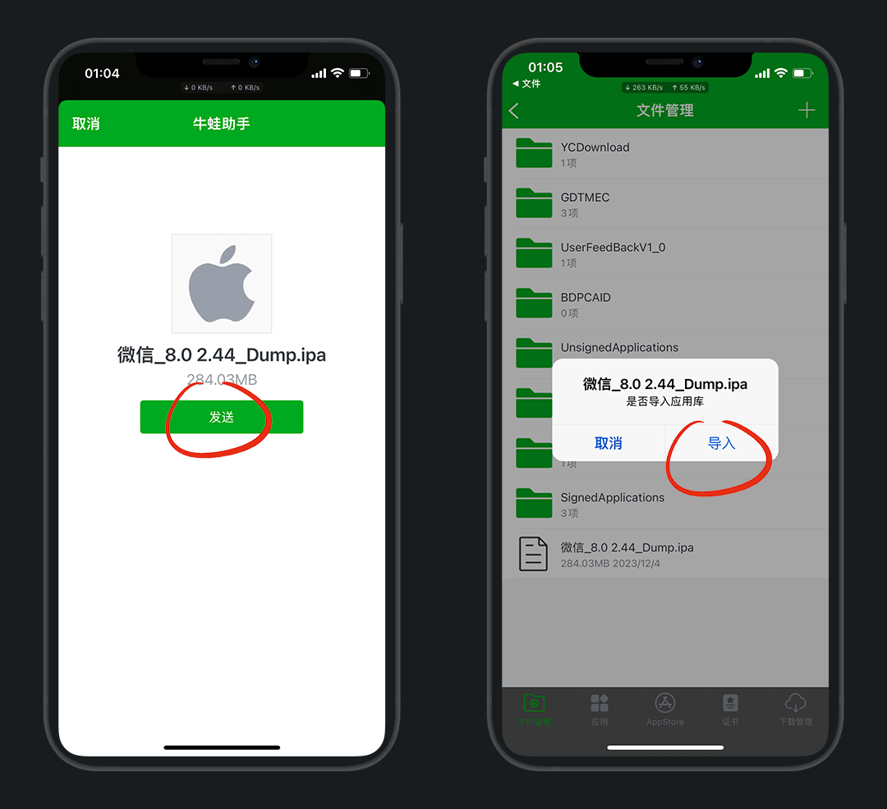
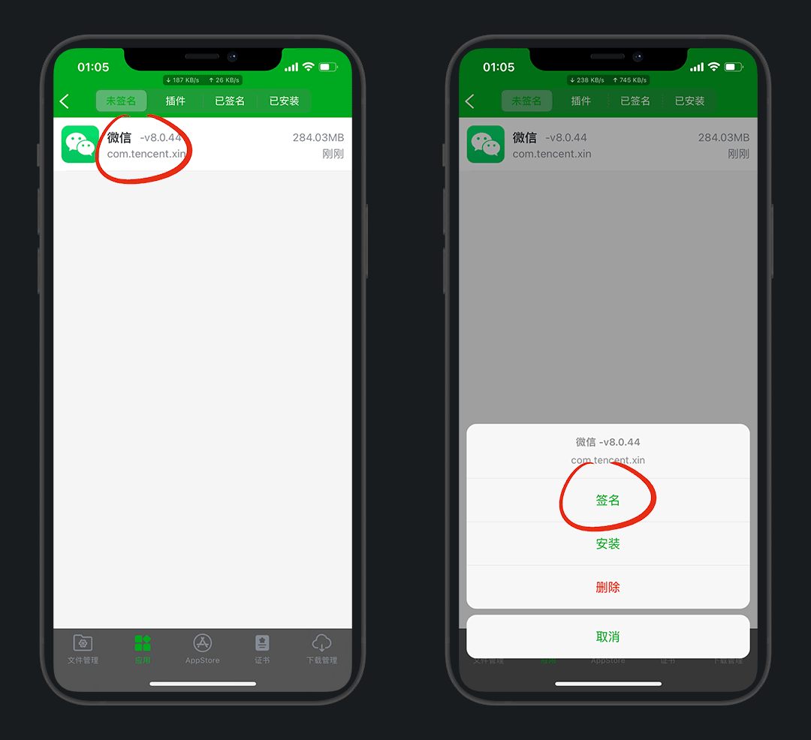

# 牛蛙助手

> 更新时间：2023-11-30

## 1.简介

最早接触的签名工具是 [爱思助手](https://www.i4.cn/) ，但全程都需要电脑，很麻烦

牛蛙的诞生就完美解决了这个问题，仅需首次需要电脑

本次演示牛蛙助手，使用与 [NB助手](https://nbtool8.com/) 基本一致

## 2.安装

牛蛙助手官网：[https://www.ios222.com/](https://www.ios222.com/)

下载打开安装，安装完成有提示

打开手机桌面的牛蛙助手，获取UDID

跳转到网页安装描述文件，设置  -通用 - VPN与设备与管理 - 安装

安装成功后，再次打开牛蛙助手即可进入界面

点击 `IPA签名` ，右下 `证书` - 右上+号 `个人证书`

输入你的 `Apple ID和密码` ，认证成功即可生成个人证书

::: details 登录失败报错
1.确保密码正确，再次尝试登录

2.账号被锁定了，请在设置中退出账号后重新登录，解封修改密码半小时后再试
:::

::: tip 说明
个人证书有效期7天，企业证书要花钱买！
:::

## 3.使用

### 虚拟定位

点击虚拟定位，默认用蓝奏的镜像，这里提示`镜像挂载失败`

设置-通用-VPN与设备与管理-VPN，选择牛蛙助手，开关打开

再次回到APP，已经可以用了，权限给`使用App时允许`

先搜索一个自己要定位的地名，比如：东方明珠，点一下这个标记，然后点锁定即可

锁定成功，打开微信定位就可以看到，已经成功了

不使用了一定要解锁，否则就回不来了！！！

### 签名/多开分身

以 `微信` 多开为例

下载砸好壳的微信ipa包，演示的版本是 `8.0.44`

::: tip 科普
这里的dump就表示砸壳，就是提取ipa安装包

因为苹果对安装包进行了加密，并包裹在了ipa上，砸壳的过程就是解密脱壳
:::

[https://www.mediafire.com/file/q7pod9131llj6ca/](https://www.mediafire.com/file/q7pod9131llj6ca/%25E5%25BE%25AE%25E4%25BF%25A1_8.0.44_Dump.ipa/file)

下载 - 点击下载好的文件

右上角分享 - 用 `牛蛙助手` 打开

发送，导入应用库

点微信 - 签名

这里我们多开就修改下 `应用名称` 和 `Bundle Identifier` 就好了，例如我在后面都加了个 `pro`

::: tip 说明
Bundle ID就是应用程序标识符，也叫应用ID，也叫包名，独一无二就相当于人的身份证

我们通过修改应用ID，就变成了两个完全独立的App，可共存安装，也就是多开
:::

根据自己需求也可以改一下图标，立即签名，签名成功，去安装

::: details 分享1个图片

:::

设置 - VPN - 勾选 `牛蛙助手` - 打开VPN开关

再去安装，安装好后返回桌面查看

现在还打不开，要信任一下

这样就能打开登录了

::: details 疑问1：为什么应用名称改了没用
牛蛙每次签名自动默认原名称，并改掉应用ID

而应用ID还是按我们修改的来了
:::

::: details 疑问2：会封号吗
理论上来说，99.99%不会

本身就是原版未修改的ipa包，不存在封号一说

有插件的都未必封号，最多限制几小时登陆；修改过的微商版微信那肯定是会封
:::

::: details 疑问3：怎么卸载
卸载不能在桌面删，只能在 `已安装` 页卡，选中应用左滑即可卸载
:::

::: details 疑问4：再安装新版本微信聊天记录还在吗
只要签名的时候，应用ID和上次一样就可以直接覆盖安装，聊天记录都在
:::

