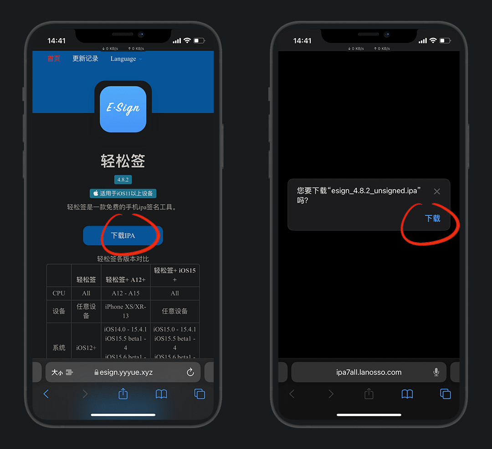
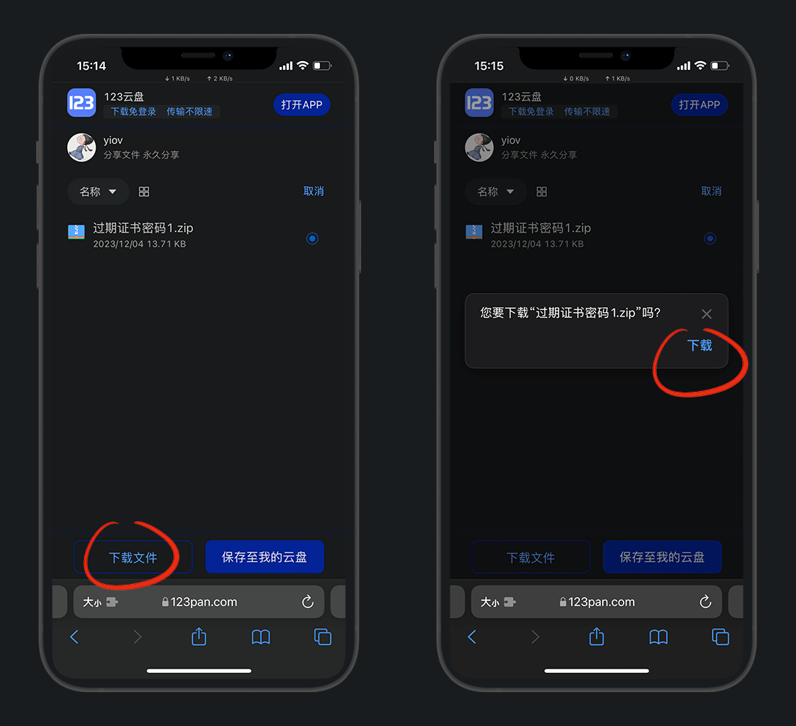
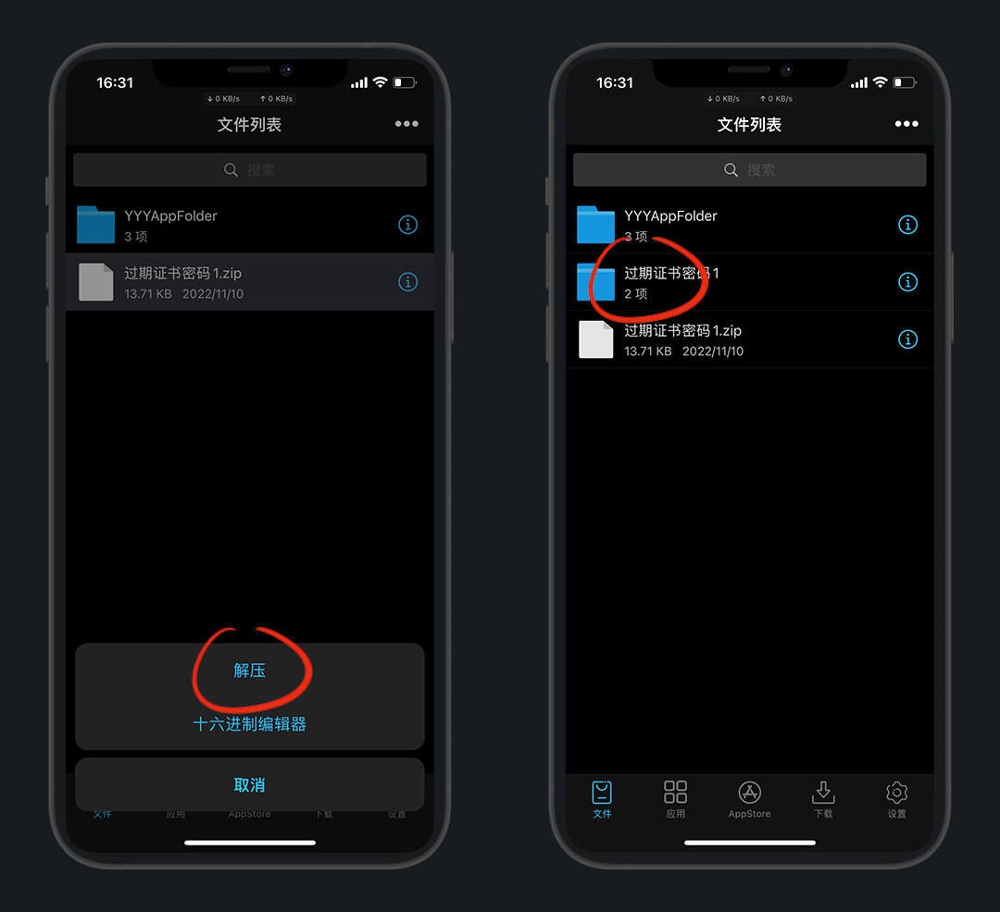
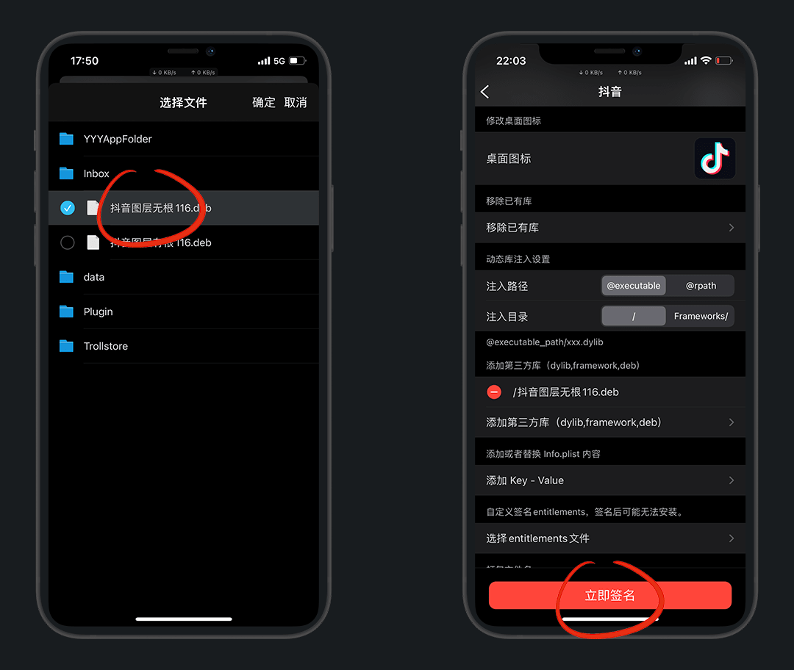
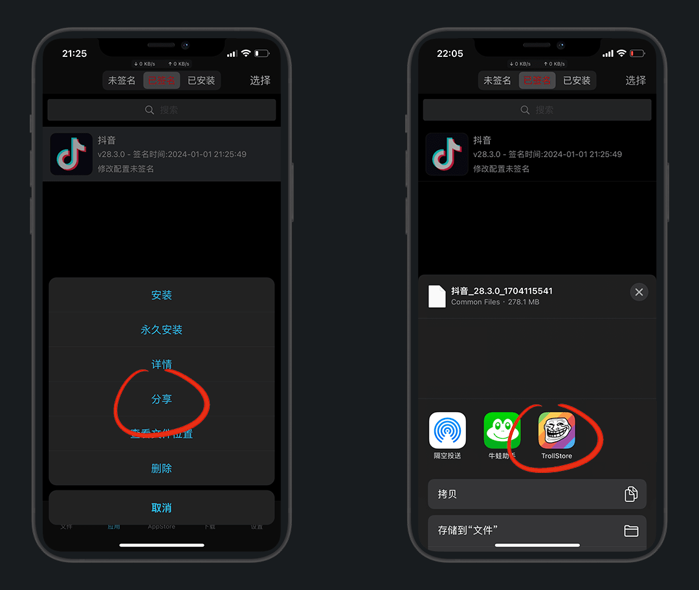

# 轻松签安装及使用

> 更新时间：2024-1-6

## 简介

轻松签原本只是签名工具，可插件注入/移除、修改bundle id多开应用等

后来集成了 [巨魔1代](./TrollStore.md) 的免签功能，推出了 `轻松签+`

::: tip 区别
* 轻松签：签名工具(需要证书)

* 轻松签+：免签/签名工具(无需证书)
:::

官网：https://esign.yyyue.xyz/

## 适用范围

::: details 轻松签适用范围
无限制
:::

::: details 轻松签+适用范围
| 系统/iPhone | 6-8系列 / SE / X (A8-A11) | 11-14系列 / XR / XS / SE 2-3 (A12-A15) | 14 Pro系列 / 15系列(A16-A17) |
| :-: | :-: | :-: | :-: |
| 14.0-15.4.1 | ✘| :heart:[A12+](https://pan.yyyue.xyz/d/cache/arm64e.ipa) | ✘ |
| 15.0-15.4.1 | :green_heart:[IOS15+](https://pan.yyyue.xyz/d/cache/arm64.ipa) | :green_heart:[iOS15+](https://pan.yyyue.xyz/d/cache/arm64.ipa) | ✘ |
| 15.5及以上 | ✘ | ✘ | ✘ |
:::

虽然适用范围上轻松签不限制，但是功能上 `轻松签+` 远超 `轻松签`

如果条件允许，装 `轻松签+` 即可

::: tip 说明
轻松签没有证书，无法工作

轻松签+没有证书，仍可以工作
:::

## 安装

::: details 轻松签 安装方式

开始前请先安装好 [巨魔助手](./TrollStore.md)，然后 [轻松签官网](https://esign.yyyue.xyz/) 下载ipa

下载 - 点击下载好的文件

右上角分享 - 用 `巨魔` 打开安装

安装成功后，桌面就有图标了

进入轻松签

:::

:::: details 轻松签+ 安装方式

::: details 若直装Esign+无网络，再来看此步骤
需要苹果国外ID登录应用商店，搜：`jetsign`  下载安装后打开

打开app，允许 `无限局域网与蜂窝网络` ，然后我们直接卸载

> 因为我们只需要把这个权限打开即可

:::

根据 [官网](https://esign.yyyue.xyz/) 的 表格 ，选择对应的安装方式

::: tip 注意
IOS 16及以上的手机不支持，官网还没有更新

以我列出的 [轻松签+适用范围](#适用范围) 表为准
:::

点击安装，桌面会出现一个 `jetsign`，进入点安装 `Esign+`

::: tip 说明
如果无法成功安装Esign+，可尝试 [科学上网](../../gfw/proxy/) 挂一个梯子
:::

打开轻松签+，允许 `无限局域网与蜂窝网络` ，就可以使用了

::::

::: details 已越狱用户安装

添加蔡明美源：https://cydia.akemi.ai/

搜索 `AppSync Unified` ，就可以免签安装App

:::

## 使用

:::: details 轻松签 必看的准备工作

我们还需要一个过期的签名证书

下载：https://www.123pan.com/s/3LWcVv-IlLrh.html

::: tip 说明
没有证书，会无法签名，所以过期的也行
:::

下载好后，我们点击进入iCloud云盘

长按压缩包，共享

用轻松签打开

点击文件，直接解压，解压完后，进入文件夹

点击 `cert 2.p 12` 导入证书库，输入密码 `1`，在设置-证书管理可看到

::::

::: details 轻松签+ 准备工作
无
:::

---

### 多开微信

> 其他应用多开也同理
>
> 目前已知：京东、淘宝、抖音无法多开，安装后无网络

下载砸好壳的微信ipa包，演示的版本是 `8.0.44`

[https://www.mediafire.com/file/q7pod9131llj6ca/](https://www.mediafire.com/file/q7pod9131llj6ca/%25E5%25BE%25AE%25E4%25BF%25A1_8.0.44_Dump.ipa/file)

::: tip 科普
这里的dump就表示砸壳，就是提取应用的ipa安装包

苹果对安装包进行了加密，犹如外壳一样，砸壳的过程就是解密脱壳
:::

下载 - 点击下载好的文件

右上角分享 - 用 轻松签 打开

点击微信文件，导入应用库

选择微信 - 签名

这里我们多开就修改下 `App名字` 和 `Bundle Identifier` 就好了

例如我在后面都加了个 `2`

::: tip 说明
Bundle ID就是 `应用程序标识符` ，也叫应用ID，也叫包名，独一无二就相当于人的身份证

我们通过修改应用ID，就变成了两个完全独立的App，可共存安装，也就是多开
:::

点击 `更多设置` 根据自己需求也可以改一下图标

::: details 分享1个图片

:::

然后下拉，建议打开 `移除应用跳转` 和 `开启文件访问` 开关，立即签名

::: tip 说明
移除应用跳转：可避免大号分享时跳转到分身上

开启文件访问：可访问本地文件及相册等
:::

:::: details 轻松签 安装方式

签名完成后，在 `已签名` 页卡中找到改好的微信，点击 `分享`

::: warning 注意
不要直接安装了，过期的证书签的名，装了也打不开

点分享！点分享！点分享
:::

用巨魔打开安装
::: warning 注意
卸载也只能用巨魔卸载，桌面删不掉
:::

::::

::: details 轻松签+ 安装方式

签名完成后，`轻松签+` 点击 `永久安装`，

:::

安装完成后，打开应用登录账号即可

::: details 疑问1：会封号吗
理论上来说，99.99%不会

本身就是原版未修改的ipa包，不存在封号一说

有插件的都未必封号，最多限制几小时登陆；修改过的微商版微信那肯定是会封
:::

::: details 疑问2：怎么卸载
卸载不能在桌面删，只能在 `已安装` 页卡，选中应用左滑即可卸载
:::

::: details 疑问3：再安装新版本微信聊天记录还在吗
只要签名的时候，应用ID和上次一样就可以直接覆盖安装，聊天记录都在
:::

::: details 官替 / 砸壳 / 多开 真的搞不懂
* 砸壳：提取官方应用的安装包

* 官替：和官方的应用ID一致，安装就会替换覆盖原版

* 多开：和官方的的应用ID不一致，可独立安装，就是分身

* 几合一：给安装包注入了插件，8合一就是注入了8个插件
:::

---

### 插件注入

需要先准备已砸壳好的应用和插件，本次以 `抖音` 为例

* 已砸壳应用：抖音 丨 [巨魔砸壳教程](./TrollStore.md#砸壳dump) 丨 [越狱砸壳教程](../Jailbreak/checkra1n.md#砸壳dump)

* 对应的插件：[抖音图层](https://www.123pan.com/s/3LWcVv-Lx5rh.html) 丨 [作者X大佬的TG群](https://t.me/DouYinHook)

::: tip 有根和无根的区别
对注入应用而言没有区别，仅是对越狱而言

有根即rootful，可以读写系统根文件，如：unc0ver 和 checkra1n 等越狱

无根即rootless，仅可读系统根文件，如 Dopamine 和 XinaA15 等越狱
:::

打开轻松签，分别倒入砸壳的IPA文件和插件

这样就都准备完毕了

::: details 插件要解压吗？
不用，注入的时候它会自动处理

插件的后缀是 `*.dylib` ，而 `*.deb` 是将其打包后的文件

:::

将抖音导入应用库，然后签名

更多设置 - 添加第三方库

选择下载好的插件，立即签名

::: details 轻松签 安装方式

返回已签名页卡，选择抖音 - 分享到巨魔安装

因为没有更改应用ID就是官替，巨魔提示存在相同应用，我们直接强制覆盖

:::

::: details 轻松签+ 安装方式

签完名，直接永久安装即可

:::

`双指双击屏幕` 打开插件设置，`单指双击屏幕` 下载无水印视频

前后视频对比

---

### 插件提取

我这里已 `抖音` 为例

在已安装的页面中点击抖音 `提取库` ，选择插件复制到

::: tip 这么多插件到底哪个是呢
插件都是以 `*.dylib` 后缀名结尾

`*.framework` 是系统文件不要动

`libsubstrate.dylib` 是默认插件不要动，否则闪退
:::

::: details 没有安装的应用 如何提取
将ipa包导入应用库，在 `未签名` 页卡也可以提取
:::

点击复制到当前目录即可

## 插件

::: tip 说明
`arm` 文件对应 `有根` ，`arm64` 文件对应 `无根`

对注入而言，没有区别，都可注入使用
:::

::: details 有根 和 无根 的区别
仅是对越狱而言

有根即 `rootful` ，可以读写系统根文件，如：`unc0ver` 和 `checkra1n` 等越狱

无根即 `rootless` ，仅可读系统根文件，如 `Dopamine` 和 `XinaA15` 等越狱
:::

- [抖音 - 图层 丨 @X大佬](https://www.123pan.com/s/3LWcVv-Lx5rh.html)

- [小红书 - 图层 丨 @X大佬](https://www.123pan.com/s/3LWcVv-Va5rh.html)

- [快手 - 图层 丨 @X大佬](https://www.123pan.com/s/3LWcVv-ja5rh.html)

- [高德地图 - 图层 丨 @X大佬](https://www.123pan.com/s/3LWcVv-ia5rh.html)

- [今日头条 - 图层 丨 @X大佬](https://www.123pan.com/s/3LWcVv-DB5rh.html)

- Tiktok - BH/Tiktok Plus 丨 [@BandarHL](https://github.com/BandarHL/BHTikTok) / [@dayanch96](https://github.com/dayanch96/BHTikTok-Plus)

