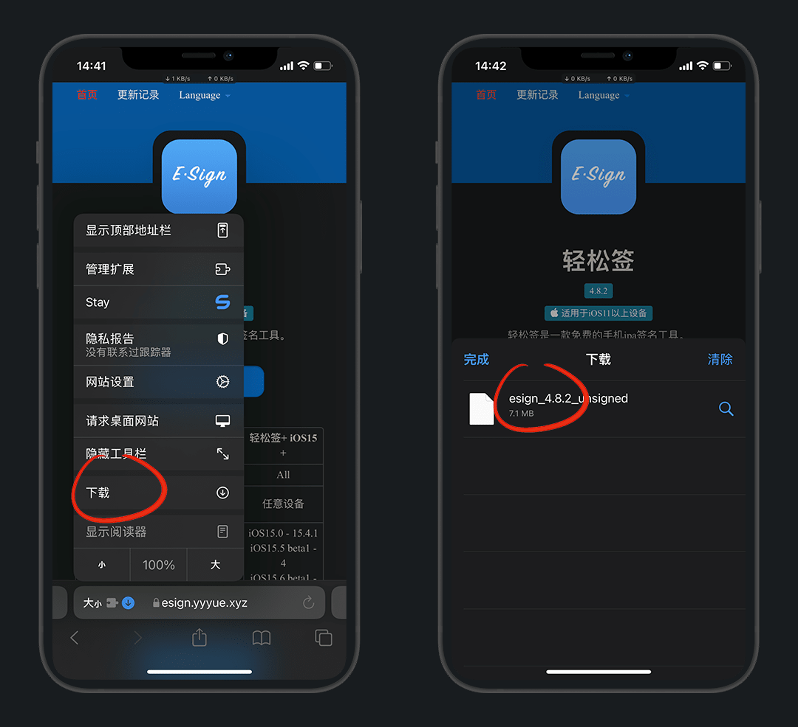
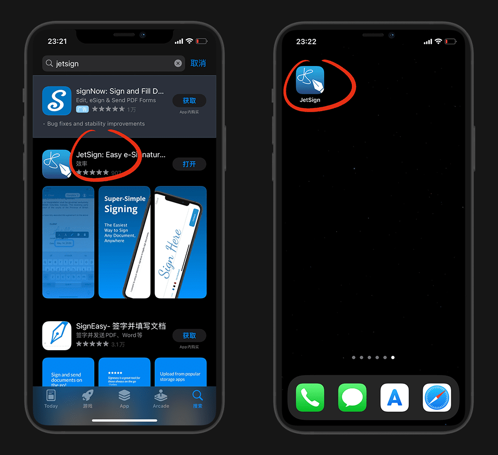
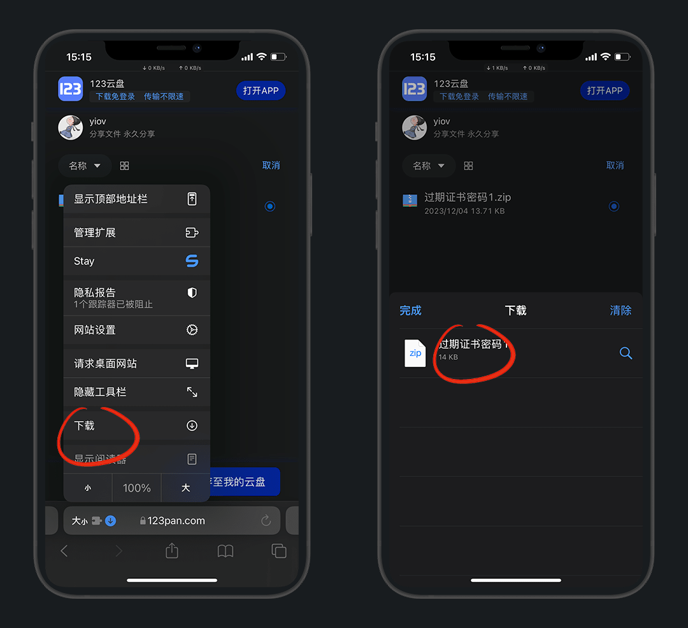
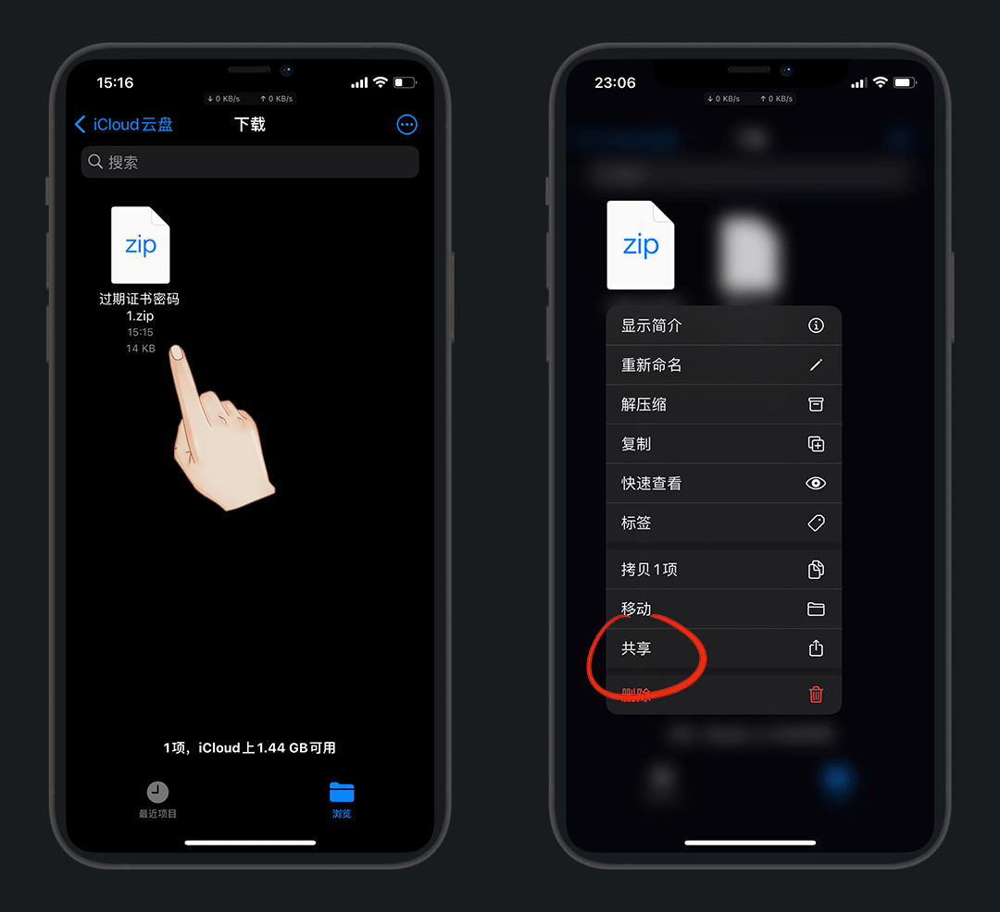
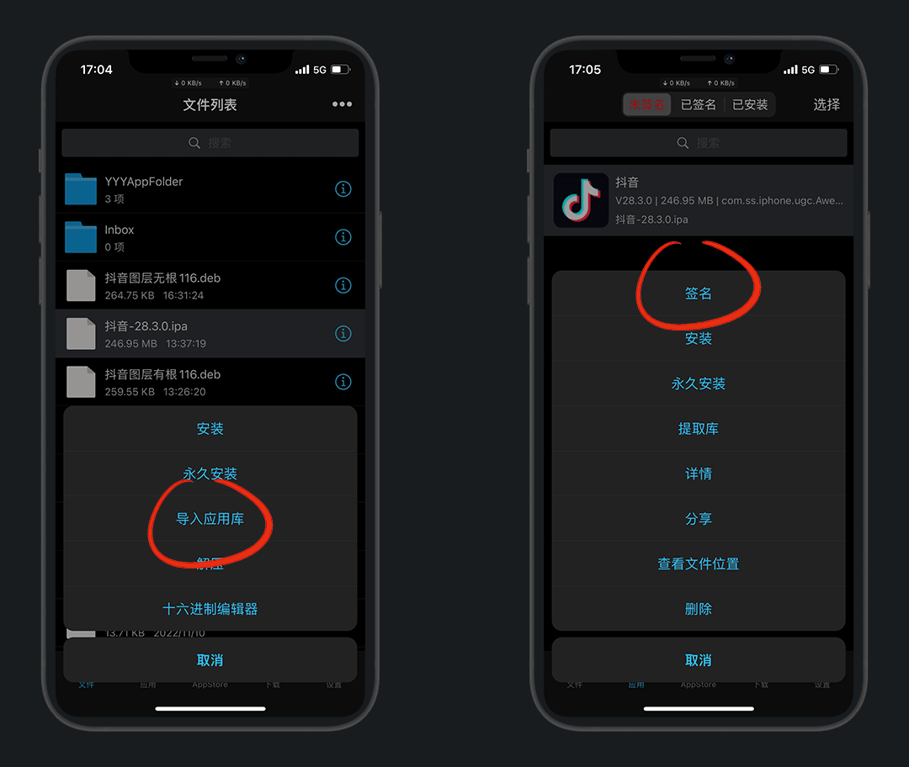

# 轻松签+

### 1.简介

随着fugu15漏洞演示，巨魔也出了新的永久签，轻松签也紧跟步伐推送了轻松签+

比巨魔好在可以注入、移除插件以及修改bundle id

### 2.适用范围

| 系统/iPhone | 6-8系列 / SE / X (A8-A11) | 11-14系列 / XR / XS / SE 2-3 (A12-A15) | 14 Pro系列 / 15系列(A16) |
| :-: | :-: | :-: | :-: |
| 14.0-14.8.1 | ✘| :heart:[A12+](https://esign.yyyue.xyz/yyy/api/esignapp/arm64e/install) | ✘ |
| 15.0-15.4.1 | :green_heart:[iOS15+](https://esign.yyyue.xyz/yyy/api/esignapp//arm64/install) | :green_heart:[iOS15+](https://esign.yyyue.xyz/yyy/api/esignapp//arm64/install) | ✘ |
| 15.5及以上 | ✘ | ✘ | ✘ |

### 3.安装

::: details 若直装Esign+无网络，再来看此步骤
需要苹果国外ID登录应用商店，搜：`jetsign`  下载安装后打开

打开app，允许 `无限局域网与蜂窝网络` ，然后我们直接卸载

> 因为我们只需要把这个权限打开即可

:::

轻松签官网：[https://esign.yyyue.xyz/](https://esign.yyyue.xyz/)

::: tip 说明
根据自己的系统，选择安装方式
:::

点击安装，桌面会出现一个 `jetsign`，进入点安装 `Esign+`

::: tip 说明
如果无法成功安装Esign+，可尝试挂一个梯子 或者 展开查看第一步收缩的内容
:::

打开轻松签+，允许 `无限局域网与蜂窝网络` ，就可以使用了

### 4.使用

以 `微信` 为例，下载好后点击，用 `轻松签+` 打开即可

::: tip 说明
微信砸壳ipa：[https://github.com/Netskao/iOS-DumpDecrypted-IPAs](https://github.com/Netskao/iOS-DumpDecrypted-IPAs)

默认下载位置：文件 - `icloud云盘` 或 `我的iPhone` 里
:::

打开轻松签+，文件 - 点击刚下载的ipa文件 - `导入应用库`

点击应用界面未签名的ipa应用，`签名`

简单看一下界面，都是字面意思

多开就要改一下 `名字` 和 `Bundle ID`

点更改图标和注入插件的，就点更多设置

我们这里有一个14合一的安装包，我们看一下，也是常用的插件

::: tip 说明
可自行移除或注入其他插件，建议直接使用别人弄好的，自己不懂不要乱弄
:::

都弄好了，就可以签名了

::: tip 建议开启
移除应用跳转：不然分享会跳转到小号

文件访问：方便传图
:::

签好名后，直接点 `永久安装` 即可

::: warning 注意
不满意可以重新签名安装，Bundle ID一致可以直接覆盖
:::

### 5.插件提取

我这里已 `抖音` 为例

:::: details 5.1 已安装应用 提取插件

点击轻松签已安装的应用，提取库-选择要提取的插件

::: tip 说明
最新版有此功能，记住插件都 `*.dylib` 的后缀名，其他的是系统的不要动，否则闪退
:::

::::

:::: details 5.2 未安装应用 提取插件

我们先下载好IPA文件，导入轻松签，解压，完成后有生成一个 `Payload` 的文件夹

进入文件夹-点击文件夹-查看文件，跳转到Filza文件目录，其中 `Frameworks` 就是插件目录

这里除了dylib插件，其他都是系统的不要动，复制出来即可

::::

### 6.插件注入

打开轻松签，点击IPA文件-导入应用库

应用-签名-更多设置

::: tip 说明
如果要多开需要改应用名和Bundle ID，后面加字就行，不改就是官替会覆盖原版
:::

添加第三方库-选择准备好的插件`Awemepure.dylib`

::: tip 说明
导入其他插件就按名字找
:::

开启文件访问-立即签名，安装就不赘述了

下载的视频，也是无水印的，其他功能自行探索吧

