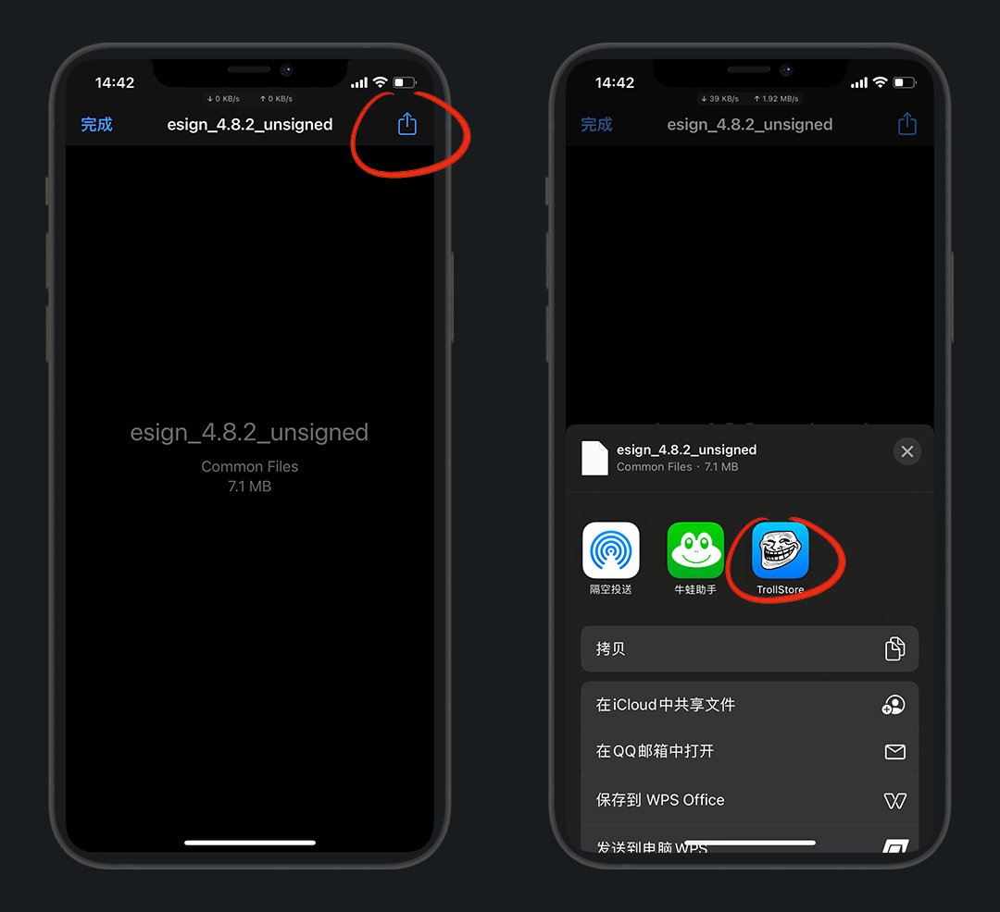
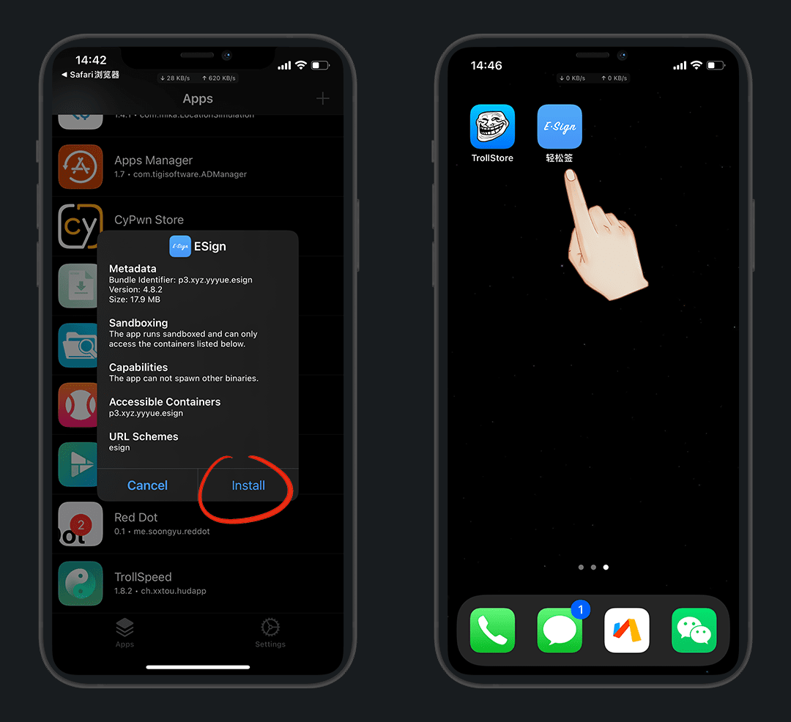
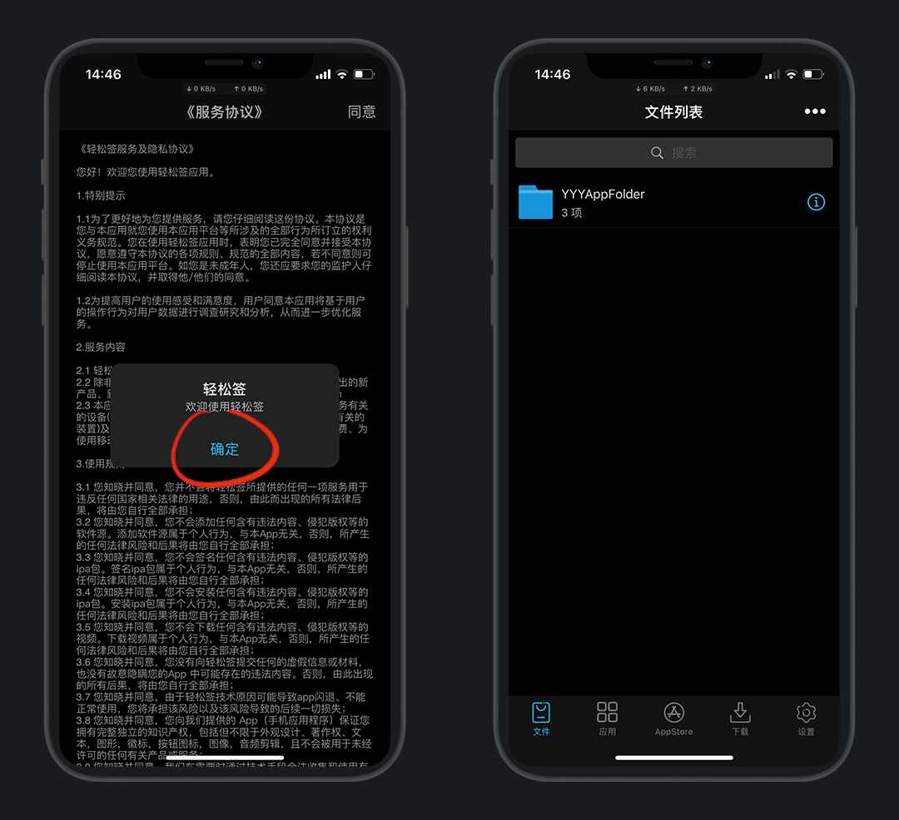
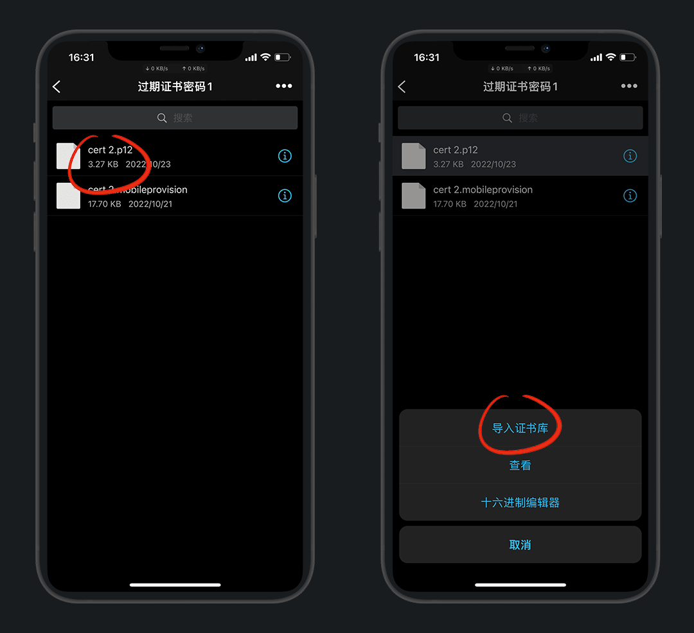
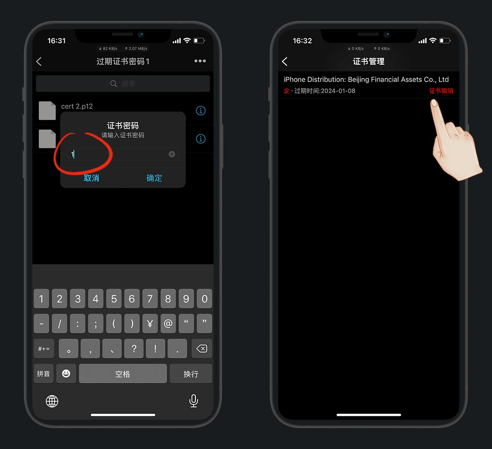
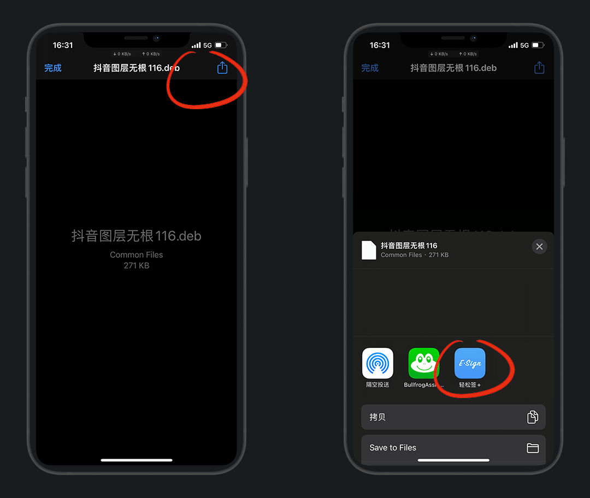
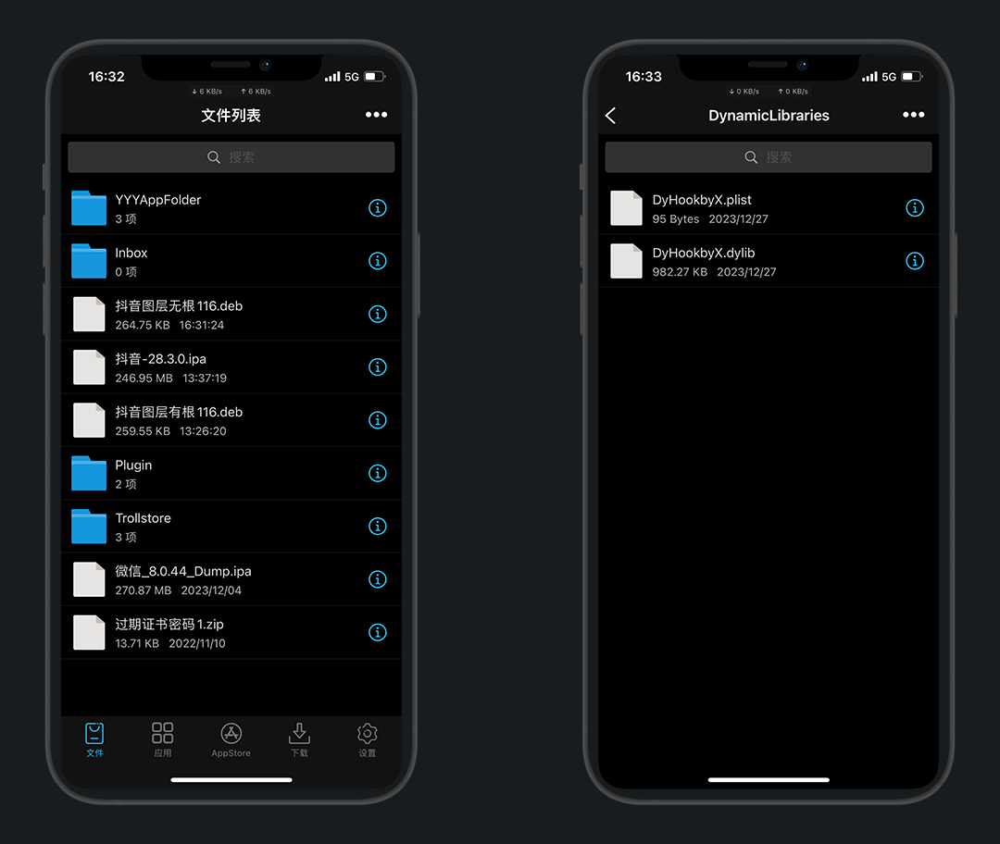
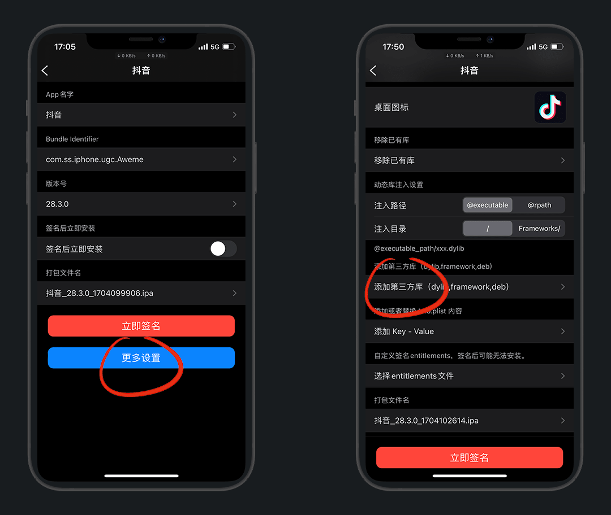

# 轻松签+安装及使用

> 更新时间：2023-12-4

## 1.简介

轻松签原本只是签名工具，后来集成了巨魔1代的免签功能，推出了轻松签+

而它可实现永久签、插件注入/移除、修改bundle id多开应用等

官网：https://esign.yyyue.xyz/

## 2.适用范围

| 系统/iPhone | 6-8系列 / SE / X (A8-A11) | 11-14系列 / XR / XS / SE 2-3 (A12-A15) | 14 Pro系列 / 15系列(A16-A17) |
| :-: | :-: | :-: | :-: |
| 14.0-15.4.1 | ✘| :heart:[A12+](https://pan.yyyue.xyz/d/cache/arm64e.ipa) | ✘ |
| 15.0-15.4.1 | :green_heart:[IOS15+](https://pan.yyyue.xyz/d/cache/arm64.ipa) | :green_heart:[iOS15+](https://pan.yyyue.xyz/d/cache/arm64.ipa) | ✘ |
| 15.5及以上 | ✘ | ✘ | ✘ |

## 3.安装

::: details 若直装Esign+无网络，再来看此步骤
需要苹果国外ID登录应用商店，搜：`jetsign`  下载安装后打开

打开app，允许 `无限局域网与蜂窝网络` ，然后我们直接卸载

> 因为我们只需要把这个权限打开即可

:::

根据 [官网](https://esign.yyyue.xyz/) 的 表格 ，选择对应的安装方式

::: tip 注意
IOS 16及以上的手机不支持，官网还没有更新

以我列出的 [适用范围](#_2-适用范围) 表为准
:::

点击安装，桌面会出现一个 `jetsign`，进入点安装 `Esign+`

::: tip 说明
如果无法成功安装Esign+，可尝试挂一个梯子
:::

打开轻松签+，允许 `无限局域网与蜂窝网络` ，就可以使用了

## 4.使用

以 `微信` 多开为例

下载砸好壳的微信ipa包，演示的版本是 `8.0.44`

[https://www.mediafire.com/file/q7pod9131llj6ca/](https://www.mediafire.com/file/q7pod9131llj6ca/%25E5%25BE%25AE%25E4%25BF%25A1_8.0.44_Dump.ipa/file)

::: tip 科普
这里的dump就表示砸壳，就是提取应用的ipa安装包

苹果对安装包进行了加密，犹如外壳一样，砸壳的过程就是解密脱壳
:::

下载 - 点击下载好的文件

右上角分享 - 用 `轻松签+` 打开

点击微信文件，导入应用库

选择微信 - 签名

这里我们多开就修改下 `App名字` 和 `Bundle Identifier` 就好了，例如我在后面都加了个 `2`

::: tip 说明
Bundle ID就是 `应用程序标识符` ，也叫应用ID，也叫包名，独一无二就相当于人的身份证

我们通过修改应用ID，就变成了两个完全独立的App，可共存安装，也就是多开
:::

点击 `更多设置` 根据自己需求也可以改一下图标

::: details 分享1个图片

:::

然后下拉，建议打开 `移除应用跳转` 和 `开启文件访问` 开关，立即签名

::: tip 说明
移除应用跳转：可避免大号分享时跳转到分身上

开启文件访问：可访问本地文件及相册等
:::

签名完成后，点击 `永久安装`，安装完成打开登录账号即可

::: details 疑问1：会封号吗
理论上来说，99.99%不会

本身就是原版未修改的ipa包，不存在封号一说

有插件的都未必封号，最多限制几小时登陆；修改过的微商版微信那肯定是会封
:::

::: details 疑问2：怎么卸载
卸载不能在桌面删，只能在 `已安装` 页卡，选中应用左滑即可卸载
:::

::: details 疑问3：再安装新版本微信聊天记录还在吗
只要签名的时候，应用ID和上次一样就可以直接覆盖安装，聊天记录都在
:::

## 5.插件提取

我这里已 `抖音` 为例

:::: details 5.1 已安装应用 提取插件

点击轻松签已安装的应用，提取库-选择要提取的插件

::: tip 说明
最新版有此功能，记住插件都 `*.dylib` 的后缀名，其他的是系统的不要动，否则闪退
:::

::::

:::: details 5.2 未安装应用 提取插件

我们先下载好IPA文件，导入轻松签，解压，完成后有生成一个 `Payload` 的文件夹

进入文件夹-点击文件夹-查看文件，跳转到Filza文件目录，其中 `Frameworks` 就是插件目录

这里除了dylib插件，其他都是系统的不要动，复制出来即可

::::

## 6.插件注入

打开轻松签，点击IPA文件-导入应用库

应用-签名-更多设置

::: tip 说明
如果要多开需要改应用名和Bundle ID，后面加字就行，不改就是官替会覆盖原版
:::

添加第三方库-选择准备好的插件`Awemepure.dylib`

::: tip 说明
导入其他插件就按名字找
:::

开启文件访问-立即签名，安装就不赘述了

下载的视频，也是无水印的，其他功能自行探索吧

