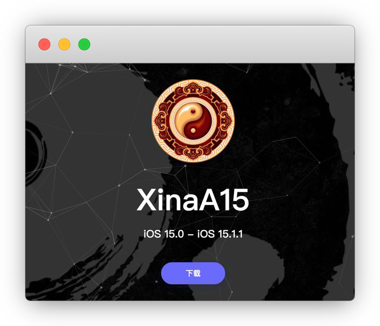
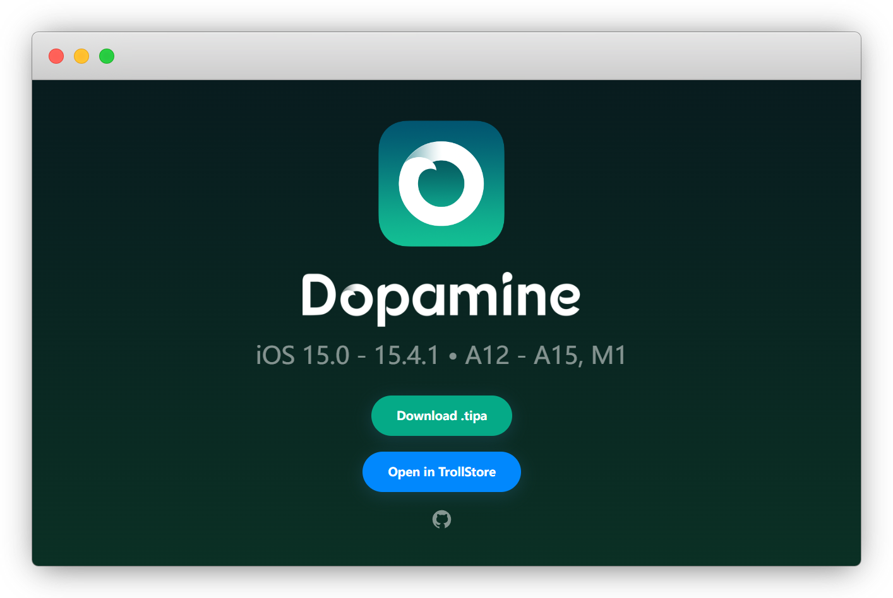
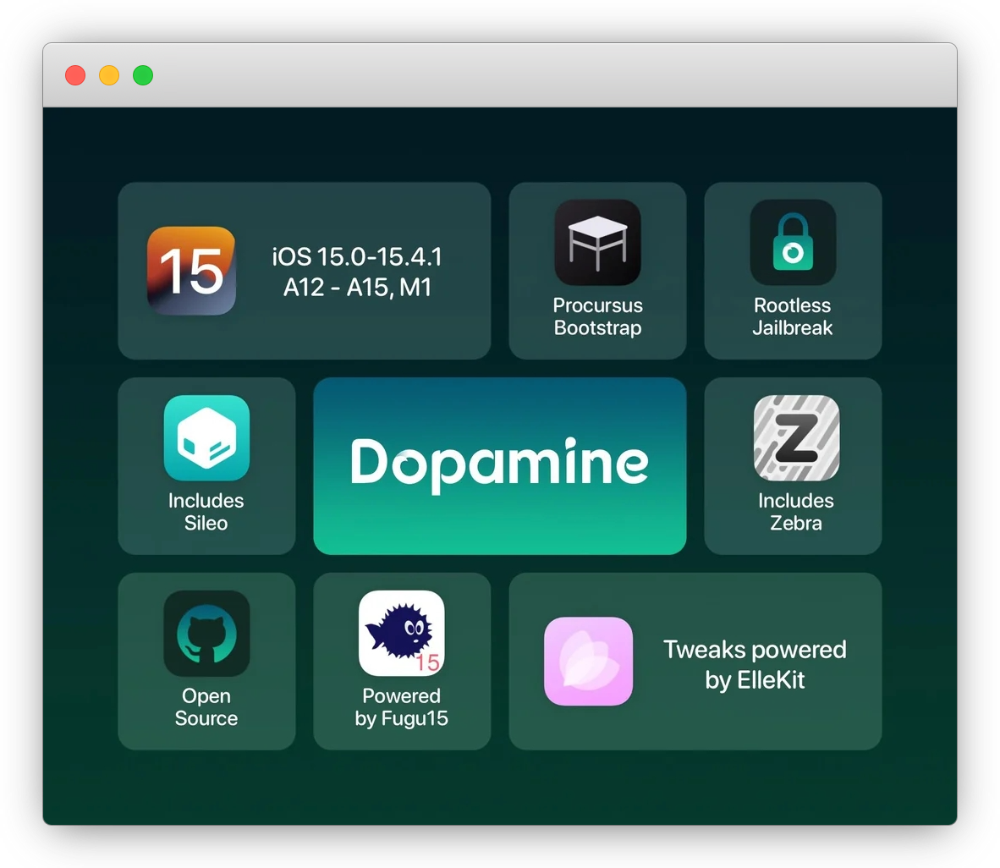
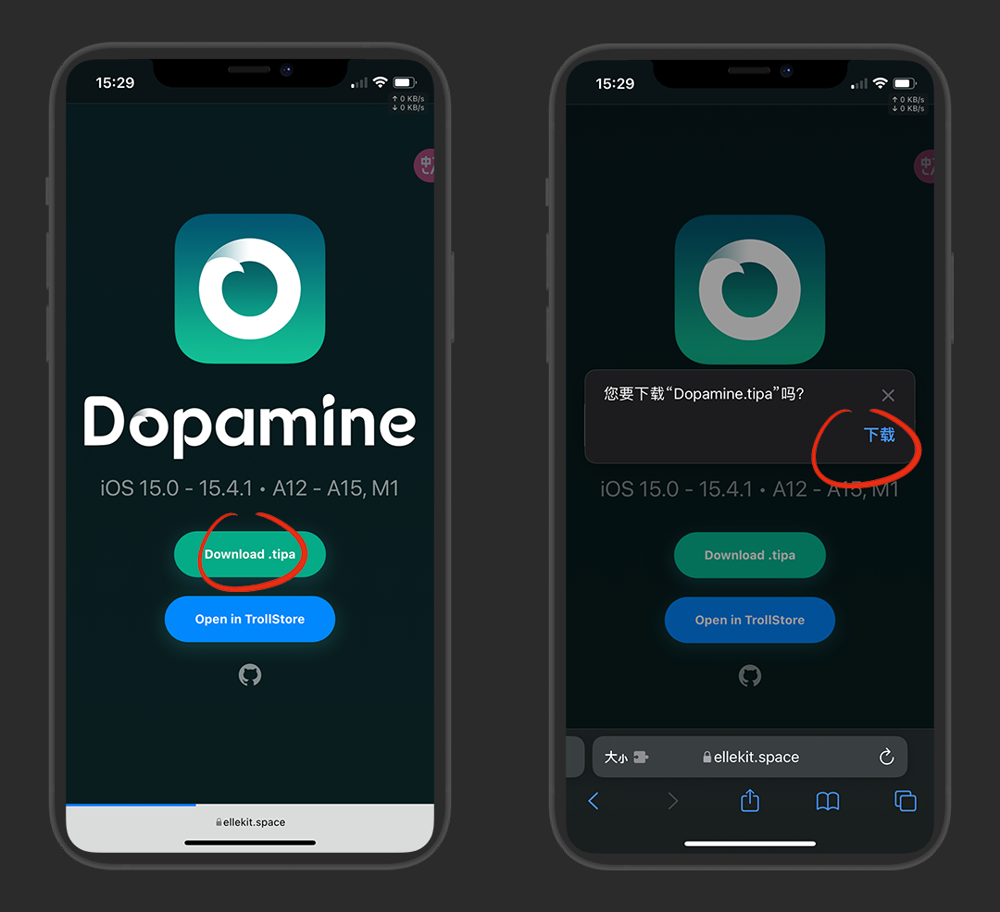
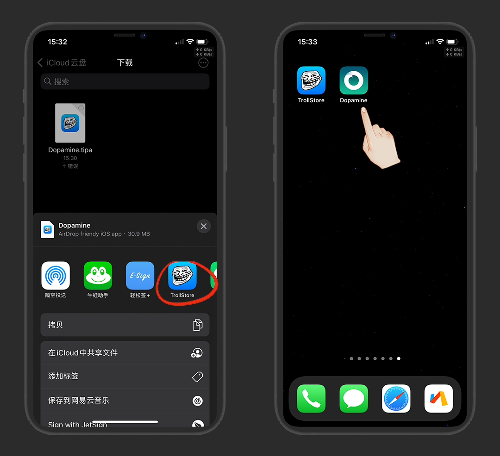
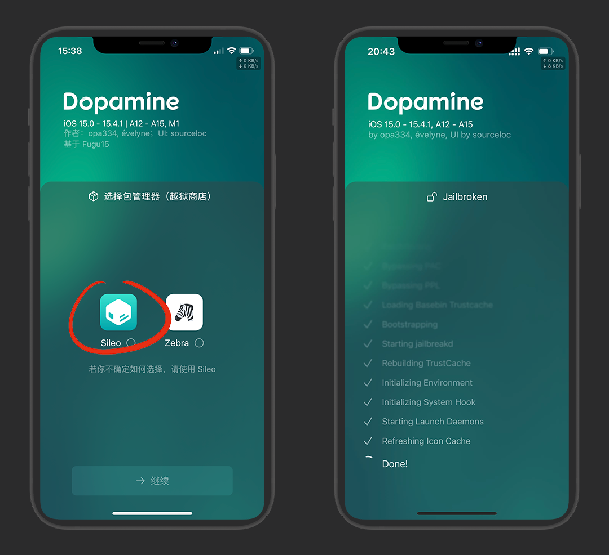
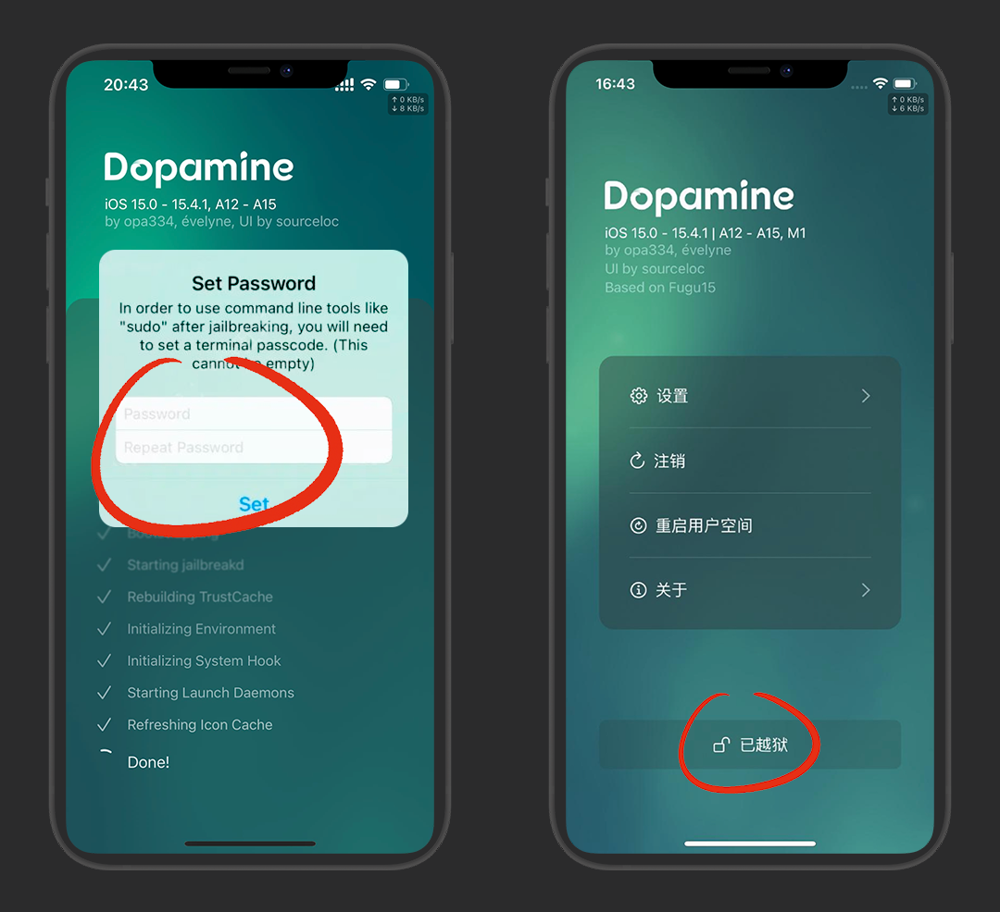
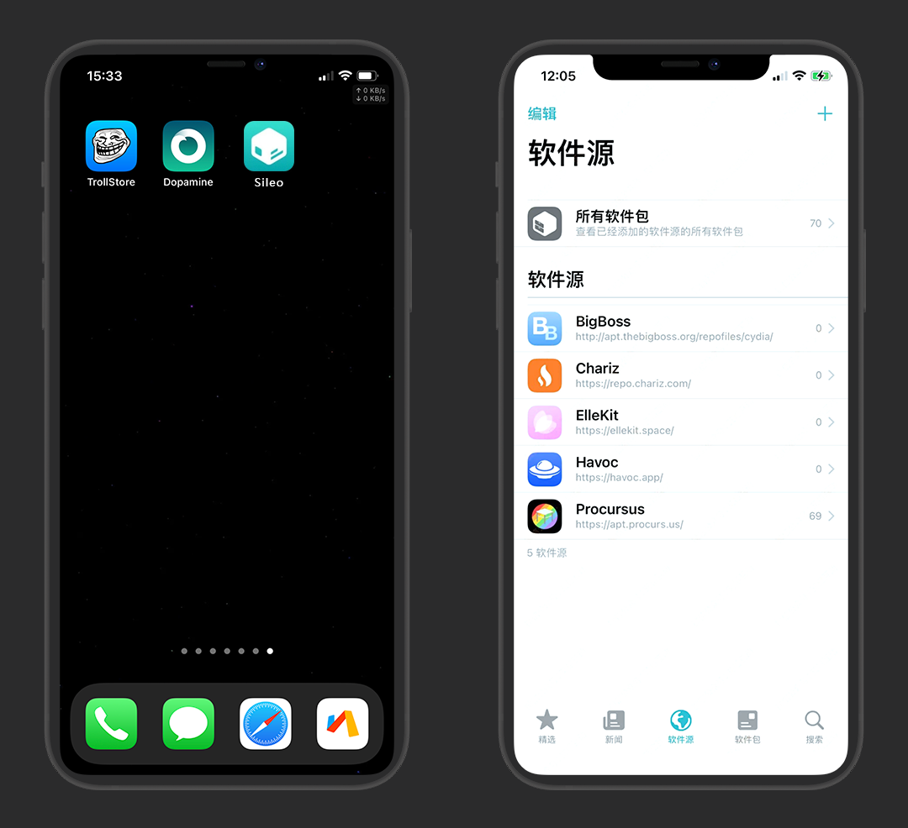

# IOS 15越狱工具Dopamine

::: warning 更新时间
最近更新：2023-7-3
:::

## 前言

由于苹果系统在不断的封堵漏洞，越狱环境更加的困难，很多大神都退圈了


::: warning 注意
本教程仅适用于：`A12-15 M1 / iOS 15.0-15.4.1`

低版本系统请参考 [苹果iPhone手机越狱教程](../jail%E2%80%8Bbreak/)
:::

::: details XinaA15 IOS 15首位越狱工具

### XinaA15

IOS 15越狱，最初由国人 [@朱心浪](https://twitter.com/xina520) 独立开发，后发布了 [XinaA15](https://xina.ss03.cn/)

* 适用：`A12-15 / iOS 15.0-15.1.1`

* 功能：首次推出最强功能的 `临退模式` ，即可以临时退出越狱模式，以应对银行等app对越狱环境的检测

* 隐退：[@opa334](https://twitter.com/opa334dev) 加入了IOS 15的越狱开发中后，退出了 `XinaA15` 的开发

* 感谢：只用了3年就学会越狱，是国人的骄傲和榜样

* 越狱源：[https://apt.xina.vip/](https://apt.xina.vip/)



:::


### Dopamine


[@opa334](https://twitter.com/opa334dev) 加入IOS 15的越狱开发中，进展迅速并暂时命令为 [Fugu 15 Max](https://github.com/opa334/fugu15)

* 适用：`A12-15 M1 / iOS 15.0-15.4.1`

* 发布：2023/4/20正式发布，并命名为 `Dopamine` (多巴胺)

* 官网：[https://ellekit.space/dopamine/](https://ellekit.space/dopamine/)

* 仓库：[https://github.com/opa334/Dopamine](https://github.com/opa334/Dopamine)

* 越狱源：[https://opa334.github.io/](https://opa334.github.io/)








::: warning 注意
越狱为不完美越狱，即无根越狱，无根目录权限，仅可读取系统文件，重启后恢复未越狱状态

完美越狱已不存在，即有根越狱，有根目录权限，可修改读写系统文件，重启后依旧越狱状态

:::

::: details 点击查看 可越狱手机机型

| 芯片| 手机 |
| :-: | :-: |
| A12 | iPhone XS系列 / XR |
| A13 | iPhone 11系列 / SE 2 |
| A14 | iPhone 12系列 |
| A15 | iPhone 13系列 / 14系列 / SE 3 |
:::


## 安装

多巴胺官网：[https://ellekit.space/dopamine/](https://ellekit.space/dopamine/)

下载ipa包



我用 [巨魔安装](../TrollStore/) 

::: tip 说明
能越狱的系统，肯定是能装巨魔的，好用

或者你也可以用 [其他自签工具](../Sideloadly/)
:::




## 越狱

::: warning 注意
如果你是 fugu 15 max beta 用户，请先备份插件，否则多巴胺正式版会清空越狱环境

* [deb备份插件.ipa](https://dzp.lanzouy.com/iAtPs0wlfhlc)
:::

支持中文界面，UI很舒服


点击底部 `越狱` 开始，选择包管理器，然后等进度完成

::: tip 说明
不知道选什么，就用默认的 Sileo
:::



首次越狱，会弹出设置终端密码提示框，请牢记密码，使用命令工具的时候会用到

进度完成后自动注销，再次进入查看手机是否完成越狱

::: warning 注意
越狱失败后，重启下手机，再试一遍，不代表一次能成功
:::




接下来就是打开Sileo商店安装插件了





## 越狱插件

::: warning 注意
Ellekit 是 Dopamine 越狱后必须安装的基板

必须首先安装 Ellekit 源：[https://ellekit.space/](https://ellekit.space/)

另：有一些有根转无根的插件，尽量不要使用，以免白苹果！
:::


### 插件下载

* [PC端：cydownload](https://github.com/borishonman/cydownload/releases)

* [手机端：PostBox](https://itunes.apple.com/app/id1644577838)「国区下架，美区下载即可」

* [手机端：Saily](https://github.com/SailyTeam/Saily/releases)

* [手机端：Sileo](https://github.com/Sileo/Sileo/releases)

* [越狱机：CyDown](https://julio.hackyouriphone.org/)

* [网页端：Repo Updates](https://www.ios-repo-updates.com/)


### 默认源

* BigBoss 源：`https://apt.thebigboss.org/repofiles/Cydia/`

* Chariz 源：`https://repo.chariz.com/`

* Ellekit 源：`https://ellekit.space/`

* Havoc 源：`https://havoc.app/`

* Procursus 源：`https://apt.procurs.us/` (必装依赖PreferenceLoader)


::: details 默认源 好用插件
```md

# BigBoss 源

* App Library Disabler：去除App资源库的插件

* CCVibration：控制中心添加振动模块的插件

* HotspotQR：将个人热点网络生成二维码

* WiFiQR：将WiFi网络生成二维码


# Havoc 源

* Anouk：给隐藏照片加锁

* Ampere：电池百分比插件

* CopyLog：剪贴板管理插件

* CCCounters：控制中心显示倒计时的插件

* CCDNDTimer：控制中心勿扰模式增强插件

* DLEasy：知名的国外社交App视频下载神器

* DNDMyRecording：录屏勿扰插件

* FloatingDockXVI：自定义Dock栏摆放数量

* Hammer It：分词大爆炸 [说明书](https://github.com/lclrc/lclrc.github.io/blob/main/HammerIt.md)

* InstaLauncher 2：应用快速启动插件

* IconOrder：依赖文件，如FolderX、Bolders Reborn

* Macaron：给Doc栏添加图片的插件

* MenuSupport：将选择菜单图标按钮显示的插件

* Stella：一款模拟雪花飘落的插件

* Snapper 3：区域截图插件，收费！需安装bigboss源的 `CCSupport` 依赖，可配合 Hammer It、Translomatic使用

* Translomatic：快捷翻译，可配合Snapper 3使用

* Uptime：控制中心显示开机后运行时间的插件

* UnderDock：新的键盘增强插件


# Chariz 源

* Atria：自定义主屏幕图标布局的插件，需在本源中安装依赖 `Alderis Color Picker`

* Bolders Reborn：自定义文件夹的插件，需在Havoc源安装依赖`IconOrder`

* Cylinder Reborn：炫酷翻页特效插件

* Comet：依赖文件，如Dodo

* LastLook：熄屏显示插件

* Orion Runtime (iOS 14 – 16)：依赖文件，如Dodo

* SearchDots：模仿iOS 16系统桌面搜索按钮的插件

* Velvet 2：多彩通知栏发光美化插件

```
:::


### 其他插件


* [AppsDump：iOS 15系统砸壳专用丨@bswbw](https://dzp.lanzouk.com/iuVXl0zxs53a)

* [deb备份插件.ipa](https://dzp.lanzouy.com/iAtPs0wlfhlc)


### 常用源

::: tip 说明
☛ 点我查看 [旧源插件列表](../jail%E2%80%8Bbreak/#_2-自带源)

注意：插件没有适配无根(rootless)的无法使用，请注意辨别 `arm64`
:::


::: details opa334 源

```md
源地址：https://opa334.github.io/

* AltList：重要的依赖，如Choicy

* Choicy：调整插件注入的工具

* CCSupport：控制中心模块相关插件的依赖，如BackgrounderAction15 for CCSupport、Cache Magic Rootless、Cpu Magic Rootless、Memory Magic Rootless、Network Magic Rootless

* Crane：App 创建容器的插件，分身神器

* libSandy：扩展系统的沙盒用户程序安装的依赖，如电话助手

```
:::


::: details Amy 源

```md
源地址：https://repo.anamy.gay/

* Sileo：Sileo越狱商店

```
:::


::: details akusio 源

```md
源地址：https://akusio.github.io/

* BackgrounderAction15 for CCSupport：应用程序后台保持运行，需在opa334源安装依赖`CCSupport`

* MilkyWay4：老牌分屏神器

```
:::


::: details AnthoPak 源

```md
源地址：https://repo.anthopak.dev/

* PanCake：一款快速返回上一页的插件，依赖`Cephei Tweak Support`在Chariz 源安装

* QuickPrefs：在设置三维触控面板增加菜单的插件

```
:::


::: details b4db1r3 源

```md
源地址：https://b4db1r3.github.io/d3vr3p0/

* OCD：角标和名称自适应图标颜色的插件

* tappy：单击或双击状态栏时间显示自定义日期的插件


```
:::


::: details CreatureSurvive 源

```md
源地址：https://creaturecoding.com/repo/

* Shuffle：设置归类插件

* libCSPreferences：Shuffle的依赖

* Tranquil：背景音插件

* TweakSettings：独立的插件设置插件

```
:::


::: details 蔡明美 源

```md
源地址：https://cydia.akemi.ai/

* AppSync Unified：免签安装IPA

```
:::


::: details CydiaGeek 源

```md
源地址：https://cydiageek.yourepo.com/

* DoubleTapToLock：双击锁屏插件

```
:::


::: details Dcsyhi 源

```md
源地址：https://dcsyhi1998.github.io/

* ADKeyboard：键盘添加颜色插件

* KBApp：键盘底部添加快捷按钮或者App的插件

* Zetsu：分屏插件

```
:::


::: details 刀刀源 源

```md
源地址：https://xiangfeidexiaohuo.github.io/

* 嗨客源的衍生源，主要是插件汉化包
```
:::


::: details Fouad Raheb 源

```md
源地址：https://apt.fouadraheb.com/

* AppData：快速查看和管理应用程序详细数据的插件
```
:::


::: details Ginsu 源

```md
源地址：https://ginsu.dev/repo/

* Comet：DualClock 2依赖

* Dodo：简洁清新的锁屏插件，需在Chariz源安装依赖 `Orion Runtime`

* DualClock 2：锁屏显示双时钟的插件，需在Chariz源安装依赖 `Orion Runtime`

* GScore：Dodo、DualClock 2依赖

```
:::


::: details htv123 电话助手 源

```md
源地址：http://apt.htv123.com/

* 电话助手：通话录音(收费插件)，需在opa334源安装依赖`libSandy`

* 魔术师：屏蔽越狱

```
:::


::: details ichitaso 源

```md
源地址：https://cydia.ichitaso.com/

* HideKBSettings：隐藏键盘设置的插件

* NoUpdateMark：去除设置更新红点的插件

* PowerSelector：电源增强插件

* PrimalFolder 2：将文件夹第一个图标作为文件夹封面的插件

```
:::


::: details Ivano Bilenchi 源

```md
源地址：https://ib-soft.net/repo

* iCleaner Pro：iOS 系统清理垃圾工具

```
:::


::: details iKarwan 源

```md
源地址：https://repo.ikghd.me/

* PMP：照片保护插件

```
:::


::: details igamegods 源

```md
源地址：https://iosgods.com/repo/

* igamegods：内存修改器

```
:::


::: details iCraze 源

```md
源地址：https://repo.icrazeios.com/

* DarkPods：模仿iOS 17系统 AirPods 系列设备弹窗深色模式的插件

* NotiCopy15：复制通知的插件

```
:::


::: details i0s_tweak3r 源

```md
源地址：https://www.yourepo.com/

* ByeByeAppLibrary：禁用App资源库的插件

```
:::


::: details JunesiPhone 源

```md
源地址：https://junesiphone.com/supersecret/

* HideDockBG：Dock 背景透明

```
:::


::: details Lizynz 源

```md
源地址：https://lizynz.github.io/

* FolderX：自定义文件夹插件，需在Havoc源安装依赖`IconOrder`

```
:::


::: details Limneos 源

```md
源地址：https://limneos.net/repo/

* AudioRecorder XS：通话录音插件

* BioProtect XS：使用指纹、面容或密码保护您的应用程序

* DynamicPeninsula：老设备实现灵动岛功能的插件

* Glow：屏幕发光的插件，熄屏显示夜总会灯光

* VoiceChanger XS：收费插件，通话变声器

```
:::


::: details 老牌猫源
```md
源地址：https://apt.25mao.com/

插件：微信插件：密友/斗图助手/游戏扫码登录

TG群：https://t.me/lanmaoios
```
:::


::: details maxiwee源
```md
源地址：https://maxiwee.de/

* FiveIcon Dock：Dock 栏5个图标

* NoDock：Dock 栏透明背景

* noquickies：去除锁屏手电筒和相机快速按钮

* nobar：去除小横条

```
:::


::: details Netskao 源

```md
源地址：https://repo.initnil.com

* CCPower：电源增强插件

* PullOver Pro：侧边分屏神器，c1d3r 开发 Netskao 重新编译

* 其他：净化/去广告/增强插件

* IPA下载：https://share.initnil.com/With_TorllStore

* QQ及微信砸壳包：https://github.com/Netskao/iOS-DumpDecrypted-IPAs

* 公众号Netskao：https://mp.weixin.qq.com/s/ieLeWpUNjbDL9JGKYhJcmA

```
:::


::: details Nebbs 源

```md
源地址：https://repo.itznebbs.com/

* Edge 2：屏幕边缘添加渐变色彩的插件

* Phoenix：Edge 2依赖文件

```
:::


::: details nahtedetihw 源

```md
源地址：https://nahtedetihw.github.io/

* ReachPlayer：便捷访问区域显示音乐播放器的插件

```
:::


::: details P2KDev 源

```md
源地址：https://p2kdev.github.io/repo/

* 3DBadgeClear：快速清除通知角标的插件

* DeleteForeverXS：永久删除照片的插件

* EZSwipe：主屏幕向下滑动手势插件

* LetMeKnow：电话接听振动的插件

* NewTab：给 Safari 底部添加新建页面+号按钮的插件

* QuitAll：一键清理后台的插件

* ReachMore：便捷访问手势插件

* Snapper2 CC Toggle：Snapper 2增强插件

* Sakal：锁屏添加天气等信息的插件

* SimpleBattery：状态栏电池增加百分比显示的插件

* SugarCane：控制中心亮度和音量添加百分比显示的插件

* ScreenshotActions：给截图添加类似于iOS 16系统的拷贝并删除选项

* TinyWidget14：简单的锁屏音乐播放器插件

```
:::


::: details PoomSmart 源

```md
源地址：https://poomsmart.github.io/repo/

* AppColorClose：颜色选择器依赖

* Battery Health Enabler：开启电池健康

* BlurryBadges：角标美化的插件

* CC On&Off：在控制中心真正的关闭WiFi和蓝牙等

* RecordPause：录像暂停的插件

* TapVideoConfig：视频录制弹窗选择分辨率的插件

```
:::


::: details SOPPPra 源

```md
源地址：https://sopppra.mooo.com/

* Cache Magic Rootless：清除系统缓存，需在opa334源安装依赖`CCSupport`

* Cpu Magic Rootless：显示 CPU 实时信息，需在opa334源安装依赖`CCSupport`

* KillApps：一键清理后台的插件

* LibGcUniversall：SettingsRevamp依赖

* Memory Magic Rootless：显示 RAM 实时信息，需在opa334源安装依赖`CCSupport`

* Network Magic Rootless：显示网速，上传和下载的速率，需在opa334源安装依赖`CCSupport`

* SettingsRevamp：设置归类/设置顶图自定义插件

* StatusTime：自定义状态栏日期和时间的插件

* TweakHub：快速呼出插件设置插件

```
:::


::: details SkyPian 源

```md
源地址：https://skypain.github.io/repo/

* CCScreenShot：控制中心截图模块

* CCAutoBrightness：控制中心亮度自动调节模块

* CCLocation：控制中心添加定位开关

* CCRespring：控制中心一键注销

* CCSettrings：控制中心添加设置开关

* Kayoko：剪贴板管理工具

* MiniLsp：锁屏迷你播放器

```
:::


::: details Shadow 源

```md
源地址：https://ios.jjolano.me/

* jjolano：屏蔽越狱检测插件

```
:::


::: details Spark 源

```md
源地址：https://sparkdev.me/

* 主题插件源

* AutoUnlockX：自动解锁插件

* CCMusicArtwork：控制中心音乐模块显示正在播放音乐封面的插件

```
:::


::: details TIGI Software 源

```md
源地址：https://tigisoftware.com/cydia/

* Apps Manager：App管理器

* Filza：系统文件管理器

```
:::


::: details Tinyapps 源

```md
源地址：https://apt.tinyapps.cn/

* 连个锤子：修复越狱后国行设备无法联网问题

```
:::


::: details uz-ra 源

```md
源地址：https://uz-ra.github.io/

* medusa：应用分屏切换

```
:::


::: details XsF1re 源

```md
源地址：https://alias20.gitlab.io/apt/

* AdaptiveAirPodView：模仿iOS 17系统 AirPods 系列设备弹窗自适应深色模式的插件

* Axon：锁屏通知归纳插件

* bfdecryptor：砸壳插件

* CalcLog：计算器显示历史记录的插件

* FakeSignalBa：自定义运营商的插件

* Power4Options：电源增强插件

* Six(LS)：iOS 6 样式的锁屏美化插件，Skitty 开发 XsF1re 重新编译

* Speedy：iOS系统自定义动画速度插件
```
:::


::: details ZX02 源

```md
源地址：https://zerui18.github.io/zx02/

* Frame：锁屏主屏使用视频作为壁纸

```
:::


