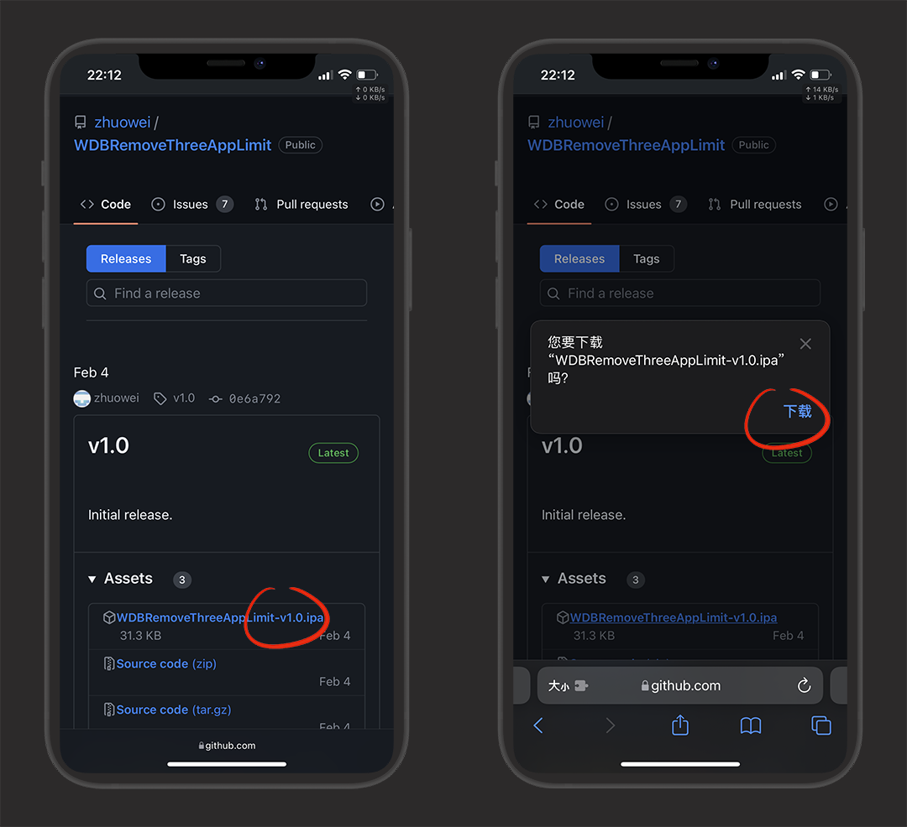
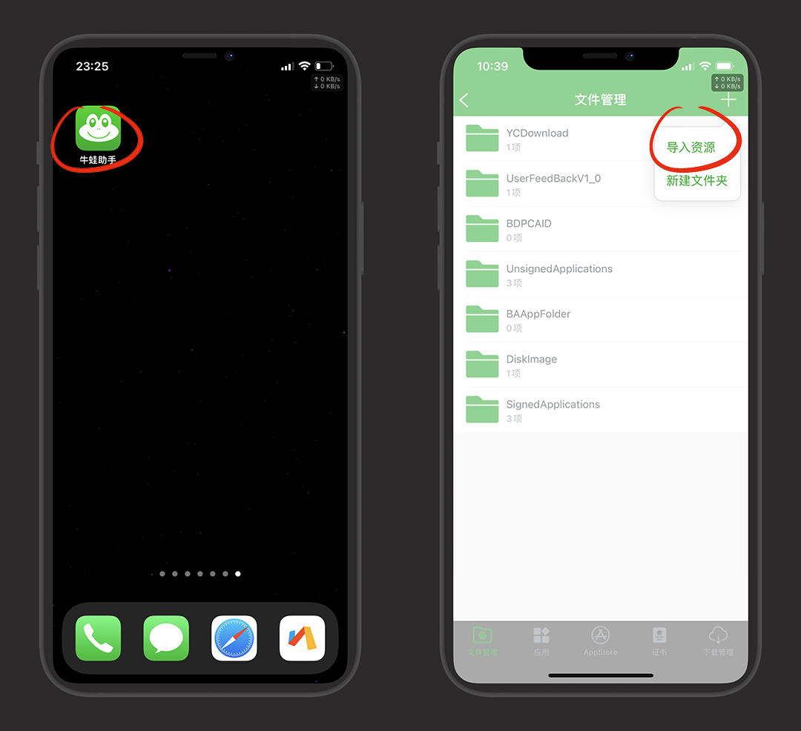
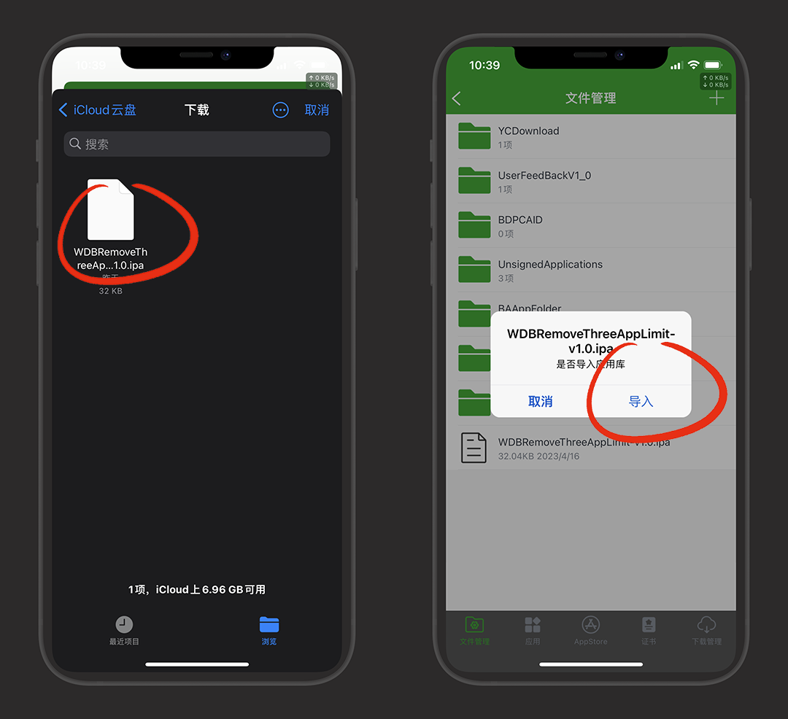
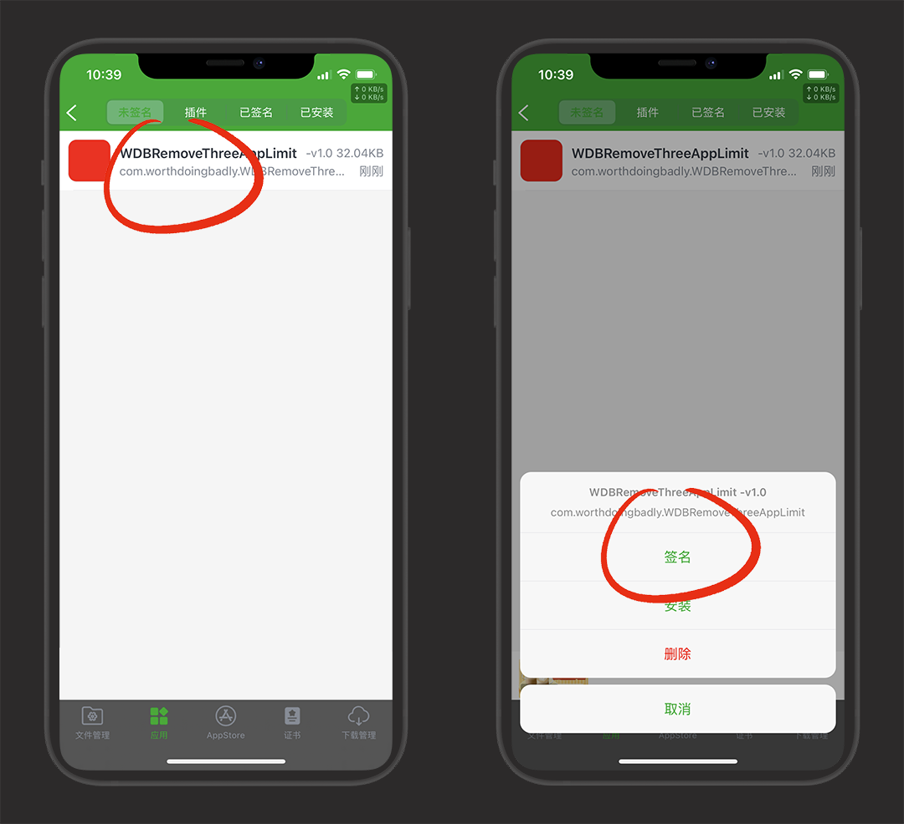
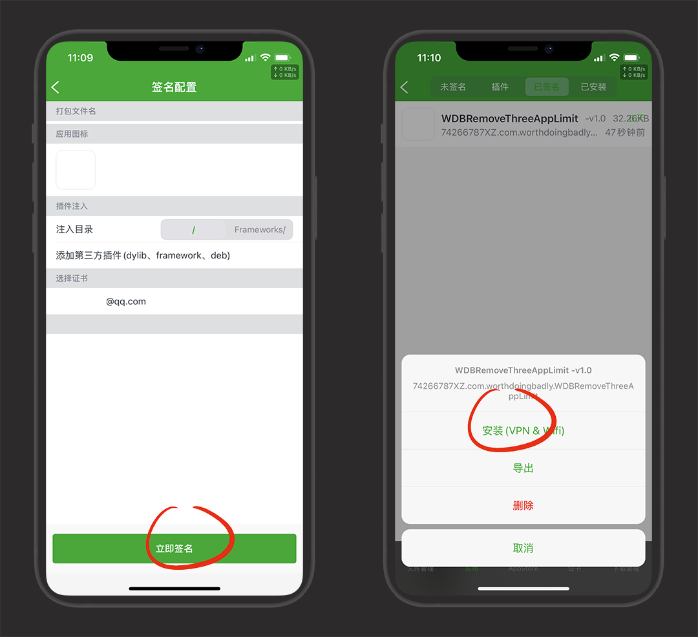
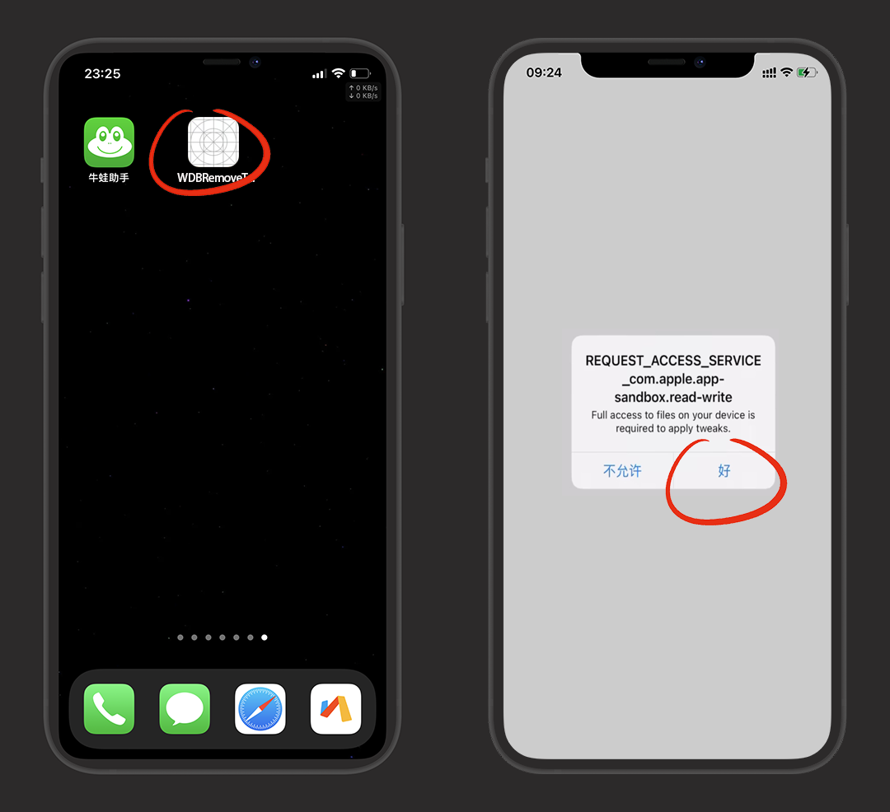
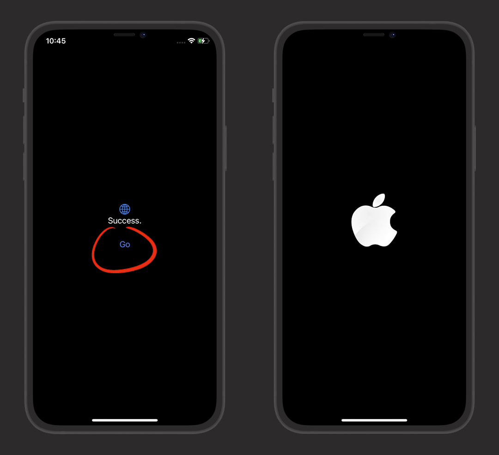
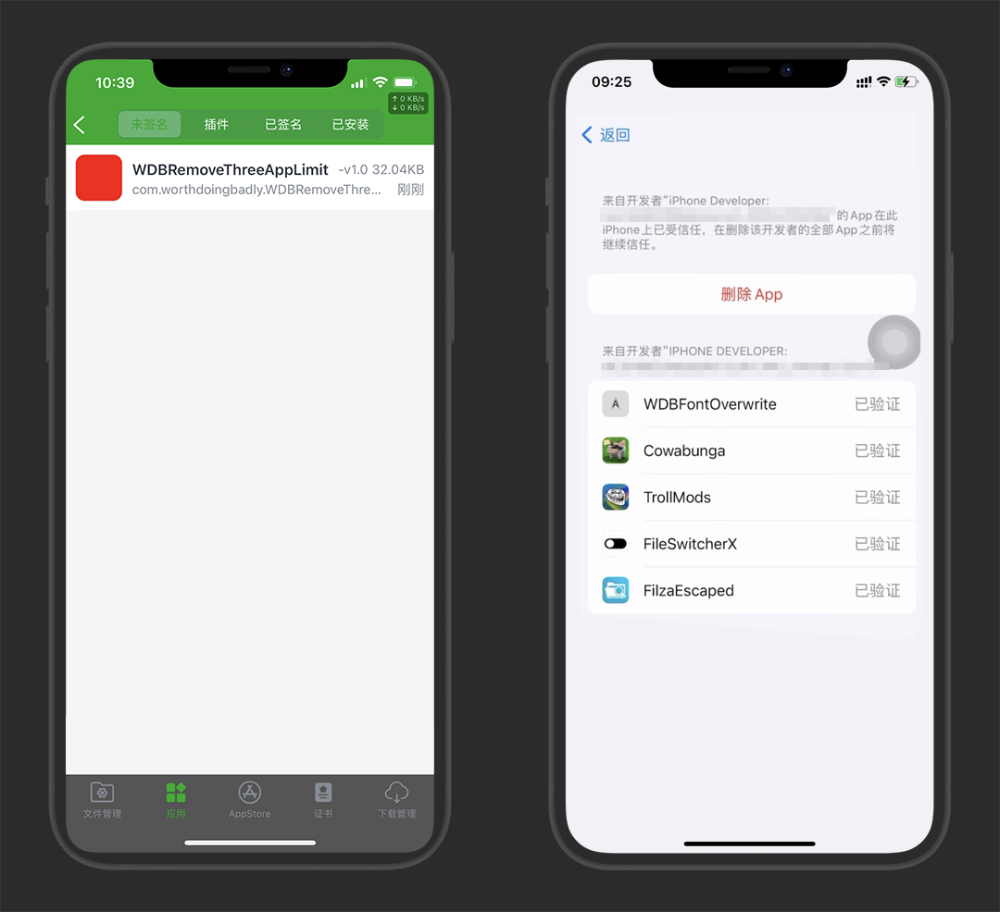
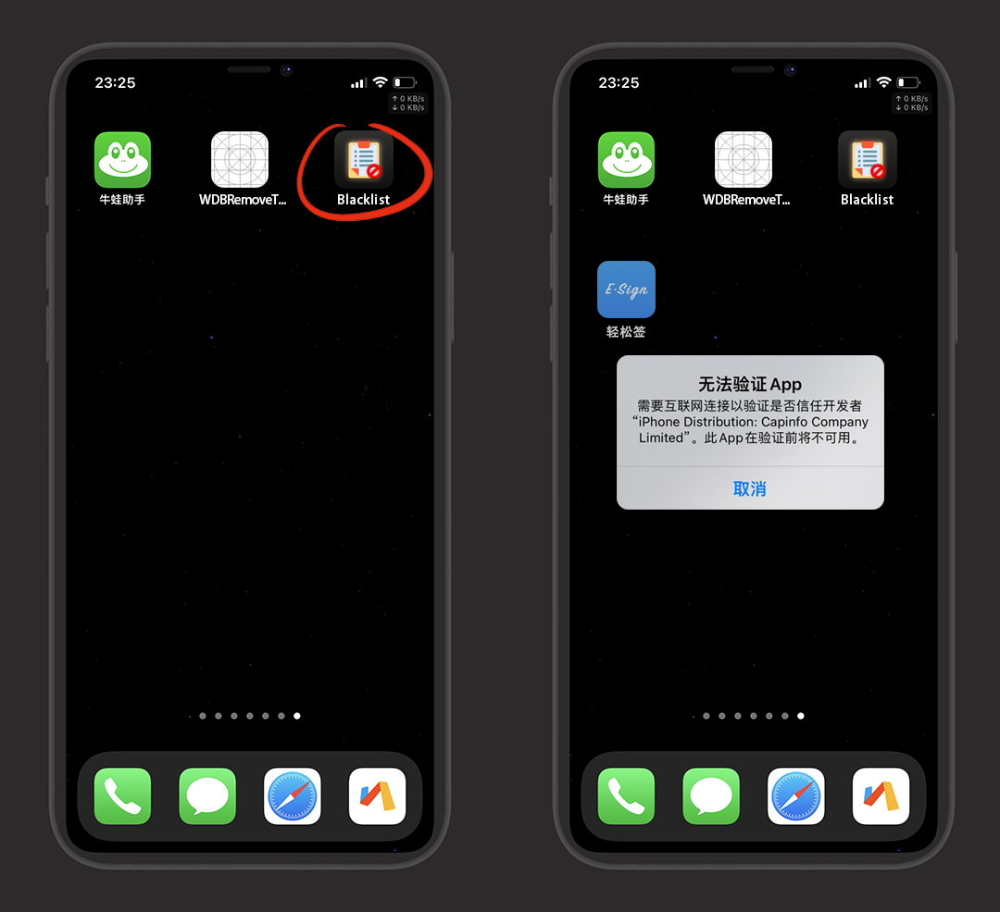
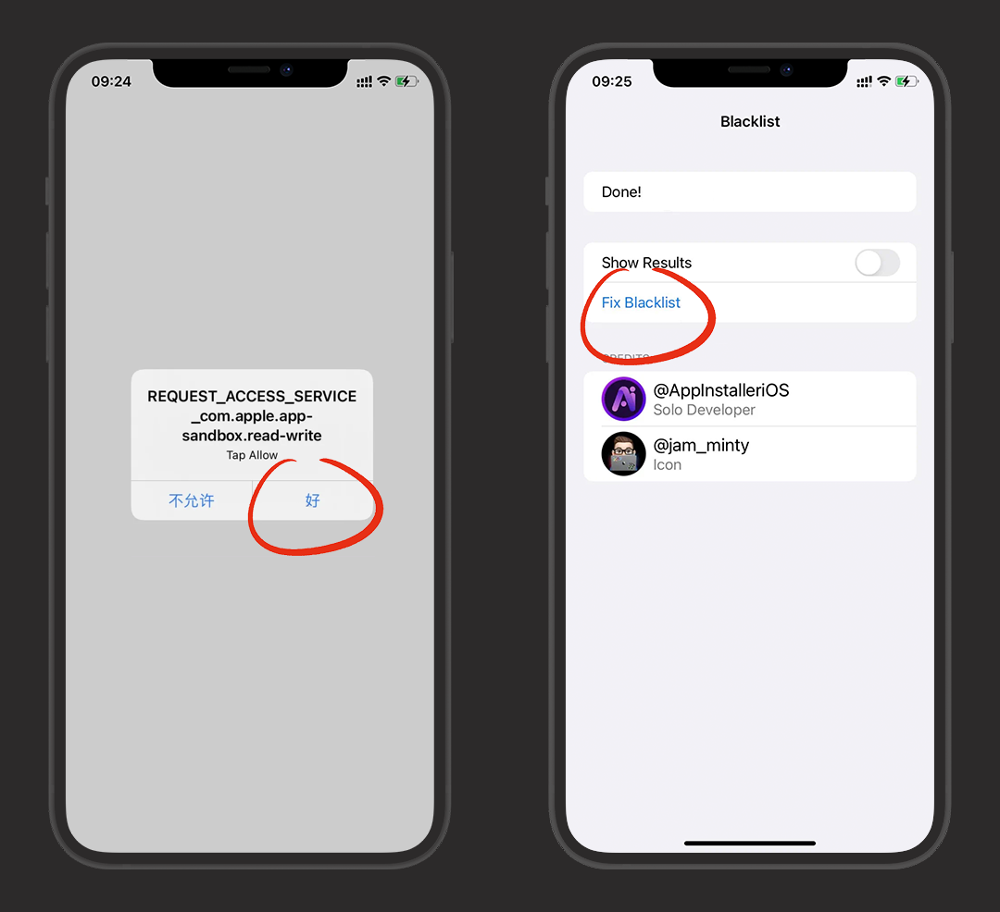

#  利用MacDirtyCow无限自签

::: warning 更新时间
最近更新：2023-3-16

提示：巨魔与越狱用户可以无视！
:::

## 前身

::: tip 说明
MacDirtyCow漏洞，也就是 `CVE-2022-46689` 漏洞
:::

* [Google Project Zero](https://github.com/googleprojectzero) 的 Ian Beer 提交了这个漏洞，它可以使App能够以内核权限执行任意代码

* 大神 [@Zhouwei Zhang](https://twitter.com/Zhouwei) 利用此漏洞发布了项目 [MacDirtyCow Demo](https://github.com/zhuowei/MacDirtyCowDemo)，通过 MacDirtyCow 可以制作一些特殊的应用程序，允许重写沙盒，覆盖文件，且无需越狱

* 2023-1-31 大神 [@XsF1ref](https://twitter.com/XsF1ref) 发推通过使用此漏洞修补 `/user/libexec/istalld` 文件，可以移除Apple ID安装3个限制

* 2023-2-4 [@Zhouwei Zhang](https://twitter.com/Zhouwei) 发布 WDBRemoveThreeAppLimit

## 原理

基本上都是通过交换同等大小文件的方式，覆盖文件实现

::: tip 说明
覆盖的文件体积越大，越占用内存
:::

所以，利用此漏洞本身就一定会出现内存占用情况，手机变卡、小组件无法使用等情况，只能通过重启后释放内存

## 适用范围

::: tip 新工具
SimpleKFD15：支持iOS15.0~15.7.6所有设备

SimpleKFD：iOS16.0~16.5和16.6b1的A12+设备

仓库：https://github.com/Lrdsnow/SimpleKFD
:::

* 支持 `iOS 14.0 - 15.7.1` 及 `iOS 16.0 - 16.1.2` 系统

* 不支持 `iOS 15.7.2` 和 `iOS 16.2 及更高的系统`

* IOS 14系统：不推荐使用

* 巨魔/越狱用户：不推荐使用

## 准备工作

* 安装：[牛蛙助手](../bullfrog/)

* 下载：[WDBRemoveThreeAppLimit：突破3个自签限制](https://github.com/zhuowei/WDBRemoveThreeAppLimit/releases)

* 下载：[Blacklist：一键修复证书失效](https://dzp.lanzouy.com/im6L30sv8moj)

## 破除自签限制

下载WDBRemoveThreeAppLimit：[https://github.com/zhuowei/WDBRemoveThreeAppLimit/releases](https://github.com/zhuowei/WDBRemoveThreeAppLimit/releases)

打开牛蛙助手，右上角+ -> 导入资源

选择刚下载好的 `WDBRemoveThreeAppLimit`，并导入应用库

::: tip 说明
Safari浏览器下载的默认在文件-icloud云盘-下载里
:::

选择 `WDBRemoveThreeAppLimit` 签名

立即签名- 安装

打开 `WDBRemoveThreeAppLimit` ，进入会有个提示，点好

点击 `go`，提示成功后重启一下手机

我们继续用牛蛙自签，可以看到我已经装了5个了

## 修复证书失效

同样的方法我们下载安装 Blacklist：[https://dzp.lanzouy.com/im6L30sv8moj](https://dzp.lanzouy.com/im6L30sv8moj)

::: tip 说明
主要用于修复右图这种，证书过期打不开的情况
:::

进入的提示点好，在点击修复 `Fix Blacklist` 即可

## 其他漏洞软件

::: warning 注意
有些工具功能是相同的，请勿同时启用
:::

### 聚合类

* [Cowabunga：超强工具箱 | @leminlimez](https://github.com/leminlimez/Cowabunga/releases) 丨 [详细使用教程](https://mp.weixin.qq.com/s/Kx7EE_VF0ozdPagUq4PPFA
)

* [Misaka：多功能插件商店 | 在Dekotas源找到NoVuInTools安装实现电量百分比](https://dzp.lanzouy.com/idngX0t8yvle)

### 美化类

* [WDBFontOverwrite：系统更换字体工具 | @ginsudev](https://github.com/ginsudev/WDBFontOverwrite/releases)

* [DockHider：Dock 栏透明背景/隐藏主页条 | @leminlimez](https://github.com/leminlimez/DockHider/releases)

* [FileSwitcherX：Dock栏透明/文件夹背透/系统键盘音等 | @straight-tamago](https://github.com/straight-tamago/FileSwitcherX/releases)

* [FileSwitcherPro：多功能修改器 | @straight-tamago](https://github.com/straight-tamago/FileSwitcherPro)

* [NoHomeBar：隐藏全面屏设备底部的主页条 | @straight-tamago](https://github.com/straight-tamago/NoHomeBar/releases)

* [DockTransparent：一键 Dock 栏透明背景 | @straight-tamago](https://github.com/straight-tamago/DockTransparent/releases)

* [ResSet16：自定义分辨率工具 | @sourcelocation](https://github.com/sourcelocation/ResSet16/releases)

* [TrollLock：更换锁屏锁头  | @haxi0](https://github.com/haxi0/TrollLock-Reborn) 丨 [锁头主题](https://github.com/YangJiiii/trolllock) 丨 [锁头下载](http://www.lockstore.top/)

* [Appabetical：主屏幕图标一键排序 | @Avangelista ](https://github.com/Avangelista/Appabetical/releases)

* [DynamicCow：非iPhone 14实现激活灵动岛功能 IOS16.0-16.1.2| @matteozappia](https://github.com/matteozappia/DynamicCow/releases)

* [StatusMagic：自定义状态/运营商名称 | @Avangelista](https://github.com/Avangelista/StatusMagic/releases)

* [Mise：通知横幅发光效果 需配合Cowabunga或FileSwitcherPro使用 | @roeegh](https://github.com/roeegh/Mise/releases)

### 工具类

* [CCEnabler：自定义控制中心](https://dzp.lanzouy.com/iENu60tb36za)

* [RespringCC：一键注销工具，可添加到控制中心 | @straight-tamago](https://github.com/straight-tamago/RespringCC/releases)

* [NoCameraSound：一键关闭拍照快门声静音拍照 | @straight-tamago](https://github.com/straight-tamago/NoCameraSound/releases)

* [ControlConfig：自定义控制中心工具 | @f1shy-dev](https://github.com/BomberFish/ControlConfig/releases)

* [Whitelist：一键修复企业证书黑名单 | @BomberFish](https://github.com/BomberFish/Whitelist/releases)

* [FilazEscaped16：文件管理器](https://basvtdevelopments.com/filzaescaped)

* [Santander：类似 Filza 的文件管理器 | @Mineek](https://github.com/34306/iPA/releases/tag/Santander_iPA)

* [KillMyOTA：禁OTA升级 | @haxi0](https://github.com/haxi0/KillMyOTA)

* [InstaSpring：一键注销 | @haxi0](https://github.com/haxi0/InstaSpring)

* [VanishBar：隐藏状态栏 | @haxi0](https://github.com/haxi0/VanishBar)
