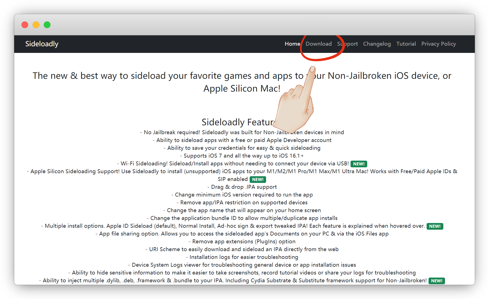
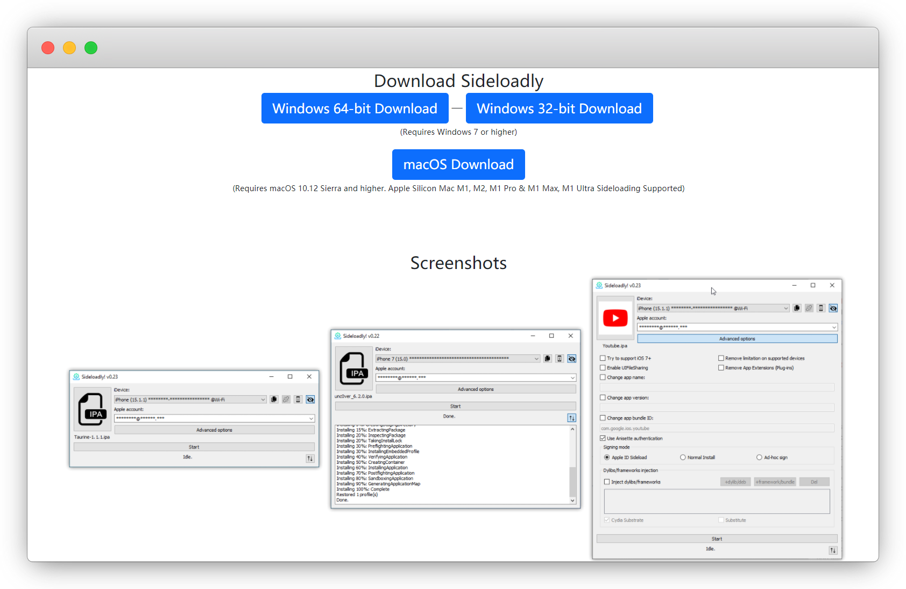
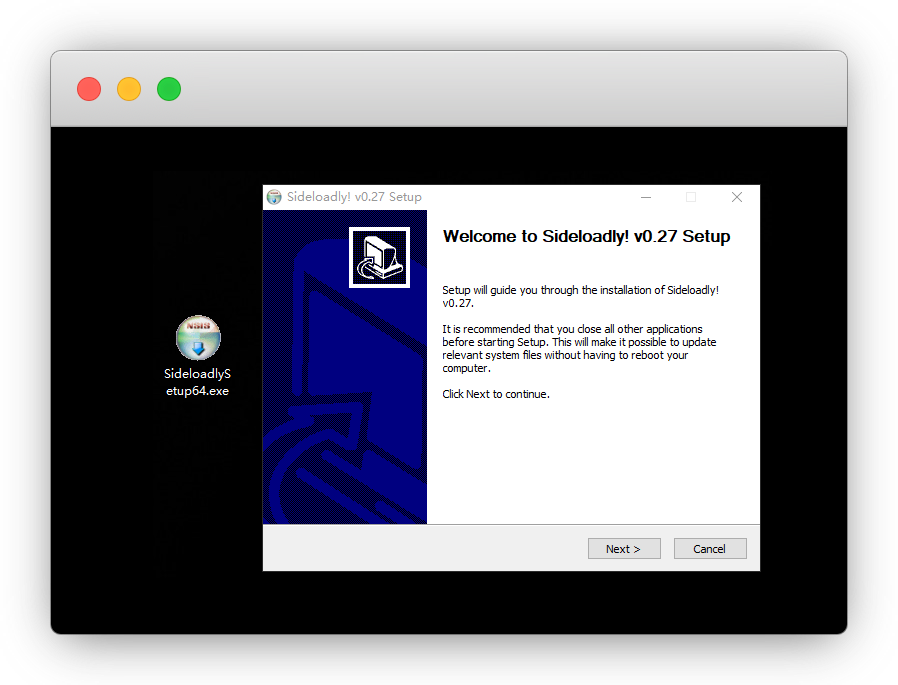
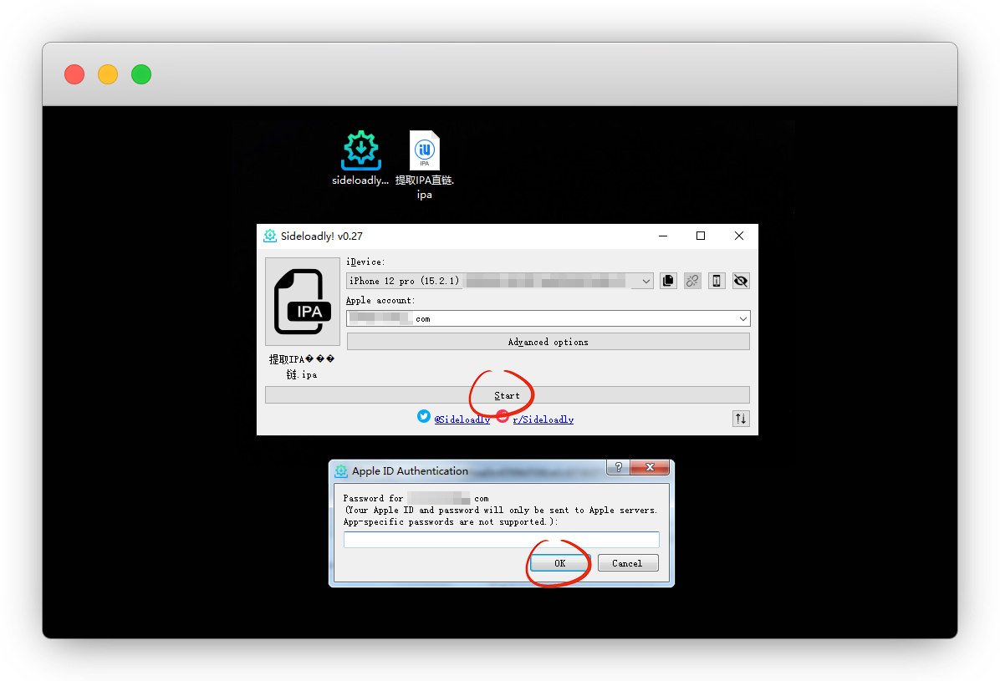

# Sideloadly免越狱自签

::: warning 更新时间
最近更新：2022-9-24

如果你是越狱的机器，可以无视本文！
:::

常见的自签工具还有 [爱思助手](https://www.i4.cn/)、[牛蛙助手](https://www.ios222.com/) 、[AltStore](https://altstore.io/)、[SideStore](https://sidestore.io/)、[Scarlet·猩红](http://usescarlet.com/)

基本上操作都差不多，且都需要电脑，我仅演示下 `Sideloadly` 如何自签

::: tip 关于签名
苹果商店上架应用，除了要花钱外，还得满足审查条件

而某些App无法上架商店的、以及破解的ipa包，可以用证书进行签名安装，供测试使用

证书一般指的是企业证书

* 共享证书 —— 免费丨手机/电脑皆可丨日抛，1天就失效
* 花钱证书 —— 收费丨手机/电脑皆可丨理论1年，失效找售后
* 自签 ———— 免费丨仅限-电脑操作丨7天，失效需重签
:::

## 特性

优点：免越狱且免费，支持 Windows 和 macOS

缺点：需手机连接电脑操作，且一个Apple ID只能签名3个应用

## 1.安装

官网：[https://sideloadly.io/](https://sideloadly.io/)

点击 `Download` ， 这里根据自己电脑系统下载

我的电脑-右键属性-系统类型显示的有 `32` 或者 `64` 位

下载完成后，双击安装，不装C盘就行，安装就不用说了吧

安装完成后，双击打开

## 2.签名安装

我在 [@SmileZXLee](https://github.com/SmileZXLee/IpaDownloadTool) 下了个`ipa下载器`的软件包，用来签名安装演示，其他安装同理

把ipa包拖入，然后看一下界面

手机连接数据线插入电脑，我们输入苹果ID账号后，点 `start` 开始

会要输入苹果ID密码，有开验证的还要输入验证码

::: tip 说明
提示 Login failed 就是登录失败，反复试，我试了20好几次才成功

这是唯一的难点，可以试试挂梯子会不会好点
:::

等到提示 `complete `完成即可，应用已经签名并安装好了

## 3.信任证书

我们打开app，提示需要信任证书

设置-通用-VPN与设备管理-显示自己的苹果ID处-信任

再次打开APP即可使用

::: tip 说明
注：7天后需要重新签哦
:::

最后的最后，了解一下高级选项的功能

## 常见问题

#### 1.设备信息没显示

手机未信任电脑，重新拔插手机信任；实在搞不定用爱思助手连接好了，再打开此软件

#### 2.苹果账号是手机号

在账号前加86，如手机为13300008888，则账号为：`8613300008888`

#### 3.输入密码闪退

可以尝试打开 `Advanced options` 高级选项 - 身份验证 改为远程 `Remote`

#### 4.未收到手机验证码

可以尝试手机 - 设置 - Apple ID - 密码与安全性 - 获取验证码

## 其他签名软件

* [轻松签](https://esign.yyyue.xyz/)

* [喵喵签](https://sign.mmqqq.com/)

* [Gbox](https://gbox.run/)

* [全能签](https://udid.nuosike.cn/sign/)

* [山猪签](https://www.shanzhuqian.com/)

* [超级签名](https://www.signhome.net/)「更名为签名之家」

## 特别鸣谢

* [Sideloadly](https://sideloadly.io/)

* [爱思助手](https://www.i4.cn/)

* [牛蛙助手](https://www.ios222.com/)

* [AltStore](https://altstore.io/)

