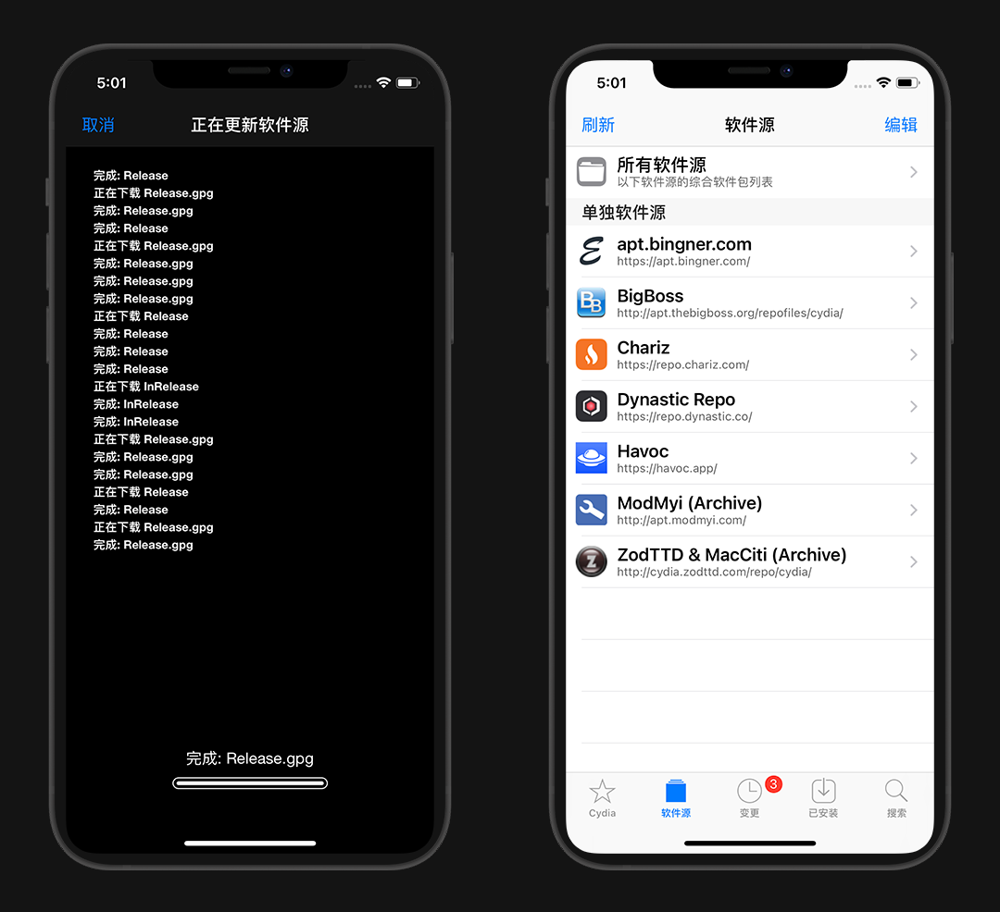

# 巨魔助手TrollStore永久免签

::: warning 更新时间
最近更新：2022-11-9

实际作用只是免签，不能代替越狱其他功能！
:::

苹果想安装App Store以外的应用，还需要一个能给IPA包签名的证书，而证书需要付费

巨魔助手正是利用了漏洞，达到了永久免签

## 前因

* [@Linus Henze](https://twitter.com/LinusHenze) 向苹果官方递交了漏洞 `CVE-2022-26766` / `CVE-2022-26763`

* 2022/7/2 大神 [@Zhouwei Zhang](https://twitter.com/Zhouwei) 公开了利用此漏洞绕过签名的方法

* 2022/9/3 大神 [@opa334](https://twitter.com/opa334dev) 利用此漏洞开发了 `TrollStore` ，手机端永久签名工具

* 2022/10/6 [@Linus Henze](https://twitter.com/LinusHenze) 在OBTS会议上公开了 `Fugu15` 的全新越狱方式，[@opa334](https://twitter.com/opa334dev) 也通过他的帮助发布了全新的`TrollStore`工具

::: tip 说明
目前 IOS 15.5 以上系统已经修复，未更新的谨慎
:::

## 适用范围

根据 [opa334的文档](https://github.com/opa334/TrollStore/) 表格查看是否符合，或者参照我的手机型号说明，不符合就默哀

::: tip 说明
系统已关闭验证，无法降级，除非很早前有SHSH备份
:::

| 手机/系统| iPhone 6-8/SE/X(A8-A11) | iPhone 11-14/XR/XS/SE 2-3(A12-A15) |
| :-: | :-: | :-: |
| 14.0-14.8.1 | checkra1n越狱 | :heart:`troll arm64e` |
| 15.0-15.4.1 | :green_heart:`troll IOS 15+` | :green_heart:`troll IOS 15+` |
| 15.5beta1-4 | :green_heart:`troll IOS 15+` | :green_heart:`troll IOS 15+` |
| 15.5 RC/15.5 | ✘ | ✘ |
| 15.6beta1-5 | SSH Ramdisk | :heart:`troll arm64e` |

注：

* `checkra1n越狱` 的是需要越狱后安装；

* `SSH Ramdisk` 使用教程：[https://youtu.be/B0MueVvJSK4](https://youtu.be/B0MueVvJSK4)

* :green_heart: troll IOS 15+：使用: [https://api.jailbreaks.app/troll](https://api.jailbreaks.app/troll)

* :heart: troll64e：使用：[https://api.jailbreaks.app/troll64e](https://api.jailbreaks.app/troll64e)

## 1.巨魔安装

请根据上面的表格，对照选择相应的安装方式

安装的是 `GTA Car Tracker` ，打开点安装 `Install Trollstore`，自动注销后，回到桌面就发现装完成了

:::: details 点击查看 已越狱安装

::: tip 建议
不太建议越狱用户安装，没有实际意义

越狱后可以通过其他插件免签，完全不需要巨魔
:::

打开Cydia-软件源-右上角编辑-左上角添加，输入源地址：https://havoc.app

等安装完成即可，现在就有Havoc的源了

搜索 `Trollstore Helper` 然后右上角-更改-安装

回到桌面打开 `Trollstore Helper` ，点 `Install TrollStore` 安装，却报错

::: tip 说明
这是没有网络权限
:::

回到 `Cydia` 搜索 `NetWorkMange`，安装

手机-设置-拉到底找到 `NetWorkMange` - 系统应用 - 打开 `Trollstore` 的开关

再次回到 `Trollstore Helper` 安装即可，桌面已经有应用了

::::

## 2.巨魔使用

打开桌面蓝色的 `TrollStore` 工具，看一下Seeting 设置界面

点开 `settings 选项`，安装 `Install ldid` ，安装完成变成灰色

准备要安装的IPA包，我这里用 `IPA下载器` 演示

仓库：[https://github.com/SmileZXLee/IpaDownloadTool](https://github.com/SmileZXLee/IpaDownloadTool)

打开文件-分享-选择Trollstore导入，即可安装完成

::: tip 说明
文件建议放到 `我的iPhone中` ，如果放到 iCloud 上导入可能会有奇奇怪怪的问题

由于苹果不能直接打开ipa，我弄成zip压缩包再解压出来
:::

现在签名安装的应用就不用担心证书过期的问题了

::: tip 注意
重启可能会导致安装的APP失效，请参照 [如何避免TrollStore掉签](#_2-如何避免trollstore掉签)
:::

## 3.巨魔必备软件

::: warning 注意
一些软件使用了蓝奏云上传，导致下载的不是IPA包，而是直接被安装

为避免这种情况，请优先安装 [IpaDownloadTool：IPA下载器](https://github.com/SmileZXLee/IpaDownloadTool/)

然后在 `IpaDownloadTool ` 内，复制蓝奏云上传链接下载IPA
:::
 
### 聚合类

* [CyPwnStore：破解应用商店](https://ipa.cypwn.xyz/) | @Coolstars 丨[APP下载](https://dzp.lanzouy.com/izOOY0snuruj)

* [Decrypt：在线砸壳商店](https://decrypt.day/)

* [IPA图书馆](https://zappfree.com/ipa-library/)

* [IPA商店](https://ipa.store/game)

* [凸游CLUB](https://toyou.club/)

### 工具类

* [轻松签+：永久签+修改bundleID | @esign](https://esign.yyyue.xyz/)

* [PostBox：插件下载工具，国区上架PostBox Pocket | @PostBoxTeam](https://www.postbox.news/downloads)

* [Apps Manager：用于备份还原 丨@TIGI Software](https://www.tigisoftware.com/default/?p=435) 丨 [@巨魔e族破解版v1.7](https://dzp.lanzouy.com/iuGk10snplud)

* [Filza：文件管理器 丨@TIGI Software](https://www.tigisoftware.com/default/?p=439) 丨 [破解教程](../Filza/)

* [AppStore++：App随意升降级 丨 @CokePokes](https://github.com/CokePokes/AppStorePlus-TrollStore/releases) 丨 [越狱源](https://cokepokes.github.io/)

* [DowngradeApp：无广告 App随意升降级 | @Netskao](https://share.initnil.com/With_TorllStore/DowngradeApp)

* [NetWorkManager：网络状态管理工具 | @Netskao](https://share.initnil.com/With_TorllStore/NetWorkManager)

* [RingTonesManager：铃声管理器 | @Netskao](https://share.initnil.com/With_TorllStore/RingTonesManager)

* [IpaDownloadTool：IPA下载器 | @SmileZXLee](https://github.com/SmileZXLee/IpaDownloadTool/)

* [LocSim：虚拟定位破解版 | @Mika](https://dzp.lanzouk.com/ipwm50xx8a8d)

* [电话助手：T9拨号 来电归属 | @xybp888](https://www.htv123.com/down/CallAssist_TrollStore.ipa)

* [AirTroller：强制隔空投送ipa 丨@sourcelocation](https://github.com/sourcelocation/AirTroller/releases)

* [DebToIPA：deb文件转IPA | @sourcelocation](https://github.com/sourcelocation/DebToIPA/releases)

---

* [Jaility：开启/解除监督状态/角标/锁屏密码空白 | @haxi0](https://github.com/haxi0/Jaility/releases)

* [Supervise：开启/解除监督状态](https://dzp.lanzouy.com/iVxW00srtzid)

* [NiceBattery：电池助手,查看电池详细数据的工具 | @NiceiOS](https://www.niceios.com/download.php)

* [CocoaTop：进程查看工具 | @Domo](https://dzp.lanzouy.com/iQnFK0srqz4b)

* [H5GG：游戏修改器工具，仅限IOS 15.0-15.1.1 | @H5GG](https://github.com/H5GG/H5GG)

* [iM 修改器：数据修改器](https://dzp.lanzouy.com/i8SeY0srrn0b)

* [Legizmo：低版系统配对高版本watchOS 系统 | @lunotecth11](https://dzp.lanzouy.com/iPyV50srs6ej)

* [TrollNonce：固定G值 | @opa334](https://github.com/opa334/TrollNonce/releases)

* [u0Launcher：修复了unc0ver越狱过程的错误 | @opa334](https://github.com/opa334/u0Launcher/releases)

* [mobileTSS：保存/下载 SHSH2 | @lucaIz-ldx](https://github.com/lucaIz-ldx/MobileTSS/releases)

* [TSSSaver：SHSH2备份工具](https://dzp.lanzouy.com/ibUOT0srubcj) | [在线SHSH备份](https://tsssaver.1conan.com/v2/)

### 美化类

* [TrollSpeed：实时网速浮窗工具](https://dzp.lanzouy.com/iTwKG0ta078f)

* [SecondHand：状态栏显示实时秒数 | @leminlimez](https://github.com/leminlimez/SecondHand/releases)

* [BatteryInfo：查看电池健康状态 | @xybp888](https://dzp.lanzouy.com/iByhE0snrq1g)

* [Mugunghwa木槿花：真主题/角标/全面屏手势 | @s8ngyu](https://github.com/s8ngyu/Mugunghwa/releases)

* [red-dot：自定义角标颜色 | @s8ngyu](https://github.com/s8ngyu/red-dot/releases)

* [TrollTools：真假主题/角标/全屏手势/锁屏图案等 丨 @sourcelocation](https://github.com/sourcelocation/TrollTools/releases)

* [BlizzardBoard：主题美化 但书签形式 | @BenjaminHornbeck6](https://github.com/BenjaminHornbeck6/BlizzardBoard)

* [WallpaperSetter：自定义浅色/深色模式的墙纸](https://dzp.lanzouy.com/i8zWt0srunwb)

* [ResolutionSetter：修改分辨率的工具 | @Halo-Michael](https://github.com/Halo-Michael/Resolution-Setter-app/releases)丨 [苹果官网分辨率查看](https://www.apple.com.cn/iphone/compare/)

* [ResolutionSetterSwift：修改分辨率的工具、内置参考分辨率 | @haoict](https://github.com/haoict/haoict.github.io/tree/master/cydia/ipa/ResolutionSetterSwift)

### 其他

* [Price Tag：App 价格监控的工具，查看每日限免](https://dzp.lanzouy.com/iQb5p0srt5je)

* [Zebra：软件包管理器；未越狱仅可查看 | @zbrateam](https://github.com/zbrateam/Zebra/releases)

* [Sileo：软件包管理器；未越狱仅可查看 | @Sileo](https://github.com/Sileo/Sileo/releases)

* [Saily：软件包管理器 | @SailyTeam](https://github.com/SailyTeam/Saily/releases)

* [OldOS：模拟 iOS 4 系统 | @zzanehip](https://github.com/zzanehip/The-OldOS-Project/releases)

* [uYou+：去除广告/下载视频/音频 | @qnblackcat](https://github.com/qnblackcat/uYouPlus/releases)

* [WiFiList：WiFi 密码查看器](https://dzp.lanzouy.com/imtkY0srvi0f)

* [WiFiScanner：WiFi 扫描工具](https://dzp.lanzouy.com/ijVas0srvn2h)

### TG资源群

之前流行的Alist网盘始终有限制，推荐几个不错的TG群

::: tip 说明
[不会使用TG的点我](../../telegram/tg/)
:::

* [巨魔商店](https://t.me/IOS_TrollStore)

* [拜登科技](https://t.me/dengbai)

* [Alist资源频道](https://t.me/alistshare)

* [秋名山一路向北](https://t.me/ae86_ios)

## 常见问题

#### 1.安装失败，不显示图标

打开 TrollStore - Settings - 点击 `Rebuild Icon Cache` ，等待重启，未重启的话，点击 `Respring` 即可

#### 2.如何避免TrollStore掉签

可以利用 `TrollStore` 重新安装 `TrollHelper`，以免打开不开了重新装

* 未越狱：打开`Helper Install As Standalone APP`，选择你要注入自带应用，选择Tips提醒或者其他，只要你重启，打开提醒App就能激活

* 已越狱：不存在掉签

#### 3.如何单独删除已安装应用

打开 `TrollStore` 应用，在Apps页面中，选中你要删除应用，左滑，点击删除

#### 4.卸载TrollStore

打开 `TrollStore` - Settings - 点击 Uninstall TrollStore ，等待重启即可

## 特别鸣谢

* [@opa334](https://github.com/opa334/TrollStore) 「TrollStore」

* [@SmileZXLee](https://github.com/SmileZXLee/IpaDownloadTool) 「IPA下载器」

