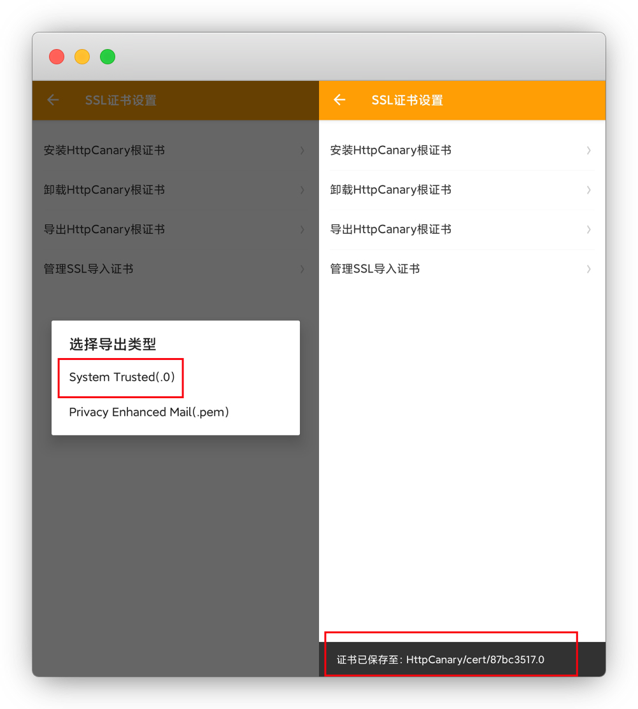

# 手机抓包工具安装及使用

::: warning 更新时间
最近更新：2021-10-13
:::

电脑抓包用 `Fiddler`，百度自己搜，本文只讲手机端

由于工具繁多，只列举2个好用的APP，其他使用方法相差不大

## 抓包工具

### IOS端

* Thor (俗称锤子，已跑路)

* HTTP Catcher （俗称网球，已跑路）

* [Stream](#ios端-stream)（免费）

### 安卓端

* Packet Capture（已凉）

* [HttpCanary](#安卓端-httpcanary)（俗称小黄鸟/小蓝鸟）

## 安装

### IOS端：Stream

APP Store下载：[https://apps.apple.com/cn/app/stream/id1312141691](https://apps.apple.com/cn/app/stream/id1312141691)

下载安装后打开，但要先安装好证书后，才能正常使用

点击 **开始抓包-允许-去安装证书**

**安装CA证书**，跳转到浏览器后，点允许

提示描述文件下载完成，**设置-通用-描述文件与设备管理**

找到这个Stream描述文件，安装

安装好就是 `已验证√` 了

然后就是**信任证书**，**设置-通用-关于本机-证书信任设置**，把开关打开

返回APP看，这样就安装完成了，记得把抓包关了先

### 安卓端：HttpCanary

::: warning 注意
由于安卓11以后系统不再信任以外的证书，导致证书无法安装，https抓包时目标APP无网络，需要借助MT管理器手动导入安装证书
:::

下载 `HttpCanary_v3.8.1` 高级解锁版：[https://dzp.lanzouy.com/i0uhfkd2nle](https://dzp.lanzouy.com/i0uhfkd2nle)

#### 硬性条件

::: tip 说明
缺一不可，达不到的无视以下教程
:::

* 手机root (小米系统切换为开发版)

* 解锁system分区 

* [MT管理器](https://www.coolapk.com/game/21048/) (手机需root并解锁分区，否则挂载失败)

#### 导出证书

安装好后打开，左上角三横-设置

**SSL证书设置-导出HttpCanary根证书**

::: tip 说明
这里为什么不点安装呢，因为就是装不了，才不能按正常的步骤
:::

类型选第一个 `System Trusted(.0)`  导出成功会提示下载到了相应的目录

::: tip 说明
默认目录：/HttpcCanary/cert/
:::

#### 解锁分区

先解锁一下分区，我自己是小米，用的Syslock

::: tip 说明
其他手机请自测，一般刷面具root完成后就解锁分区了，如MT管理器无法移动文件就过来解锁
:::

下载Syslock：[https://dzp.lanzouy.com/ioB9Npn6xtg](https://dzp.lanzouy.com/ioB9Npn6xtg)

下载后，打开按钮

重启后，再次打开Syslock，开启即可完成

#### MT管理器

下载MT管理器：[https://www.coolapk.com/game/21048/](https://www.coolapk.com/game/21048/)

安装完成后打开，简单说一下，这里分别显示的是根目录和SD卡目录

::: tip 说明
知道是目录就好了，那就开始操作
:::

点进MT管理器 **右栏** 根目录的文件夹 `date/date`，然后搜索黄鸟的应用包名 `com.guoshi.httpcanary`

::: tip 说明
找到一个就可以点停止搜索了
:::

点击搜索到的结果，再点绿色的包进去

再点 `cache` 文件夹进去

点底部的同步按钮，这样两边栏就都一致了，选择 `HttpCanary.pem`，复制

复制时，把文件名改成 `HttpCanary.jks`，确定

::: tip 说明
到这里我们的CA证书就弄好了，但是根证书还需要装到手机系统里才行
:::

点击 **左边** 栏空白处，再点左上角 **三横-内部存储-HttpCanary**

再点 `cert` 文件夹进去，找到我们之前**导出的根证书**

点击 **右边** 栏空白处，再点左上角 **三横-根目录**

分别进入 `etc/security/cacerts` 文件夹，这里面就都是系统的证书了

我们选择证书长按复制到根目录即可

到这里，证书就全部安装完成了

::: tip 说明
可以到卸载更证书里看到，系统的证书里已经有黄鸟了
:::

## 使用

我们要抓某个APP的数据，先点击开始抓包，然后再进APP操作，抓到后点停止

为方便演示，以下以 `滴滴果园` 和 `京东CK` 为例

::: tip 说明
请看清楚先后步骤
:::

### IOS抓包演示

---

#### 抓滴滴果园

进入滴滴APP主界面，找到免费领水果，**但先不要进去**

然后打开Stream，点击**开始抓包**，切到滴滴APP，点**免费种水果**

::: tip 说明
先点开抓包，再进APP操作，这样才能精准的抓到数据
:::

直到完成进入滴滴果园，点击**停止抓包**

进入抓包历史查看，刚刚抓到的数据

接下来就是筛选数据，右上角放大镜，域名下选择 `game.xiaojikeji.com`

现在就4条记录了，选POST包进去，请求拉倒底 `查看JSON`

这里的`token`值就是我们要的数据

#### 抓京东CK

打开浏览器，输入网址：[https://m.jd.com/](https://m.jd.com/)

::: tip 多账号步骤
浏览器开无痕模式-登账号-抓CK1-叉掉网页-关无痕-退出浏览器...(多账号循环)
:::

打开Stream，开启抓包-返回京东页面刷新一下

停止抓包，然后在抓包历史里找数据

点放大镜，筛选要找的包，就剩这一个

::: tip 说明
方法：GET

域名：api.m.jd.com
:::

进去后点请求，下拉到最下面，找到 `pt_key=***;pt_pin=***;` 就我我们要的数据

::: warning 注意
这里的分号不能漏，且不能有空格符
:::

还可以利用 [Alook浏览器](https://apps.apple.com/cn/app/alook/id1261944766) - 工具箱 - 开发者工具 - cookies ，一键提取

如果觉得筛选数据麻烦，可以用 [点我☛快捷指令提取](https://www.icloud.com/shortcuts/f47146c2831a4e8e8bb7f06daac1b858)

### 安卓抓包演示

---

#### 抓滴滴果园

进入滴滴APP主界面，找到免费领水果，**但先不要进去**

然后打开黄鸟，点击蓝色的飞机开始抓包，切到滴滴APP，点**免费种水果**

::: tip 说明
先点开抓包，再进APP操作，这样才能精准的抓到数据
:::

直到完成进入滴滴果园，点击绿色的飞机停止抓包

右上角放大镜 - 服务器Host

勾选 `game.xiaojukeji.com` ，就剩4个了，点POST包进去

请求里的 `toekn`值就是我们需要的数据

### 抓京东CK

直接上工具 JD任务小辅：[https://mp.weixin.qq.com/s/iAuW6if4o_P9wfR1h2pfeg](https://mp.weixin.qq.com/s/iAuW6if4o_P9wfR1h2pfeg)

安装登录APP-右上角-设置-导出登录信息，粘贴到任意聊天界面，提取pt信息

::: tip 说明
我们只需要 `pt_key=***;pt_pin=***;`
:::

