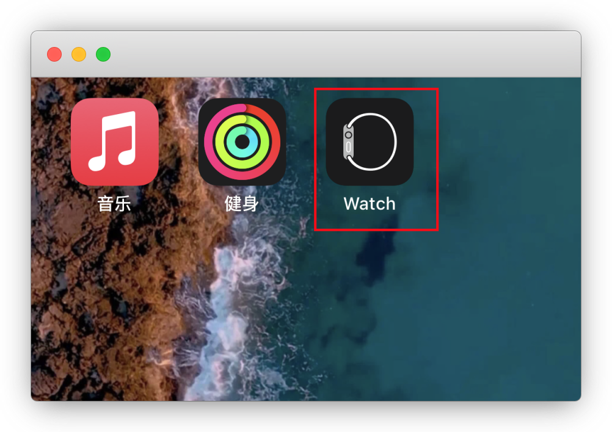
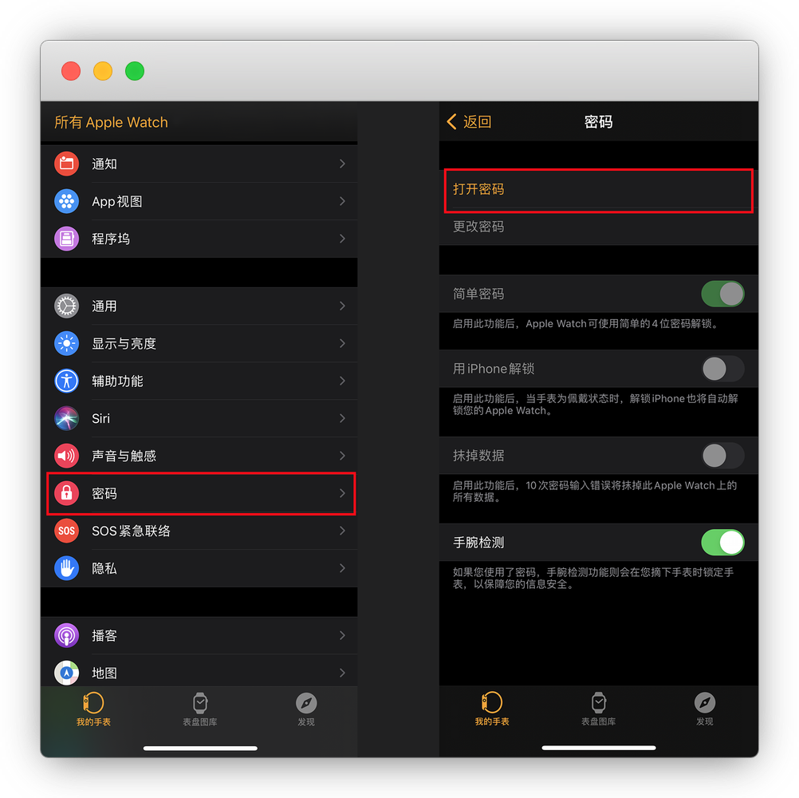
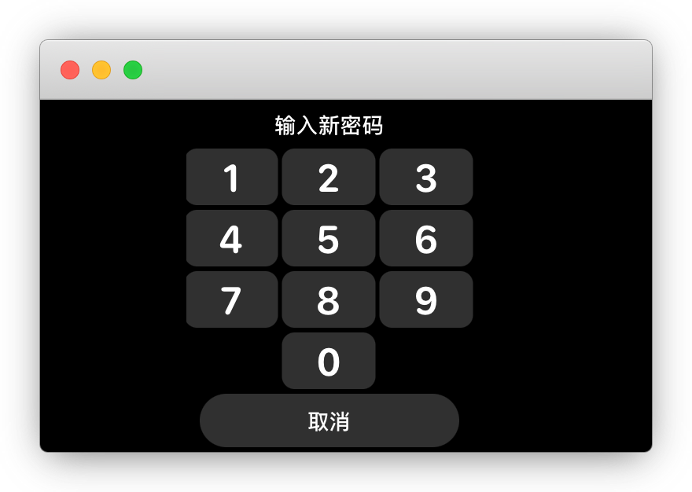
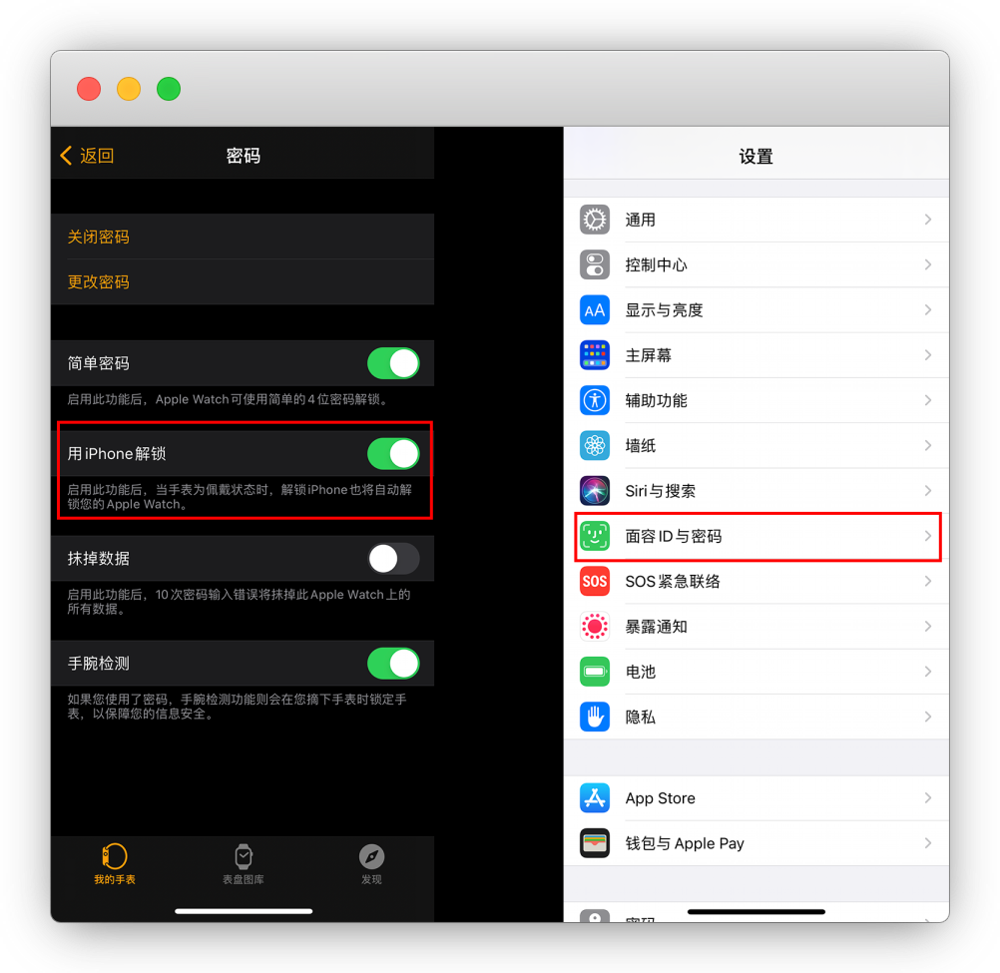
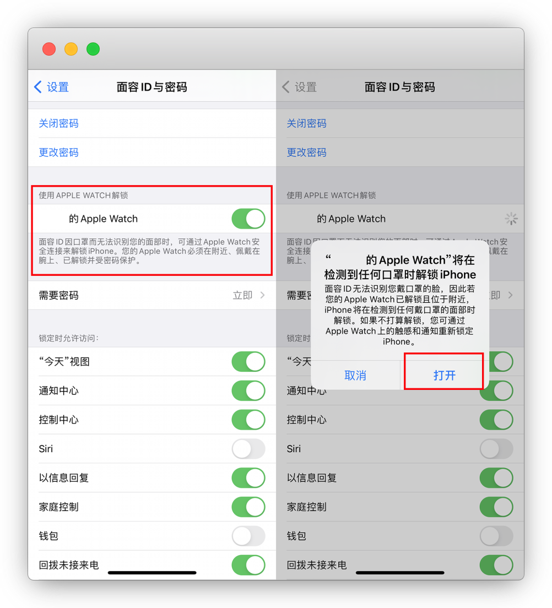
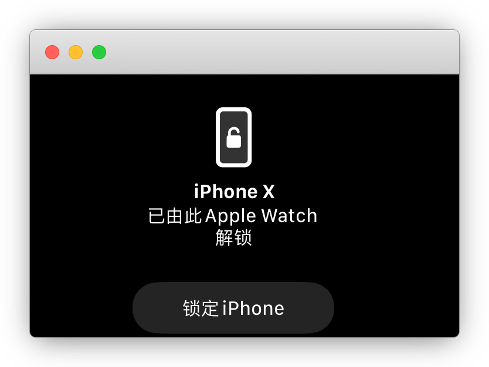

# 戴口罩解锁iPhone面容ID

::: warning 更新时间
最近更新：2021-9-16
:::

因为戴口罩遮挡了脸部，导致Face ID无法识别完整，解锁失败

硬性要求：**需要购买Apple watch**

::: tip 说明
原系统为IOS15是不支持的

现IOS16已支持，无需apple watch
:::

## 1.设置Wacth密码

手机打开Watch

密码-打开密码

这时候，Watch表盘上会有提示设置密码，用于解锁Watch

## 2.开启面容ID解锁

手机Watch里开启 `用iPhone解锁` 开关，设置-面容ID与密码，开启apple watch 解锁

打开 Apple Watch 的按钮开关

现在就可以戴口罩解锁了,更多好玩的Apple Watch功能，自己摸索吧

::: tip 说明
如果不行，重新开关Apple Watch开关即可
:::

