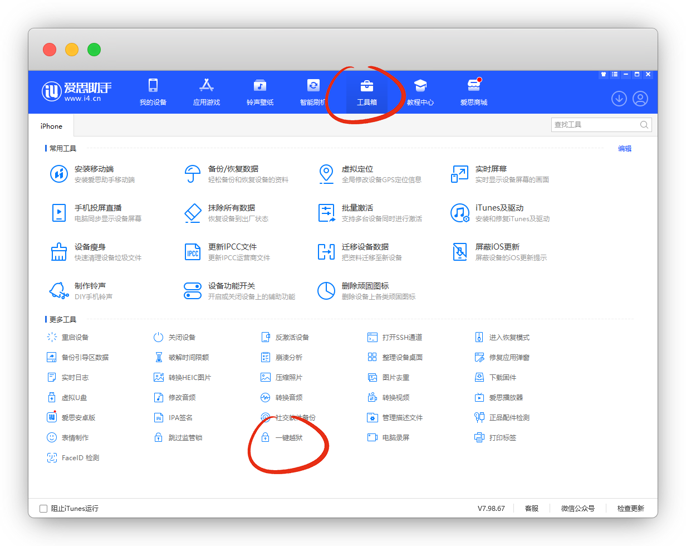
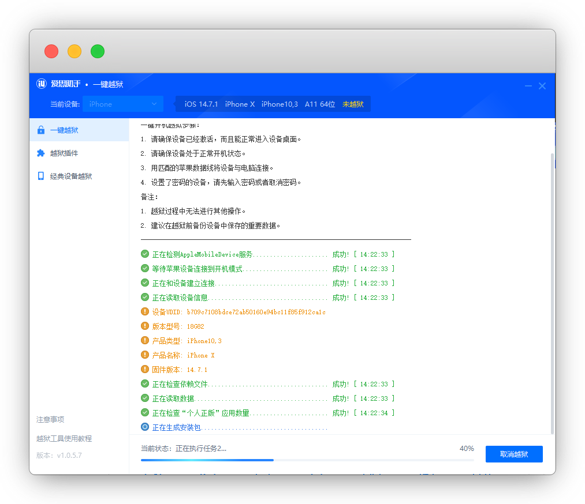
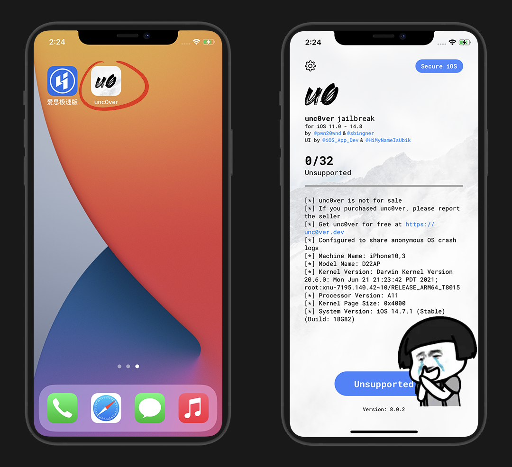
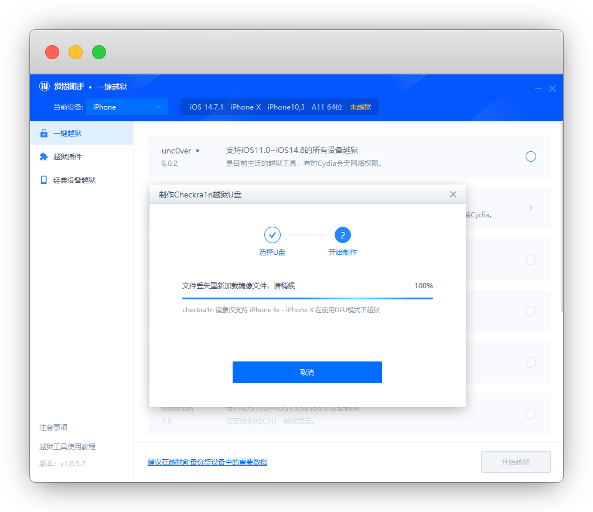
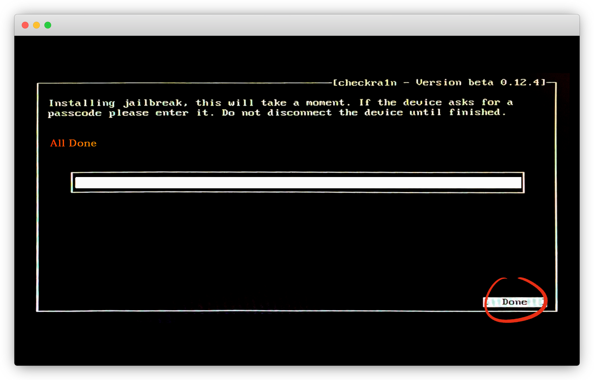
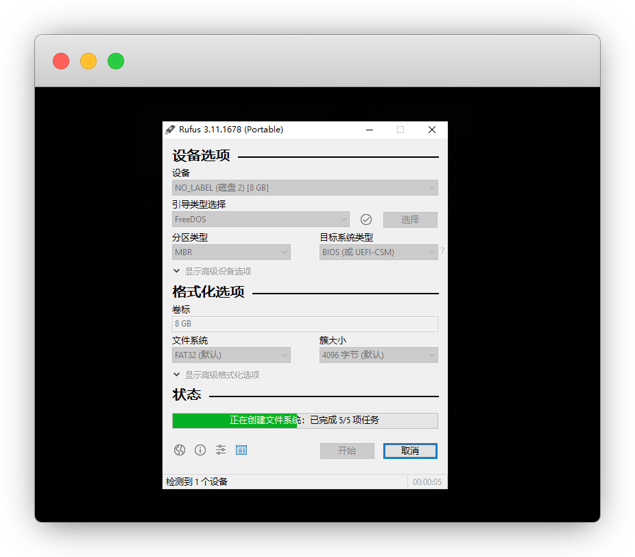

# 苹果iPhone手机越狱教程

::: warning 更新时间
最近更新：2022-11-8

如果你是IOS15以上的系统，请查看 [IOS 15越狱工具Dopamine](../Dopamine/)
:::


## 常见越狱工具

* [opa334：Dopamine](../Dopamine/) 「`A12-15 iOS 15.0-15.4.1`」

* [国人朱心浪：XinaA15](../Dopamine/#xinaa15) 「`A12-15 iOS 15.0-15.1.1`」

* [unc0ver](https://unc0ver.dev/) 「`A12-13 iOS 14.6-14.8` 丨 `A9-A14 IOS 11.0-14.3`」

* [Palera1n](https://palera.in/) 「`A9-A11 iOS 15.0-16.4.1`」

* [checkra1n](https://checkra.in/) 「`A7-A11 iOS 12.0-15.4.1`」

* [Taurine](https://taurine.app/) 「`A9-A14 iOS 14.0-14.3`」

* [odyssey](https://theodyssey.dev/)「`A9-A13 iOS 13.0-13.7`」

* [Chimera](https://chimera.coolstar.org/) 「`A7-A12 iOS 12.0-12.5.7`」

* [Electra](https://coolstar.org/electra/)「`A9-A11 iOS 11.0 – 11.4.1`」


::: details 点击查看苹果机型芯片对照表

| 芯片| 手机 |
| :-: | :-: |
| A9 | iPhone 6s系列 / SE |
| A10 | iPhone 7系列 |
| A11 | iPhone 8系列 / X |
| A12 | iPhone XS系列 / XR |
| A13 | iPhone 11系列 / SE 2 |
| A14 | iPhone 12系列 |
| A15 | iPhone 13系列 / 14系列 / SE 3 |
:::


## 演示

如果刚上手不太懂得使用，直接 [爱思助手](https://www.i4.cn/) 简单且好用

* iPhone X(A11) 

* IOS系统：14.7.1

* 已备份 (避免出现白苹果之类的意外)

* 无OTA文件 (设置-通用-iPhone储存空间如有，删除更新)


## 1.安装爱思助手


进官网下载并安装爱思助手

官网：[https://www.i4.cn/](https://www.i4.cn/)


安装完成后，连接手机，手机端点一下 `信任` ，就进入了爱思界面，请先右上角注册并登录账号，否则无法使用越狱功能

::: tip 说明
都是手机的信息，查验手机也会用到它
:::


点工具箱，一键越狱，等下载安装完成




打开后会自动识别可用的越狱工具

::: tip 说明
如果你这里没有可用的工具，排出数据线没插好外，默哀，你的手机越狱不了
:::


## 2.开始越狱


我这里是 `unc0ver` 和 `checkra1n`，二选一即可

* unc0ver可能会出现Cydia无网情况

* checkra1n稳定，但需要额外准备一个U盘，做启动盘

* 注：IOS 9 以后都没有完美越狱了，重启手机后恢复未越狱状态


### 2.1 unc0ver越狱


勾选 `unc0ver` ，点击开始越狱，自动下载安装




回到手机，设置-通用-设备管理，安装信任证书


打开 `unc0ver` ，却提示 `Unsupported`，竟然不支持，我哭

::: tip 说明
不支持就是无解了，不要再尝试了，换工具吧
:::




虽然我的手机不可以，我去截个图来继续演示


打开 `unc0ver` ，点左上角 齿轮 ，进入设置，只开 `Load Tweaks`即可，右上角 Done 退出


返回后 点击 `jailbraek` 开始越狱，等完成后，点击好，手机自动重启

::: tip 说明
接下来直接看 [第3节Cydia的使用](#_3-cyida的使用)
:::


### 2.2 checkra1n越狱


选择 `checkra1n`，弹出提示要U盘了

::: warning 注意
操作会清空U盘数据，自行备份好数据！！！
:::


我插入准备好的U盘，识别后，开始制作





接下来重启电脑，进入BIOS模式并选择以U盘启动

我的微星主板是按 `F11` 快速选择，[其他品牌制作PE启动盘时的介绍](../../daily/wepe/#_3-bios设置u盘启动)

::: warning 说明
如果U盘有一个EFUI模式，硬件支持的话选，速度快点；不支持就选常规U盘
:::


在Welcome to checkn1x 界面按组合键 `Alt+F2` 进入 Checkra1n


电脑用USB链接手机，手机弹窗点`信任`，然后再电脑端用方向键选择 `options` 回车

::: tip 说明
无反应，再次拔插数据线即可
:::


除了 Safe Mode 不选择，其他都选，返回

::: danger 注意
先选1后，返回！再选345，不然有几率卡死
:::


这时候 `start`就亮了，方向键选择 `Start` 后按回车，下一步

::: tip 说明
如果还没有亮，再次拔插数据线就可以了
:::


手机自动进入DFU模式，每个人手机不同，请看下电脑界面提示按键，然后 `Start` 开始操作

::: tip 说明
我的是先长按电源键+音量下键4秒

再松开电源键，保持按住音量下键10秒
:::


越狱完成后，Checkra1n 会提示 `All Done` 

::: tip 说明
如果越狱失败，请再尝试一次
:::




桌面会有 `checkra1n` 图标生成，打开 checkra1n，点击 Cydia 并安装 `Install Cydia`

::: tip 说明
如果不显示或者提示 `timed out` ，挂个梯子就好了
:::


## 3. Cyida的使用


进入Cyida-更新必要软件包-确定-即可进入主页


界面简介，常用的就是 `软件源` 和 `搜索`，用Trollstore演示一下

软件源-右上角编辑-左上角添加，输入源地址：[https://havoc.app](https://havoc.app)


等安装完成即可，现在就有Havoc的源了


搜索 `Trollstore Helper` 然后右上角-更改-安装就完成了


## 4. U盘恢复工具

[点我下载：rufus-3.11p.zip](https://d-image.i4.cn/i4web/image/news/2020-07-16/fileTypeImages_1594880598242082789.zip)丨 [备用：蓝奏云](https://dzp.lanzouy.com/iW1tG0cm7wcb)


下载工具下载到桌面，打开运行


插入U盘，会自动识别设备，在 引导类型选择 下选择 `FreeDOS`


点击开始，直到完成，U盘恢复正常模式




## 越狱插件


由于插件源众多，不一一赘述，更多源请参考 `@艾橙互动` 公众号的整理

[插件目录大全](https://mp.weixin.qq.com/s/ploLK0P8KakFgicxZYC1UQ) 丨 [整理的各类源](https://mp.weixin.qq.com/s/lSE0PSKA4PT09ChOrEwRRw)


### 1.deb插件下载


::: tip 说明
我们常见的 `dylib插件` 也就是deb解压出来的
:::

* [PC端：cydownload](https://github.com/borishonman/cydownload/releases)

* [手机端：PostBox](https://itunes.apple.com/app/id1644577838)「国区下架，美区下载即可」

* [手机端：Saily](https://github.com/SailyTeam/Saily/releases)

* [手机端：Sileo](https://github.com/Sileo/Sileo/releases)

* [越狱机：CyDown](https://julio.hackyouriphone.org/)

* [网页端：Repo Updates](https://www.ios-repo-updates.com/)


### 2.自带源

::: tip 说明
默认源，无需额外添加，避免误删的对照
:::

* Binger源：`https://apt.binger.com/`

* BigBoss源：`https://apt.thebigboss.org/repofiles/Cydia/`

* Chariz源：`https://repo.chariz.com/`

* Dynastic Repo源：`https://repo.dynastic.co/`

* ModMyi(Archive)源：`https://apt.modmyi.com/`

* ZodTTD&MacCiti(Archive)源：`https://cydia.zodttd.com/repo/cydia`


::: details 默认源好用插件
```md
### BigBoss源

* PreferenceLoader：越狱插件运行的依赖文件

* AppList：查看已经安装的 App 列表

* RocketBootstrap：允许在 App 运行时加载插件

* Apple File Conduit "2"：手机连接电脑，爱思助手可以访问导入或导出文件

* 连个锤子：修复无法联网问题

### Chariz源

* Atria：自定义桌面布局

* Cylinder Reborn：炫酷翻页特效

* LastLook：款熄屏显示插件，收费！

* NewTerm 2：终端工具

```
:::


### 3.常用源

::: details Netskao哥哥源
```md
源地址：https://repo.initnil.com

DumpDecrypter：砸壳解密工具

NetWorkManager：联网权限管理

injectipa：dylib插件注入

微信净化/抖音净化等等

IPA下载：https://share.initnil.com/With_TorllStore

QQ及微信砸壳包：https://github.com/Netskao/iOS-DumpDecrypted-IPAs

公众号Netskao：https://mp.weixin.qq.com/s/ieLeWpUNjbDL9JGKYhJcmA
```
:::


::: details 老牌猫源
```md
源地址：https://apt.25mao.com/

插件：微信插件：密友/斗图助手/游戏扫码登录

TG群：https://t.me/lanmaoios
```
:::


::: details APP库
```md
源地址：http://ak.wxqqurl.cn/appstore

IPA盘：https://pan.wxqqurl.cn

公众号App库：https://mp.weixin.qq.com/s/aDLiPqL5tSxbTOa5M2IqGw
```
:::


::: details 艾锋源
```md
源地址：http://apt.ss03.cn/

公众号：艾锋降级
```
:::


::: details 电话助手源
```md
源地址：http://apt.htv123.com

购买授权码：https://buy.htv123.com/
```
:::


::: details 嗨客汉化源
```md
源地址：http://repo.qqtlr.com
```
:::


::: details 冷冷雨源
```md
源地址：https://lenglengyu.com

TG群：https://t.me/+l9inH184Ye9jZmM1
```
:::


::: details 苏兔美化酸果
```md
源地址：https://apt.sutuplus.com/

公众号苏兔：https://mp.weixin.qq.com/s/aDLiPqL5tSxbTOa5M2IqGw
```
:::


::: details AppCake源
```md
源地址：http://cydia.iphonecake.com/

CarackerXI+ 砸壳官方源
```
:::


::: details akusio源
```md
源地址：https://akusio.github.io/

BackgrounderAction15 for CCSupport：应用在后台保持运行，不支持微信 丨 需安装CCSupport

MilkyWay：分屏插件
```
:::


::: details CokePokes源
```md
源地址：http://cokepokes.github.io/

AppStore++ APP升降级，在APP Store长按应用的打开按键
```
:::


::: details Delta源
```md
源地址：http://getdelta.co

Flex3：免广告插件
```
:::


::: details Fouad源
```md
源地址：https://apt.fouadraheb.com/

AppData：系统垃圾清理
```
:::


::: details Havoc源
```md
源地址：https://havoc.app

原Packix源迁移至此

Trollstore Helper：巨魔助手(免签神器)

ReProvision Reborn：自签插件，免签安装IPA

Ampere：电池百分比数字显示
```
:::


::: details 蔡明美源
```
源地址：https://cydia.akemi.ai/

AppSync Unified：自签插件，免签安装IPA
```
:::


::: details Ivano Bilenchi`s Repo源
```md
源地址：https://ib-soft.net/cydia

iCleaner pro：老牌清理插件
```
:::


::: details julioverne源
```md
源地址：https://julio.hackyouriphone.org/

Cydown：deb插件下载

NtSpeed：悬浮网速显示
```
:::


::: details MiRO92源
```md
源地址：http://miro92.com/repo

Cyrch：在Cydia顶部增加一个搜索功能
```
:::


::: details opa334源
```md
源地址：https://opa334.github.io/

Choicy：调整注入管理插件丨汉化赵楠源：`https://invalidunit.github.io/repo/`

AltList：安装Choicy的依赖

CCSupport：控制中心模块相关插件的依赖
```
:::


::: details SkyPian源
```md
源地址：https://skypain.github.io/repo/

CCLocation：控制中心添加定位开关，一键开启或关闭定位

CCRespring：控制中心一键注销

CCSettrings：控制中心添加设置开关，一键打开手机设置 App

MiniLsp：锁屏迷你播放器
```
:::


::: details TIGI Software源
```md
源地址：https://tigisoftware.com/cydia/

Apps Manager： Filza文件管理器
```
:::


::: details xia0Repo源
```md
源地址：http://xia0z.github.io/

FakeLocationX：虚拟定位
```
:::


## 常见问题


#### 1.手机重启后，恢复到未越狱状态了

恭喜你，重新来一遍


#### 2.uncover一直卡进度条，不到32

可尝试用[Altstore](https://altstore.io/)签名安装 `uncover` 后，重新越狱


#### 3.怎么清除越狱


清理越狱环境，但安装的插件配置文件会保留，建议先清理

* [iCleaner Pro](https://ib-soft.net/cydia)「删除插件」

* 用[Filza File Manager](http://tigisoftware.com/cydia/)，在 `Cydown` 路径 `/var/mobile/Documents/CyDown` 删除已经下载的 deb 安装包

* 卸载必须依赖 用 `PreferenceLoader` 批量卸载

* unc0ver：左上角点击齿轮，把所有按钮都关闭，只开`Restore RootFS`，重启

* Checkra1n：进入点击 `Restore System` ，清除完毕后重启，桌面残留Cydia图标删除即可。如果银行打不开，请备份后，抹机


#### 4.Checkra1n桌面没有图标了


用Checkra1n制作的U盘，重新越狱即可


## 特别鸣谢

* [爱思助手](https://www.i4.cn/news_detail_42302.html)

* [unc0ver](https://unc0ver.dev/)

* [checkra1n](https://checkra.in/)
