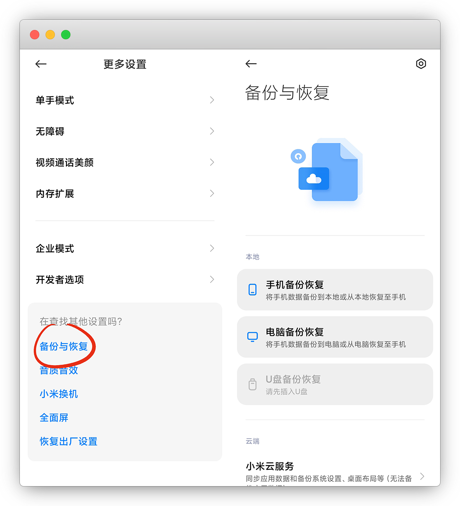
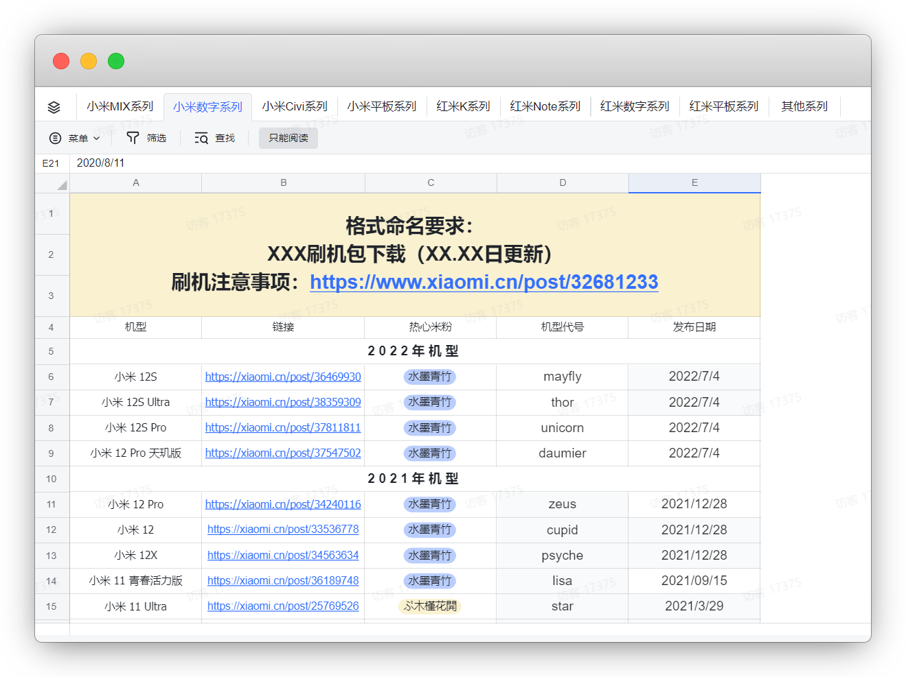
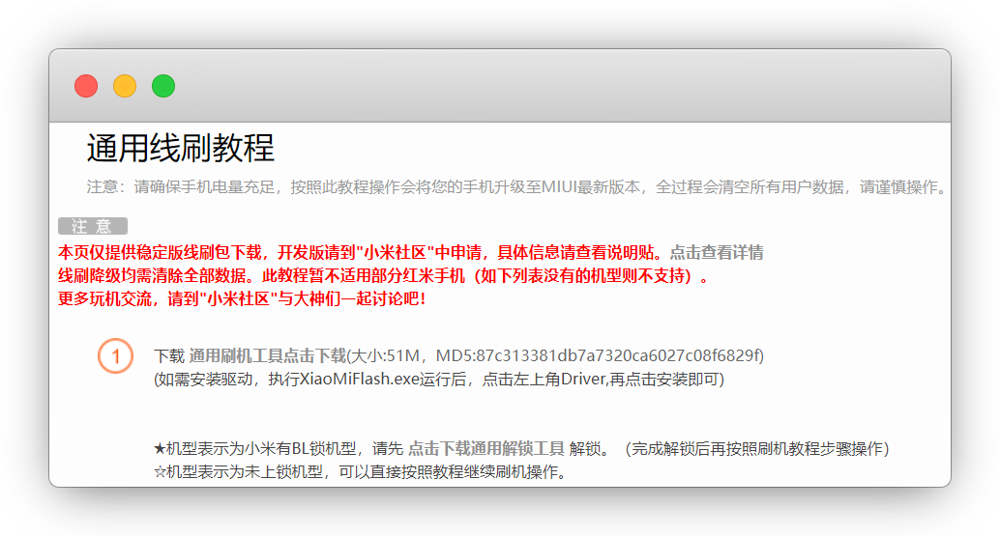
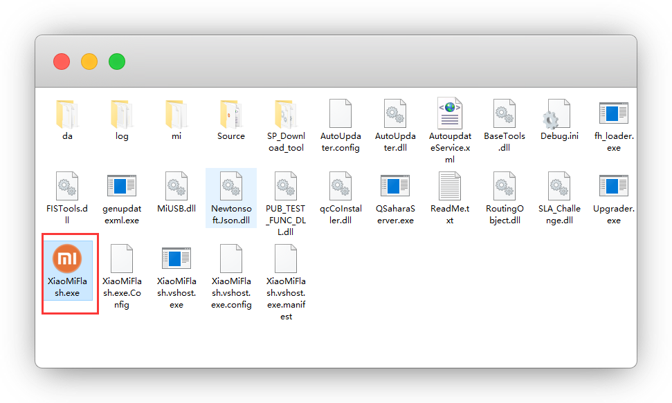
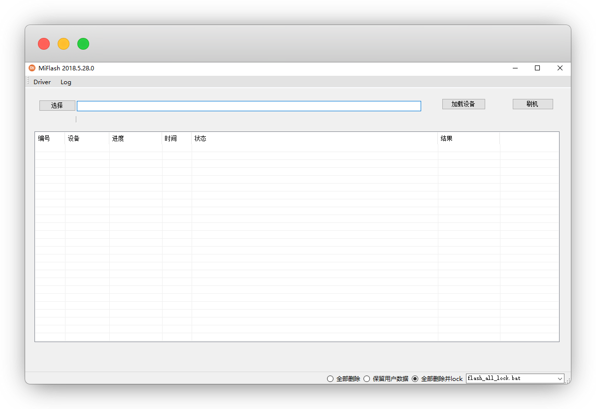
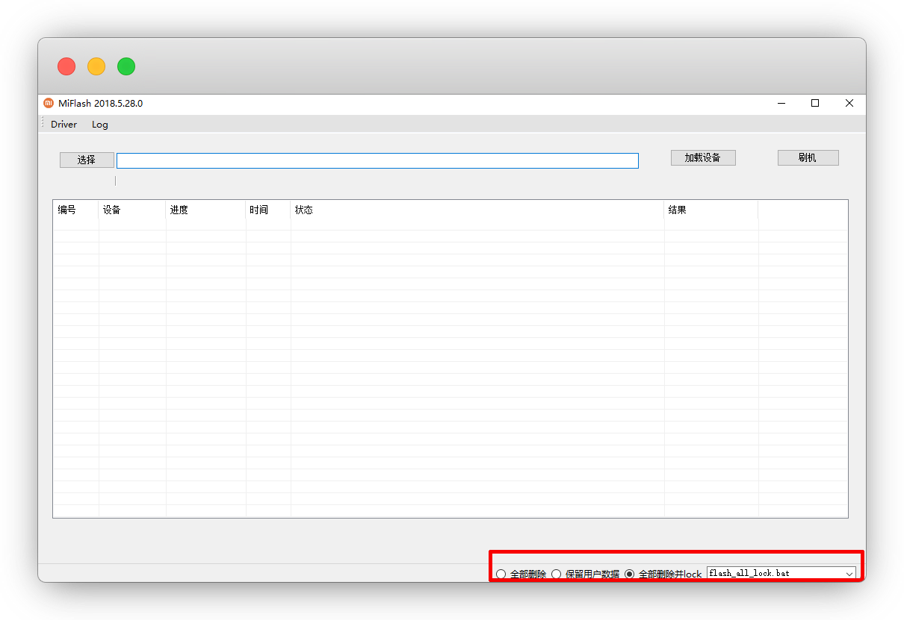
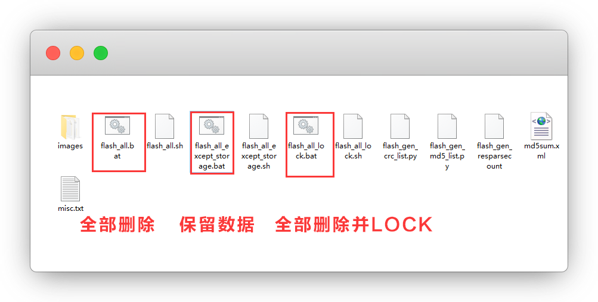
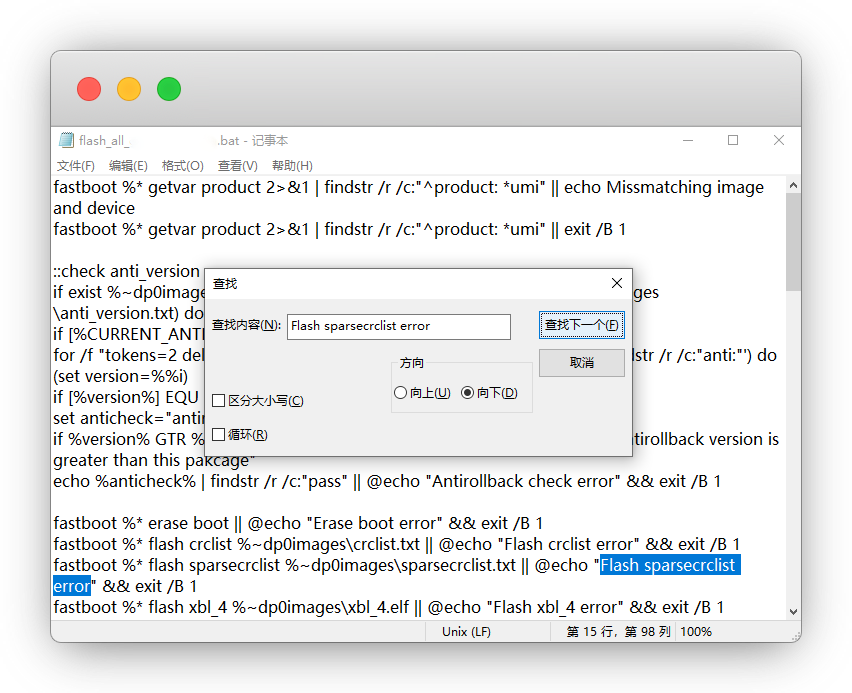
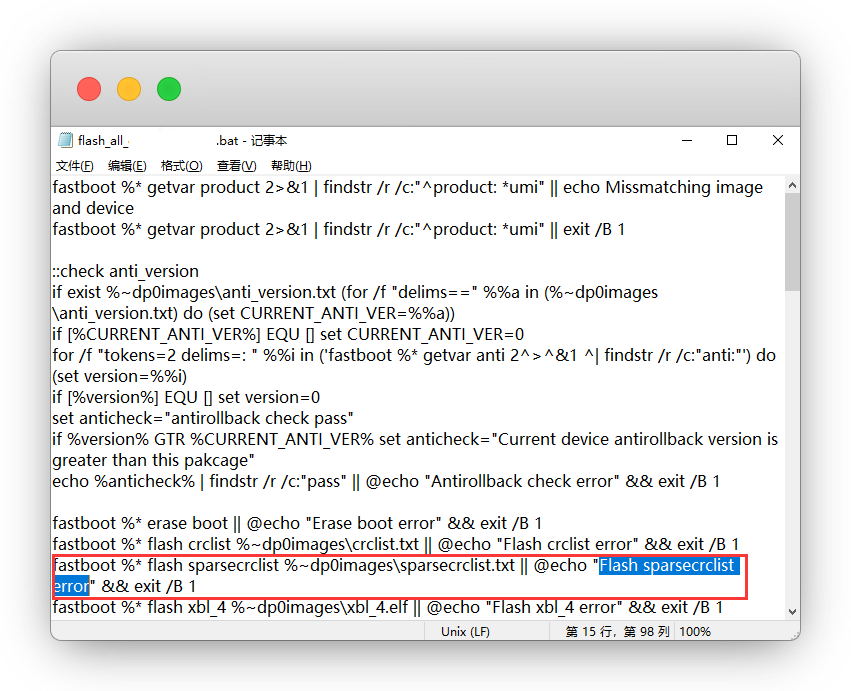
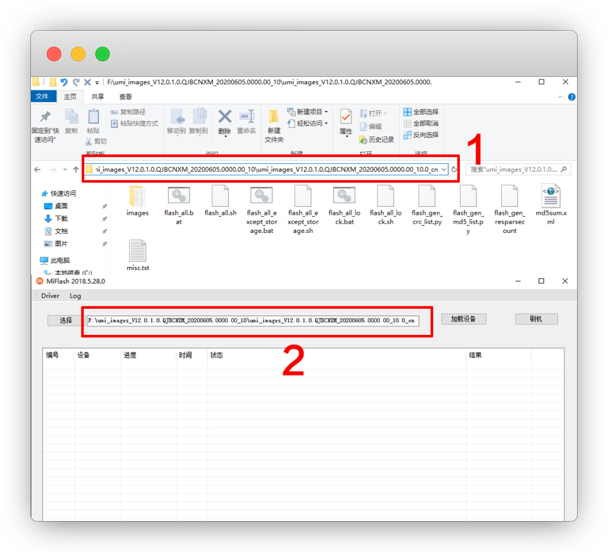

# 小米线刷降级破MIUI限制

::: warning 更新时间
最近更新：2021-10-18
:::


::: danger 注意
本教程仅适用于 刷机时出现

`remote:update sparse crc list failed`

原因：MIUI 12.5 后小米限制了降级
:::


## 准备工作


* 原装数据线+备份

* 下载rom包

* 下载小米官方刷机工具

* [已解官方BL锁](http://www.miui.com/unlock/index.html)


## 1.备份


方便恢复数据，一定要备份！！

设置-更多设置-备份与恢复，备份复制到电脑桌面，不然刷机会丢失

::: tip 说明
手机端备份后在 **MIUI-Backup-AllBackup** 文件夹
:::




## 2.下载ROM包


想要降回哪个版本，就去下载相应稳定/开发版包，下载后解压

::: tip 说明
开发版要去小米论坛申请内测资格并通过，然后去 [官网申请BL锁](http://www.miui.com/unlock/index.html)
:::

官方论坛刷机包汇总：[https://web.vip.miui.com/page/info/mio/mio/detail?postId=37093637](https://web.vip.miui.com/page/info/mio/mio/detail?postId=37093637)

::: tip 其他途径
XiaomiRom：[https://xiaomirom.com/](https://xiaomirom.com/)
:::




## 3.小米官方刷机工具


官网下载到电脑后解压

```
老版：http://bigota.d.miui.com/tools/MiFlash2018-5-28-0.zip

新版：https://cdn.alsgp0.fds.api.mi-img.com/micomm/MiFlash2020-3-14-0.rar

带下载包的miflash pro：https://dzp.lanzouy.com/ij7Wk0g7755g
```




## 4.开始刷机


手机关机，再 **长按音量下键+电源键** ，进入线刷 `FASTBOT` 兔子模式，数据线连接电脑


解压后，打开小米刷机工具文件夹，运行 **XiaoMiFlash.exe**





停在这个界面就行

::: tip 说明
第一次下载的点一下 `Driver` 安装一下驱动，已经装过的无视
:::




以下一一对应

::: tip 说明
全部删除 —— flash_all.bat

保留数据 —— flash_all_except_storage

全部删除并LOCK —— flash_all_lock.bat
:::





打开ROM包文件夹，找到相应的bat命令更改，鼠标右键—用记事本打开




编辑—查找 `Flash sparsecrclist error`




把这一段**整句全删掉**，不留空格，**保存并退出**




打开刷机工具，选择你ROM包的文件夹

::: tip 说明
这里注意你的ROM包文件夹的位置，一定要对

不知道路径的，进你的ROM包文件夹里，复制顶部的路径，粘贴过去就行
:::




然后点击 — **加载设备** —— **刷机** 即可，会有绿色进度条

等300-400秒就可以完成了，开机还要等一会


## 常见问题


#### 1.刷机出现couldn't find flash script

答：ROM文件夹位置没选对


#### 2.半天没开机

答：只要刷机显示success，就耐心等开机就行


#### 3.手机已开机，但刷机工具卡进度条800多秒

答：如果没开机，给我老实等着，千万不要动

如果已经开机了，就表示已经完成了，不用担心，拔掉数据线即可


