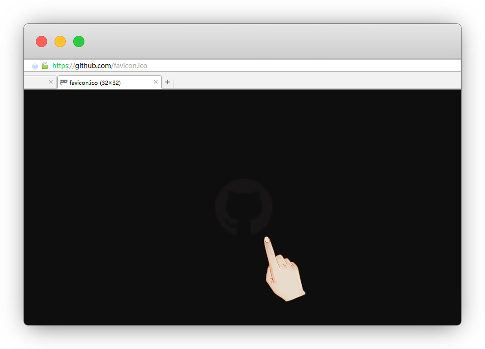
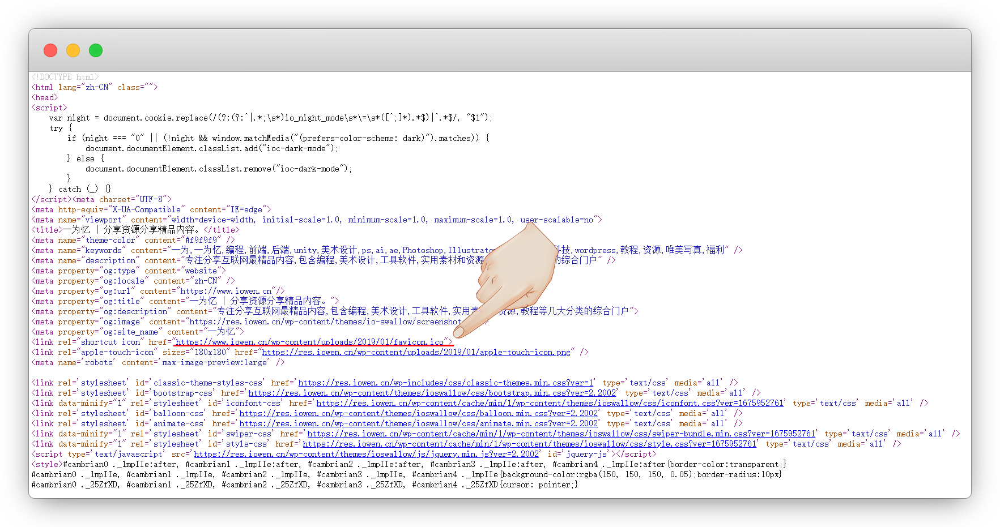
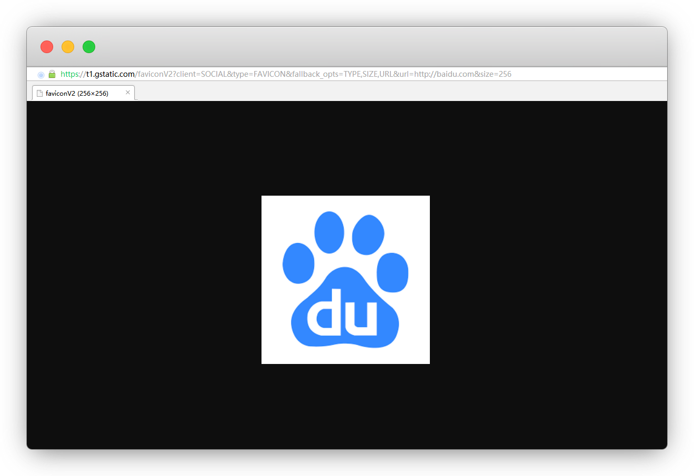
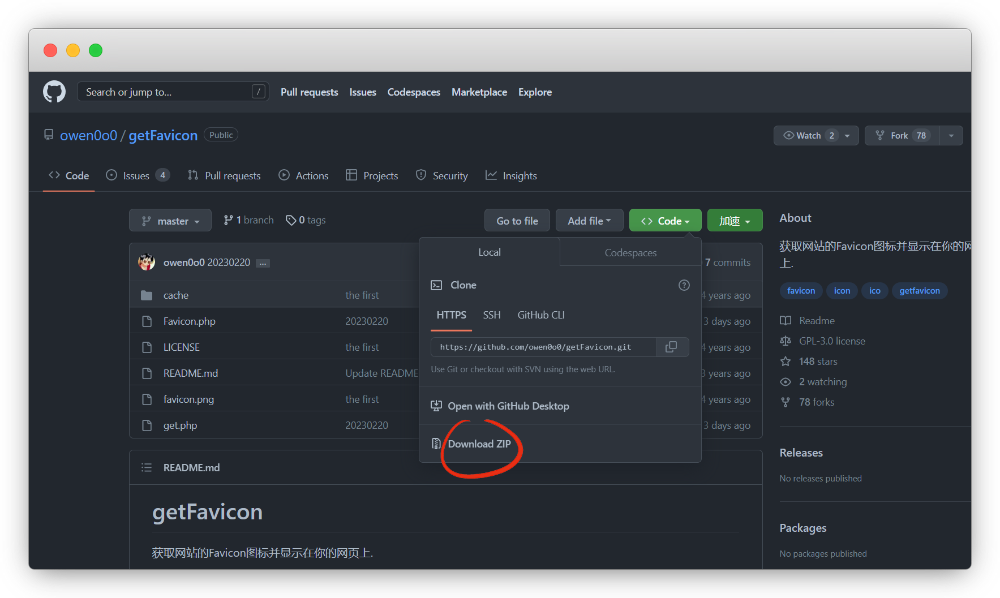
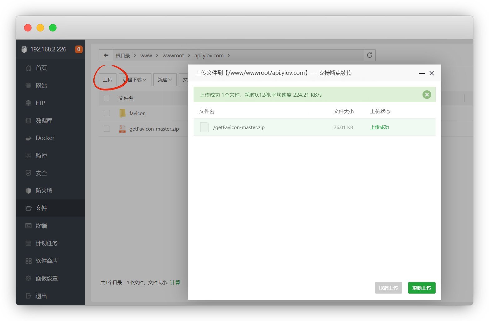
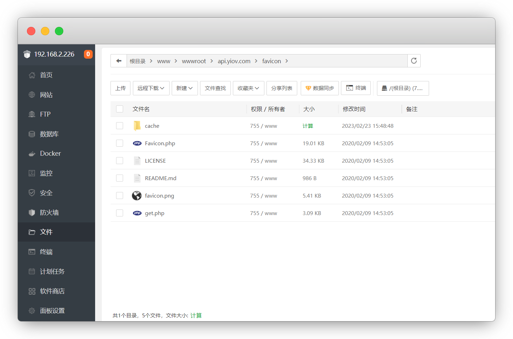
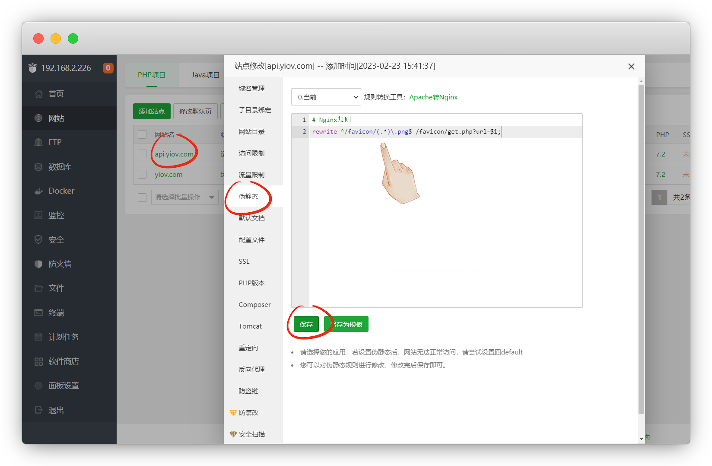
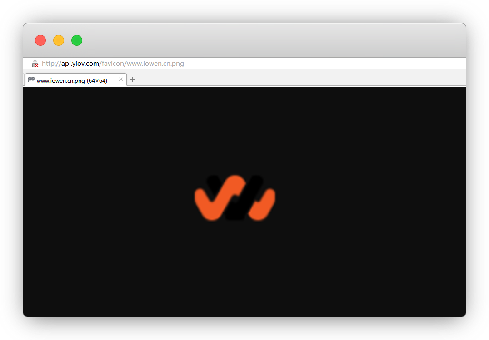

# 搭建Favicon图标API

::: warning 更新时间
最近更新：2023-2-23
:::


## 前言

Favicon图标就是浏览器标题栏上显示的小图标，也可以是缩小版的LOGO

之前搭建WebStack的时候，完全依赖的 [@owen0o0](https://github.com/owen0o0/getFavicon) 的api来获取Favicon图标

现在就按他的教程，尝试自己搭建一个


## 常见获取方式


### 1.域名+/favicon.ico

比如：https://github.com/favicon.ico

::: tip 说明
一定要是在主域名下 `/favicon.ico` 一般都放在主目录里
:::




### 2.查看原代码

比如：https://www.iowen.cn/

网页右键-查看源代码(ctrl+u)，这里就很明显能看到 `.ico` 结尾的文件




## 3.谷歌链接获取

格式：http://www.google.com/s2/favicons?domain=网站地址

获取：http://www.google.com/s2/favicons?domain=baidu.com

::: tip 说明
默认查看的尺寸是16*16，我们把后面的size=的值改成想要的大小即可，如果没有该尺寸，会返回默认16

常见的尺寸：16 / 32 / 48 / 64 / 128 / 256 / 512
:::




## 4.一为API获取

文档：[https://api.iowen.cn/doc/favicon.html](https://api.iowen.cn/doc/favicon.html)

根据文档，我们得知格式如下

格式：https://api.iowen.cn/favicon/网址.png

获取：https://api.iowen.cn/favicon/www.iowen.cn.png


## 准备工作


* [服务器1台](../ECS/)

* [域名1个](../ECS/#域名)

* [安装Xshell工具](../Xshell/)

* [安装宝塔面板](../BT/)


## 开始搭建

我们先进仓库，将代码下载到桌面

仓库：[https://github.com/owen0o0/getFavicon](https://github.com/owen0o0/getFavicon)



登录宝塔，新建添加一个站点，进目录-上传压缩包-解压，并将文件名改成 `favicon`

::: tip 说明
改名是为了和下面的连接对上
:::




cache 文件夹给 755 权限

::: tip 说明
宝塔直接上传的一般都是755
:::




访问：`http://你的网站/favicon/get.php?url=https://目标网站`

::: tip 说明
如果出现获取不了的情况，`ctrl+F5` 强制刷新缓存再试一次

比如：http://api.yiov.com/favicon/get.php?url=https://www.iowen.cn
:::


方便cdn缓存，伪静态规则 `二选一`

::: tip 说明
域名-伪静态，粘贴保存
:::

```php
# Nginx规则
rewrite ^/favicon/(.*)\.png$ /favicon/get.php?url=$1;
```

```php
# Apache 规则
<IfModule mod_rewrite.c>
RewriteEngine On
RewriteRule ^favicon/(.*)\.png$ favicon/get.php?url=$1 [L]
</IfModule>
```



调用方法：`http://你的网站/favicon/目标网址.png`

::: warning 注意
目标网址不能有 `http(s)://`，且结尾必须填 `.png`

以后亦可都用这种方式

比如：http://api.yiov.com/favicon/www.iowen.cn.png
:::




## 常见问题


#### 1.访问出现404

域名是否需解析 / 链接路径是否和文件名一致 / 链接是否正确


#### 2.自己的网站如何制作favicon.ico图标

图片在线转ico格式

* [在线生成透明ICO图标](http://www.ico51.cn/)

* [比特虫](https://www.bitbug.net/?rsv_upd=1)
