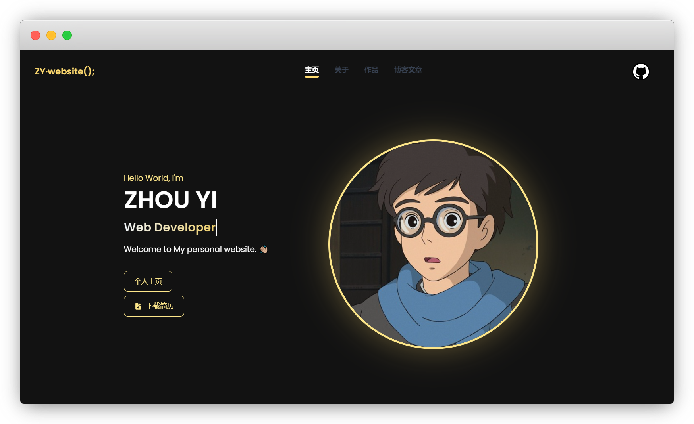
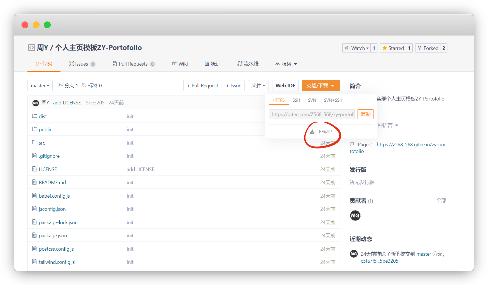
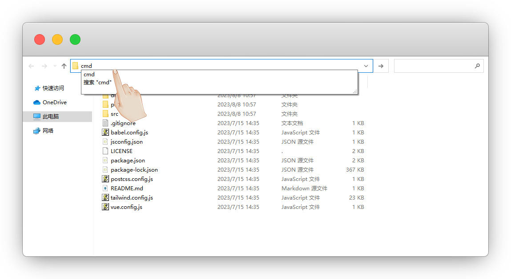
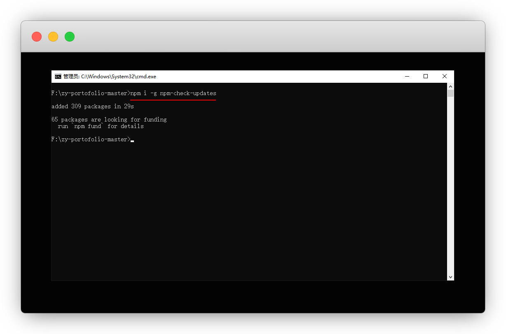
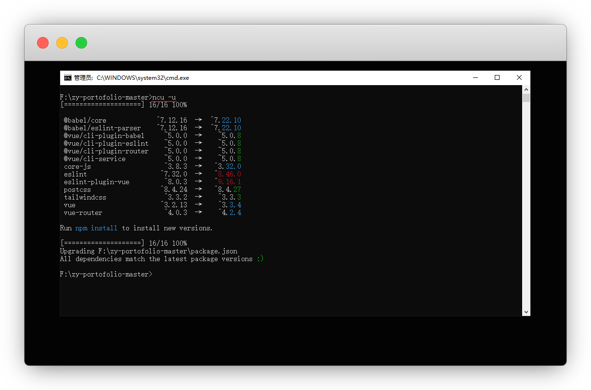
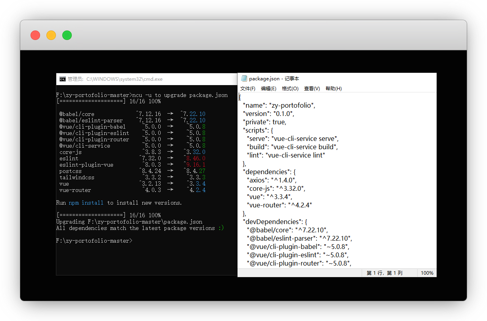
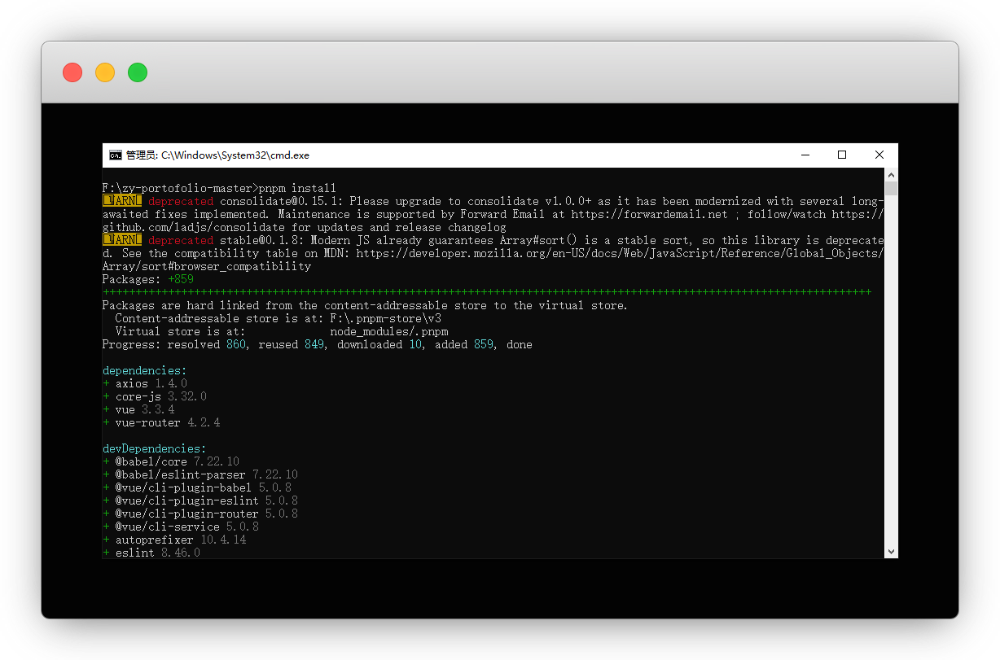
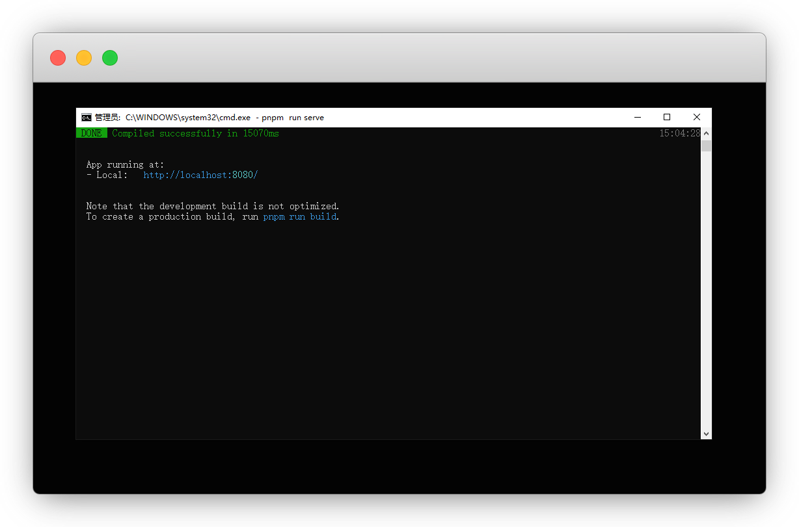

# Portofolio个人主页搭建

::: warning 更新时间
最近更新：2023-8-8
:::

## 简介

之前我们介绍了 [一款精美的个人主页](../home/) ，这次又来了一款

本次也是对作者 [@Z568_568](https://gitee.com/Z568_568/) 的教程做一下详细补充




## Demo

作者的预览挂了，我贴我的

预览：https://yiov.github.io/zy-portofolio/


## 前期准备

::: tip 说明
已安装过的无视
:::


* [node.js安装使用](../nodejs/)

* [YARN 和 PNPM](../nodejs/#yarn-和-pnpm)「推荐」

* [VS Code的安装步骤](../VSCode.md)「推荐」


## 1.下载源码

作者仓库：https://gitee.com/Z568_568/zy-portofolio

我的仓库：https://github.com/Yiov/zy-portofolio


::: tip 说明
没有Gitee账号的注册一个就行了，[GitHub](https://github.com/ZHYI-source) 暂时没有上传
:::



下载完成解压，在地址栏输入 `cmd` 进入终端

::: tip 说明
你也可以右键用VS Code打开，Ctrl+`键进入终端
:::




## 2.安装依赖

由于作者仓库模块有些过时了，我们用 `ncu` 一键更新

::: tip 说明
update的方式没这个一键方便
:::


安装 npm-check-updates

```sh
npm i -g npm-check-updates
```



检查可更新的版本

```sh
#ncu就是npm-check-updates的简称
ncu
```


更新模块包版本信息

```sh
#即运行ncu -u to upgrade package.json
ncu -u
```




这时候我们的package.json里的版本都按最新的填写完毕了





我们直接用命令更新安装依赖即可

::: tip 说明
推荐使用pnpm，速度快
:::


```sh
pnpm install
```



::: warning 说明
警告的两个显眼包可以无视，不影响开发

两个都在`package-lock.json`中，没必要较真
:::


## 3.开发模式


```sh
pnpm run serve
```


浏览器打开本地端口的连接

`http://localhost:8080/`





## 4.全局修改


### 4.1 Fav图标

```
//fav图标路径
public\favicon.ico
```

准备一张LOGO的图，替换成我们自己的即可

在线生成ICO图标：https://www.ico51.cn/


### 4.2 站点标题

```
//站点标题路径
src\router\index.js
```

原先显示 `Home - ZY();`，我们按喜好改，我习惯用 `丨`

```js{2}
router.beforeEach((to, from, next) => {
  document.title = to.meta.title + '丨Yiov'; // [!code focus]
  next();
});
```

不喜欢这个 `Home` 也可以改成中文，其他的以此类推

```js{6}
const routes = [
  {
    path: '/',
    name: 'home',
    component: HomeView,
    meta: { title: '首页' } // [!code focus]
  },
]
```


### 4.3 页面文字


```
//页面文字修改
src\App.vue
```

我们先改左上角的文字，原显示为 `ZY·website();`

```vue{2}
<button @click="redirectToHome" class="flex">
    <span class="self-center text-lg text-[#ffdb70] font-semibold whitespace-nowrap fadein-bot hover:text-amber-100">Yiov</span> // [!code focus]
</button>
```

GitHub跳转，图片建议也放本地的public文件夹中

```vue{2-3}
<div class="flex md:order-2 fadein-bot">
    <a href="https://github.com/Yiov" target="_blank"></a> // [!code focus]
</div>
```

导航的文字也可以自己修改

```vue{6}
<div class="hidden md:flex justify-between items-center w-full md:w-auto md:order-1" id="mobile-menu-3">
    <ul class="flex-col md:flex-row flex md:space-x-8 mt-4 md:mt-0 md:text-sm md:font-medium">
        <li>
            <router-link to="/"
                class="fadein-bot text-gray-700 hover:bg-gray-50 border-b border-gray-100 md:hover:bg-transparent md:border-0 block pl-3 pr-4 py-2 md:hover:text-gray-500 md:p-0"
                aria-current="page">主页
            </router-link>
        </li>
        ...
</div>
```


## 5.主页修改

```
//主页修改路径
src\views\HomeView.vue
```

### 5.1 主页文字

按需修改即可，觉得字体小的可以复制下面的class

```vue
<p class="text-amber-200 text-4xl font-bold text-white fadein-up">I'm</p>
<h1 class="text-4xl font-bold md:text-5xl text-white fadein-up">YIOV</h1>
```


### 5.2 动态文字


自行替换 `toRotate` 的内容即可

```vue{5}
<script>
export default {
    name: 'HomeView',
    data() {
        return {
            toRotate: ["Web Developer", "Full-stack Engineer", "Tech Enthusiast"],
            period: 2000,
            txt: '',
            loopNum: 0,
            isDeleting: false,
        };
    },
}
</script>
```


### 5.3 动态表情

作者这里添加了一个emoji，我们可以自己替换

emoji大全：https://emoji6.com/emojiall/


```vue
<p class="text-white pr-4 fade-in-from-left">Welcome to My personal website.<span class="wave">❤️</span> </p>
```


### 5.4 功能按钮

自己按需修改即可，我还是喜欢干净，我直接删除了

```vue
<a href="http://www.zhouyi.run/#/About" target="_blank"
    class="fadein-bot fade-500 flex items-center py-2 px-4 mx-auto text-sm font-medium rounded-lg border transition duration-300 md:py-2.5 md:px-5 md:mx-0 text-amber-200 border-amber-200 hover:bg-amber-200 hover:bg-opacity-10 bg-transparent focus:outline-none w-fit">
    个人主页
</a>
<button class="fadein-bot fade-500 flex items-center py-2 px-4 mx-auto text-sm font-medium rounded-lg border transition duration-300 md:py-2.5 md:px-5 md:mx-0 text-amber-200 border-amber-200 hover:bg-amber-200 hover:bg-opacity-10 bg-transparent focus:outline-none w-fit">
    <svg xmlns="http://www.w3.org/2000/svg" viewBox="0 0 24 24" fill="currentColor" class="mr-2 w-4 h-4">
        <path fill-rule="evenodd" d="M5.625 1.5H9a3.75 3.75 0 013.75 3.75v1.875c0 1.036.84 1.875 1.875 1.875H16.5a3.75 3.75 0 013.75 3.75v7.875c0 1.035-.84 1.875-1.875 1.875H5.625a1.875 1.875 0 01-1.875-1.875V3.375c0-1.036.84-1.875 1.875-1.875zm5.845 17.03a.75.75 0 001.06 0l3-3a.75.75 0 10-1.06-1.06l-1.72 1.72V12a.75.75 0 00-1.5 0v4.19l-1.72-1.72a.75.75 0 00-1.06 1.06l3 3z" clip-rule="evenodd"></path>
        <path d="M14.25 5.25a5.23 5.23 0 00-1.279-3.434 9.768 9.768 0 016.963 6.963A5.23 5.23 0 0016.5 7.5h-1.875a.375.375 0 01-.375-.375V5.25z"></path>
    </svg>下载简历
</button>
```


### 5.5 主页头像

尺寸作者是用的500x500，不要太大否则撑爆，同样可以放public

```vue
<div class="flex justify-center md:justify-start fadein-right">
       
</div>
```


## 6.关于页修改

```
//关于页路径
src\views\AboutView.vue
```

### 6.1 简介
文字部分就没啥好说了，想要修改，不想要就删掉

```vue
<div class="md:w-7/12">
    <ul class="mb-3 md:mb-7 fadein-left fadeins-1">
        <li class="bg-clip-text bg-gradient-to-r from-slate-100 to-amber-300 text-transparent">
            · Hi! 我是ZHOU YI，一位拥有3年前端开发工作经验的热爱前端的开发者
        </li>
        <li class="bg-clip-text bg-gradient-to-l from-slate-100 to-amber-300 text-transparent">
            · 90后 热爱前端开发 持续学习中 追求技能不断提高
        </li>
        <li class="bg-clip-text bg-gradient-to-r from-slate-100 to-amber-300 text-transparent">
            · 热衷于学习技术类知识，不断充实和提高自己，对新技术有强烈的学习欲望
        </li>
        <li class="bg-clip-text bg-gradient-to-l from-slate-100 to-amber-300 text-transparent">
            · 喜欢研究和构建酷炫的动画效果，用代码记录灵感和有趣的想法
        </li>
        <li class="bg-clip-text bg-gradient-to-r from-slate-100 to-amber-300 text-transparent">
            · 对新技术怀有渴望，寻找学习更多知识的乐趣
        </li>
        <li class="bg-clip-text bg-gradient-to-l from-slate-100 to-amber-300 text-transparent">
            · 喜欢分享自己的作品代码和文章
        </li>
    </ul>
    ...
</div>
```


### 6.2 技能

文字修改就不用说了，简单


```vue{5-6,11-12}
<div>
    <ul class="flex flex-wrap text-sm font-medium text-center text-gray-500 dark:text-gray-400 mb-5">
        <li class="mr-2">
            <button class="inline-block px-4 py-3 rounded-lg hover:text-white"
                :class="{ 'text-amber-200 bg-amber-200 bg-opacity-10': activeTab === 1 }"
                @click="activeTab = 1">技术栈
            </button>
        </li>
        <li class="mr-2">
            <button class="inline-block px-4 py-3 rounded-lg hover:text-white"
                :class="{ 'text-amber-200 bg-amber-200 bg-opacity-10': activeTab === 2 }"
                @click="activeTab = 2">工具箱
            </button>
        </li>
    </ul>
</div>
```


### 6.3 图片等信息

ID好像没什么冲突，随便写，图片链接用

Flaticon：https://www.flaticon.com/

如果你要新增 `tech: []`，那么下方的 `button` 和 `activeTab` 数字进行变动

::: tip 说明
遗憾的是不能做跳转
:::

```vue
tech: [
        {
            id: 1,
            name: 'HTML',
            imageUrl: 'https://cdn-icons-png.flaticon.com/512/1051/1051277.png',
            status: '掌握'
        },
    ]
```


## 7.作品


```
//作品修改路径
src\views\PortfolioView.vue
```

文字自己修改，这里文章图片格式请保持一致

```
//文章图片路径
public\img\
```

引用：`portfolio_v1`

实际文件名：`portfolio-portfolio_v1.png`

不想要这么复杂，也可以自己改

```html{6-7}
<!--路径：src\views\PortfolioView.vue-->

<div class="flex h-12 w-12 items-center justify-center p-0 h-full w-full lg:p-0 zoom-in">
    
        <!--如果你部署到仓库，前面还需要加仓库名-->
</div>
```


::: tip 说明
增加文章，就修改 `items: []` 里的内容即可
:::


## 8.博客文章

```
//博客文章路径
src\views\BlogView.vue
```

这里没啥好说的，作为博客来说，文章展示的话远远不够，看后期会不会优化吧

我是直接弃用了

直接在`src\App.vue`将 改成a标签


```html
<li>
    <a href="https://github.com/Yiov" target="_blank">
         博客文章
    </a>
</li>
```

::: tip 删除说明
`BlogView.vue` 和 `ArticleView.vue` 可以一起删

还要删掉 `src\router\index.js` 的内容

`components`整个文件夹都可以不要
:::


## 9.美化

主要是说一下颜色的替换

快我生活：https://www.kw360.net/color/rgb.html


### 9.1 全局背景

```scss{6,17,25}
//路径：src\App.vue

//全局背景色
body {
    font-family: 'Poppins', sans-serif;
    background: hsl(240, 6%, 13%);
    -webkit-font-smoothing: antialiased;
    -moz-osx-font-smoothing: grayscale;
    text-align: center;
    color: #2c3e50;
    height: 100vh;
}


//固定下拉条
::-webkit-scrollbar-track {
    background: hsl(216, 2%, 94%);
    border-radius: 5px;
}


//滚动下拉条
::-webkit-scrollbar-thumb {
    background: #3eaf7c;
    border-radius: 5px;
}
```


### 9.2 导航栏

有2个地方

```html
<!--路径：src\App.vue-->

<!--bg-[#121212]就是颜色代码-->
<nav class="max-w-7xl px-5 md:fixed top-0 z-[98] w-screen backdrop-blur-md bg-[#121212] bg-opacity-80">
```


```scss{7,13,24}
//路径：src\App.vue

//选中文字颜色
nav a.router-link-exact-active {
     display: inline-flex;
    flex-direction: column;
    color: red;
    transition: color 0.3s;
}

//选中文字鼠标悬停颜色
nav a.router-link-exact-active:hover {
    color: green;
}

//文字底部横条颜色
nav a.router-link-exact-active::after {
    display: inline-block;
     content: "";
    margin-top: 0.08em;
    width: 100%;
    height: 4px;
    border-radius: 2px;
    background-color: #3eaf7c;
}
```


### 9.3 主页文字

```scss
//路径：src\views\HomeView.vue

//文字光标
.typewrite > .wrap {
    border-right: 0.08em solid rgb(155, 9, 33);
}


//主页图片发光
.pict {
    box-shadow: 0px 0px 73px -9px rgba(29, 7, 235, 0.44);
    -webkit-box-shadow: 0px 0px 73px -9px rgba(29, 7, 235, 0.44);
    -moz-box-shadow: 0px 0px 73px -9px rgba(29, 7, 235, 0.44);
}
```

### 9.4 作品链接

```scss
//路径：src\views\PortfolioView.vue

//跳转链接悬停颜色
svg:hover {
        stroke: #b306b3;
    }
```


### 9.5 技术页文字

```html{6}
<!--路径：src\views\AboutView.vue-->

<!--路径：amber就是琥珀色，其实整个web基本都是这个色-->
<li class="mr-2">
    <button class="inline-block px-4 py-3 rounded-lg hover:text-white"
        :class="{ 'text-amber-200 bg-amber-200 bg-opacity-10': activeTab === 1 }"
        @click="activeTab = 1">技术栈
    </button>
</li>
```


## 10.部署


构建前先确定好，你是放在仓库的，还是网站根目录的

```js{4}
//路径：vue.config.js
const { defineConfig } = require('@vue/cli-service')
module.exports = defineConfig({
  transpileDependencies: true,
  //publicPath: './',  //部署到根目录
  publicPath: '/zy-portofolio/',  //部署到仓库
})
```

放网站就填根目录 `./` ，否则就写仓库名

> 如果你不填，就会丢失样式

::: danger 注意
1.部署到根目录，图片路径不用改

2.部署到仓库，所有！所有！图片前都必须加仓库名！
:::

完成这些后就可以构建了

```
pnpm build
```

将dist目录里的文件上传到服务器或者静态托管平台即可