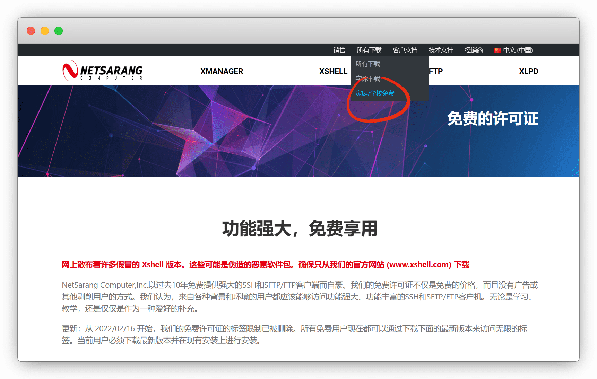
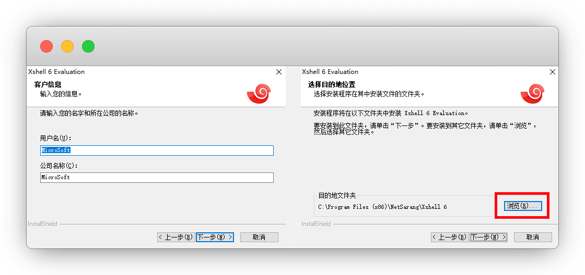
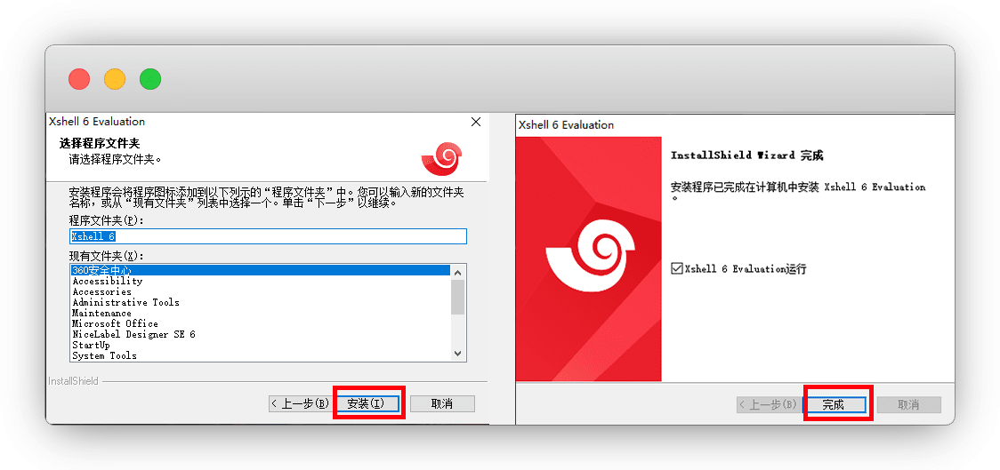
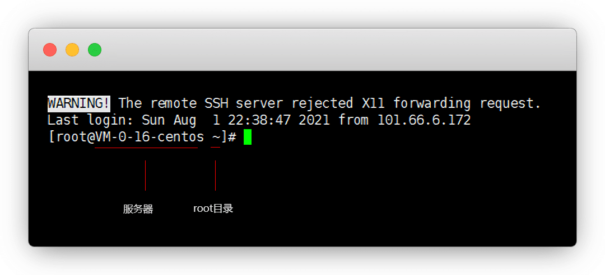

# Xshell终端连接服务器

::: warning 更新时间
最近更新：2021-11-17
:::


## shell工具

* 电脑端：[Xshell](https://www.netsarang.com/)、[FinalShell](http://www.hostbuf.com/)、[MobaXterm](https://mobaxterm.mobatek.net/)等等

* 手机端：[Termius：苹果](https://apps.apple.com/cn/app/id549039908) 丨 [Termius：安卓](https://apkpure.com/cn/termius-ssh-and-sftp-client/com.server.auditor.ssh.client) 丨 [JuiceSSH：安卓](https://www.juicessh.com/changelog)


本文仅演示 `Xshell` 安装教程


## 1.下载Xshell


这里我们直接去官网下载免费版，也属于教育版

::: tip 说明
不要在其他网站下载，否则过一段时间会结束体验期
:::

Xshell官网：[https://www.netsarang.com/zh/all-downloads/](https://www.netsarang.com/zh/all-downloads/)


进入页面后，下拉到底部，找到 `家庭/学校免费` ，点击





进来后，需要填写邮箱，一会要接受邮件，姓名随便

::: tip 说明
我这里只用Xshell，我只勾选了这一个，想都要的都勾选
:::


填好后点下载，邮箱就会收到下载地址了


打开链接即可下载

::: tip 说明
注：如果以前下载的Xshell，提示评估期已过，那就再来一遍
:::




## 2.安装Xshell


下载好后，我们双击开始安装


客户信息默认，下一步，目的地位置，我们改一下，**别装C盘**了

点 `浏览`




我们把C盘改成D盘，其他不要动，确定，下一步


安装-直到完成，打开


## 3.连接服务器


打开Xshell，左上-新建会话


名称随便，主机填你的服务器 `公网IP` ，端口默认22


选 用户身份登陆，用户名默认 `root` ，密码服务器选系统的时候自己设置的

::: tip 说明
要是忘记了，去服务器控制台那里重置密码
:::


弹出主机密钥验证，接受保存就好




正常就连接成功了

::: tip 说明
如果不小心X掉了，选择服务器，鼠标右键-打开
:::


## 其他拓展


### 1.查看目录列表

```
cd /
ls
```


### 2.手机端远程SSH


#### Termius

根据自己的系统选择下载：[Termius：苹果](https://apps.apple.com/cn/app/id549039908) 丨 [Termius：安卓](https://apkpure.com/cn/termius-ssh-and-sftp-client/com.server.auditor.ssh.client)

::: tip 说明
可以不登录账号使用，登录只是方便同步信息
:::

安装好打开，点击 `Hosts` 再点右上角 `+`


点 `New Host` ，填写信息后，save保存

::: tip 说明
`host name` 填公网IP

`Username` 填账户名 `root`

`Password` 填服务器密码
:::


这样就登录成功了，点击当前标签也可关闭连接


#### JuiceSSH

官网下载 [JuiceSSH](https://juicessh.com/) 或者 [蓝奏云](https://dzp.lanzouy.com/iMsuF0gb2dha)


新建认证这里

::: tip 说明
用户名：root

密码：(你自己设置的)

填好后，右上对勾 `√` 确定
:::


连接页面右下+号 - 新建连接，这样就连接成功了

::: tip 说明
地址：(你的IP地址)

认证：(你的服务器)

填好后，右上对勾 `√` 确定
:::


