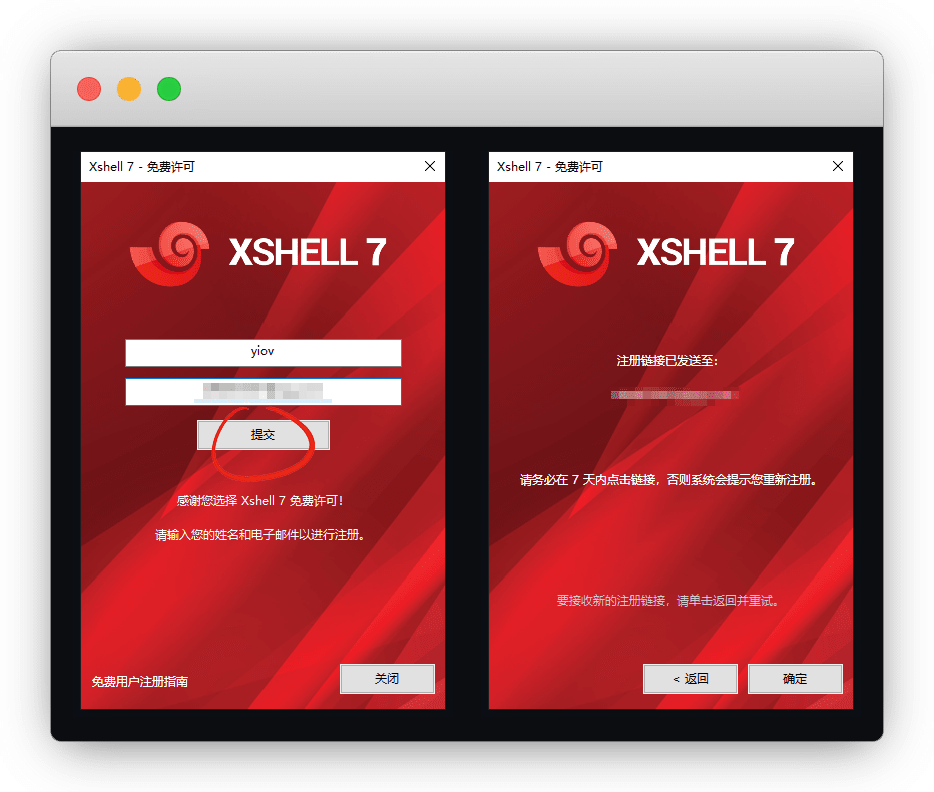
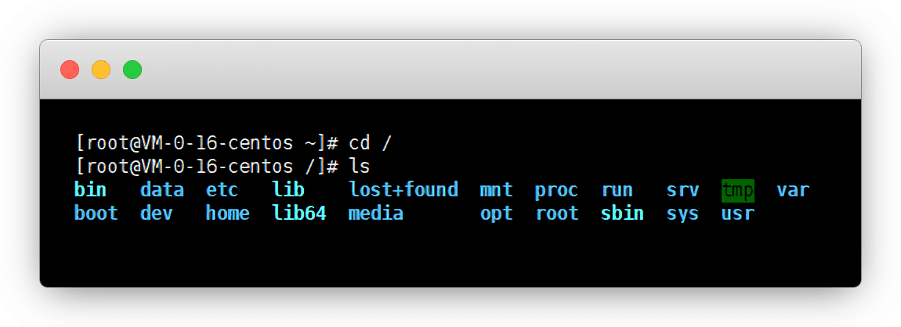
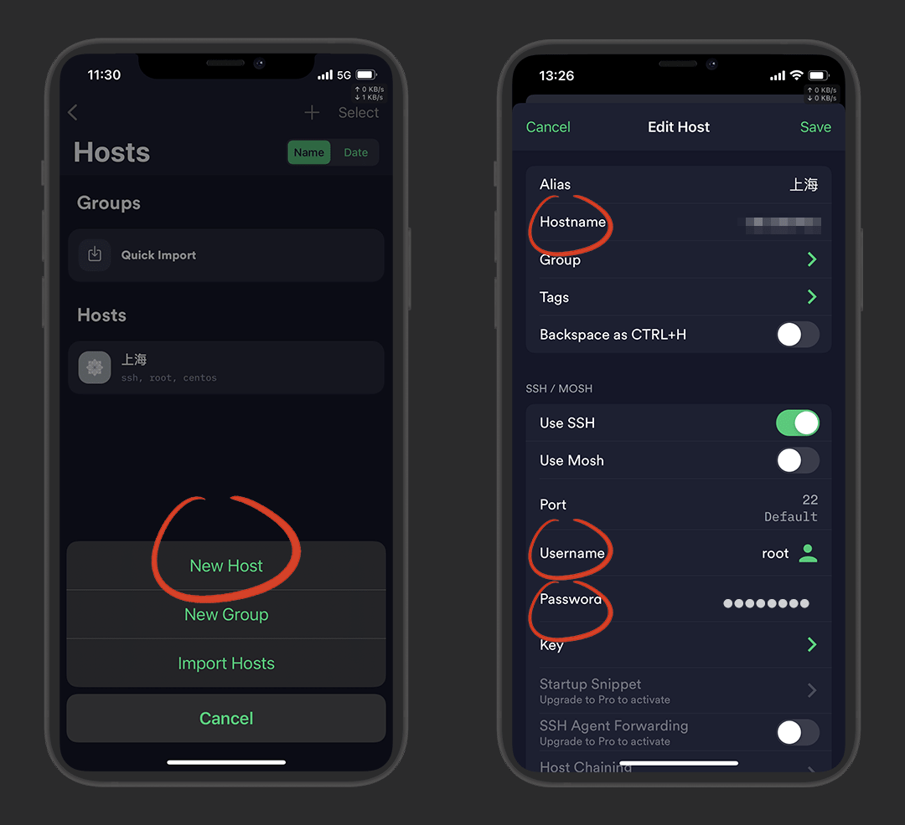
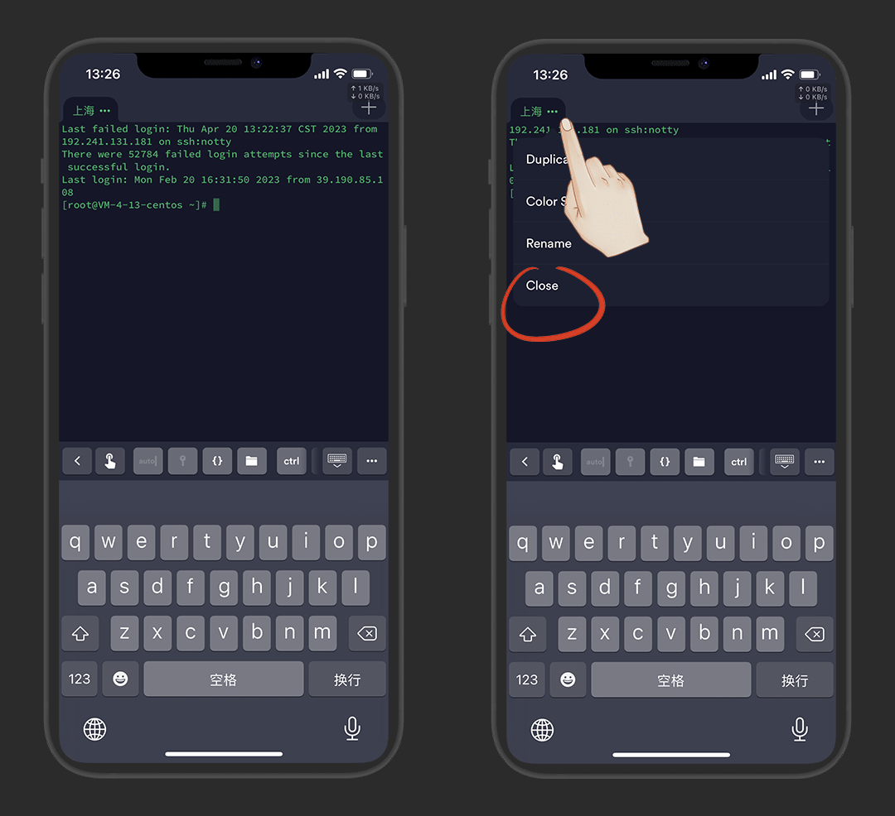

# Xshell终端连接服务器

> 更新时间：2023-12-22


## 简介

Xshell是 NetSarang 公司旗下的一个安全终端模拟软件，用于远程连接服务器

::: details 关于 CMD 和 PowerShell
* 操作系统：可以分为 `kernel` (核心) 和 `Shell` (外壳) 两部分，shell位于系统外层，只要用于连接系统内部核心

* Shell：分为图形shell和命令行shell，Windows系统桌面 `explorer.exe` (资源管理器) 是图形shell，而 `cmd` 是命令行shell

* CMD：是 Command shell 的简写，仅用于执行Windows系统命令和批处理文件

* PowerShell：是CMD的升级版，包含CMD所有功能且可跨平台使用

* Xshell：不仅包含它们两个的所有功能，还能多窗口连接服务器，处理脚本等等
:::


## 常见工具

带 ⭐ 的是有教程的，点击即可跳转


* 电脑端：[⭐Xshell](#电脑端)、[FinalShell](http://www.hostbuf.com/)、[MobaXterm](https://mobaxterm.mobatek.net/) 等等

* 手机端：[⭐Termius：苹果/安卓](#termius) 丨 [⭐JuiceSSH：安卓](#juicessh)


## 电脑端

### 下载安装


Xshell官网：https://www.xshell.com/zh/all-downloads/

::: tip 说明
现在官网已经可以免费使用了
:::

进入页面后，点击 `所有下载 - 家庭/学校免费`


选择 `Xshell` 下载即可


下载好后，我们双击开始安装


客户信息默认，下一步，目的地位置，我们改一下，**别装C盘**了

点 `浏览`


我们把C盘改成D盘，其他不要动，确定，下一步


安装，直到完成


打开后会要求注册，填好用户名和邮箱，提交

关掉再打开即可，不需要真的去注册！





### 连接服务器


打开Xshell，左上-新建会话


名称随便，主机填你的服务器 `公网IP` ，端口默认22


选 用户身份登陆，用户名默认 `root` ，密码服务器选系统的时候自己设置的

::: tip 说明
要是忘记了，去服务器控制台那里重置密码
:::


弹出主机密钥验证，接受保存就好


正常就连接成功了

::: tip 说明
如果不小心X掉了，选择服务器，鼠标右键-打开
:::


root目录用 `~`,根目录用 `/`

```
cd /
ls
```




## 手机端


### Termius

根据自己的系统选择下载：[Termius：苹果](https://apps.apple.com/cn/app/id549039908) 丨 [Termius：安卓](https://apkpure.com/cn/termius-ssh-and-sftp-client/com.server.auditor.ssh.client)

::: tip 说明
可以不登录账号使用，登录只是方便同步信息
:::

安装好打开，点击 `Hosts` 再点右上角 `+`


点 `New Host` ，填写信息后，save保存

::: tip 说明
`host name` 填公网IP

`Username` 填账户名 `root`

`Password` 填服务器密码
:::



这样就登录成功了，点击当前标签也可关闭连接




---

### JuiceSSH

仅限安卓，官网下载 [JuiceSSH](https://juicessh.com/) 或者 [蓝奏云](https://dzp.lanzouy.com/iMsuF0gb2dha)


新建认证这里

::: tip 说明
用户名：root

密码：(你自己设置的)

填好后，右上对勾 `√` 确定
:::


连接页面右下+号 - 新建连接，这样就连接成功了

::: tip 说明
地址：(你的IP地址)

认证：(你的服务器)

填好后，右上对勾 `√` 确定
:::


