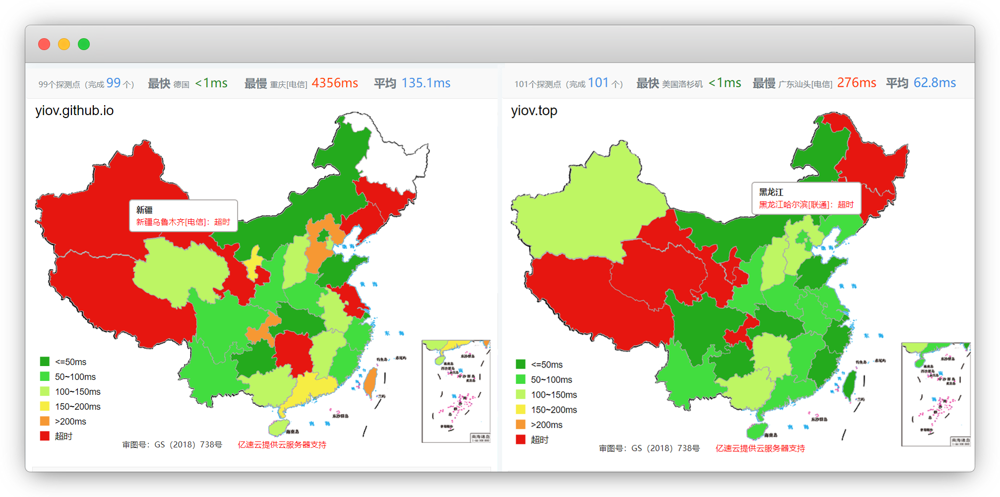

# cloudflare注册使用

::: warning 更新时间
最近更新：2023-6-3
:::

## 简介

我们常说的 `套个CF` ，其实就是说的cloudflare，因为他其中最特色的功能就是免费的CDN

::: tip 关于CDN
CDN 的全称是 Content Delivery Network，即内容分发网络

* 比方：北京到广东的快递包裹，时长要3天；但如果北京在广东有货物仓储，直接广东发货，时长就仅需1天

* 作用：CDN就是这个作用，将我们的网站临时存储在服务器中，谁访问就分配距离他最近的节点连接，从而大大加快网页访问速度

另：常见的CDN服务商还有 [又拍云](https://www.upyun.com/)、[七牛云](https://www.qiniu.com/)、[腾讯云COS](https://cloud.tencent.com/act/pro/cos)、[阿里云OSS](https://www.aliyun.com/product/oss)等
:::

## 注册

官网：[https://www.cloudflare.com/](https://www.cloudflare.com/)

注册好账号

::: tip 说明
虽然有了中国站点，但访问还是要挂梯子
:::

## 使用

cloudflare除了可以使用CDN还可以创建 [cloudflare page](https://pages.cloudflare.com/) ，我这里先不说

### CDN加速

::: tip 说明
仅演示下步骤，自己的服务器网站也是一样的步骤

由于github基本处于半墙状态，也可以借助cloudflare进行加速
:::

演示网站：[https://yiov.github.io/](https://yiov.github.io/)

::: warning 注意
需要自己先购买一个域名，github pages不能修改DNS

[域名使用 点我 ☛ 查看教程](../githubpage/#_3-访问及自定义域名)
:::

我是腾讯云买的域名，进控制台，添加记录

主机记录`@`或者自定义其他二级域名，记录类型为`CNAME`，记录值填github页面 `yiov.github.io`

::: warning 注意
如果你是自己的服务器，直接快速解析好就可以了，不需要添加CNAME别名解析
:::

然后在仓库设置 - pages - 自定义域名 填入 我们购买的域名，保存

::: tip 说明
等待解析完成，用域名可以访问即可
:::

回到 cloudflare 添加站点

::: tip 说明
不需要填https，直接填域名
:::

拉倒最下面，选择 Free 免费的方案，继续

它会自动扫描我们原本的DNS

我只解析了一个`@`，竟然没扫描过来，那就手动添加一下吧，和DNSPod那里一样的

添加好后点 继续

::: tip 建议
这里最好将小云朵代理状态关掉，否则网站不可访问

代理走的是美国节点
:::

最后要求我们修改DNS服务器

以腾讯云为例进入域名后台，勾选域名 - 更多操作 - 修改DNS服务器

自定义DNS，将cloudflare提供的2个DNS填上去

完成后，会显示其他，且可以进域名里看到变更了

点击检查服务器即可，等10分钟左右就会激活成功了

这里的快速入门，我也是一顿骚操作默认点完了，最后网站不能访问

> 提示：too many HTTP

需要将 `SSL/TLS - 边缘证书 - 始终使用HTTPS` 关闭

还是无法访问，最后发现是小云朵没关

DNS - 记录 - 将小云朵关掉，仅DNS即可

刷新访问就可以了，我们用 [站长工具](https://ping.chinaz.com/) ping一下前后

::: tip 说明
事实证明免费的也就这样，还是付费的好用
:::

