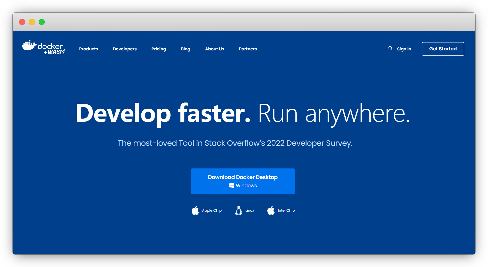
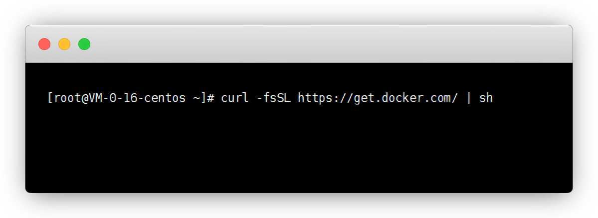
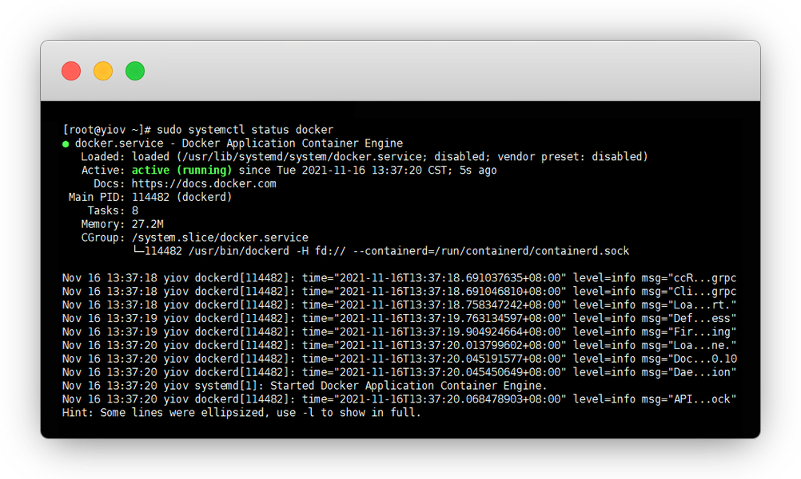
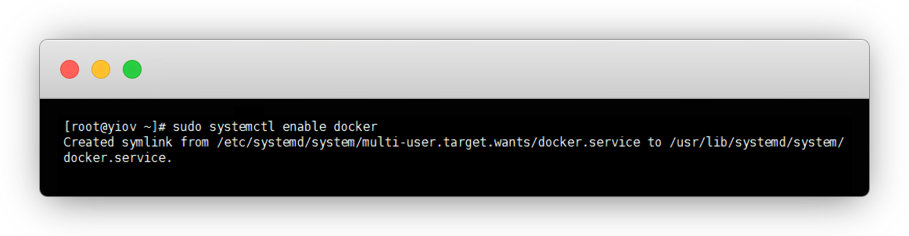
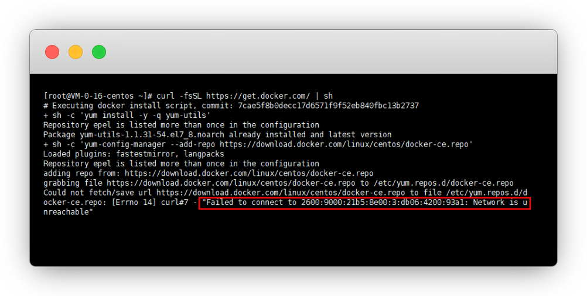
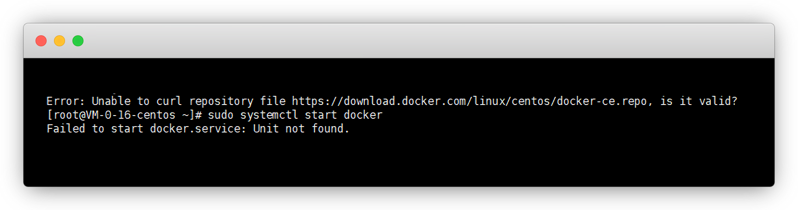
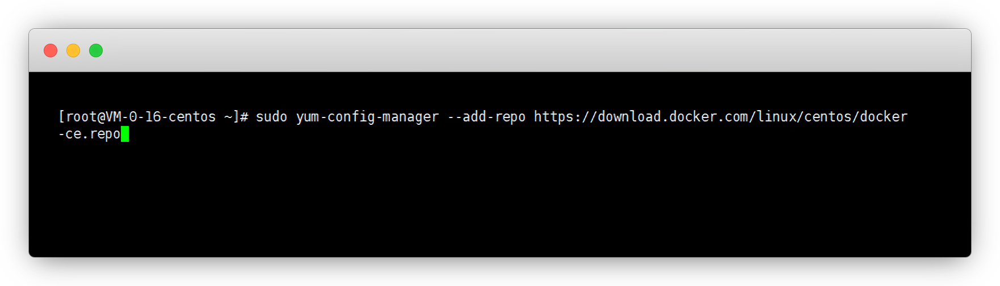
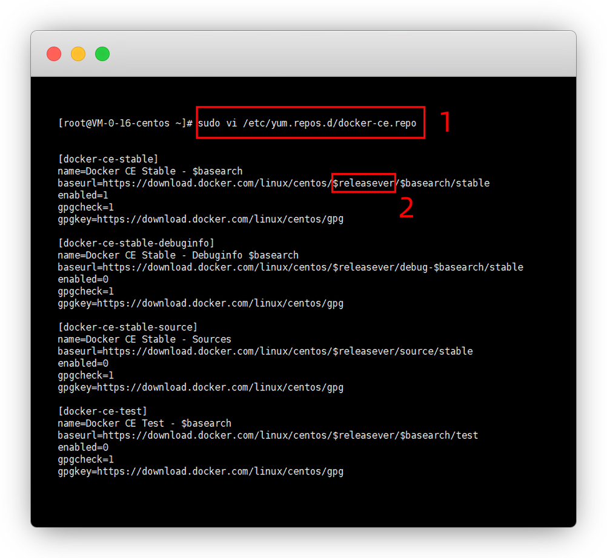
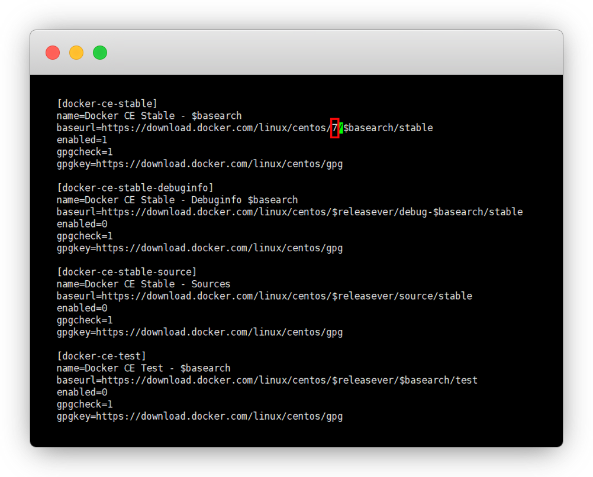

# Docker的安装教程

::: warning 更新时间
最近更新：2021-11-17
:::


## 简介

虚拟机占用空间大，启动时间长，容器技术应运而生，docker就是其中一种应用容器引擎

可以更加便捷的管理镜像


官网：[https://www.docker.com/](https://www.docker.com/)




## 准备工作

* [服务器](../ECS/) 或 [虚拟机](../VMware/)

* [Xshell工具](../Xshell/)


## 1.安装

用Xshell工具登录服务器，然后一键安装Docker需要的依赖包

```sh
cd
curl -fsSL https://get.docker.com/ | sh
```




安装完成后，开启Docker服务

```sh
sudo systemctl start docker
```


```sh
sudo systemctl status docker
```




```sh
sudo systemctl enable docker
```




## 2.其他功能


:::: details 点击查看 多容器管理

安装 `Docker compose` ，用于管理多容器，容器不多的，可以不用装


这个有点慢，多等一会

::: tip 说明
仓库：[https://github.com/docker/compose](https://github.com/docker/compose)
:::

```sh
sudo curl -L https://github.com/docker/compose/releases/download/1.16.1/docker-compose-`uname -s`-`uname -m` -o /usr/local/bin/docker-compose
```


```sh
chmod +x /usr/local/bin/docker-compose #给权限
```


```sh
docker-compose #运行docker-compose
```

::::


### docker常用命令


```sh
docker ps -a #查看容器

docker stop 容器ID #暂停容器

docker rm -f 容器ID #删除容器

docker kill 容器ID #关闭容器

docker restart 容器名称 #重启容器

exit #退出容器

docker images #查看镜像

docker rmi 镜像ID #删除镜像

docker rm -f whyour/qinglong:latest #删除镜像
```


## 常见问题


#### 1.Docker安装出现Errno 14


Errno 14连接失败，是密钥下载失败了，那我们手动下载即可

::: tip 说明
我碰到的情况有2种，都是这么解决的
:::






重新添加仓库

```sh
sudo yum-config-manager --add-repo https://download.docker.com/linux/centos/docker-ce.repo
```




再编辑repo

```sh
sudo vi /etc/yum.repos.d/docker-ce.repo
```

进来之后，我们找到标记位置，按 `Vi` 进入编辑模式，会有个绿色的光标




用方向键移动，把 `$releasever` 改成 `7`，多余的字用Del键删，其他的不要改

```diff
- baseurl=https://download.docker.com/linux/centos/$releasever/$basearch/stable`

+ baseurl=https://download.docker.com/linux/centos/7/$basearch/stable
```




然后按 `ESC` 退出编辑模式，再输入 `:wq` 即可保存退出

::: tip 说明
`:`冒号按SHIFT键打出来，确保是全英文输入法状态
:::


我们重新安装，两次y确定后安装成功

```sh
curl -fsSL https://get.docker.com/ | sh
```


#### 2.如何卸载旧版本Docker


如果出现安装错误，或者未知错误，直接卸载了重装

::: tip 说明
放心卸，不会影响镜像面板的使用
:::

```sh
#老版本的Docker被称为docker或docker-engine
sudo yum remove docker docker-common docker-selinux docker-engine
```


