# dockerhub上传本地镜像

::: warning 更新时间
最近更新：2021-11-12
:::


## 前言

本文仅演示本地有的镜像，就是你服务器拉取了别人的镜像

怎么上传到自己的dockerhub

至于如何制作镜像不教，因为我也不会，哈哈哈哈


## 准备条件

* [服务器1台](../ECS/) 或 [虚拟机](../VMware/)

* [安装Xshell工具](../Xshell/)

* [安装docker](../docker/)


## 1.创建docker账号


docker官网注册：[https://hub.docker.com/](https://hub.docker.com/)

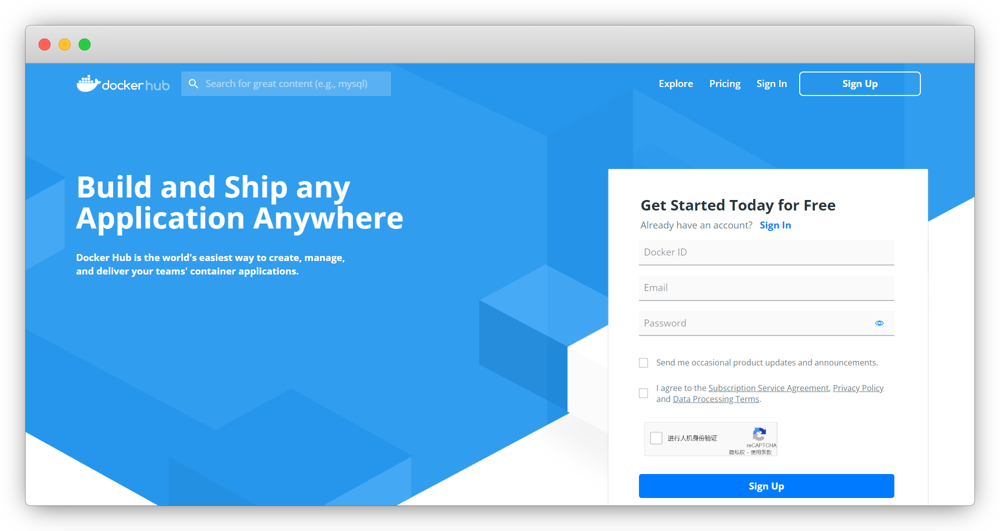


登录账号后，点 `Repositories-Create Repository` 创建仓库

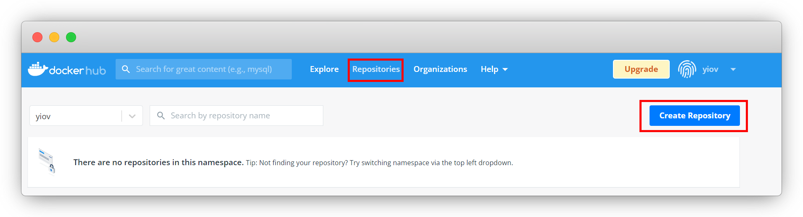


给仓库命名，公开还是私有，创建

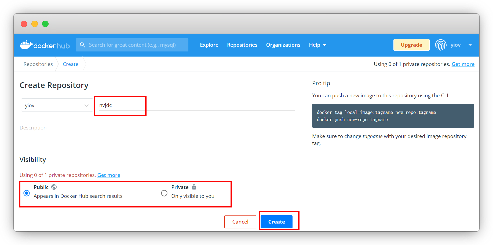


这样就创建成功了

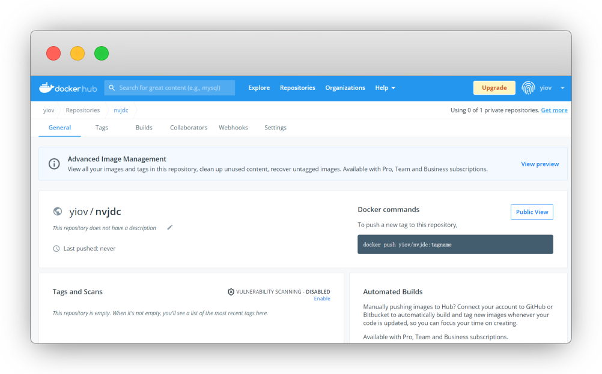


## 2.拉取镜像


Xshell工具登录 服务器 或 虚拟机，拉取要上传(备份)的镜像

::: tip 说明
已拉取过的无视，本次仅做演示
:::

练手可拉取青龙镜像：[https://hub.docker.com/r/whyour/qinglong](https://hub.docker.com/r/whyour/qinglong)

```sh
docker pull whyour/qinglong:latest
```

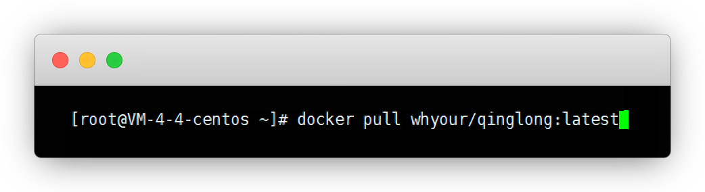


## 3.登录docker


输入命令登录docker账号和密码，输完直接回车

```sh
docker login
```

`Login Succeeded` 就是登录成功了

::: tip 说明
Username：账户名

Password：密码(输入是隐藏的，尽管输入，不是键盘出问题)
:::

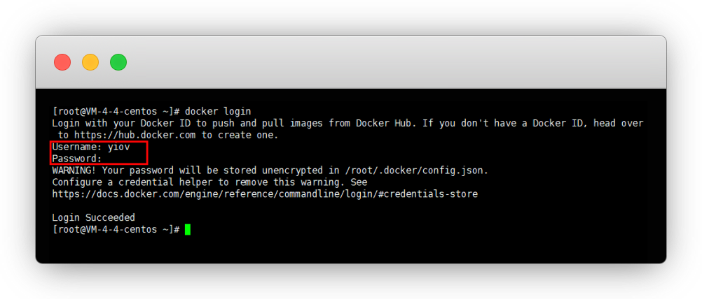


## 4.上传镜像


我们先查看一下查看镜像

::: tip 说明
如没有镜像，就是还未拉取，看步骤2

我这里想要上传 @nolan 的 `nvjdc` 镜像作为演示
:::

```sh
docker images
```

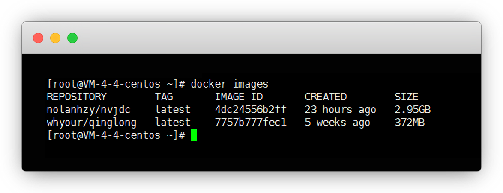


dockerhub无法直接上传别人的镜像

我们pull镜像后，通过 `打标签` 的形式换成自己的账户仓库名，再上传就可以了

```sh
docker tag 镜像ID 账户名/仓库名:标签名
```


::: tip 说明
镜像ID：4dc24556b2ff(上面自己复制)

账户名：nolanhzy(自己的账户名)

仓库名：nvjdc(仓库名用第1步自己建的名字)

标签名：latest(可以自己改)
:::


最终：

```sh
docker tag 4dc24556b2ff yiov/nvjdc:1.0
```

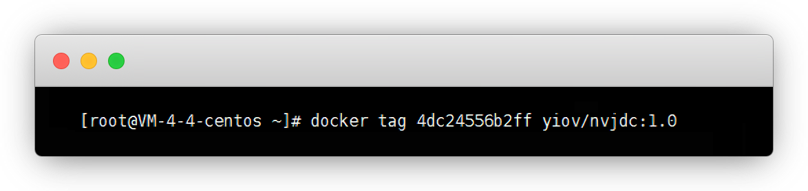


我们再查看一下镜像，这样我们就得到了与原镜像完全一致的镜像

```sh
docker images
```

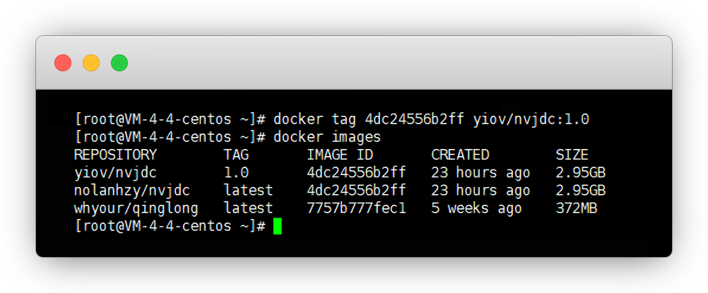


现在我们来上传镜像

::: tip 说明
如果上传前想查看数据 `docker inspect 账户名/仓库名:版本号`
:::

```sh
docker push yiov/nvjdc:1.0
```


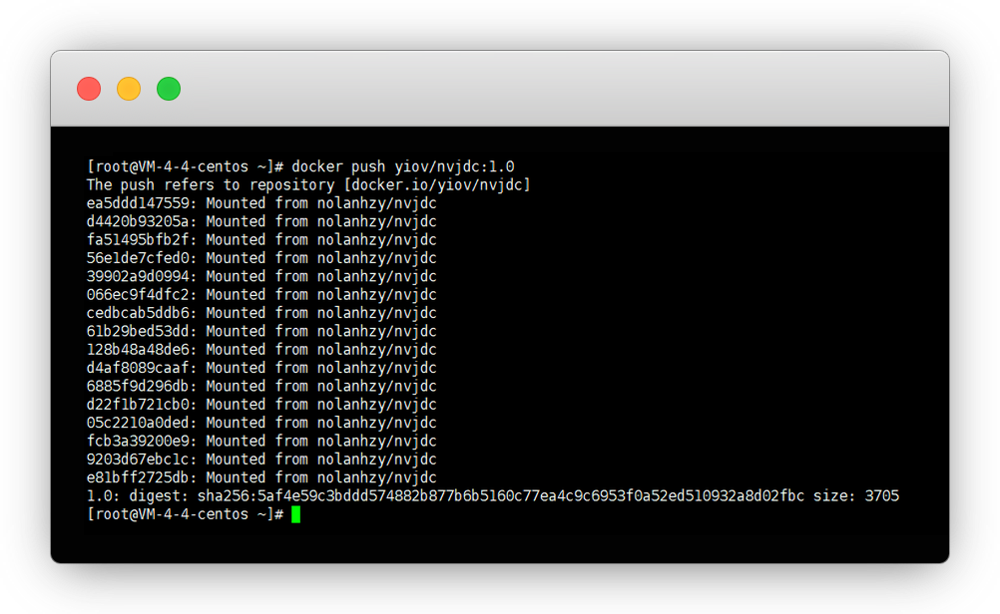


回到dockerhub网页查看，这样就是上传成功了

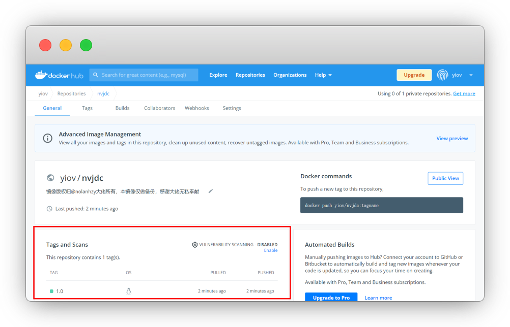


在Tags也能直观的看到，pull命令就可以直接使用了

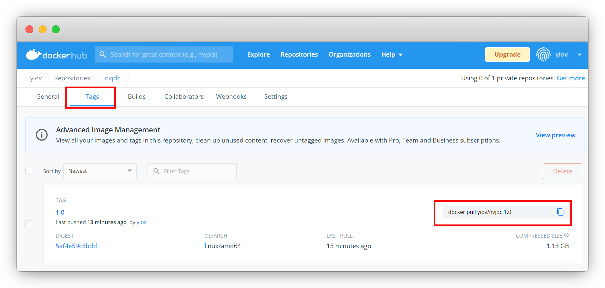


## 5.退出账号并删除镜像


先退出账号的好处，就是为了毕竟自己误操作，需要的时候再登


```sh
docker logout
```

`Removing login` 就是已经移除登录状态了

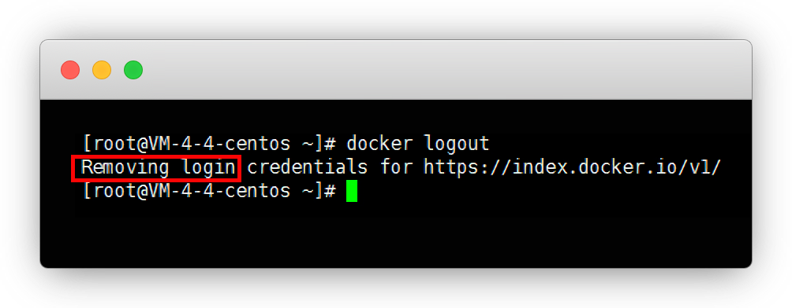


先查看一下本地的镜像，我们用命令删除这个生成的镜像


```sh
docker images
```

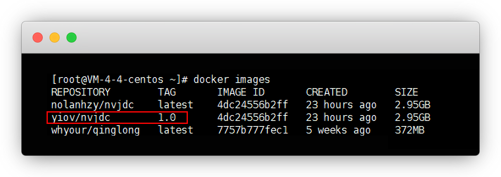


用命令删除即可

::: tip 说明
我的就是：`docker rmi -f yiov/nvjdc:1.0`
:::


```sh
docker rmi -f 账户名/仓库名:标签名tag
```

这里再次 `docker images` 看一下，已经删除了

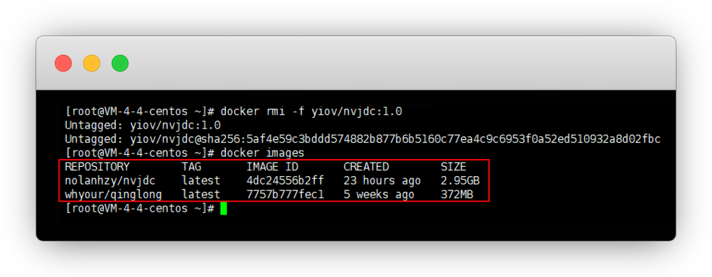


## 常见问题


#### 1.docker一直登陆失败

答：会话超时了，关掉SSH工具，重新打开，重新登录 `docker login` 即可


## 特别鸣谢

* [青龙镜像](https://hub.docker.com/r/whyour/qinglong)

* Nvjdc (已更名为方舟)

