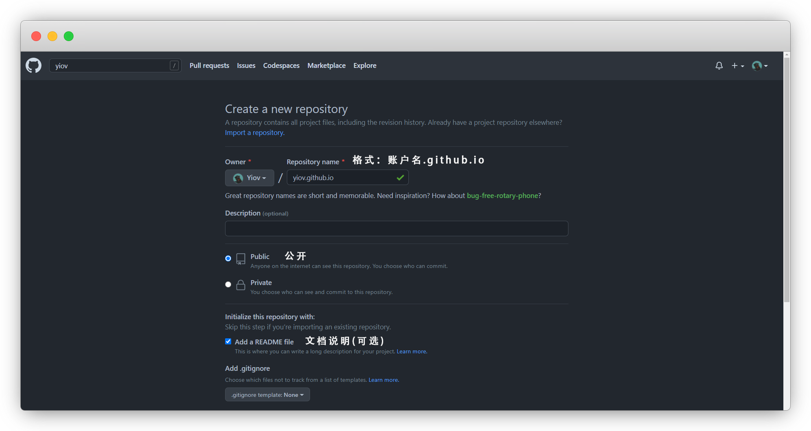
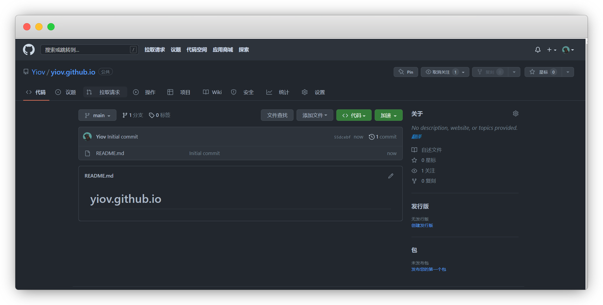
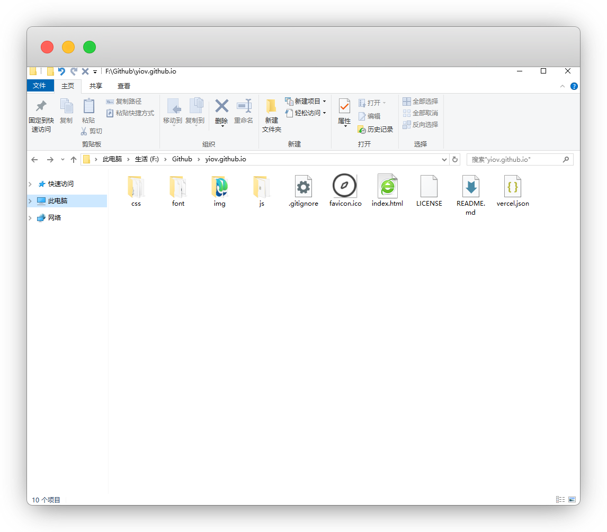
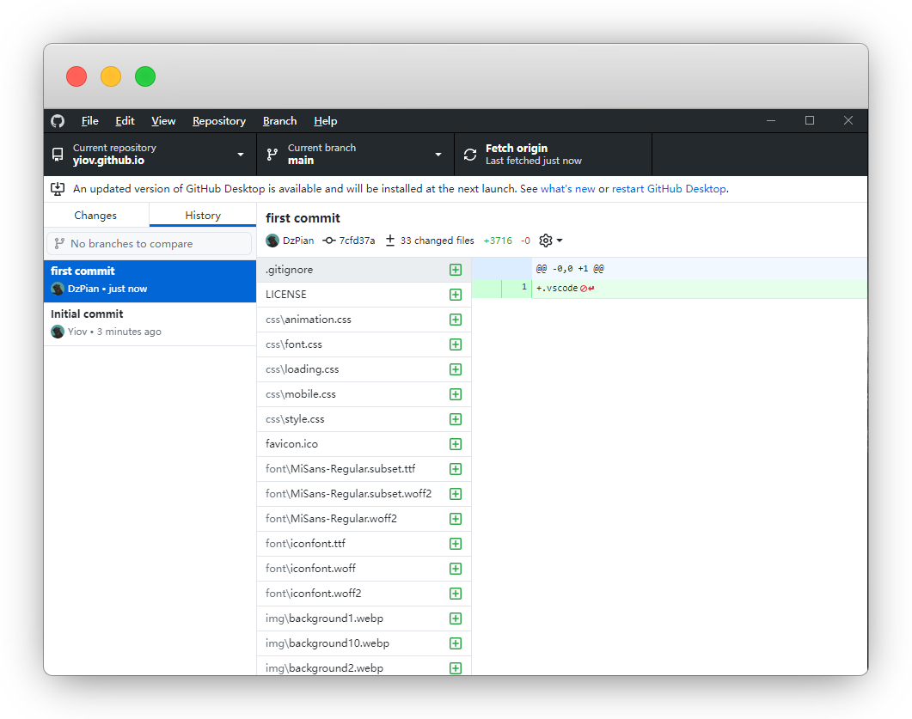
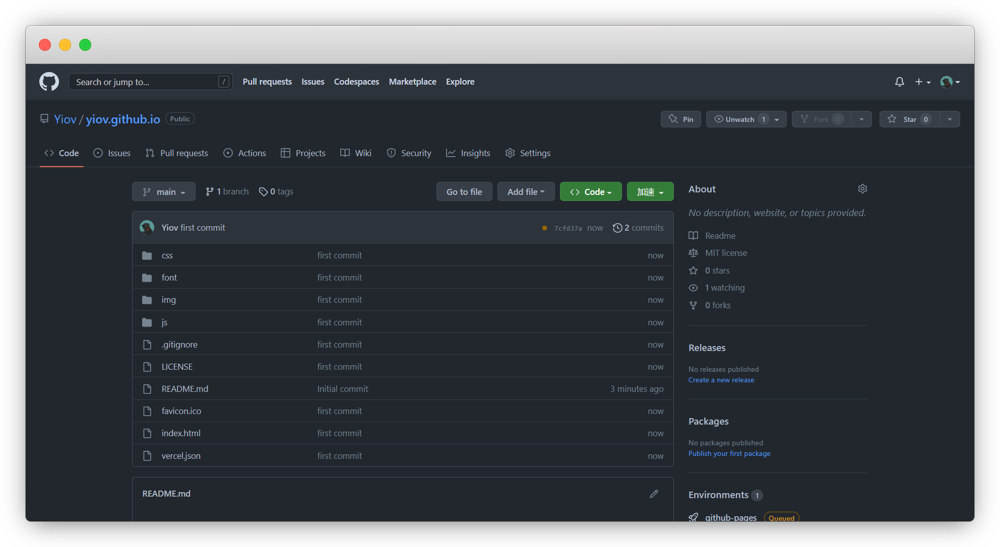
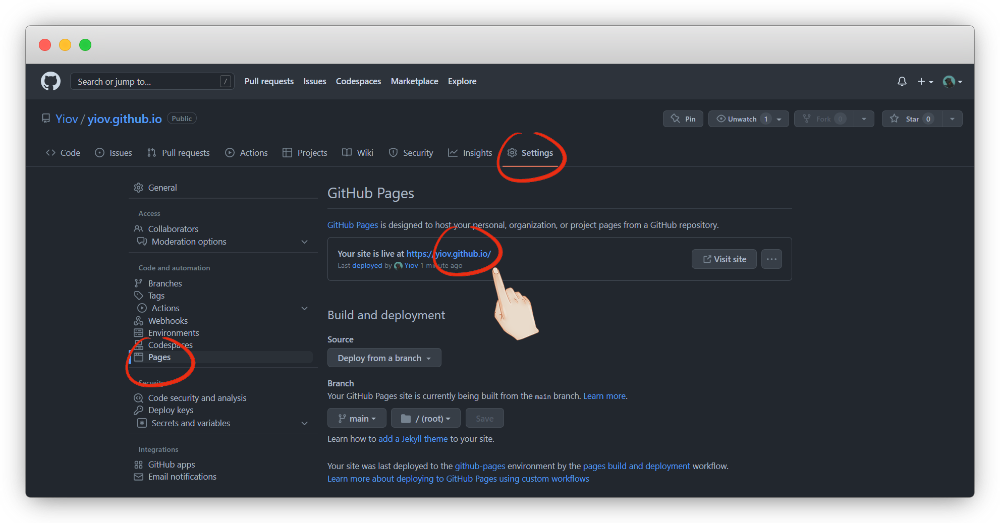
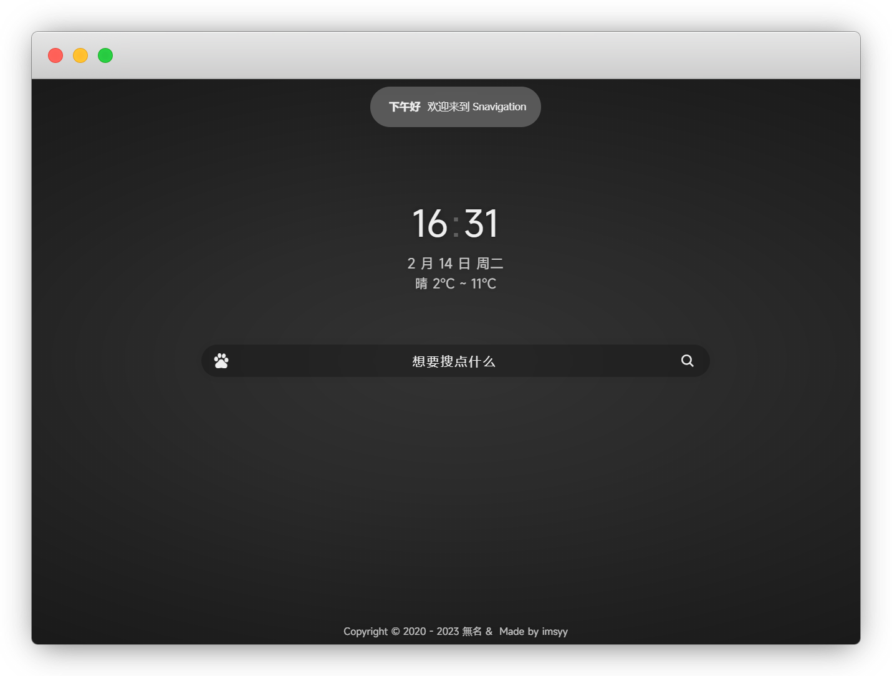
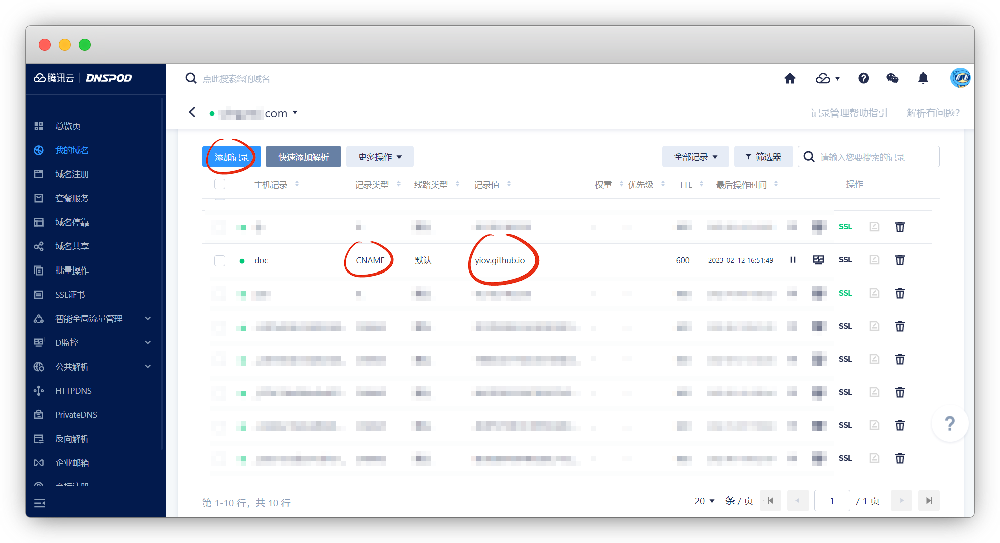
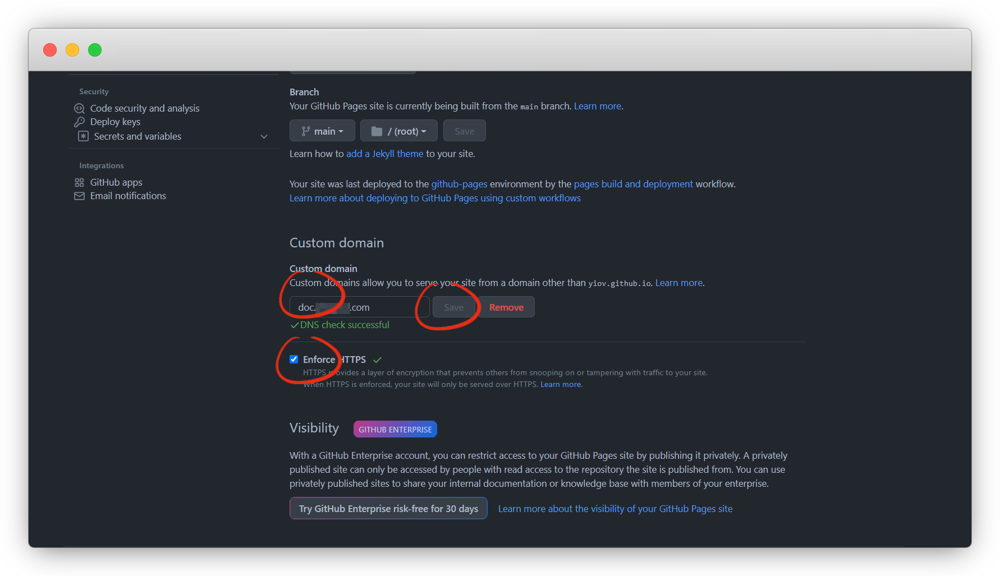
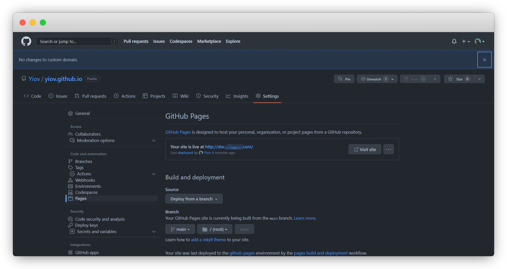

# Github Page静态托管

::: warning 更新时间
最近更新：2023-2-14
:::

## 静态托管

| 名称 | 自定义域名 | 限制 | 缺点 |
|:-:|:-:|:-:|:-:|
| [Github page](https://pages.github.com/) | 支持 | 空间1G，100G/月 | 国内访问慢，百度不收录 |
| [Gitee Pages](https://gitee.com/help/articles/4136#article-header0) | 收费 | 空间1G，100G/月 | 需实名，仓库审查 |
| [GitLab Pages](https://docs.gitlab.cn/jh/user/project/pages/index.html) | 支持 | - | 国内访问慢 |
| |
| [Netlify](https://docs.netlify.com/get-started/) | 支持 | 100G/月 | 从GitHub、GitLab、BitBucket拉取 |
| [Vercel](https://vercel.com/docs/concepts/get-started) | 支持 | 100G/月 | 从GitHub、GitLab、BitBucket拉取 |
| [Cloudflare Pages](https://developers.cloudflare.com/pages/get-started/) | 支持 | - | 从GitHub、GitLab拉取 |

::: tip 说明
现在只讲github page，操作和原理都相差无几
:::

## 准备工作

* [注册github账号及使用](../../daily/github/) 

## 1.新建仓库

此时因为要搭建静态网站，与平时建仓库就有一点区别了

这里输入 `你注册的账户名.github.io`，仓库公开即可，确定

::: tip 说明
比如我的：yiov.github.io
:::

这样就建好了

## 2.上传代码

用GitHub Desktop克隆仓库到本地后，把源码都放进去

::: tip 说明
演示源码使用的是 [@imsyy的Snavigation](https://github.com/imsyy/Snavigation)
:::

用GitHub Desktop上传即可

上传完成，我们回到github刷新网页，这样就上传完成了

::: tip 说明
GitHub Desktop卡进度了，重新点击push
:::

## 3.访问及自定义域名

`Setting-page` 这里的 `https://yiov.github.io` 就是我们的网页了

可以访问试试看看，这样就OK了

如果想用自己的域名，先在服务器添加一个 `CNAME` 值，记录值填这个网址 `yiov.github.io`

::: tip 说明
我这里用的二级域名 `doc` 
:::

回到github设置，下拉在自定义域名里填入我们的二级域名，保存

等解析完成，过程会有点慢，直到显示 `DNS Check successful`即可

::: tip 说明
我这里是 `doc.***.com`

建议是勾选 htpps
:::

然后我们就能看到域名已经变成自己的了

## 常见问题

#### 1.有没有其他好玩的静态源码

最简单的方法就是在github上搜 `github.io`

#### 2.能否托管无数个静态网站

一个帐户只能托管一个，但是可以仓库名可以多，不限制数量

::: tip 说明
账户名为 `yiov` ，则域名 `yiov.github.io`

仓库名为 `vuepress`，则域名 `yiov.github.io/vuepress`，需要在仓库页面下选择 Setting-pages，分支改成main，选择root保存
:::

## 特别鸣谢

* [@imsyy](https://github.com/imsyy/Snavigation)