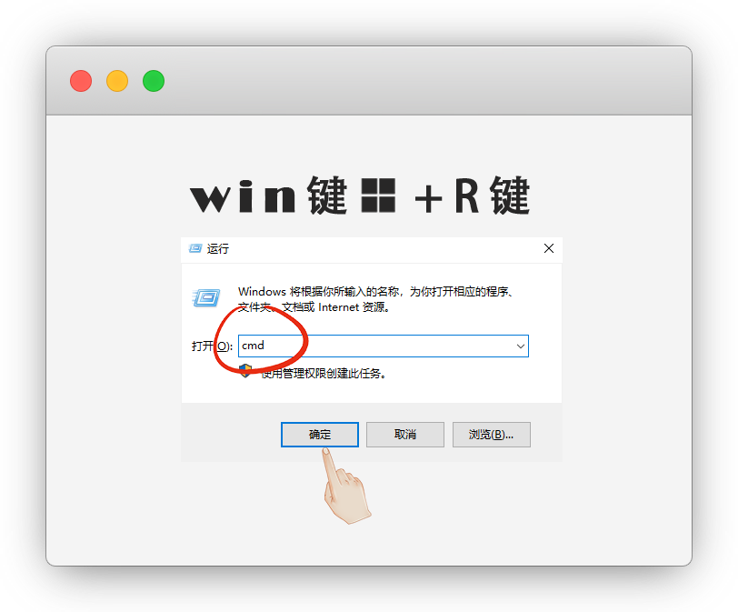

# 简单的个人主页搭建

::: warning 更新时间
最近更新：2023-7-19
:::

简单的小主页，根据原作者 [@imsyy](https://github.com/imsyy/home) 的教程进行了详细截图补充


## Demo

::: tip 说明
由于 CDN 缓存原因，查看最新效果可能需要 `Ctrl` + `F5` 强制刷新浏览器缓存
:::

- [無名の主页](https://www.imsyy.top)

- [無名の主页 - 备用线路](https://home-imsyy.vercel.app/)


## 1.下载源码

下载源码：[https://github.com/imsyy/home](https://github.com/imsyy/home)



放到一个盘符，并解压

::: tip 说明
我自己是放到了 `F盘`
:::


## 2.安装nodejs

请参考之前的教程 [node.js安装使用](../nodejs/#window安装)


## 3.安装yarn

::: warning 注意
已安装过的无视
:::

目录地址栏输入 `cmd` 回车，快捷打开命令终端


```sh
# 安装yarn
npm install -g yarn

# 查看版本号
yarn -v

```


## 4.安装依赖


```sh
yarn install
```


## 5.开发模式

```sh
yarn dev
```


进入开发模式，会生成一个本地预览链接，打开

```
http://localhost:3000/
```

::: tip 说明
我们现在就要，将默认页面修改成自己的
:::


## 6.页面修改

基础的修改都在 `.env` 里面，右键笔记本打开修改保存


### 站点信息

```md
#站点信息/简介/天气/歌曲/建站日期
.env
```


其他信息的修改，请参考图

```md
#站点信息/简介/天气/歌曲/建站日期
.env

#图标
public/images/icon

#社交链接
public/socialLinks.json

#社交联系语
src/components/SocialLinks/index.vue

#网站链接6个
src/components/Links/index.vue

#打开音乐
src/components/Hitokoto/index.vue

#音乐列表
src/components/Music/index.vue

#时间胶囊
src/components/TimeCapsule/index.vue

#设置
src/components/Set/index.vue

#页脚版权备案信息
src/components/Footer/index.vue
```


### 5.2 天气修改

天气及地区获取需要 [高德开放平台控制台](https://console.amap.com/dev/index) 获取 API

创建一个 `Web 服务` 类型的 `Key`，并将 `Key` 填入 `.env` 中的 `VITE_WEATHER_KEY` 中


### 5.3 音乐修改

本项目采用了基于 `MetingJS` 的 `Aplayer` 音乐播放器，可实现快速自定义歌单

仅支持 **中国大陆地区**

请在 `.env` 文件中更改歌曲相关参数即可实现自定义歌单列表

```md
# 歌曲 API 地址
VITE_SONG_API = "https://api-meting.imsyy.top"
# 歌曲服务器 ( netease-网易云, tencent-qq音乐 )
VITE_SONG_SERVER = "netease"
# 播放类型 ( song-歌曲, playlist-播放列表, album-专辑, search-搜索, artist-艺术家 )
VITE_SONG_TYPE = "playlist"
# 播放 ID
VITE_SONG_ID = "7452421335"
```


### 5.4 字体修改

现采用 `HarmonyOS Sans` 开源字体，采用字体拆分，提升加载速度


::: tip 说明
主页的 Logo 字体已经过压缩，若用本站 Logo 以外的字母会变回默认字体，这里是 [完整字体](https://file.4everland.app/font/Other/Pacifico-Regular.ttf)

由于本站 `CDN` 已开启防盗链，**非本站域名不可访问**，请将字体引入链接更改为下方内容，否则 **自定义字体将失效**

https://s1.hdslb.com/bfs/static/jinkela/long/font/regular.css
:::

* 全局字体：文件在 `public - font`，在 `src - style` 的 `style.css` 和 `style.scss`

* 局部文字：首页LOGO位置的字体在 `src - components - Message` 修改 `.name` 的 `font-family`，但是更改后LOGO和文字的位置会错位，需要自行调整2个 `.name` 下的`height` 的值，一个是PC端，一个是手机端，也可以注释掉 `transform`


### 5.5 点的修改

主页面填写网址，会有一个点，比如 `yiov.top`，中的 `.`

不想显示的在 `src - components - Message` 中将 `sm`后面的点删掉即可


### 5.6 导航图标修改

使用的是字节跳动旗下的icon，我们查找喜欢的替换即可

[https://iconpark.oceanengine.com/official](https://iconpark.oceanengine.com/official)


### 解除右键

网页禁止了右键，查看审查元素不方便

可以在 `src - App.vue` 中注释掉即可


## 7.构建

修改完成后，我们退出开发模式

::: tip 说明
退出模式 `Ctrl`+`C`
:::

构建，构建后的静态资源会在 `dist` 目录中生成

```sh
yarn build
```


## 8.上传

我们将`dist`打包并上传到服务器上

::: tip 说明
没有服务器也可使用 [静态托管平台部署](../githubpage/#静态托管)
:::


上传后访问域名，却只有文字，因为要开启https，[直接SSL证书弄好了再开启](../ECS/#ssl证书)


然后我们就看到成果了


## 常见问题

#### 1. 输入yarn命令错误提示

> 'yarn'不是内部或外部命令，也不是可执行的程序或批处理文件

原因：yarn没有成功安装，卸载后重新安装

```sh
# 卸载
npm uninstall yarn -g

# 安装yarn
npm install -g yarn

# 查看版本号
yarn -v
```

