# node.js安装使用


::: warning 更新时间
最近更新：2023-2-23
:::


## 目录


* [Linux](#linux系统安装)

* [Window](#window安装)

* [安卓端](#安卓安装)

* [IOS端](#ios安装)


::: tip 说明
安装了宝塔的可直接在软件商店搜node安装
:::


## 简介

node.js是JavaScript的运行环境

* 官网：[https://nodejs.org/zh-cn/](https://nodejs.org/zh-cn/)

* 仓库：[https://github.com/nodejs/node](https://github.com/nodejs/node)

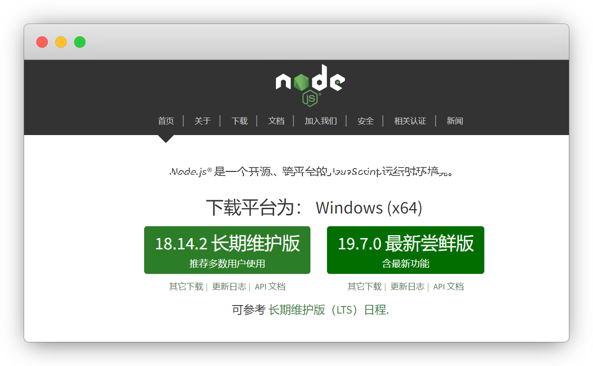


## linux系统安装


选择 `linux x64`下载，为了保证稳定性，建议选择长期维护的版本

::: tip 说明
不用直接点击下载，我们用命令
:::

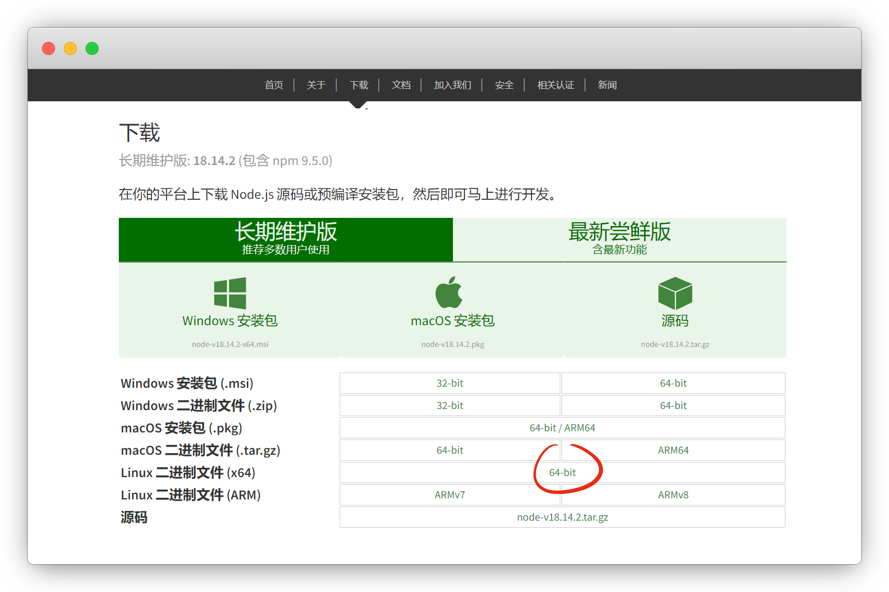


切换root账号

::: tip 说明
一般都是root，多加一步不影响

鼠标右键粘贴！ctrl+v是不可用的
:::

```sh
sudo su root #切换到root帐号
cd / #进入根目录
```

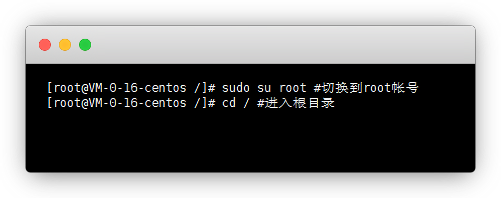


下载安装，版本是目前最新的V14.17.4，可按照官网最新的版本改好命令，保持一致

::: tip 说明
其他版本查找：[https://nodejs.org/dist/](https://nodejs.org/dist/)

依次运行命令
:::

```sh
#下载nodejs安装包
wget https://nodejs.org/dist/v14.17.4/node-v14.17.4-linux-x64.tar.xz

#解压
tar xvf node-v14.17.4-linux-x64.tar.xz

#改名
mv node-v14.17.4-linux-x64 node-v14.17.4
```

等待完成，停在 改名 那 `回车` 一下就行了

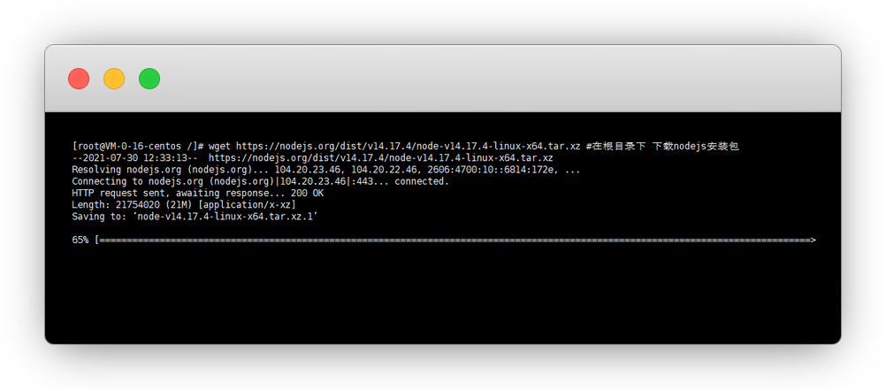


进目录查看文件夹，有就代表安装好了

::: tip 说明
注意版本号一致
:::

```sh
#进入目录并列出
cd /node-v14.17.4/bin && ls
```

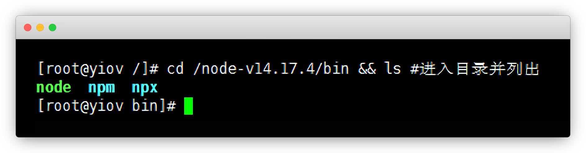


建立软连接

::: tip 说明
注意版本号一致
:::

```sh
ln -s /node-v14.17.4/bin/node /usr/local/bin/node
ln -s /node-v14.17.4/bin/npm /usr/local/bin/npm
```

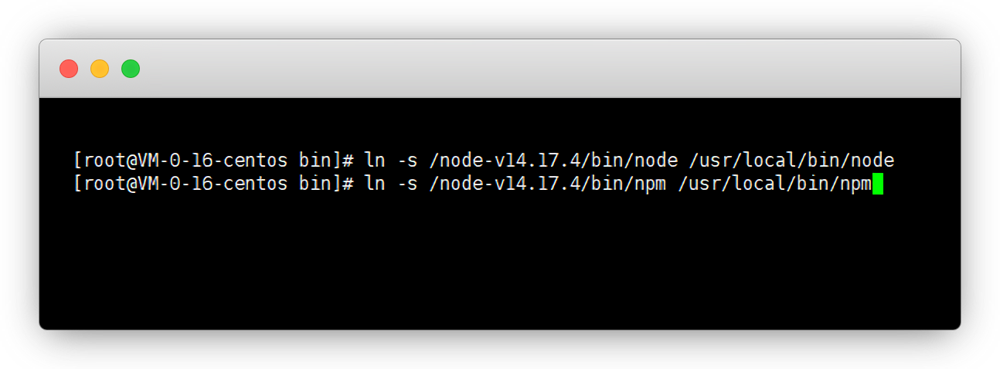


重启Xshell

::: tip 说明
完成后一定要关掉 Xshell 再打开，否则不生效
:::

确定重启后，复制下面命令查看一下

```sh
cd /node-v14.17.4/bin && ls
node -v #查看版本号
npm -v #查看包管理工具
```

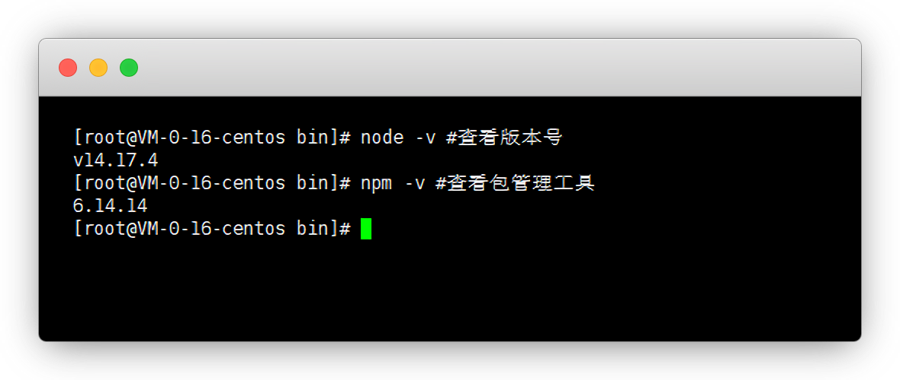


清理安装包，查看目录列表，标红的 `node***.tar.xz` 就是刚下的压缩包

```sh
cd /
ls
```

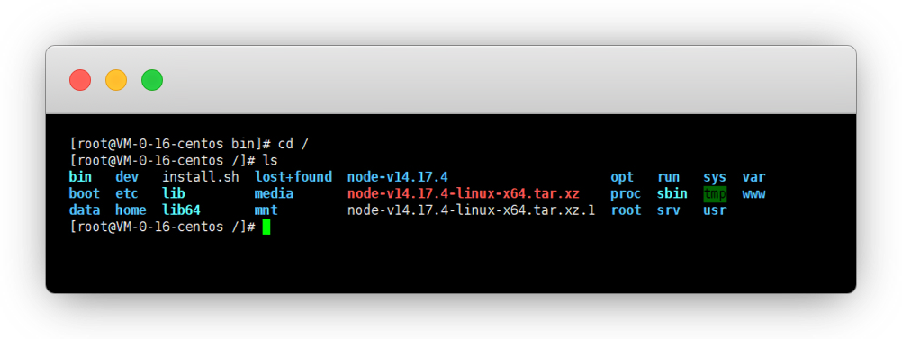


删除node安装包，复制下列命令

::: tip 说明
版本不同的话，自己改下名

我这里有两个，是因为我运行了2次，下载重复了
:::

```sh
rm -rf node-v14.17.4-linux-x64.tar.xz
```


删完后，我们再进目录看一下，完美

```sh
cd /
ls
```

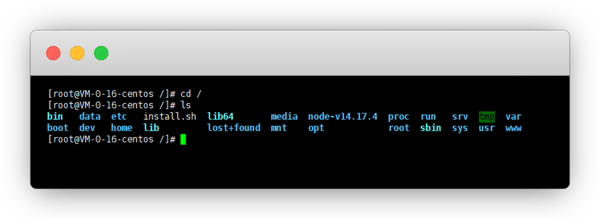


## Window安装


### 安装

官网下载我们选择window的方式

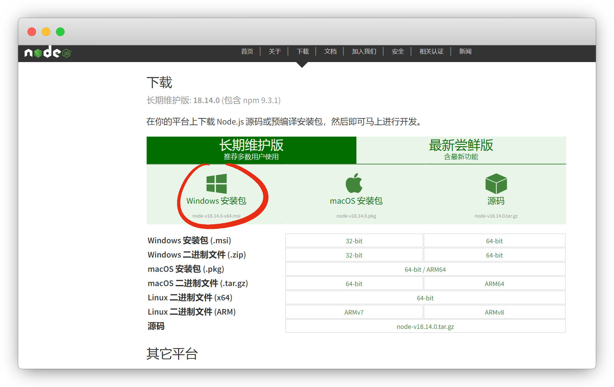


下载好安装，就不用说了吧

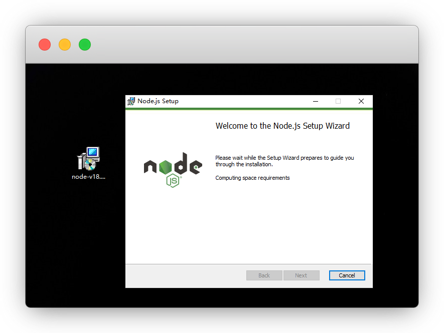

安装好后，我们运行 `window键+R` 进入 `cmd` 终端


查看一下版本号，有就说明成功了

```sh
node -v
npm -v
```

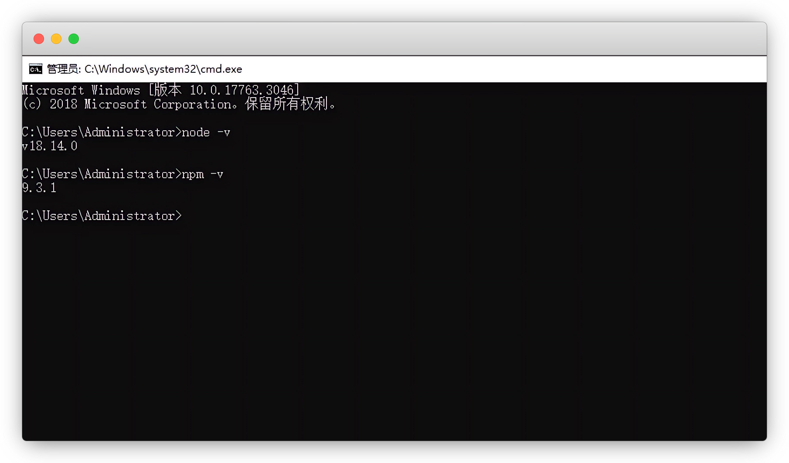


### 更改全局模块(可选)

::: tip 说明
默认情况下，下载 `yarn` 或者 `pnpm` 会直接下载到 `C盘`

如果想挪到安装目录的就看，无所谓的无视，不影响使用
:::

在安装目录下创建两个文件夹 `node_global` 和 `node_cache`

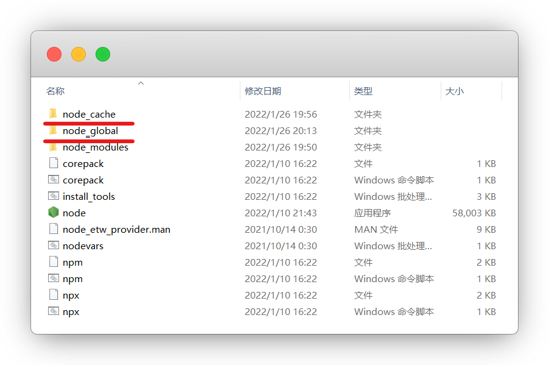


打开cmd 输入下列指令

::: warning 说明
全程请参照自己的安装目录来修改！！！

prefix = 创建的node_global文件夹所在路径

cache  = 创建的node_cache文件夹所在路径
:::

```sh
npm config set prefix "D:\Program Files\nodejs\node_global"
npm config set cache "D:\Program Files\nodejs\node_cache"
```

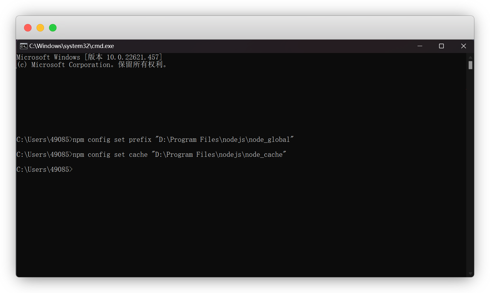


修改系统环境变量，将 `用户变量` 下的 `Path` 修改为如下，之后点击确定

```
D:\Program Files\nodejs\node_global
```

::: tip 说明
此电脑-右键-属性-高级系统设置-环境变量
:::

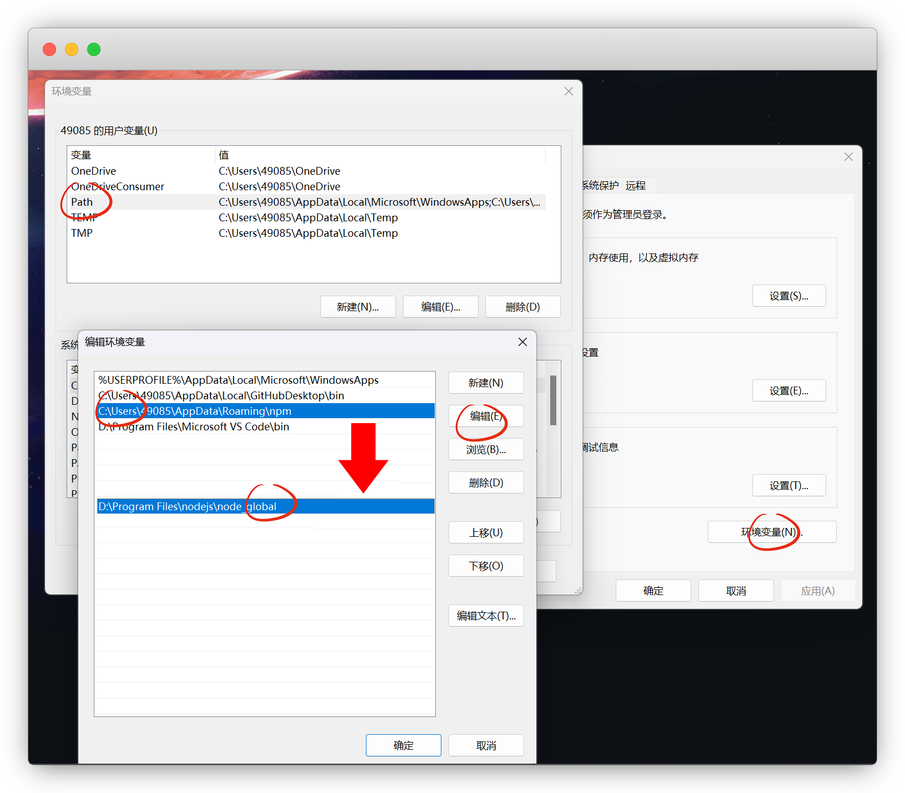


在 `系统变量` 下新建 `NODE_PATH` ，值如下

```
D:\Program Files\nodejs\node_global\node_modules
```

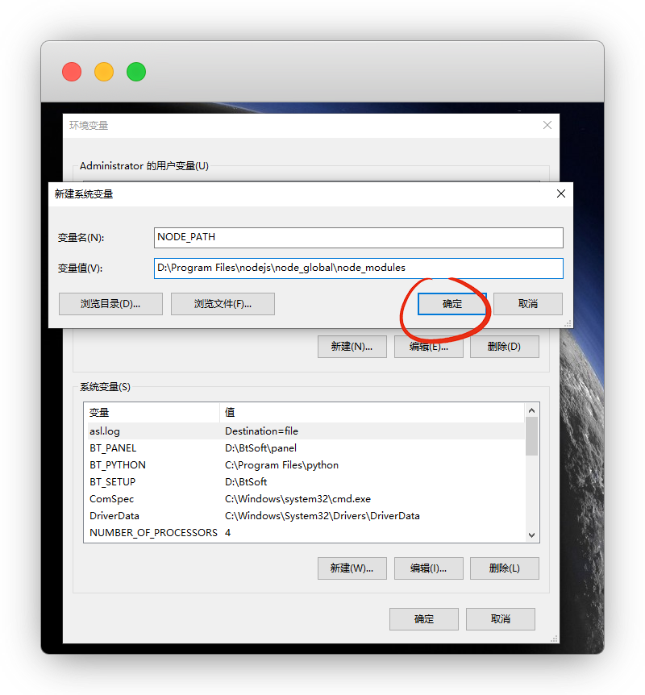


在 `系统变量` 下的 `Path` 新建，添加node全局文件夹之后点击确定

```
D:\Program Files\nodejs\node_global
```

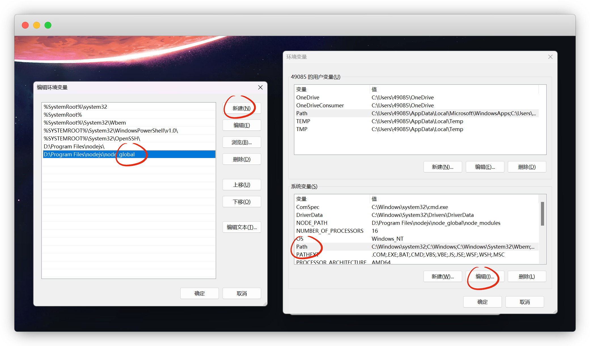

右击Nodejs文件夹-属性-安全，点击编辑，将所有权限都✔上

::: tip 说明
关掉cmd重新打开，看是否能查询版本
:::

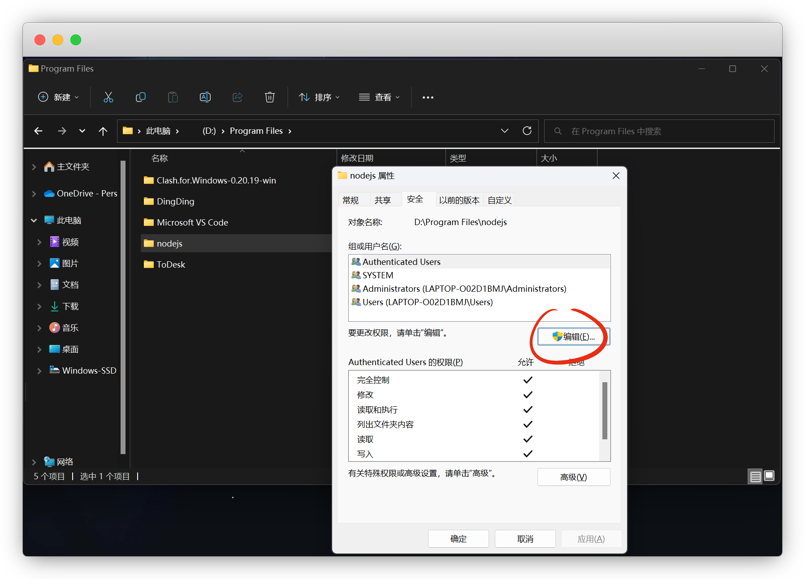

```sh
node -v
npm -v
```


## YARN 和 PNPM

我们常用的 `yarn`和 `pnpm` 可以安装一下，顺便测试一下全局模块是否正确

:::: code-group
::: code-group-item pnpm
```sh
#安装pnpm
npm install -g pnpm
#查看版本号
pnpm -v
```
:::
::: code-group-item yarn
```sh
#安装yarn
npm install -g yarn
#查看版本号
yarn -v
```
:::
::::

::: tip 说明
win11上如果报错，是因为power shell的安全策略，不允许执行不安全脚本

`nrm : 无法加载文件 C:\Users\用户\AppData\Roaming\npm\nrm.ps1，因为在此系统上禁止运行脚本`

解决：搜索 `power shell` 或者 `power shell ISE` ，管理员方式打开，输入如下值，然后全选A

:::


```sh
set-ExecutionPolicy RemoteSigned
```

想要改回来

```sh
set-ExecutionPolicy Default
```


## 安卓安装

::: warning 建议
电脑端已经玩溜了的人使用

小白请勿轻易尝试
:::

我们要用到 [Termux](https://termux.com/cn/) ，它是一款安卓终端仿真器和Linux环境应用程序，且不需要root，自带apt管理软件包

### 安装Termux

下载 `Termux` 安装并打开

官网：[https://termux.com/cn/](https://termux.com/cn/)

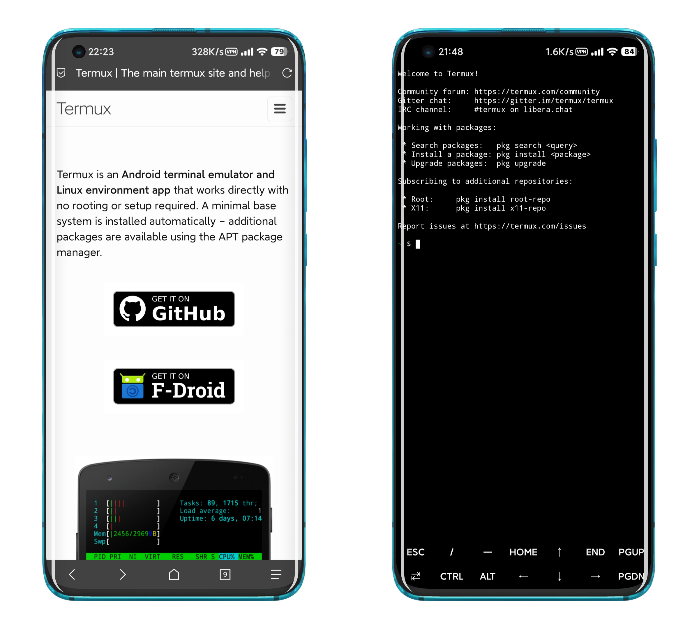


### 升级apt

要升级，否则可能安装node失败

```sh
apt update && apt upgrade
```

::: tip 说明
中间有Y/N的，都y
后面有Y/I/N/O/D/Z的，默认N即可，直接回车
:::

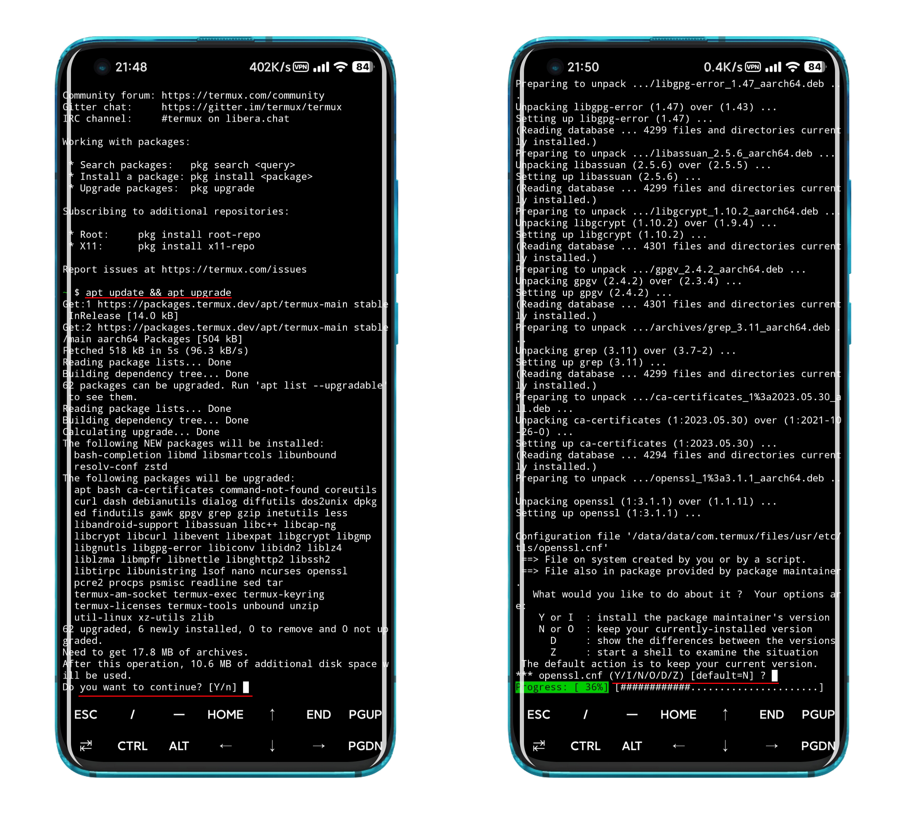


### 安装nodejs

因为包管理是apt，我们就用它安装

::: tip 说明
中间有Y/N的，都y
:::

```sh
#安装
apt install nodejs

#查询版本
node -v
npm -v
```

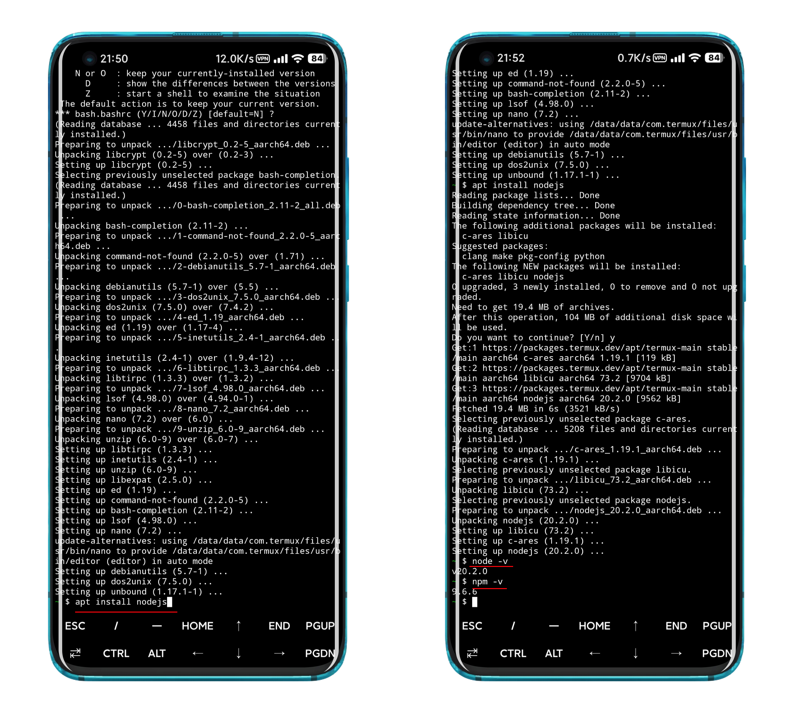

### 其他命令

习惯vim编辑器的直接装

```sh
apt install vim
```

常见的vim命令

```sh
#编辑文件
vi /文件路径

#保存并退出
ESC键+:wq

#不保存退出
ESC键+:q!
```

手机已root的也可以直接使用 [MT管理器](https://www.coolapk.com/game/21048/)

Termux路径：

```
/data/data/com.termux/
```

::: tip 说明
方便下次使用，在目录右上角点 `添加书签` ，然后再设置中打开 `在侧栏显示书签`
:::


## iOS安装

我们要用到 [iSH shell](https://ish.app/) ，它是一款iOS端终端 [Alpine Linux](https://alpinelinux.org/) x86系统，采用 musl libc 和 busybox 构建 ，自带apk管理软件包

::: tip 说明
apk 是 alpine linux 中的包管理器，类似 ubuntu 中的 apt，centos 中的yum

由于IOS系统特殊性，我们只能使用npm，无法升级成yarn/pnpm
:::


### 安装iSH

在苹果商店下载安装并打开

[https://apps.apple.com/cn/app/id1436902243](https://apps.apple.com/cn/app/id1436902243)


### 升级apk

更新镜像源和软件包

```sh
#更新源索引
apk update

#更新软件包
apk upgrade
```


### 安装nodejs

node和npm要分别安装

::: warning 注意
由于系统默认是v3.14，最新的 [Alpinelinux 中的 nodejs](https://pkgs.alpinelinux.org/packages?name=nodejs&branch=v3.14) 是 `14.21.3` ，而pmpm 需要16以上

无法使用 npm install -g yarn或者pnpm命令，只能使用npm
:::

```sh
#安装
apk add nodejs

#查询版本
node -v
```

```sh
#安装
apk add npm

#查询版本
npm -v
```

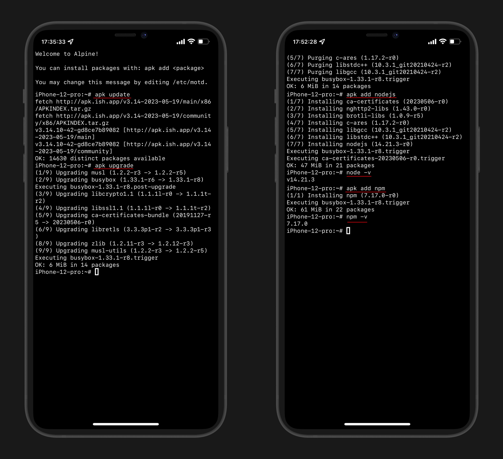


### 其他命令

vim编辑器安装

```sh
apk add vim
```


常见的vim命令

```sh
#编辑文件
vi /文件路径

#保存并退出
ESC键+:wq

#不保存退出
ESC键+:q!
```


通过 `apk –help` 命令查看其他包管理命令

```sh
#安装包名
apk add 包名

#删除包
apk del 包名

#搜索包
apk search

#查看包信息
apk info
```


## 常见问题

#### 1.linux输入版本号没反应

关掉重新打开，再次查询


#### 2.如何卸载


:::: code-group
::: code-group-item npm
```sh
#npm卸载
npm uninstall npm -g

#卸载node
yum remove nodejs npm -y
```
:::
::: code-group-item yarn
```sh
#卸载
npm uninstall yarn -g
```
:::
::: code-group-item pnpm
```sh
#卸载
npm rm -g pnpm
```
:::
::::


#### 3.三者的关系

yarn是npm的升级版，pnpm是npm的替代，速度上自然是新秀pnpm更快


#### 4.linux如何换源

默认一般都是国外源，所以下载软件包的时候会有点慢，想快的就需要换国内镜像源

* 阿里云源：[https://developer.aliyun.com/mirror/](https://developer.aliyun.com/mirror/)

* 华为云源：[https://mirrors.huaweicloud.com/](https://mirrors.huaweicloud.com/)

* 兰州大学源：[https://mirror.lzu.edu.cn/](https://mirror.lzu.edu.cn/)

* 清华大学源：[https://mirrors.tuna.tsinghua.edu.cn/](https://mirrors.tuna.tsinghua.edu.cn/)

* 上海交大源：[https://mirror.sjtu.edu.cn/](https://mirror.sjtu.edu.cn/)

* 腾讯源：[https://mirrors.cloud.tencent.com/](https://mirrors.cloud.tencent.com/)

* 网易源：[https://mirrors.163.com/](https://mirrors.163.com/)

* 中科大USTC：[https://mirrors.ustc.edu.cn/](https://mirrors.ustc.edu.cn/)


那么我们的npm就可以换源了

::: tip 说明
其他源自行修改后面的源地址
:::


```sh
npm config set registry http://mirrors.cloud.tencent.com/npm/
```

除了常见的用 `vim或nano 编辑器` 修改换源，还可以使用一键脚本 `sed -i` 命令


示例：

Centos 换成 清华大学源

```sh
# 对于 CentOS 7
sudo sed -e 's|^mirrorlist=|#mirrorlist=|g' \
         -e 's|^#baseurl=http://mirror.centos.org/centos|baseurl=https://mirrors.tuna.tsinghua.edu.cn/centos|g' \
         -i.bak \
         /etc/yum.repos.d/CentOS-*.repo

# 对于 CentOS 8
sudo sed -e 's|^mirrorlist=|#mirrorlist=|g' \
         -e 's|^#baseurl=http://mirror.centos.org/$contentdir|baseurl=https://mirrors.tuna.tsinghua.edu.cn/centos|g' \
         -i.bak \
         /etc/yum.repos.d/CentOS-*.repo
```


Ubuntu 换成 兰州大学源

```sh
sudo sed -i "s@http://.*archive.ubuntu.com@https://mirror.lzu.edu.cn@g" /etc/apt/sources.list
sudo sed -i "s@http://.*security.ubuntu.com@https://mirror.lzu.edu.cn@g" /etc/apt/sources.list
```


Debian 换成 中科大源

```sh
sodo sed -i "s@http://deb.debian.org@https://mirrors.ustc.edu.cn/g" /etc/apt/sources.list
sudo sed -i 's/deb.debian.org/mirrors.ustc.edu.cn/g' /etc/apt/sources.list
```