# Socks5的搭建

::: warning 更新时间
最近更新：2022-1-25
:::

要问有什么用，用不上也就不会看了


## 准备工作


* [服务器1台](../ECS/)

* [域名1个](../ECS/#域名)

* [安装Xshell工具](../Xshell/)

* [安装宝塔面板](../BT/)


## 1.安装依赖

Xshell登录服务器，输入下面命令安装

```sh
yum -y install gcc make automake pam-devel openldap-devel openssl-devel cyrus-sasl-devel
```

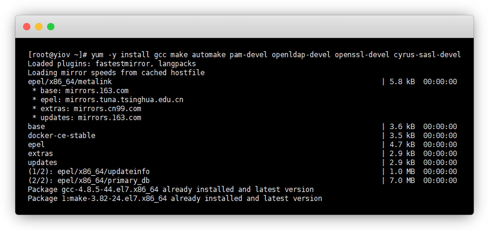


## 2.下载安装包

进入[Socks5官网](http://ss5.sourceforge.net/) 获取下载链接

下载地址：[http://sourceforge.net/projects/ss5/files/](http://sourceforge.net/projects/ss5/files/)

::: tip 说明
不用下载到本地，把下载链接复制一下，我们直接wget到服务器
:::

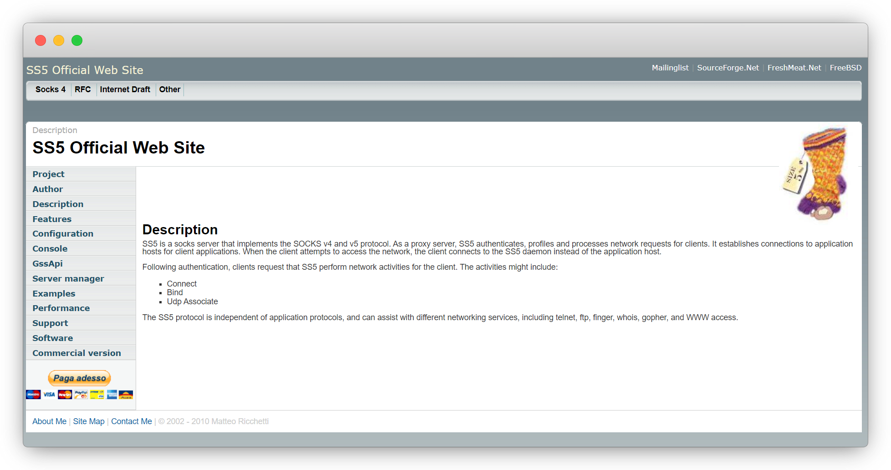


```sh
wget http://downloads.sourceforge.net/project/ss5/ss5/3.8.9-8/ss5-3.8.9-8.tar.gz
```

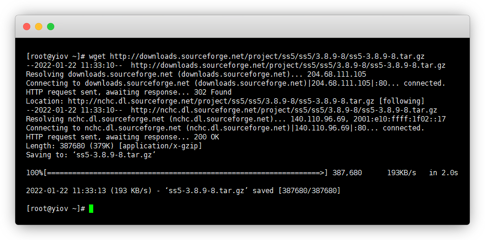


::: details 点击查看 其他下载链接

另一个日本大学的包也可以用，选一个即可

```sh
wget https://jaist.dl.sourceforge.net/project/ss5/ss5/3.8.9-8/ss5-3.8.9-8.tar.gz
```

:::


## 3.解压

```sh
tar -xzvf ss5-3.8.9-8.tar.gz
```
::: tip tar注解
`-x` 解压指令；

`-z` 解压/压缩gzip；

`-v` 过程显示文件；

`-f` 使用文档名
:::

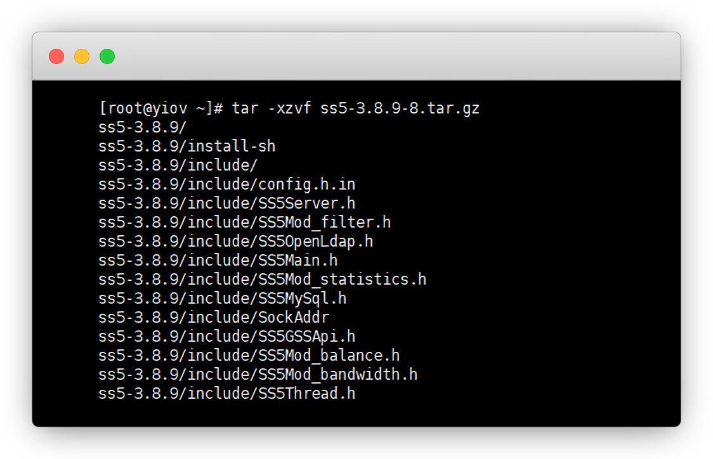


## 4.编译及安装

```sh
cd ss5-3.8.9
./configure && make
make install
```

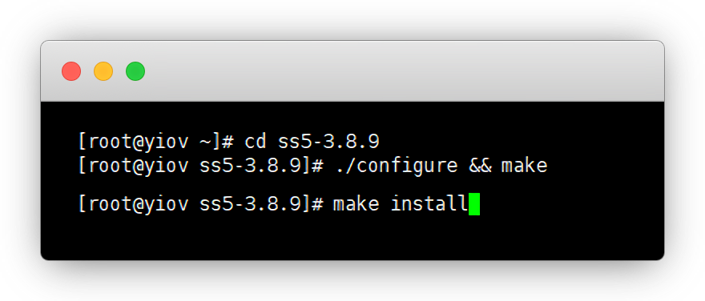

::: tip 说明
前面步骤不对，这里就会报错

configure会检测当前环境是否满足依赖关系，自动生成makefile，否则会报错
:::


## 5.配置用户

```sh
vim /etc/opt/ss5/ss5.conf
```
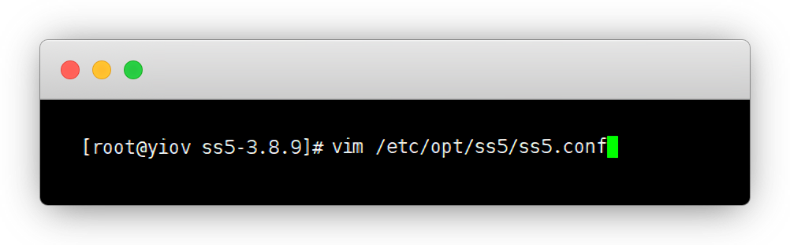


### 5.1不设置密码

在line 87用`DEL键`删掉注释#号

```sh
auth 0.0.0.0/0 - -
```
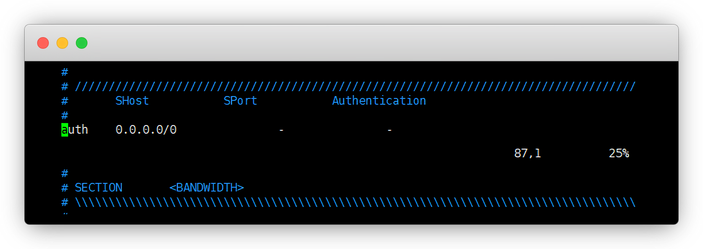


在line 203用`DEL键`删掉注释#号

```sh
permit - 0.0.0.0/0 - 0.0.0.0/0 - - - - -
```

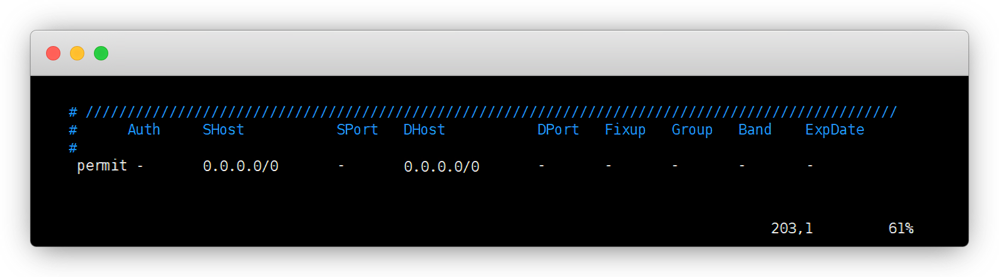

::: tip 说明
修改好后，`ESC键`，然后`:wq`+`回车键`保存并退出

不保存并退出为`ESC键`，然后`:q!`+`回车键`
:::


### 5.2 设置密码

一样在87行和203行，就是加了个 `u`

```sh
auth 0.0.0.0/0 - u
permit u 0.0.0.0/0 - 0.0.0.0/0 - - - - -
```

修改密码

```sh
vim /etc/opt/ss5/ss5.passwd
```

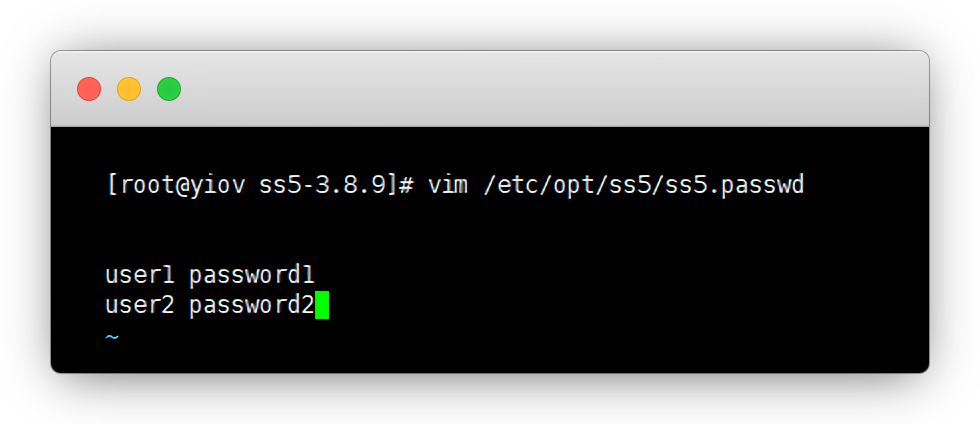


用户名和密码中间用空格隔开,一行一个账密

```sh
user1 password1
user2 password2
```


## 6.设置端口

默认端口是1080，`强烈建议修改`，不然会被扫，比如10080或者10800之类的

```sh
vim /etc/sysconfig/ss5
```

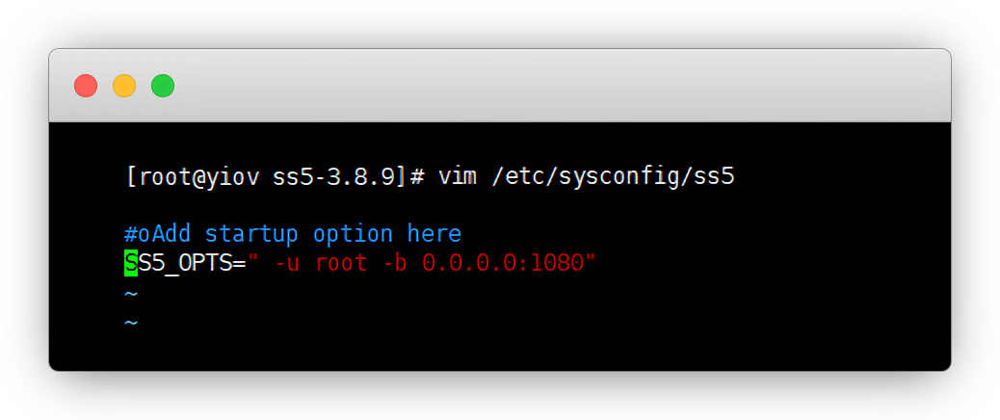


把第2行的 `#` 号删掉，然后改成下面的

```sh
SS5_OPTS="-u root -b 0.0.0.0:1080"
```

修改好后，`ESC键`，然后`:wq`+`回车键`保存

不保存为`ESC键`，然后`:q!`+`回车键`


放行端口

::: warning 注意
服务器还需要，在安全组/防火墙放行端口
:::

```sh
cd
firewall-cmd --zone=public --add-port=1080/tcp --permanent
```

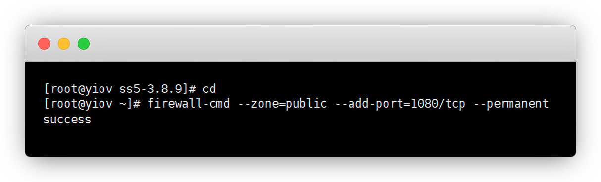


## 7.开启访问权限

```sh
chmod a+x /etc/init.d/ss5
```


不开权限启动会报错

> env: /etc/init.d/ss5: Permission denied

::: tip chmod注释
`a` 为所有人；

`x` 为execute 执行权限；

`r` 为read 读权限；

`w` 为write 写权限
:::


## 8.启动socks5

```sh
service ss5 start
```

现在就搭建完毕，可以使用了，使用方法就不用说了吧

一般无密码方式

```sh
socks5://ip:端口
```

一般有密码方式

```sh
socks5://账号:密码@ip:端口
```


## 其他常用命令

```sh
service ss5 stop # 停止

service ss5 status # 查看状态

service ss5 restart # 重启

# 开机自启 自行选择
chkconfig --add ss5

chkconfig ss5 on

```


## 特别鸣谢


* [Socks5官网](http://ss5.sourceforge.net/)


