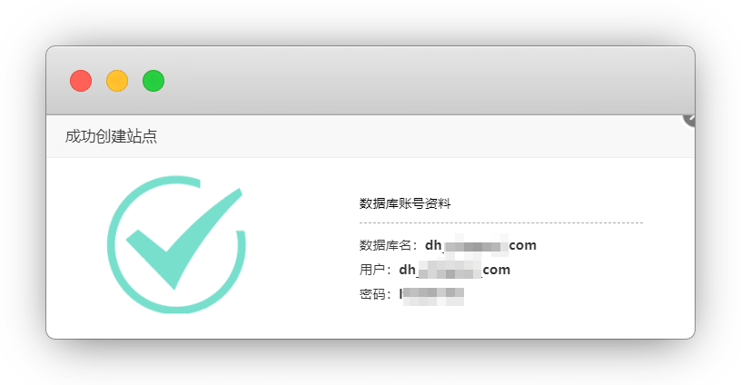
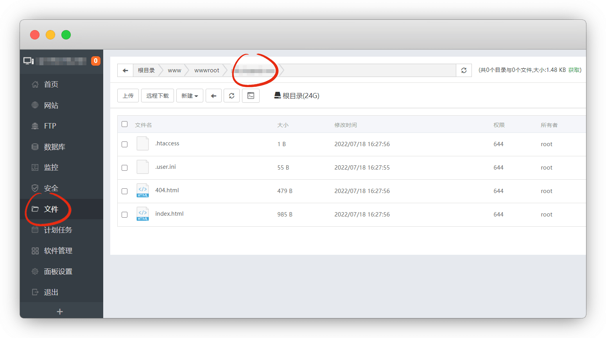
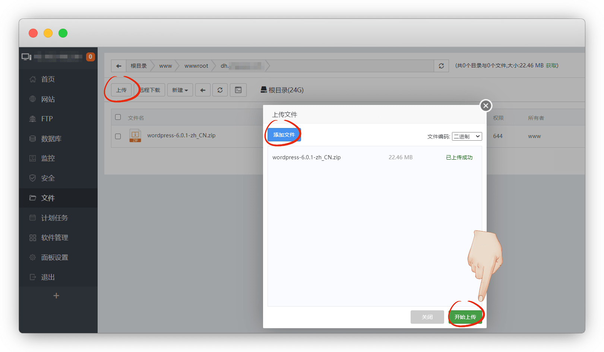
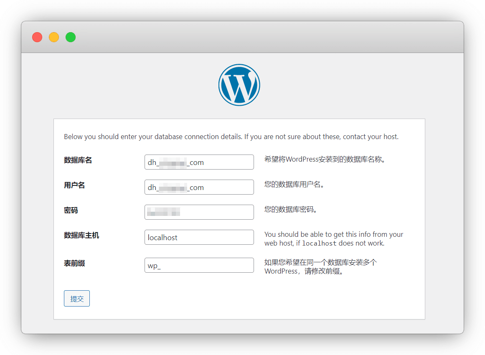
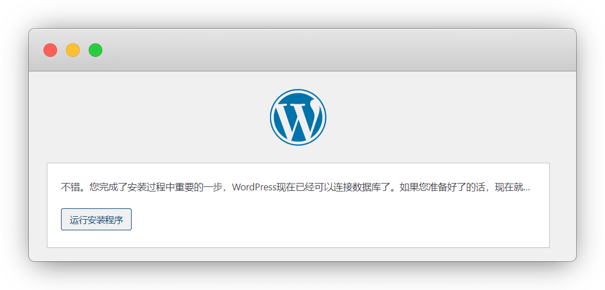
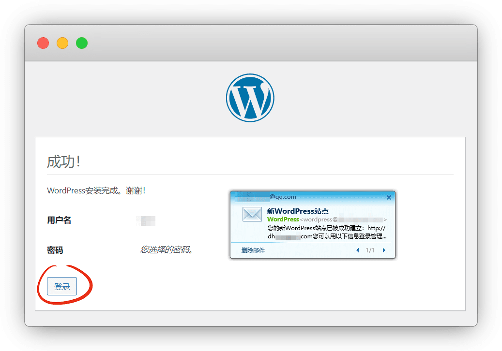
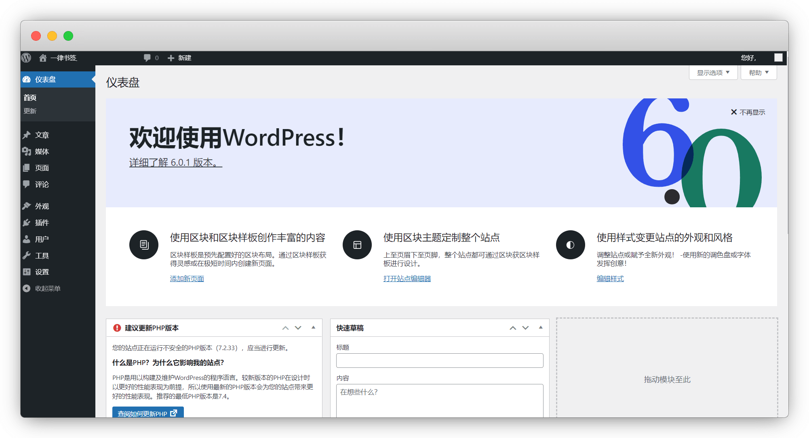

# wordpress详细安装教程

::: warning 更新时间
最近更新：2022-7-18
:::

wordpress官网：[https://cn.wordpress.org/](https://cn.wordpress.org/)

## 准备工作

* [服务器1台](../ECS/)

* [域名1个](../ECS/#域名)

* [安装Xshell工具](../Xshell/)

* [安装宝塔面板](../BT/)

* 足够的耐心

## 1.下载wordpress

进入 [wordpress中国官网](https://cn.wordpress.org/) ，点击右上角获取 - 下载并安装 - 下载

::: tip 说明
下载就可以了，不要解压！一会用
:::

## 2.添加站点

打开宝塔面板后，点 网站-添加站点

域名填入你买的域名，FTP不创建，数据库MySQL，密码可以自己改的好记一点，提交

这样站点就创建完成了

::: tip 说明
要记一下，等会要用
:::

## 3.上传wordpress

文件  `/www/wwwroot/dh.***.com` 目录，把里面的文件都删掉

上传下载好的wordpress压缩包，完成后右键解压

但是，这样我们站点只有个文件夹，而不是整个wordpress的文件

我们进文件夹，把里面文件全部剪切出来

::: tip 说明
事后记得删除空文件夹和压缩包哦
:::

## 4.安装wordpress

访问你的域名即可，我的是`dh.***.com`，你们按自己的域名来

数据库名和用户名是一样的，密码自己设的，后面2项默认不用改

::: tip 说明
数据主机也可以填IP，表前缀除非有多个wordpress在数据库，避免冲突就改下，否则默认
:::

这样就可以了，运行程序，填写站点信息，自己填好就行了

完成后邮箱也会受到消息，我们点登录

这样就完成了wordpress的所有安装

进入了后台，外观-主题里找 或 上传主题

::: tip 说明
我会整理一些自己喜欢的主题进来，进行参考
:::

后台的地址：[http://***.com/wp-admin/](http://***.com/wp-admin/)

## 特别鸣谢

* [@wordpress中国](https://cn.wordpress.org/)
